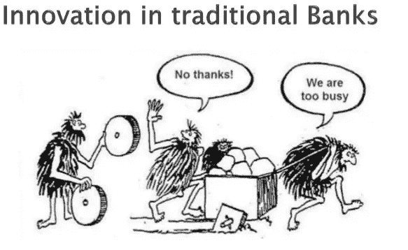

# DDI —金融科技资源

> 原文：<https://medium.datadriveninvestor.com/ddi-fintech-resources-64383c5f7fab?source=collection_archive---------12----------------------->

无论是 Fintech 还是 Techfin，利用机器学习、区块链和人工智能等技术来改善金融服务最近风靡一时。

我们准备了一些非常有用的资源，让你了解这个蓬勃发展的行业的最新进展。

# 特色金融科技资源

**新闻:**[**fin tech at TechCrunch**](https://techcrunch.com/tag/fintech/)

你的每日金融科技新闻。

**博客:** [**金融品牌**](https://thefinancialbrand.com/fintech/)

关于金融技术的最新观点、见解和信息。

**课程:**供应链金融&区块链技术 

了解如何使用尖端技术评估、销售和实施供应链金融计划。

**讨论:**[**r/Fintech**](https://www.reddit.com/r/fintech/)

与金融科技爱好者谈论科技如何改变金融服务

看不出你在找什么？这里 我们为你准备了更多有用的 Fintech 资源 [**！**](https://www.datadriveninvestor.com/fintech-resources/)