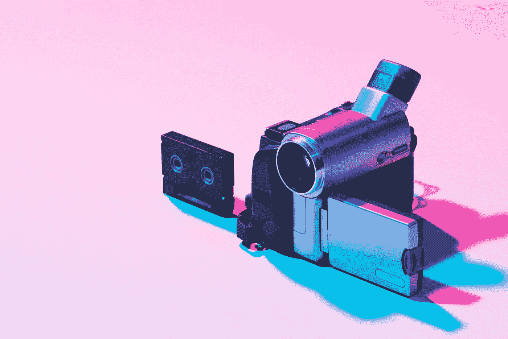

# DDI 有新的 Youtube 频道了！

> 原文：<https://medium.datadriveninvestor.com/ddi-has-a-new-youtube-channel-d2facce51491?source=collection_archive---------19----------------------->

## [立即订阅！](https://www.youtube.com/channel/UCdKDq7Tu9f8xtooSLZ92AEw)

# 亲爱的朋友们，

现在，您一定开始意识到 DDI 不仅仅是一个媒体出版物，我们正在为社区建立一个多维平台，以促进思想交流和见解共享。

作为我们帮助作家接触更广泛受众战略的一部分，DDI 推出了我们自己的 youtube 频道 的 [**，帮助将您的精彩故事转化为 youtube 社区有吸引力且易于消化的视频。这将有助于你获得一个全新的流量来源，以前没有开发。如果您是 Medium Partners 计划的一部分，那么流量的增加将是一个巨大的推动！**](https://www.youtube.com/channel/UCdKDq7Tu9f8xtooSLZ92AEw)

由于这是一个新的页面，我们询问您是否可以点击[**SUBSCRIBE**](https://www.youtube.com/channel/UCdKDq7Tu9f8xtooSLZ92AEw)**来打开频道！**

**此外，如果你想在你的社交媒体上分享我们的一些视频，这将是对频道的巨大推动，我们将不胜荣幸！**

**我们在 DDI 要感谢你们所有人的持续支持，感谢你们帮助我们建立了这样一个由充满激情的个人组成的伟大社区。**

# ****现在，你怎么能参与进来呢？****

**如果你是一个想获得更多曝光率的作家，只需将你的故事发至 videos@datadriveninvestor.com*网站，我们将施展我们的魔法。***

***提交标准:*

故事的 medium/DDI 主站点文章链接；您想要展示的 5-8 个要点

与要点相匹配的图片/照片；链接的外部 URL(供您使用)**

**我们有宏伟的计划，所以我们正在寻找有兴趣成为我们 DDI Youtube 频道发展一部分的合作者。我们希望听到您的想法和创意，并欢迎您提交您想要发布的独特视频内容。这是一个**所有**、**、T29 的平台，我们希望**你**能够分享和推广你的作品。如果您有任何想要我们展示的内容，请不要害羞，直接发送给我们！****

**我们正在推出专家讨论、视频教程和其他视频内容。请通过*videos@datadriveninvestor.com*联系我们，让我们知道您是否有想要的东西。**

***《走向清晰，而不是精神错乱》***

**DDI 团队**