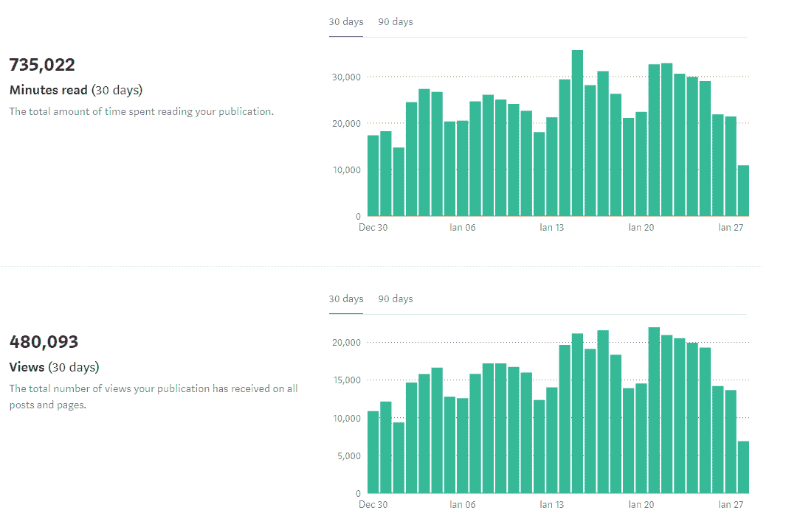

# DDI 超过 10，000 人

> 原文：<https://medium.datadriveninvestor.com/ddi-is-10-000-strong-17276ebf36dc?source=collection_archive---------34----------------------->

亲爱的朋友们，

我很自豪能成为好消息的传递者！
数据驱动型投资者今天已经突破了 10，000 名关注者的里程碑！

## 一万多人

给你一个关于这个数字的视角，我们的追随者可以填满百老汇剧院 6 倍以上..

如果我们在一个屋檐下为所有的人组织一次新年倒计时，我们将会把 1988 年夏季奥运会举办地汉城的整个奥林匹克体操馆填满。

How Olympic Gymnastics Arena would look like with all current DDI-ers in it

## 激动人心的数字

目前，DDI 的页面浏览量超过 480，000 次，我们的读者每月花费 735，000 多分钟阅读 DDI 上发布的内容。

无论你是一名寻求向更广泛的受众传播精彩想法的作家，还是一名踏上自我提升之旅的读者，我相信分享 DDI 的统计数据将有助于你实现目标。

## 大卫对抗歌利亚的故事才刚刚开始

我们目前是 8，449 家媒体出版物中增长最快的第 28 家，击败了像**ThinkGrowth.org**(15 万粉丝)、T **大西洋** (15 万粉丝)和**谷歌开发者**(8.5 万粉丝)这样的巨头。

这只能说明一件事——DDI 的潜力**无限**。

为了充分实现这一潜力，我们邀请所有的 DDI er 成为我们旅程的一部分。

关注我们 [**此处**](https://pages.convertkit.com/aa17a2bf1e/f261cc5cc0) 了解如何参与其中。

> “走向清晰，而不是疯狂！”

DDI 团队