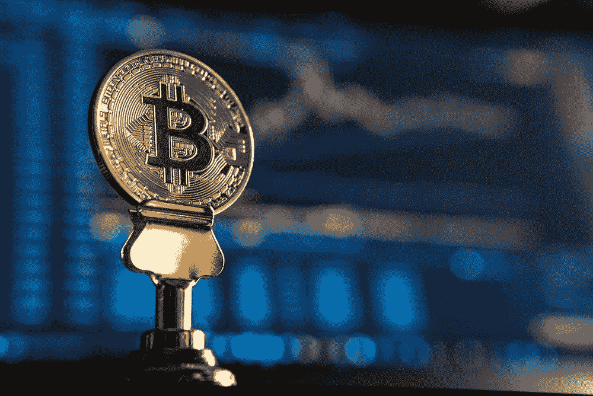

# DDI —顶级区块链课程回顾

> 原文：<https://medium.datadriveninvestor.com/ddi-top-blockchain-courses-review-37aded812741?source=collection_archive---------9----------------------->

随着比特币最近的复苏，这是一个重温你的加密知识和区块链技能的好时机。

无论您是技术新手还是想要在行业中领先，我们都有合适的资源来帮助您起步。

点击 阅读完整列表 [**。**](https://www.datadriveninvestor.com/top-10-blockchain-courses/)

> 区块链委员会 Eid 销售将于 6 月 9 日结束—全网站 20%折扣！
> 
> 折扣代码:Eid20

# [认证智能合同开发者](http://bit.ly/31fauAw)

区块链委员会一直在开发各种关于发展区块链的高度专业的认证课程，这是出了名的。智能合约开发者课程将让你学习什么是智能合约，以及如何在以太坊和其他区块链平台上将其付诸实践。

[**现在报名**](http://bit.ly/31fauAw)

# [认证区块链专家第二版](http://bit.ly/2EUHrJ4)

这门课程的目标是那些想在没有软件开发的情况下进入区块链工作领域的专业人士。该课程深入、实用，并提供项目经验。它打开了区块链顾问、建筑师或项目经理的职业机会之门。

[**现在报名**](http://bit.ly/2EUHrJ4)

# [认证区块链开发者第二版](http://bit.ly/2Wlkjcu)

2018 年区块链开发者是最抢手的 IT 专业人士，需求似乎没有放缓。区块链委员会认证向雇主展示了你在多个平台上创建区块链的熟练程度。

[**现在报名**](http://bit.ly/2Wlkjcu)

[**认证加密货币交易商**](http://bit.ly/2Ij8QoM)

对令人兴奋的加密货币世界感兴趣？你想学习如何在动荡的加密市场中获利吗？这是你的机会！本课程向您展示什么是加密货币，如何交易和了解市场动向。

[**现在报名**](http://bit.ly/2Ij8QoM)