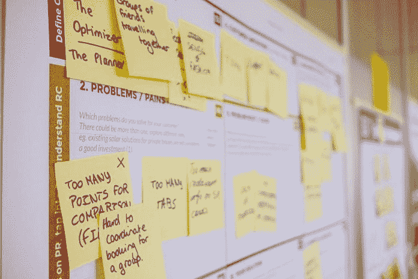

# DDI —每周精选 2019 年 4 月 22 日

> 原文：<https://medium.datadriveninvestor.com/ddi-weekly-selection-april-22-2019-db3a62a7c1d4?source=collection_archive---------6----------------------->

# 算法本身并没有偏见，它是一种预期的结果，会带来意想不到的后果

由 [**文森特**塔宝拉](https://www.datadriveninvestor.com/2019/04/08/algorithms/)

Twitter、脸书和谷歌等公司因监管内容时的偏袒而受到批评。Twitter 被指控禁止比自由派用户更多的保守派和右翼用户。

众所周知，脸书支持更多支持自由主义和左派观点的内容。据观察，谷歌在搜索结果中对左派内容的排名高于右派和保守派。我不会列举所有的例子，但你可以阅读.. [**【阅读更多】**](https://www.datadriveninvestor.com/2019/04/08/algorithms/)

# 杀死你公司的毒药可以拯救它

由 [**艾利森**](https://www.datadriveninvestor.com/2019/03/26/poison-in-your-company-productive-pessimism/)

悲观在商业中是必要的。这就是我们不断创新、成长和改进我们人类创造的公司的原因。然而，有生产性悲观和破坏性悲观。

也不要把这些和批评混为一谈——悲观主义不需要把其他人也牵扯进来。批评可以在成功的地方进行，而悲观主义通常只关注失败(或可能的失败)。我们可以生气，消极，只看到事物的缺点，但仍然利用它.. [**【阅读更多】**](https://www.datadriveninvestor.com/2019/03/26/poison-in-your-company-productive-pessimism/)

# 比特币现金内战现在将加密交易所卷入其中

由 [**费萨尔汗**](https://www.datadriveninvestor.com/2019/04/16/the-bitcoin-cash-civil-war-now-embroils-crypto-exchanges/)

如果说隐密体有什么是我喜欢的，那就是它总是充满新的、有趣的或有争议的东西，我今天的隐密日记也不例外。

回到 2018 年 11 月，加密巨头比特币(BTC)的分支经历了一次有争议的硬分叉，当时 BCH 社区分裂为 BCH ABC(可调整区块大小上限)和 BCH SV(Satoshi Vision)——请记住，BCH 是 2017 年 8 月比特币硬分叉本身的结果，也在 2018 年 5 月经历了另一次硬分叉——这是半年前发生的硬分叉的一个小背景.. [**【阅读更多】**](https://www.datadriveninvestor.com/2019/04/16/the-bitcoin-cash-civil-war-now-embroils-crypto-exchanges/)