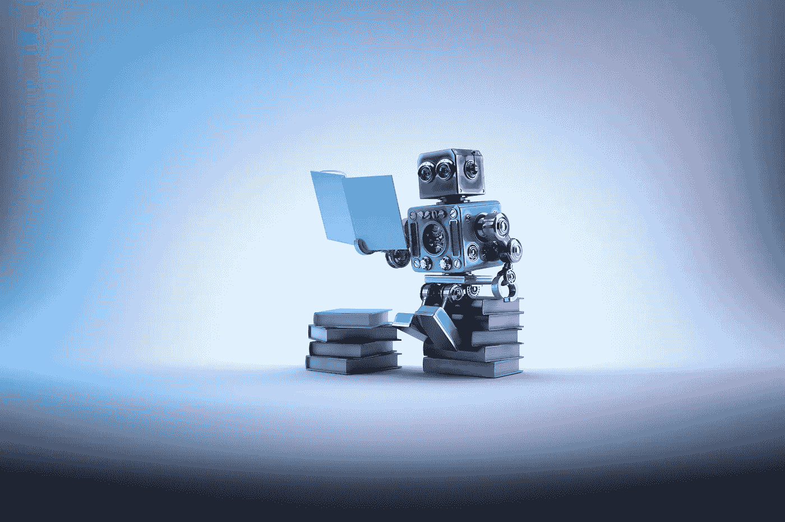

# DDI 每周精选—2018 年 7 月 1 日

> 原文：<https://medium.datadriveninvestor.com/ddi-weekly-selection-july-1-2018-1eb2362c7c30?source=collection_archive---------11----------------------->

# [每个人都便便](https://medium.com/datadriveninvestor/everyone-poops-f50894714b26)

由[马蒂·特佐洛](https://medium.com/@mattie.terzolo) — 6 分钟阅读

*每个人都会便便*是人类和动物吃食物和便便的永恒故事。Taro Gomi 没有让我们做好准备的是，有些人会在街上拉屎。在旧金山，人类排泄物是一个日益严重的问题；无论是对于那些撞上它的人，还是对于那些除了在公共街道上解手之外别无选择的人。

# [人工智能去杂波生活](https://medium.com/datadriveninvestor/ai-to-de-clutter-life-fc9c11d84776)

由 [Harsha Angeri](https://medium.com/@harshaangeri) — 10 分钟阅读

美国成年人平均每天花大约 6 个小时在互联网上(来源:2018 年 KPCB 互联网趋势)。

我们不断地在网上寻找。我们发现了什么？

**杂乱。**

# [**拆箱区块链**](https://medium.com/datadriveninvestor/unboxing-blockchain-5a2203c50839)

由[马达夫·米什拉](https://medium.com/@madhav.mishra) — 4 分钟读取

区块链是所有加密货币交易的数字化、分散化、公开的分类账。随着“已完成”[块](https://www.investopedia.com/terms/b/block-bitcoin-block.asp)(最近的交易)被记录并按时间顺序添加到其中，它不断增长，允许市场参与者跟踪数字货币交易，而无需中央记录保存。每个节点(连接到网络的计算机)都有一份自动下载的区块链。

# [**加密货币到底有多分散？**](https://medium.com/datadriveninvestor/just-how-decentralized-are-cryptocurrencies-3c26c179d3ad)

由 [Shashank Pattekar](https://medium.com/@shashankpattekar) — 7 分钟读取

*“我再给你讲一个报道不足，但值得关注的故事。比特币真的被中国控制了。中国有四家矿商控制了超过 50%的比特币。”*

当布拉德·加林豪斯(Brad Garlinghouse)最近做出这一[断言](https://www.thestreet.com/investing/bitcoin/ripple-ceo-speaks-at-stifel-financial-conference-14619614)时，他似乎指的是中国不成比例的比特币挖矿力量的积累。Ripple 首席执行官强调了一个在加密界仍在激烈辩论的问题，即尽管去中心化是加密货币的核心原则，但比特币——事实上，许多最大的加密货币项目——仍以这样或那样的形式表现出某种程度的集中化。

# [专题信息图——你想知道的一切——第二卷](https://medium.com/datadriveninvestor/infographic-special-everything-you-want-to-know-vol-2-42a1a6d32f09)

由[费萨尔汗](https://medium.com/@khanfk) — 3 分钟阅读

这是本周信息图表专题的一小部分。请随时评论或提供任何反馈。

# [**把你萎靡不振的生意变成一只 AI 蝴蝶**](https://medium.com/datadriveninvestor/transform-your-sluggish-business-into-an-ai-butterfly-3c3b22013f3)

由 [Roseanne Murphy](https://medium.com/@roseannemurphy2) — 4 分钟阅读

无论从哪个角度来看，邀请机器学习进入你的业务运营都是一项投资。你必须投入时间和金钱，员工需要再培训。你的牌被重新洗牌。

很多公司不喜欢这样。他们觉得这令人生畏。