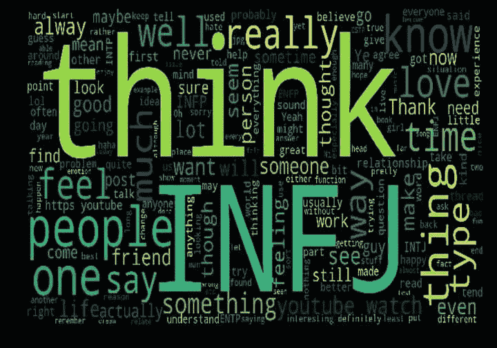

# DDI —每周精选 2019 年 6 月 10 日

> 原文：<https://medium.datadriveninvestor.com/ddi-weekly-selection-june-10-2019-92f30759cc14?source=collection_archive---------11----------------------->

​

# [训练人工智能从文本中预测迈尔斯-布里格斯性格类型](https://www.datadriveninvestor.com/2019/06/03/training-ai-to-predict-myers-briggs-personality-types-from-texts/)

由**—7 分钟阅读**

**我上大学时，经常看《吉尔莫女孩》，这是一部由埃米·谢尔曼·帕拉迪诺创作、劳伦·格拉汉姆和阿丽克西斯·布莱德尔主演的美国喜剧连续剧。我看了 7 季，加上 2016 年上映的续集。喜欢不同性格的人物组合。我是罗里·吉尔摩和洛根·亨茨伯格的超级粉丝！​**

**所以，我找到了一个很好的数据集来玩，Myers-Brigss 16 种性格类型，我可以用它来训练一个模型，检测文本中不同类型的性格，甚至更好的是，在 Gilmore Girls 字符上测试它，以预测他们的性格！【[阅读更多](https://www.datadriveninvestor.com/2019/06/03/training-ai-to-predict-myers-briggs-personality-types-from-texts/)**

**​**

****

**​**

# **[修正政治意味着更新我们的民主制度](https://www.datadriveninvestor.com/2019/06/04/fixing-politics-means-updating-our-democratic-system/)**

**由 [**西尔万·罗雄**](https://www.datadriveninvestor.com/2019/06/04/fixing-politics-means-updating-our-democratic-system/) — 6 分钟读完**

**我们都曾抱怨过我们的政客。我们都熟悉他们的行为模式。我发现有趣的是，我们经常对政治家令人恼火的行为不屑一顾，认为这只是正常的行为，没什么可做的。**

**例如，许多政治家在政治生涯末期致力于不受欢迎但又必要的立法。那时他们知道对该法案的反应不会影响他们自己的个人生活。**

**他们不能连任，所以他们只有在那时才实施这些法律。因此，人们往往必须等待，也许还要忍受几年，一项法律才能生效，尽管从技术上讲，这项法律可以更快地制定出来。【 [**阅读更多**](https://www.datadriveninvestor.com/2019/06/04/fixing-politics-means-updating-our-democratic-system/)**

**​**

****

**​**

# **[定向广告主导竞争](https://www.datadriveninvestor.com/2019/06/05/targeted-ads-dominate-the-competition/)**

**由 [**吉姆·卡扎曼**](https://www.datadriveninvestor.com/2019/06/05/targeted-ads-dominate-the-competition/) — 3 分钟阅读**

**广告必须有策略地投放，以获得最佳投资回报。这可能是在竞争激烈的市场中的决定性因素。除了是一名社交媒体经理和生活博客写手，阿什利·莫克维纳还是一名广告大师。**

**他在一次非洲推特聊天中解释了在社交媒体上投放广告的各种方式，哪些平台最划算，以及企业与消费者联系的其他策略。**

**在争夺最佳社交媒体场所的竞争中，一家公司脱颖而出。【 [**阅读更多**](https://www.datadriveninvestor.com/2019/06/05/targeted-ads-dominate-the-competition/)**