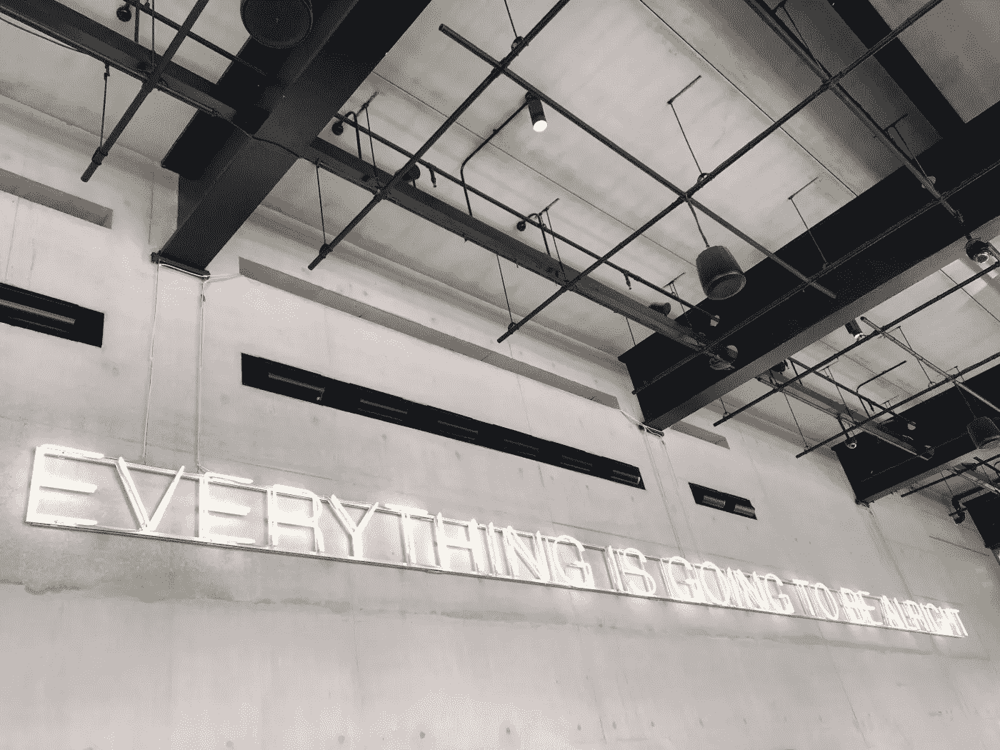

# DDI —每周精选 2019 年 6 月 18 日

> 原文：<https://medium.datadriveninvestor.com/ddi-weekly-selection-june-18-2019-9e30b822a78e?source=collection_archive---------13----------------------->

# [想要追求你的激情——迈出第一步](https://medium.com/datadriveninvestor/wanna-pursue-your-passion-take-this-first-step-76eb9a341fa6)

由[**伊丽莎白**](https://medium.com/@thenewrulesofdating) — 6 分钟读完

我的另一半总是和我分享生活如何让你感到不舒服的故事，开始时有一点，然后越来越多，就好像把你推向另一个方向。他称之为鸟巢的沙沙声。

有时你会受到小小的触动，也许你在人生决策方面没有朝着正确的方向前进。他们通常从一些小迹象开始，如压力、睡眠不足、焦虑、不开心等。它可以是当你做着可能会感到舒适，甚至可能看起来阻力最小的事情时，你内心深处的那种感觉，但它会在你内心产生一种不安。​

然后，这些迹象变得越来越大，几乎到了你无法忽视它们的地步。你睡不着。很多时候你会感到不安。你只是感觉不到平静。有些东西感觉缺失了，它无法被你最初告诉自己是你走上一条特定道路的原因的事情填补或证明。[**阅读更多】**](https://medium.com/datadriveninvestor/wanna-pursue-your-passion-take-this-first-step-76eb9a341fa6)

# [我是谁？人工智能可以帮你找到这个问题的答案](https://www.datadriveninvestor.com/2019/06/08/who-am-i-ai-can-help-you-find-the-answer-to-that-question/)

由[**拉曼迪**](https://www.datadriveninvestor.com/2019/06/08/who-am-i-ai-can-help-you-find-the-answer-to-that-question/) — 3 min 阅读

人类 99.9%相同，0.1%不同。尽管 0.1%看起来是一个很小的量，但考虑到人类拥有的碱基对数量，这实际上是一个很大的量。我们的 DNA 中都有三百万个独特的点。如果我们能够理解我们 DNA 中的不同基因变异，以及它们如何影响我们，我们就可以开始应用所谓的个性化医疗。

个性化医疗是医生为患者定制治疗方案。就我个人而言，我认为我们应该使用个性化的药物，因为我们都是如此不同。对一个人有效的治疗方法对另一个人就不一样了。然而，人工分析基因变异需要数年时间。

这就是人工智能的用武之地。人工智能可以用来分析变异如何影响我们，以预测某人患某种疾病的概率，以及哪些治疗方法对治疗我们可能患的疾病最有效。 [**【阅读更多】**](https://www.datadriveninvestor.com/2019/06/08/who-am-i-ai-can-help-you-find-the-answer-to-that-question/)

# [凡事皆有因(？)](https://medium.com/datadriveninvestor/everything-happens-for-a-reason-ecfef4d6e257)

由 [**阿德里安·s·波特**](https://medium.com/@adrianpotter) — 4 分钟读完

> "我相信每件事的发生都是有原因的，即使我们不够聪明，看不到这一点。"—奥普拉·温弗瑞

我用这句话的奥普拉版本来引发这场咆哮，但每个人都熟悉这句话，万事皆有因。历史上有 10 亿人以各种形式提到过它(所以请原谅奥普拉的粉丝们——我不只是在挑剔她)。​

这句话被想成为哲学家的人、自助大师、给孩子灌输一丝希望的父母、传教士、老师以及任何想在面对不幸时假装聪明的人广为流传。

一方面，这句话可以激励人心，暗示我们在每一次损失的背后都有一个我们需要发现和消化的有价值的教训。

但是从另一方面来说，这句老套的咒语可能是失败者用来隐藏他们远远落后于这个世界上有进取心的人的事实的拐杖。 [**【阅读更多】**](https://medium.com/datadriveninvestor/everything-happens-for-a-reason-ecfef4d6e257)