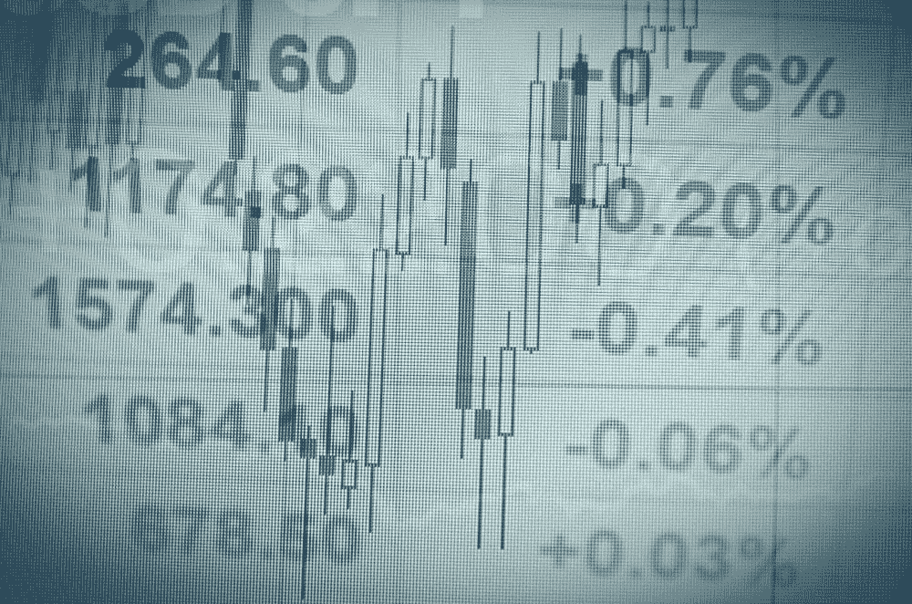
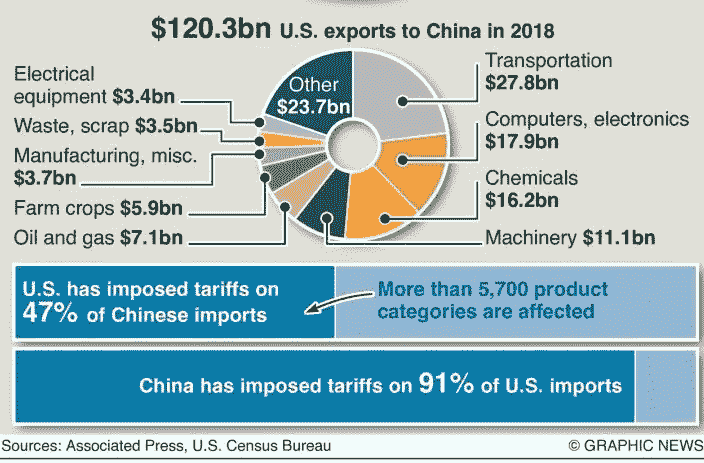

# DDI —每周精选 2019 年 5 月 13 日

> 原文：<https://medium.datadriveninvestor.com/ddi-weekly-selection-may-13-2019-43925c4af2d1?source=collection_archive---------14----------------------->

## [了解平台资本主义](https://www.datadriveninvestor.com/2019/05/09/understanding-platform-capitalism/)

由[的**丹尼尔·詹宁斯的**的](https://www.datadriveninvestor.com/2019/05/09/understanding-platform-capitalism/)

理解平台资本主义对于在 21 世纪赚钱至关重要。解释一下，平台就是网络；或生态系统，(通常)提供商品或服务的数字。平台的所有者可以通过三种方式从这些商品或服务中赚钱。

首先，像**网飞(纳斯达克代码:NFLX)** 这样的平台对入驻平台收取固定费用或通行费。例如，网飞会员通过付费可以获得无限量的流媒体视频。

第二，一个平台对每一笔交易收取费用。比如 **PayPal(纳斯达克股票代码:PYPL)** 每笔交易收费 2.9%；或 30₵销售，用于付款处理。

第三，许多平台向商家收取访问客户或观众的费用。具体来说， **Alphabet(纳斯达克股票代码:GOOG)** 向使用谷歌搜索引擎的广告商收取费用。另外，**亚马逊(NASDAQ: AMZN)** 和**阿里巴巴(NYSE: BABA)** 向商家收取访问客户的费用。 [**【阅读更多】**](https://www.datadriveninvestor.com/2019/05/09/understanding-platform-capitalism/)

​

## [使用网络抓取的智能电子商务定价策略](https://www.datadriveninvestor.com/2019/05/09/smart-e-commerce-pricing-strategy-using-web-scraping/)

由 [**阿希汉**](https://www.datadriveninvestor.com/2019/05/09/smart-e-commerce-pricing-strategy-using-web-scraping/)

一个失败的故事:假设你有 50 副暴徒生活太阳镜，总共花了你 33 美元。基于电子商务的成本定价，每双鞋的零售价格应该是单位制造成本和单位边际利润之和。

**成本+加价=挂牌价格**

然后你做相应的计算:

0.7 美元材料成本(30 美元/50 双)

4.39 美元间接成本(买家运费)

0.7 美元+4.39 美元=**5.09 美元**总成本****

**这是你第一次在易贝卖东西。你天真又贪婪，把加价定为成本的 95%。在易贝上的零售价是 5.09 美元* 195% = 9.95 美元。**

**我实际上是故事中的卖家。你可能会预见到这样的结果:连续六个月没有一个人会买太阳镜，即使在我把价格降到 4 美元之后。似乎很明显，如果你降低价格，人们就会来看你的清单。然而，这对于许多电子商务卖家和公司来说是一个巨大的误解。 [**【阅读更多】**](https://www.datadriveninvestor.com/2019/05/09/smart-e-commerce-pricing-strategy-using-web-scraping/)**

****

## **[贸易战再次升级&其影响](https://www.datadriveninvestor.com/2019/05/12/the-re-escalation-of-trade-war-its-implications/)**

**由 [**费萨尔汗**](https://www.datadriveninvestor.com/2019/05/12/the-re-escalation-of-trade-war-its-implications/)**

**本周早些时候，特朗普总统发了一条推特，威胁要在周五将 2000 亿美元的中国进口关税从目前的 10%提高到 25%，引发了股市的下跌——他最终做到了。**

**这引发了全球股市的紧张情绪，因为投资者已经将这一问题搁置一边，预计很快会达成某种贸易协议。但特朗普对两个最大经济体之间旷日持久的谈判的失望从这一行动中显而易见。不仅如此，他还威胁将剩余的 3250 亿美元中国进口商品的关税提高到 25%。 [**【阅读更多】**](https://www.datadriveninvestor.com/2019/05/12/the-re-escalation-of-trade-war-its-implications/)**