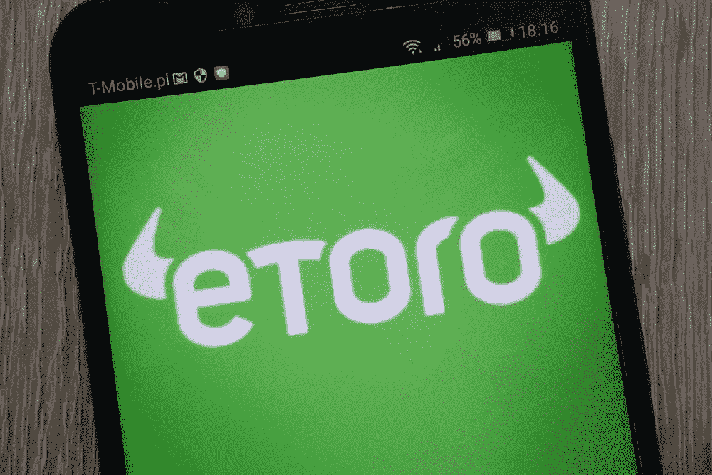
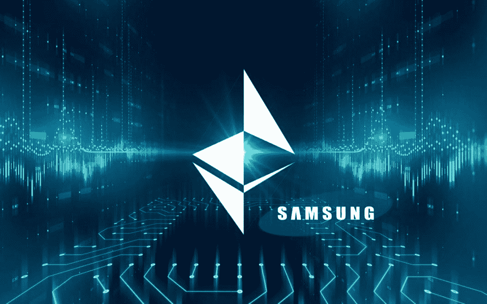

# DDI —每周选择 2019 年 5 月 6 日

> 原文：<https://medium.datadriveninvestor.com/ddi-weekly-selection-may-6-2019-c7e42438e40f?source=collection_archive---------16----------------------->

## [eToro 终极指南](https://www.datadriveninvestor.com/2019/05/02/the-ultimate-guide-to-etoro/#)

由[号**纳希德阿克哈特**号](https://www.datadriveninvestor.com/2019/05/02/the-ultimate-guide-to-etoro/#)

可以说是整个 eToro 平台上最好的功能，复制交易是一种允许投资者自动复制已开仓并由专业交易员管理的头寸的工具。

因此，它有效地允许经验不足的投资者利用平台上最好的交易者的专业知识。它能让你从平台上成千上万的交易者中进行选择。它是完全可定制的，这意味着你可以找到适合你的个人资料和偏好的交易者。 [**【阅读更多】**](https://www.datadriveninvestor.com/2019/05/02/the-ultimate-guide-to-etoro/#)

## [Ocado 引领零售业机器人化](https://www.datadriveninvestor.com/2019/05/03/ocado-leads-the-robotization-of-retail/)

由 [**丹尼尔·詹宁斯**](https://www.datadriveninvestor.com/2019/05/03/ocado-leads-the-robotization-of-retail/)

Ocado 和美国杂货巨头 Kroger(纽约证券交易所代码:KR)计划在美国建立 20 个 CFC。首批两个美国氯氟化碳项目已经在佛罗里达和俄亥俄州开始建设。重要的是，克罗格拥有 Ocado Group Plc 6%的股份。此外，据《金融时报》报道，Ocado 正在探索与瑞典杂货商 ICA、加拿大 Sobey's 和法国集团 Casino 建立 CFC 的合作伙伴关系。

在英国，Ocado 与服装和奢侈食品零售商马克&斯潘塞(M&S)合作推出了一项食品杂货配送服务。据路透社报道，马克斯-斯潘塞公司将向 Ocado 支付 7.5 亿英镑(10 亿美元)组建合资企业。M&S 将通过发行 600 股股票和削减 40%的股息来为新的杂货服务融资。 [**【阅读更多】**](https://www.datadriveninvestor.com/2019/05/03/ocado-leads-the-robotization-of-retail/)

​

## 加密日记:三星硬币，科技巨头的 BaaS

由 [**费萨尔汗**](https://www.datadriveninvestor.com/2019/05/02/crypto-diaries-samasung-coin-tech-giants-baas-the-rise-of-coinjoins/)

对于加密货币来说，4 月是一个巨大的月份。以小反弹形式出现的看涨修正已经持续了整整一个月，这是我们在将近一年半的时间里没有看到过的。

Alt 的大多数。硬币跟随比特币(BTC)的价格上涨，但迄今为止，BTC 是持续看涨势头的最大受益者。在撰写本文时，BTC 的主导地位为 54.8%，Cryptos 的总市值达到 1790 亿美元。现在让我们转到其他感兴趣的话题上来。 [**【阅读更多】**](https://www.datadriveninvestor.com/2019/05/02/crypto-diaries-samasung-coin-tech-giants-baas-the-rise-of-coinjoins/)