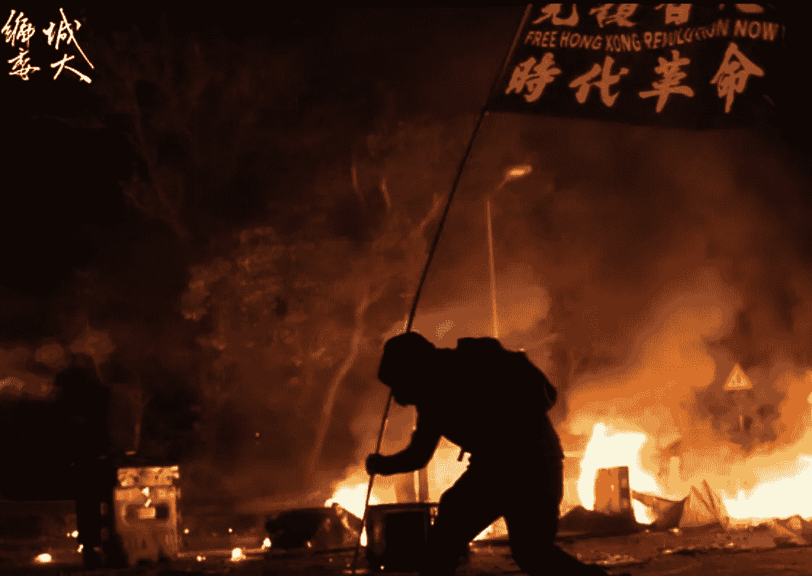

# DDI —每周精选 2019 年 11 月 18 日

> 原文：<https://medium.datadriveninvestor.com/ddi-weekly-selection-november-18-2019-8fe661c8afee?source=collection_archive---------18----------------------->

# 香港现在发生了什么？

作者 Ladykylie

警察向手无寸铁的市民开枪，三名年轻人被击中，情况危急。没有参加活动的普通民众因为只是路过而被喷辣椒水，或者无缘无故地被逮捕、被暴打。

催泪弹在香港各处被发射，对私人财产造成损害，包括住宅区、商店、大学、医院和疗养院。 [**【阅读更多】**](https://medium.com/@kyliecthapthong/what-is-happening-now-in-hong-kong-2019-nov-13-451ee063a5d4)

# 他们的故事值得一看

作者:吉姆·卡扎曼

成功的企业建立在有效的故事之上。人们喜欢看、读或听故事。这些故事创造了一种基于同理心的人际关系。当你通过一个故事来推广你的品牌时，你不是在试图说服观众购买你的产品。你们分享一个经历，把决定权留给他们。对于 Solomon Kershima Yateghtegh 来说，这就是说服的艺术。他以此为生。 [**【阅读更多】**](https://www.datadriveninvestor.com/2019/11/14/theirs-are-stories-to-behold/)

# 你是什么水平？(k 级理论解释)

梅尔·范·登·阿克

想象一下，一个教室里大约有 30 名学生。这门课是关于神经经济学的讲座，学生都是行为科学家或行为经济学家。我们的讲师(也是一位神经经济学家)突然转过身来，建议我们玩一个小游戏。房间里的紧张气氛上升了。人们或兴奋或警惕地看着对方。“我们来玩选美吧。”

现在不要认为我的神经经济学讲师是某种类型的讨厌鬼。如今，选美比赛与参赛者的实际长相无关。让我解释一下。 [**【阅读更多】**](https://www.datadriveninvestor.com/2019/11/12/whats-your-level-level-k-theory-explained/)

# 加密博彩行业(预测市场):概述

伊戈尔·达维多夫

预测市场是人们对未来事件发生的推测的集合。这些事件包括:选举结果、商品价格、体育赛事等等。通过利用“大众的智慧”，这些市场决定了未来结果的可能性。那些正确预测结果的人赢了钱，那些没有输的人赢了钱。

预测市场有多种用例。第一是预测未来事件。预测市场已经被用来“准确预测政治竞赛、体育赛事的结果，偶尔还有经济结果” [**【阅读更多】**](https://www.datadriveninvestor.com/2019/11/15/the-crypto-betting-industry-prediction-markets-an-overview/)

# 自动驾驶汽车的剖析

作者:拉曼迪普·塞尼

现代汽车已经存在了一个多世纪，是我们日常生活的基础。尽管汽车已经存在了很长时间，但在使用汽车之前，我们总是必须精通一项至关重要的技能:驾驶。不再是了。汽车行业即将发生巨大的变化，它被命名为自动驾驶汽车。

现在你一定想知道，这些自动驾驶汽车是如何工作的？先是电脑学会了下棋，现在会开车了？？？嗯，自动驾驶汽车使用五个关键组件运行:计算机视觉、传感器融合、定位、路径规划和控制。 [**【阅读更多】**](https://www.datadriveninvestor.com/2019/11/14/the-anatomy-of-self-driving-cars/)