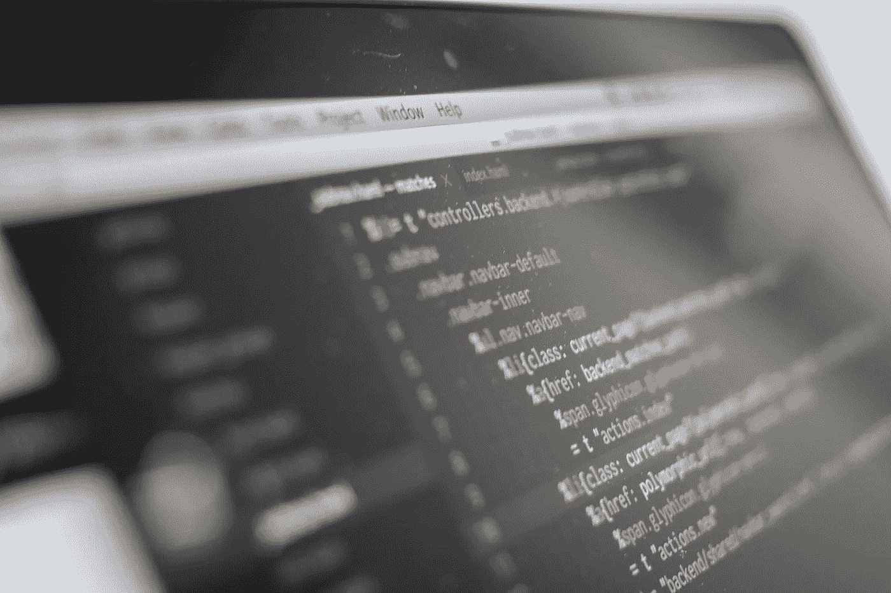

# DDI 每周精选—2018 年 9 月 3 日

> 原文：<https://medium.datadriveninvestor.com/ddi-weekly-selection-september-3-2018-785b3ab7002a?source=collection_archive---------19----------------------->

# 人工智能将如何通过给你一份新工作来偷走你的无聊工作。

由[托马斯·瓦托](https://medium.com/@thomasvato) — 4 分钟阅读

人工智能正在窃取工作，让一些人失业。对于某些工作和职业来说，这是一个危险的结局。这只是正在发生的事件的表面现象。

# [你的应用的 8 个关键 KPI 以及如何跟踪它们](https://medium.com/datadriveninvestor/8-critical-kpis-for-your-app-and-how-to-track-them-5a6d74ee7c9b)

通过 [Appsee](https://medium.com/@Appseecom) — 7 分钟读取

你的应用是你的宝贝。你溺爱它，你珍惜它，你是一流的直升机家长。在它诞生之前，你倾注了大量的数字、逻辑和实践，然后做出(你当时认为的)对应用的生存和最终繁荣最好的决定——这些决定将积极地影响你的生活和你的应用的生活。

# [电子商务的挑战和发展方向](https://medium.com/datadriveninvestor/the-challenges-of-ecommerce-and-where-things-are-headed-8a05bbc47050)

通过[乔·汉森](https://medium.com/@joehanson) — 6 分钟阅读

20 世纪中叶，西尔斯的国内年收入徘徊在整个美国 GDP 的 1%左右(约为今天的 1800 亿美元)。他们是无与伦比的庞然大物——出售从工具、洗衣机到房子的一切东西。快进到 2005 年。一家名为亚马逊的小公司仅为西尔斯带来了 17%的收入。接下来的 5 年里，西尔斯的销售额每年下降 14%，而亚马逊的销售额翻了两番。到 2016 年，亚马逊的收入为 1360 亿美元，而西尔斯为 220 亿美元。

# [SEC 提出的“最佳利益”规则未能保护投资者](https://medium.com/datadriveninvestor/sec-best-interest-proposed-rule-falls-short-of-protecting-investors-54ad68c4700b)

到[更好的市场](https://medium.com/@BetterMarkets) — 4 分钟阅读

每个美国人都期望并应该从他们的经纪人那里得到至少一样东西:符合他们最大利益的客观金融建议。但通常不会这样。相反，几十年来，经纪公司被允许推荐用佣金和费用填满自己钱包的投资，同时让客户购买定价过高、表现不佳的产品，根据极其保守的估计，这些产品每年会造成数百亿美元的储蓄损失。三个月前，美国证券交易委员会最终提出了一项据说可以解决问题的规则。

# [所以你想学编程](https://medium.com/datadriveninvestor/so-you-want-to-learn-programming-8641a55ec880)

由 [Kawai Wong](https://medium.com/@fancycoconut) — 10 分钟阅读

你是谁？你是不是一直想学编程(*从事副业或者像托尼·斯塔克和贾维斯*做的那样做一些很酷的事情)，但是不知道从哪里开始？也许你想换个职业..或者你可能已经知道了编程:你是一名高中生或大学生，正在思考你的编程技能下一步该何去何从。

# 提高心态质量的 8 种方法

由 [Davor Karafilowski](https://medium.com/@davorkarafiloski) — 10 分钟阅读

我们都经历过。你发现自己陷入了困境，回顾着自己的梦想，希望事情有所不同。然后你开始过度换气，你丑陋的朋友“过度思考”过来拜访。在这么混乱的情况下，一个人如何保持积极的态度？

答案很简单——一步一步来！