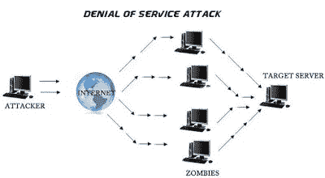
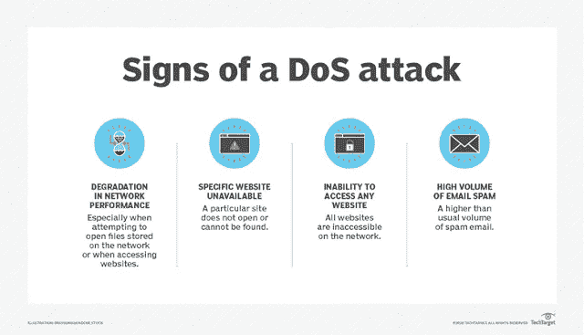

# DDoS 攻击—解释

> 原文：<https://medium.datadriveninvestor.com/ddos-attack-explained-9d67d467b1aa?source=collection_archive---------6----------------------->

DDoS 攻击是一种众所周知的分布式拒绝服务攻击。DDoS 攻击是一种利用 DoS 攻击多个受害系统的攻击，这些受害系统受到恶意程序的感染。

DoS 攻击是一种网络攻击，攻击者会攻击一台服务器，并为用户推送大量流量来关闭服务器。在 **DDoS** 攻击中，攻击将来自不同的来源，结果将是大规模的破坏。

# 工作:

受害者的电脑被称为僵尸。攻击者将向服务器提供更多的流量，例如成百上千的流量。这将变得不可能停止寻找和阻止 IP 地址。

很难找到这些可能的 IP 及其来源。

# DDoS 攻击的类型:

## 1.流量攻击:

这种攻击会向目标发送像 TCP、UDP 这样的巨大数据包。这会攻击服务器。这种攻击伴随着恶意软件利用。

## 2.带宽攻击:

在这种攻击中，攻击者会向目标加载大量垃圾数据。这将导致网络带宽损失，并导致拒绝服务。

## 3.应用攻击:

它将攻击受害者的应用层，并使资源不可用。

# 如何预防？

*   始终为 DDoS 攻击制定响应计划。
*   构建强大的网络基础设施。
*   学习基础网络工程
*   始终拥有基于云的存储。
*   理解所有的警告信号。

# 重要事项:

这是一个 DDoS 攻击的小介绍。订阅我们的博客了解更多信息。请随意评论你的观点。

[点击这里加入我们的脸书小组](https://www.facebook.com/groups/bugtech/)

[点击这里进入我们的脸书页面](https://www.facebook.com/Bug-Tech-380548266042438/?modal=admin_todo_tour)