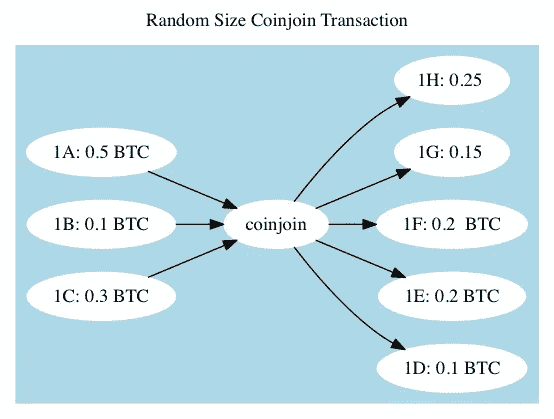
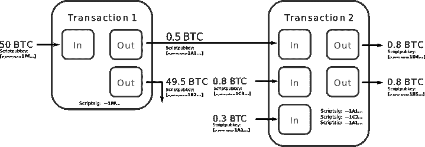

# 匿名加密服务的去匿名化

> 原文：<https://medium.datadriveninvestor.com/de-anonymizing-anonymous-crypto-services-a80258132e5b?source=collection_archive---------0----------------------->

随着退出骗局和对黑暗网络市场华尔街市场(WSM)的管理员的逮捕，区块链取证调查工作有了一些重要收获。逮捕起因于 WSM 管理员对比特币进行去匿名处理。

这里最大的担忧不是这些匿名化服务的失败，而是在网站上互动的人们的在线操作安全实践是如此之差。在[司法部文件](http://www.justice.gov/opa/press-release/file/1159706/download)中提到了特定用户之间的账户隔离。美国司法部文件的第 28 和 29 页详细描述了一个用户如何通过 PGP 密钥和比特币钱包身份与多个账户绑定。比特币钱包通过类似于 [bestmixer.io](http://bestmixer7o57mba.onion/) 的比特币翻滚服务被匿名化。tumblers 和最近的 coinjoins 背后的过程旨在清洗资金的路径。

# 翻滚服务

翻滚服务已经存在几年了。随着比特币假定匿名的想法逐渐消失，技术被创造出来以模糊区块链的输出。翻滚服务首次出现。翻滚给你别人的 BTC，发生在一个集中的位置。如果操作得当，监控可以发现交易。IP 地址跟踪也有助于缩小可能的用户范围。coinjoins 把你的 BTC 和一套别人的 BTC 混在一起。这是有联系的，但是貌似合理的否认允许用户声称不知道。仍然有一个到 coinjoin 服务的链接。 [nopara73](https://medium.com/u/34bdb6a99bc1?source=post_page-----a80258132e5b--------------------------------) 很好地解释了 coinjoin 事务是如何执行的。

对于普通的比特币交易:

> 你从一个地址寄一些硬币到另一个地址，你在同一个地址拿回零钱。当然，这种模式提供了可怕的比特币隐私，因此[改变地址](https://bitcoin.org/en/glossary/change-address)被引入。
> 
> 然而，你的钱包软件在内部生成第三个地址来接收零钱，而不是将零钱发送到同一个地址。这凸显了另一个问题，如何在一个钱包里存储这么多地址。[分层确定性钱包](https://bitcoin.org/en/developer-guide#hierarchical-deterministic-key-creation)解决了这个问题，但是这超出了本文的范围。

Coinjoin 随后试图利用这一问题给比特币网络带来一种匿名感。

Source via https://en.bitcoin.it/wiki/CoinJoin

> 当 CJ 发生时，每个人都必须把 1 个比特币送到某个地方，进行大规模的联合交易，然后没人能知道谁把比特币送到了哪里。当然，这只有在您查看单个事务而不是事务链时才成立。

围绕 coinjoin 的一个突出问题是，找到提供相同数量 BTC 的人将他们连接在一起，以建立这种 coin join 操作可能发生的似是而非的否认。以及进一步的区块链分析。围绕区块链分析的技术只会越来越好。这些法律公司可以使用的网络搜集/信息工具，是帮助政府的同谋，从几年前它们第一次上线的时候起，数量已经激增。

有很多关于三个字母的机构能够找出洗衣活动来源的故事。这封 2017 年由一群密码朋克组成的电子邮件链[警告了使用这些服务带来的危险。](https://marc.info/?l=cypherpunks&m=151429933610511&w=2)这些服务提供了一个解决方案，但服务要求并不总是能够实现。

# 区块链取证和调查能力

根据司法部的文件，邮政服务能够对管理员拥有的比特币进行去匿名化。仅凭钱包地址并不能发现 WSM 管理员的身份。管理员最大的问题是能够将他们自己或以前的别名与他们在 WSM 的当前帐户完全隔离开来。

> WSM 的第三个行政长官被称为“TheOne”，如下所述，调查进一步揭示了可能的原因，认为弗罗斯特是“TheOne”，有两个主要原因。首先，如下所述(在第 30 段)，用于“TheOne”的 PGP 公钥与用于 Hansa 市场上的另一名字“dudebuy”的 PGP 公钥相同如下所述，与弗罗斯特使用的虚拟货币钱包相关的金融交易与“dudebuy”有关。如上文第 4 . 1 段所述，在暗网调查的背景下，PGP 公钥可能是个人的唯一标识符。

大多数人在公共领域发布他们的 PGP 密钥，可以绑定到他们的帐户/用户名/电子邮件。“TheOne”拥有相同的 PGP 密钥，与另一个名为“dudebuy”的账户关联，用于绑定两个身份。这些在线身份很可能是被错误地联系在一起的。当“TheOne”创建他们的帐户时，我敢肯定他们不会考虑创建一个完全唯一的标识符，如 PGP 密钥对。这个小小的错误导致了联邦调查局对这个人的调查。

该报告继续解释了他们如何能够将“TheOne”与他的比特币钱包地址联系起来，这些地址与这个账户和“dudebuy”账户相关联。这一联系使执法机构更加相信“TheOne”和 dudebuy 是同一个人。

WSM 的另一名管理员由于他们的 VPN 提供商向执法部门提供了他们的 IP 地址而被迫回到他们的物理位置。虚拟专用网加密你的流量，这样除了虚拟专用网提供商没有人能看到你的流量。

> BKA 还调查了第二个被怀疑是管理员的人，他使用 2 号 VPN 提供商访问 WSM 服务器基础设施的某些仅供管理员使用的组件。BKA 告诉我，根据其调查过程，它了解到分配给这个人的家的一个 IP 地址(该 IP 地址的帐户是以嫌疑人母亲的名字注册的)在类似的大致时间范围内访问了 VPN 提供商#2，因为 VPN 提供商#2 访问了 WSM 服务器基础设施中仅供管理员使用的组件。根据我的培训和经验，我相信这个人(后来被确定为 KALLA)访问了 VPN 提供商#2，以访问 WSM 服务器基础架构中仅供管理员使用的组件。

我以前推荐过这个网站，我相信这是任何人寻找隐私/安全支持服务的最佳资源。VPN 提供商的日志记录总是一个问题。如果你担心被监视，那就需要采取措施。仅仅用家人的名字注册一个 VPN 是不会切断链接的。不需要法医天才就能联系起来。所需要的只是一个法庭命令，让 VPN 服务提供商交出他们所拥有的关于你的账户的一切。他们可以给出连接到他们服务的确切 IP 地址。有很多方法可以让你匿名支付/注册一个 VPN 服务，上面的链接说明了如何做到这一点。

# 为什么一切都出错了

WSM 以及上周被关闭的另一个暗网市场(Valhalla)的管理员需要在每次与他们的市场互动时保持警惕。这意味着在登录网站或与网站互动时，要格外小心。网站上使用的金融工具有助于实现假设的匿名，但如果你使用的服务实际上匿名了你的数字资产，它将发挥很大的作用。在进行实时测试之前，你不会真正知道你的 BTC 是否是匿名的，而当这种情况发生时，对一个人来说做出剧烈的改变可能已经太晚了。如果你在寻找私人数字货币，只需看看大多数人可以购买的[私人](https://masteringmonero.com/) [加密货币](https://www.getmonero.org/library/Zero-to-Monero-1-0-0.pdf)[即可。](https://z.cash/technology/)

执法机构会一直在打击这类服务。对于个人来说，除了逃避狱卒之外，避免坐牢的一个更简单的方法是转向 DAO 设置。OpenBazaar 和 [Bisq](https://bisq.network/) 为类似的事情提供了解决方案，人类风险进一步降低。

*翼型不纵容非法活动。教育自己，学习如何保持隐私和安全。你可以在 Josh@airfoilcapital.com 找到我或者访问翼型服务*