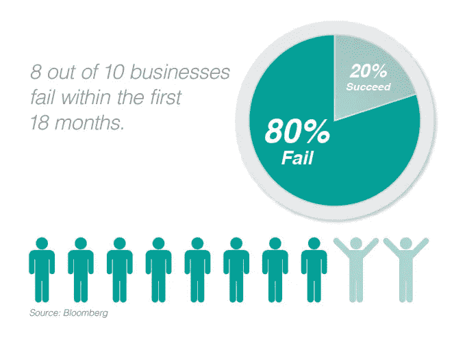
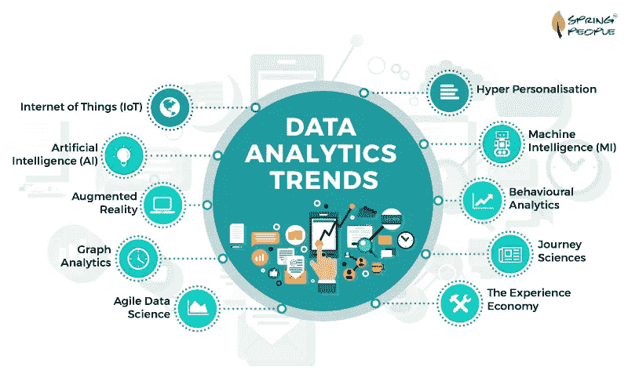

# 处理生意上的问题。

> 原文：<https://medium.datadriveninvestor.com/dealing-with-business-kryptonite-9ade0611d115?source=collection_archive---------7----------------------->

根据彭博的数据，在运营的前 18 个月内，十家企业中有八家会失败。只有前 20%的项目和企业首次成功上市，并在接下来的 50 年里长期存在。

百分之八十的公司倒闭了，去处理事务和准备清算报告。 ***这些商家怎么了？或者说，更重要的问题是，金融崩溃之前到底发生了什么？***

连续创业家和福布斯撰稿人埃里克·瓦格纳提出了五个理由。

**原因一**:没有真正接触客户。

**原因二**:市场没有真正的分化。

**第三个原因**:未能以清晰、简洁和有说服力的方式传达价值主张。

**原因四**:高层领导崩溃。

**第五个原因**:无法确定一个有可靠收入来源的盈利商业模式。

## 所有这些原因只有一个根本原因！这种业务被称为**“非结构化数据”！**

> “缺乏坦诚会阻碍聪明的想法、快速的行动以及优秀的人贡献他们所有的东西。简直是杀手锏。” ***杰克·韦尔奇，致胜***

[“http://sherpasoftware.com/wp-content/uploads/2013/08/Structured-Unstructured.png](http://sherpasoftware.com/wp-content/uploads/2013/08/Structured-Unstructured.png)”

# 什么是非结构化数据？

非结构化数据就是一切；它包括所有不易搜索的、隐藏的或有价值的原始信息，这些信息可能已经为组织所知。其中一些是社交媒体互动、网站、商业应用、移动数据和数字。

# 那么什么是结构化数据呢？

这些包括固定数据库、员工 ID 号、邮政编码和 SS 号。简而言之，它们可以很容易地被测定和提取使用。

这是当前经济中的一个大问题，对于企业尤其是中小型企业(SME)来说，世界上生成的大部分数据包含 80%以上的非结构化数据。大多数没有能力或正确的工具来处理它们，以便能够利用它来处理动态的经济环境。

## **80%的非结构化数据对比 20%的结构化数据**

如果一家 X 公司有 80%的业务数据被隐藏起来，并且无意中对利益相关者隐藏了起来，那该怎么办？这些数据中的大部分可能来自不同的部门，如 IT、行政和生产部门，以保护公司或掩盖某些事情来留住他们的投资者和贷款人。员工的创新想法因害怕失败而被经理隐瞒就是一个例子。

x 公司的员工应该将这一点正确地传达给组织中其他有帮助的人，高管也应该传达这样一个信息:颠覆性技术的失败尝试也将得到奖励，以促进改进。通过这种方式，它可以避免销售额下降或利润停滞，避免最糟糕的情况，即国家将关闭企业并清算其资产以支付贷款人。

通常，影响组织的大多数内部数据和外部数据都保存在运营级别，至少占可能决定组织命运的重要事务的 80%。

这就是为什么只有 20%的交易成功的原因。这要归功于开放的沟通、较少的官僚作风，以及沟通顺畅、目标明确。

[“https://www.springpeople.com/blog/wp-content/uploads/2017/12/Data_Analytics_Trends.jpg](https://www.springpeople.com/blog/wp-content/uploads/2017/12/Data_Analytics_Trends.jpg)”

# **好消息！**

如果问题在于非结构化数据分析的成本，你就不必雇佣数据科学家，也不必被迫支付高额费用。价格合理的人工智能和通过区块链提供的预测学习是解决方案！

**DATAVLT** 是一个开创性的区块链平台，旨在帮助来自世界各地的中小企业明智地利用业务数据来获得超越其他企业的竞争优势。

使用他们的分析平台，企业可以选择要分析的相关数据类型，然后将数据输入网络进行深入分析，并生成相当准确的报告和预测。报告可能包括销售预测报告、市场分析和人员管理绩效。

它们将用于帮助业主和管理人员做出有用的经济决策，并从 80%的老鼠夹中逃脱，并将他们的商业纳入 20%的最高成功率中。

你会成为前 20%的人吗？

