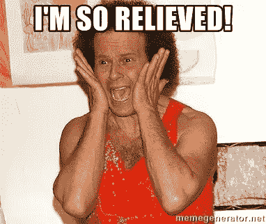
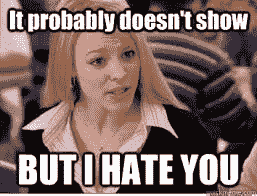
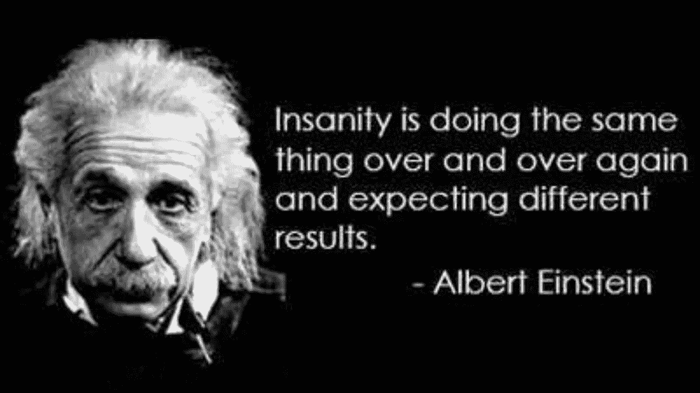
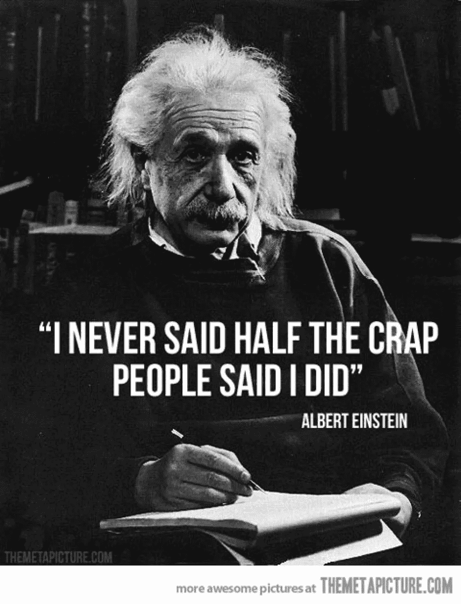

# 与 FOMO 打交道(害怕错过)

> 原文：<https://medium.datadriveninvestor.com/dealing-with-fomo-fear-of-missing-out-d0283543ce40?source=collection_archive---------5----------------------->

subscribe-[iTunes](https://itunes.apple.com/us/podcast/bit-better-have-my-money/id1374764732)[Stitcher](http://www.stitcher.com/s?fid=183129&refid=stpr)[Google Play](https://playmusic.app.goo.gl/?ibi=com.google.PlayMusic&isi=691797987&ius=googleplaymusic&apn=com.google.android.music&link=https://play.google.com/music/m/Ikoddu7nd3g5ijjnhnedvdpgzo4?t%3DBit_Better_Have_My_Money!%26pcampaignid%3DMKT-na-all-co-pr-mu-pod-16)[iHeartRadio](https://www.iheart.com/podcast/269-Bit-Better-Have-My-29238100)

组合-[https://cointracking.info/portfolio/bitbetterhavemymoney](https://cointracking.info/portfolio/bitbetterhavemymoney)

今天没有太多关于投资组合的报道，这不是一件坏事。

让我们来谈谈 FOMO。**是最坏的。我讨厌它。比起气球，我更讨厌它。我非常讨厌气球，但 FOMO 更讨厌。不过，差不了多少。人们在气球上吐痰是令人讨厌的。**

我不想成为以 1 美元买入比特币，然后以 200 美元卖出的人。这是我最大的恐惧。看看 FOMO 已经在那里了！**混账 FOMO。**

**那么我该如何与 FOMO 打交道。**

我从来没有卖掉我所有的硬币。每当我卖出一项投资时，我都会留下一些。哪怕只有 5 个硬币。我离开他们。

我买卖的硬币越多，管理起来就越困难，但这让我忘记了 FOMO。这是我能做的最好的事情。

**我对付 FOMO 的另一种方式。**

当机会出现时，我就买。比特币就是一个很好的例子。当它在 20000 美元的时候，每个人都希望他们在 6000 美元的时候买下它。

它跌到了 6500 美元，所以这是一个机会。但是，人们很害怕，因为价格跌了这么多。他们认为它不会完全恢复。

会的，而且已经发生了。现在你可能有 FOMO，因为它的价格是 9k 美元。所以去买一些，然后你就可以摆脱 FOMO。

我对付愚蠢的 FOMO 的最后一招。

如果一枚硬币的价格上涨，我会有那种该死的感觉。我想分享利润。

这就是纪律和经验发挥作用的地方。我还记得那种被甩在身后拿着包的感觉。看着价格下跌，我的钱也跟着下跌。这太糟糕了。

这几乎发生在每个人身上，重要的是记住它的感觉。

我应该把它和那张照片放在一起，它合得很好，但是我不能…

*原载于 2018 年 5 月 2 日*[*【bitbetterhavemymoney.com】*](http://bitbetterhavemymoney.com/dealing-with-fomo-fear-of-missing-out/)*。*

