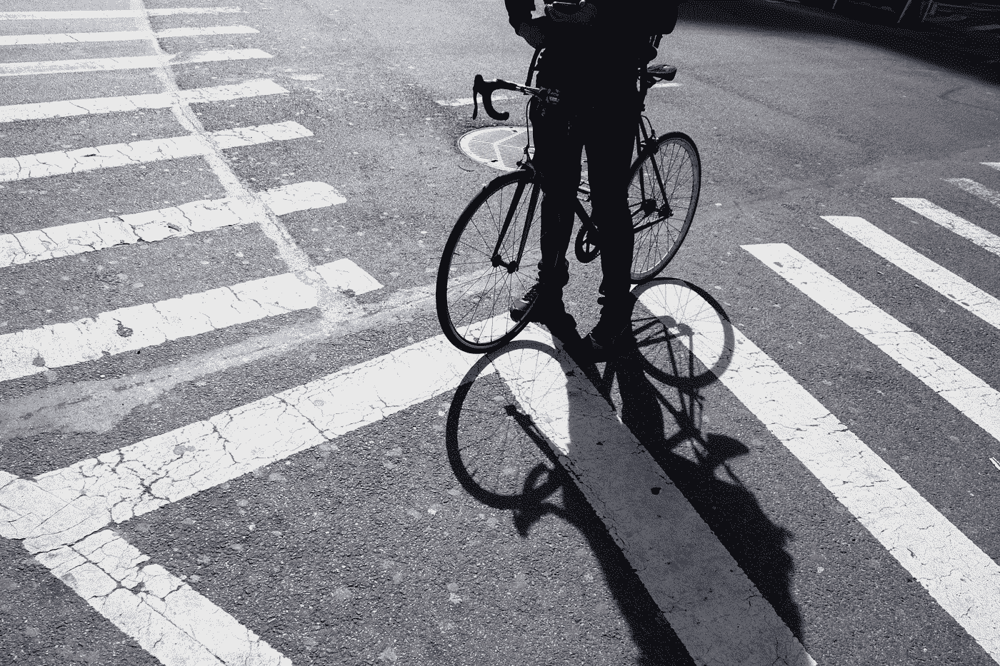
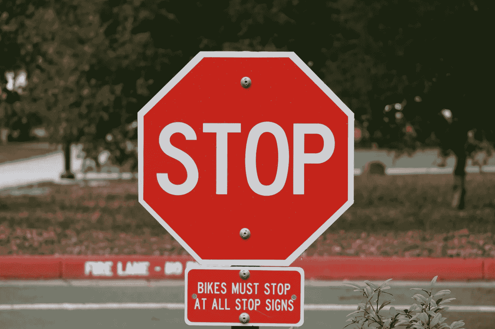

# 亲爱的骑自行车的人:离开我们的道路

> 原文：<https://medium.datadriveninvestor.com/dear-cyclists-get-off-our-roads-d64f3dcac460?source=collection_archive---------0----------------------->

# 为什么司机想让自行车远离交通——以及该怎么做

Photo by [Emil Bruckner](https://unsplash.com/@emilbruckner?utm_source=unsplash&utm_medium=referral&utm_content=creditCopyText)

作为一个骑自行车并且偶尔开车的人，我想了很多关于司机和骑自行车的人之间的关系。

最近，在纽约市第 18 名骑车人被司机撞死后，我直面了司机对骑车人的敌意。在 facebook 上阅读这个男人的死讯时，我犯了一个错误，向下滚动到评论。以下是前 10 条评论中的一些引文*:

 [## 跑步摆脱疯狂:锻炼如何提高你的生产力|数据驱动的投资者

### 没有比锻炼更好的方式来开始一天的工作了。我试着一周至少做四天，在…

www.datadriveninvestor.com](https://www.datadriveninvestor.com/2018/10/23/running-to-get-rid-of-the-crazy-how-working-out-increases-your-productivity/) 

*   "当一半的骑自行车的人像野生动物一样骑车时，你怎么能抱怨死亡呢？"
*   “没有关于今年被骑自行车的人撞死的两个行人的报道！！!"
*   “他们在我前面过马路的时候，我被超车，被甩，被尖叫，我的车盖被重击，而我当时是绿灯。”
*   “所以，也许在卡车路线上骑自行车不是个好主意？？？🤷‍♀️"

我想大多数纽约人会为开车的人少了、交通流量少了、道路噪音少了等等而感到兴奋。但是如果这些评论是可信的，有相当多的人根本不这么认为。

在今年夏天的另一起事件中，一名卡车司机在 Bed-Stuy 撞倒了一名骑自行车的年轻女子，并把她拖到卡车下面一个街区。打了她之后他的[评论](https://bklyner.com/tanker-killed-cyclist/)？“太多自行车了，路上太多自行车了。”

为什么会这样？为什么司机如此讨厌骑自行车的人，他们希望我们死了？为什么开车的人死在高速公路上是悲剧，而骑自行车的人被杀却是“你罪有应得”？

作为一个经常骑自行车的人，我也参与到这种动态中。我对那些经常拿我的生命冒险开车的人怀有很大的敌意，他们无疑会在杀了我之后找到责备我的方法。

但是 10 年前，我不骑自行车，我只开车。我记得在高速公路上骑自行车的人让我感到害怕。这是出于恐惧，而不是仇恨。我甚至敢说，对骑自行车的好斗的人的愤怒有一种仁慈。因为没人想成为杀手。虽然骑自行车的人担心我们的生命，但作为一名司机，我也感到被骑自行车的人“威胁”——有可能在骑自行车时意外撞死人，并在余生的每一天都重温这种恐惧。

尽管我对司机每次想走过 3 个街区就发动 2 吨重的陆地游艇感到恼火，但司机对骑自行车的人也有一些抱怨。我看到司机和骑车人的攻击行为，但我敢说，混蛋骑车人的比例比混蛋司机高。

这不是自行车的错。自行车不会在人们穿着紧身衣的屁股碰到座位的那一刻就把他们变成恶魔。有些骑自行车的人表现得像混蛋，这其实是有逻辑原因的。

在我的家乡科罗拉多，你会看到一个鲜明的对比。小溪边的自行车道上，各个年龄段的人都在骑自行车。爸爸们带着孩子在拖车里。老年人从杂货店回家。从学校走向兼职工作的青少年。人们微笑着互相挥手。令人惊讶的是，在整整一年的骑行中，我从未遇到过一个混蛋。

然而，往高速公路方向走半英里，你会看到穿着弹力纤维的人在车流中穿梭，向司机扔小鸟。这就像他们在自己的个人环法自行车赛中，需要他们周围的每个人都知道这件事。

基础设施是区别。正如他们所说，“建筑总是赢家。”我们缺乏骑自行车的安全场所，一方面鼓励了违法行为，另一方面鼓励了胆大的人骑自行车，同时阻止了理智的人。

## 为什么骑自行车的人会违法？

当我今年开始骑自行车上班时，我看到了道路在多大程度上是为司机设计的——而不是为骑自行车的人设计的。

限速、停车标志、车道、道路网格模式——尽管街道最初是为每个人而建，但从 20 世纪 20 年代开始，它们围绕汽车和司机进行了重新设计。

Photo by [C Drying](https://unsplash.com/@cdrying?utm_source=unsplash&utm_medium=referral&utm_content=creditCopyText)

以停车标志为例。它们不是为时速 5 英里、能在半个街区之外看到什么都没发生的人设计的。它们是为时速 30 英里的汽车设计的，这些汽车在十字路口开得太快，看不到有什么东西过来。

这就是为什么欧洲国家不再使用停车标志，而是转向环形交叉路口。环形路对每个人来说都更安全、更高效。它们消除了“下车后再骑上自行车(以及违反法律的诱惑)”的想法，并且让汽车有更好的燃油效率，而不用每两个街区就不停地“走走停停”。

一些地方——比如法国——最近承认让时速 5 英里的骑车人在空无一人的十字路口完全停下来是愚蠢的；2015 年，巴黎将骑自行车的人在没有完全停下来的情况下[将红灯视为“让行”](https://www.bbc.com/news/magazine-33773868)合法化。爱达荷州和特拉华州颁布了 T2 法律，允许骑自行车的人将停车标志视为让步。

此外，当你骑自行车时，你开始意识到你不可能在每个(专为汽车设计的)停车标志处都停下来。没有 6 缸发动机能帮你在 10 英尺内恢复速度。事实上，当你重新获得动力的时候，你已经到了另一个停车标志。20 分钟的自行车通勤需要 60 分钟，因为你花了所有的时间和精力从停车标志和停车灯中恢复过来。

如果你打算继续骑自行车上班，同时还能去杂货店接你的孩子，你会得出这样的结论:你必须在骑自行车时运用自己的洞察力。你决定，如果你来到一个停止标志，没有人来，你要使用常识，继续前进。当然，疯狂的自行车手们把这种想法发挥到了极致,“去他妈的每个人，我想做什么就做什么！!"但是绝大多数骑自行车的人都非常谨慎，谨慎地骑车，尽可能地遵守法律。

在纽约市的展望公园西区，47%的骑车人在人行道上非法骑车。他们害怕有生命危险。但是在增加自行车道后，这个数字下降到了 3%。

> “在美国，疏忽大意的司机平均每天杀死两到三名骑自行车的人，但他们很少被指控杀人。”——《卫报》:[为什么指控驾车者骑车死亡如此困难？](http://Negligent drivers kill an average of two to three cyclists a day in the US, but they are are rarely charged with homicide)

此外，骑自行车让我意识到美国法律保护我生命的频率有多低。在这个国家，很少有司机在杀死一名骑自行车的人后被指控犯有任何罪行，即使司机当时超速行驶并发短信。在最坏的情况下，他们可能会得到一小笔罚款。你听说过有多少司机因为杀死步行或骑自行车的人而入狱？然而，大多数骑自行车的人的交通死亡是由司机疏忽造成的。

在美国，超速被司机认为是一种可笑的违法行为。人们开玩笑说他们收到了多少张超速罚单，却忽视了超速驾驶是 T4 近 1/3 交通死亡的一个因素。

(关于这个问题的完整讨论，请听汽车之战播客中的[违法](https://soundcloud.com/user-843671744/breaking-the-law)。)

## 为什么骑自行车的人好斗、粗鲁、混蛋等等？

脸书有人发表了一个我觉得很深刻的评论:“美国将继续得到它应得的自行车手。”

换句话说，在美国，我们不提供安全措施使得骑自行车的风险越大，越多的骑车人会去冒险。

因为我们认为骑自行车的人的生活是次要的，谨慎的人不倾向于骑自行车。大多数骑自行车上下班的人( [76%](http://peopleforbikes.org/our-work/statistics/statistics-category/?cat=participation-statistics) )是男性——相比之下，在骑自行车安全的荷兰，只有 45%的骑车人是男性。

这些男性中相当一部分是你在高速公路上看到的开着保时捷 95 英里/小时的白人。(在非洲裔美国人和西班牙裔美国人中，骑自行车的比例[较低](http://peopleforbikes.org/our-work/statistics/statistics-category/?cat=participation-statistics)。)这些冒险者是每个人都讨厌的家伙——他们把你从他们的花式自行车上扔下来，闯红灯，在车道间穿梭，在没有灯的晚上骑车。

我只想说那些骑车的人也讨厌这些人。

这就是为什么“为什么自行车社区没有一个安全运动？?"是一个公平的批评，但不是一个有效的方法。极端冒险的人——也许不是大多数，但在美国仍有很大一部分骑自行车的人——不会因为一堂安全课而改变他们的行为。

## 那么答案是什么呢？

通过对人们骑自行车做出常识性的规定，违法和混蛋骑车都是完全可以预防的。

2019 年[丹麦一项在十字路口使用摄像机的研究](https://politiken.dk/indland/art7185605/Rygterne-om-cyklister-som-lovl%C3%B8se-banditter-er-st%C3%A6rkt-overdrevne?shareToken=0AfdbgAACQSg)显示，14%的骑车人在没有自行车基础设施的区域骑车时违反了法律(例如，闯红灯)。在道路对自行车更安全的地区，这个数字下降到了 5%以下。

自行车友好型街道意味着你不需要为了在适当的时间内去上班而闯停车标志。你不需要骑在人行道上来生存。

安全的自行车基础设施(专用自行车道、环形路而不是停车标志、交通速度稳定)将把许多新的骑行者——他们谨慎地骑行并遵守法律——带入自行车人群。明智的人会骑自行车，包括更多的妇女和不同年龄的人(老人和儿童)。随着越来越多的司机偶尔成为骑自行车的人，自行车社区和汽车社区之间的理解将会加深。

事实上，只要有一点深思熟虑的基础设施，冒险的人将成为自行车人口中的绝大多数。

吉纳在节俭风筝博客:[http://www.frugalkite.com 上写下了她走向财务独立的旅程。](http://www.frugalkite.com.)

*   文章和附加引用[此处](https://www.facebook.com/pg/greenpointers/posts/?ref=page_internal)(发文日期:7 月 26 日)和[此处](https://www.instagram.com/p/B1pAm8PpkLs/?fbclid=IwAR3Ta77TsSiwQS9U9aHQXNqqFOYe7lv5Okj_Rn7bt857hcYMGKK8uVjvIxI)。