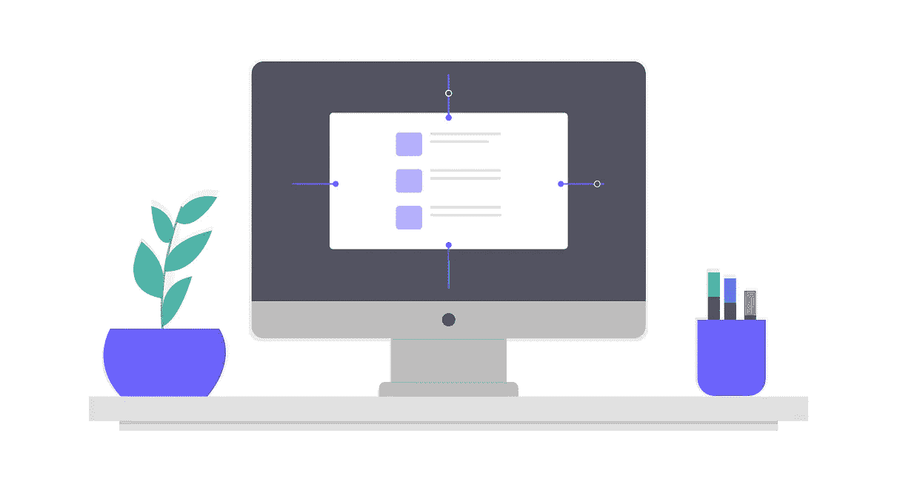

# 亲爱的企业资源规划人员——是时候迎接下一个挑战了。

> 原文：<https://medium.datadriveninvestor.com/dear-erps-its-time-for-the-next-challenge-bc9b9856809c?source=collection_archive---------24----------------------->

创建一个能够抽象出大多数零售商需求的软件是一个挑战。在竞争激烈的领域，这也是一个预先存在的挑战。如果你是一个现有的 ERP 供应商，让自己在竞争中脱颖而出。但是现在，新的更强的海浪涌向海岸。

> 更大的问题是如何进一步游过这一新浪潮，最好的划水方式是什么？

软件产品不再是奢侈品，而是一种商品。

Software products are not more a Luxury, its a commodity.

# **产品质量和支持**

大多数或所有用户都接触到某一组帮助他们与熟人和朋友交流的信使/聊天应用程序。他们想要达到的目标和实现的目标之间有着更简单的关联。企业级软件的内置质量在所有领域都已经感受到了。

改进软件记录交易的方式必须如此之快，以至于随后的过程必须由企业家多次设定，而不是由手工操作的人设定。

> 找出合适的产品是创新者的工作，而不是顾客的工作。
> ——本·霍洛维茨

# 互联网的浪潮

互联网拉近了距离，也让事情变得更具挑战性。目前用于这种环境的工具已经“习惯于破旧不堪”。

**报告&分析** 令人困惑的报告和更加静态的分析仪表板的时代已经一去不复返了。然后是 pivotsal 报告，这是用户必须自己设计的一组不同的 pivot。

**数据的金矿** 事实一再证明，零售商的这些数据是金矿，每个人都在追逐它。如何将数据货币化，收回管理这些数据的成本，需要更好的工程设计，并巧妙地安抚客户，以改善他们的业务。

如果没有合适的合作伙伴网络和联盟伙伴，超越这一点并挑战自我可能是不可行的。欢迎来到下一波零售浪潮，不仅仅是在供应链上，所有零售业利益相关者和消费者的整个心态都发生了变化。

# 我有什么资格说这些？

***人工智能*** *和* ***机器学习*** 是在所有系统中节省大量金钱和人力的东西。从医疗保健、汽车、金融到零售。

我们 Delium Technologies 为自动驾驶零售业务创建人工智能和人工智能解决方案。今天的许多零售商仍然需要专家的帮助。一些零售商在资金和人力方面面临更大的压力。机器是这两种情况的唯一出路。

我是一个受到足够启发的人，作为一个联盟伙伴在这条道路上与你们同行。让我们一起把学习机送到最需要的世界！😎

访问 [www.delium.ai](http://www.delium.ai)