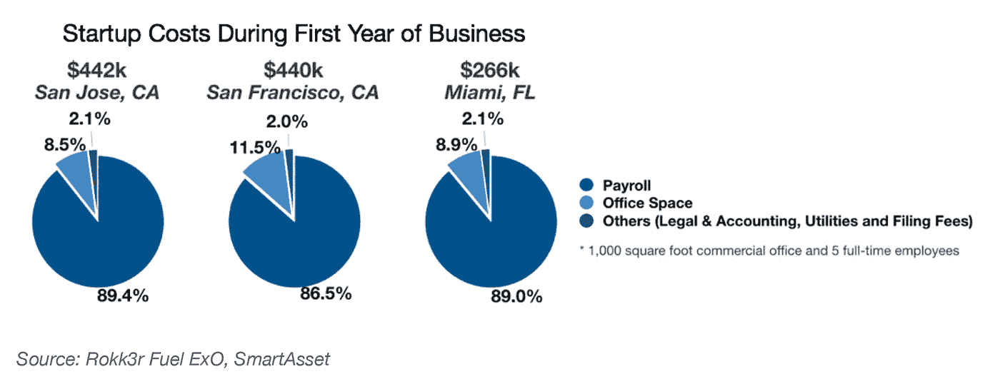
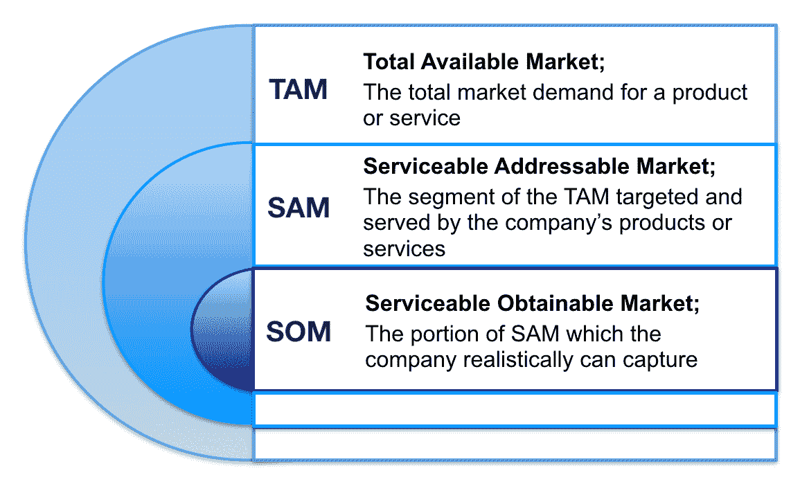
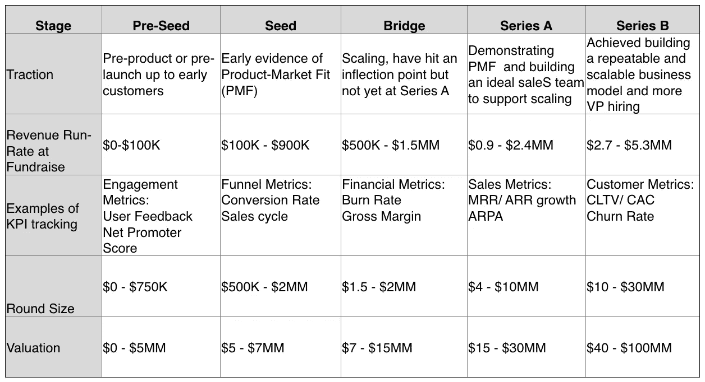

# 亲爱的初创公司创始人

> 原文：<https://medium.datadriveninvestor.com/dear-startup-founders-a3a7d8c121e4?source=collection_archive---------9----------------------->

## 我们需要谈谈。

*“创办一家公司就像把自己从悬崖上扔下去，然后在下去的路上组装一架飞机。”* *-* 雷德·霍夫曼，领英联合创始人、董事长。

Photo by [Ihor Malytskyi](https://unsplash.com/@ihor_malytskyi?utm_source=medium&utm_medium=referral) on [Unsplash](https://unsplash.com?utm_source=medium&utm_medium=referral)

连续创业者会告诉你，从零开始创业是一项充满陷阱的艰巨任务，不管你已经成功或失败了多少次。

*除了一般的困难之外，每项业务都面临着独特的挑战——从寻找和培训人才、验证概念，到实现产品与市场的契合以及管理公司文化。未能克服其中的一个或多个会直接导致公司的灭亡。*

*Fuel Venture Capital 的团队拥有多年创建公司、经营企业和为数十位初创企业创始人提供咨询的经验，已经看到了这些问题的许多方面。因此，在我们作为投资者和合伙人的双重角色中，我们迅速识别模式，及早发现问题，并高效和有效地帮助创始人。*

*随着我们的筹资活动接近尾声，我们打算全力以赴寻找新的投资机会，并管理当前投资组合中的公司。因此，在我们跨入新的一年之际，我们希望与你们这些初创企业的创始人直接对话，希望开启一场可能让我们走到一起的对话。*

当人们在交谈中提到风险投资或科技初创公司时，大多数人都会立即想到沙丘路。该地区赢得并巩固了世界科技之都的声誉，吸引了大批企业家、资金雄厚的风险投资家和各种天使投资者。在某些方面，这两个群体的碰撞带来了巨大的繁荣，催生了一些当今最具突破性的产品和服务。然而在其他方面，硅谷的巨大成功也是一种负担。今天人们最关心的是旧金山湾区过高的生活和工作成本，尤其是在新年伊始各种公民倡议纷纷出台的时候。

根据 RealPage 的数据，*旧金山纪事报*于 2019 年 1 月 12 日发表的一篇文章报道，旧金山、圣何塞和奥克兰大都会地区各种规模公寓的平均要价分别为 3335 美元、2789 美元和 2302 美元。数据显示，唯一价格较高的地区是纽约市，为 3571 美元。

企业运营成本呢？硅谷的燃烧率是美国普通城市的四倍，是美国最高的。这让你不禁想知道，该地区资金短缺的初创企业究竟是如何生存下来的。

与此同时，聚集在湾区或附近的成功的后期技术公司，如谷歌和脸书，已经开始向员工提供非常丰厚的薪酬，这使得早期创业公司的创始人更难争夺有才华的员工。但这种命运还有其他选择。

越来越多的证据表明，创始人可以在硅谷泡沫之外获得成功。

在一个技术丰富、技术民主化和全球化的世界，创业团队已经获得了必要的资源，可以跨越城市和时区与团队成员进行有效的沟通，从世界任何地方获得技术，接近任何客户，与任何投资者联系。在成本较低的新兴科技中心，成本节约让创始人有了更好的开端、更长的跑道和更多的时间起步。

**考虑到这一点，** **燃料风险投资** **已经着手积极寻找硅谷之外的*公司，那里的资本可以更直接地分配给创收活动。***

# **去哪里找我们**

支持科技公司成立和发展的有前途的创业中心已经在美国各地涌现，迈阿密就是其中之一。

近年来，迈阿密因其欣欣向荣的创业场景而多次获得认可。例如，2017 年，追踪创业精神的非营利组织考夫曼基金会(Kauffman Foundation)将迈阿密列为全美创业活动第一名。

迈阿密是一个全球化的城市，拥有通往拉丁美洲和欧洲的独特通道，生活成本相对较低，并且没有州所得税，因此对于有抱负的初创企业创始人来说，在哪里创业是一件轻而易举的事情。

在 Fuel，我们的目标是在迈阿密成为世界级技术创新中心的旅程中，将它带到下一个阶段。为此，我们加入了总部也在迈阿密的风险投资公司 Fuel，以进入全球生态系统，在那里我们有更多的资源来帮助创始人从创意到退出。

我们还与该市最具影响力的人物和商业团体结盟，无论是在科技领域还是在房地产领域，以加强和发展该地区的创业生态系统。(预计在未来几周内，将会发布详细介绍这些战略合作伙伴关系的公告。)

我们认为每一种关系和互动都是将迈阿密打造成吸引工程专家、经验丰富的投资者、有前途的企业以及受尊敬的孵化器和加速器的不可或缺的组成部分。

我们是迈阿密科技生态系统的骄傲和积极的传播者。

# **如何联系我们**

我们在内部完成的第一批项目之一是设计和推出创始人提交门户网站(FSP)，有兴趣获得资金的企业家可以联系我们，并提交他们的公司信息供我们进行尽职调查。我们明白，并不是每家初创公司都有风投关系，并特别了解我们网络中的某个人，但这不应该成为他们不与我们合作，或者我们不了解他们令人兴奋的初创公司的理由。提交平台使我们能够快速筛选任何不符合我们投资标准的公司，只与有潜力成为指数级组织的公司合作。

# **什么吸引我们**

我们每年获得大约 5000 个投资机会。到了年底，只有 8 到 10 家公司，或 0.1%的申请被批准进行交易。

我们遵循严格的多阶段尽职调查流程来识别高潜力公司。我们的目标是 80%的成功率，而不是像许多风险投资基金那样，依靠 80%的失败来获得 20%的成功。对我们来说，每家公司都很重要。

还有:我们不是被动的投资者。投资后，我们卷起袖子，准备帮助创始人应对挑战，包括软件开发、融资、日常业务运营、销售和营销。

抛开这些不谈，以下是我们在潜在投资中寻找的五个特征:

1.  **高素质团队化妆**

在初创企业的早期阶段，投资者更多地押注于创始人及其团队，而不是创意本身。即使这个想法在开始时是独特的或破坏性的，如果没有一个杰出的创始人来执行它，或者知道如何改变它，它也没有什么价值。燃料风险投资的工作是帮助创始人发挥他们的优势，保持对他们的弱点的认识，并建立一个团队来填补空白。我们欣赏创始人身上的三个可取特质:

*   **目光远大，目光短浅。**具有改变世界眼光的创始人总是能得到我们的关注。然而，如果没有及时执行的清晰路线图，愿景就没有什么意义。创始人应该展示伟大的想法和激情，明确重点。胸怀大志，但要知道需要采取哪些小步骤。从小的祭品，大的东西才会成长。
*   **精力与激情**。精力充沛、充满激情的创业者能够从挫折中恢复过来。燃料风险投资公司的创始人兼董事总经理杰夫·兰斯德尔鼓励创始人“工作的时候，就好像成功不是保证一样”创始人应该展示勇气，不仅要赢得团队和最初客户的信任，还要赢得未来投资者的信任。
*   **不公平的竞争优势。**创始人应该提供合理的理由，说明为什么他们是创业的最佳人选。优势可能包括技能、背景、知识和创始人从以前的工作中积累的经验、关键关系或独特的见解。优势越独特，创业者成功的机会就越大。

2.**机遇景观**

创始人通常会在他们的推介台上抛出数十亿美元的总可用市场(TAM)数字，以传达他们的初创公司正在寻求的巨大机会。我们经常发现这些数字没什么用处，因为在很多情况下，创始人无法证明这些数字是合理的，也无法将其与他们的商业计划联系起来。一个更好的方法是将目标市场分为三组:总可用市场、可服务的目标市场和可服务的可获得市场。

了解更深层次的市场动态可以让创始人确定目标客户，衡量他们的需求，然后制定有针对性的营销支出计划和上市战略。作为一个风险投资基金，从市场规模来评估一家初创公司的财务潜力对我们来说很重要。因此，我们看重那些专注于获得最准确数字而非最大可能数字的创始人。

Source: Fuel Venture Capital

**3。指数势**

“指数性”是我们投资论题的基础。燃料风险投资努力识别和资助指数公司。

根据定义，指数公司必须利用加速技术，追求巨大的变革目标，并展现一系列内部和外部特征。这些因素使他们的表现超过竞争对手大约 10 倍。我们的普通合伙人 Salim Ismail 专门写了一整本书《指数型组织》来讨论指数理论。我们鼓励创始人熟悉他的概念，以及指数公司应该实施的属性或做法。

**4。牵引力指标**

我们通常建议创始人在联系我们之前，了解他们的衡量标准，并证明某种程度的吸引力，作为市场验证或早期产品市场适合性的证据，以便在竞争中获得最佳的融资机会。

公司吸引力是在时间范围内、在同行群体中进行评估的，尤其是针对公司在筹集某一轮融资之前需要实现的里程碑。

Source: Fuel Venture Capital

几个时期的持续增长的关键指标，通常是更高的客户增长和持续的收入增长，是显示公司发展势头的理想选择。但是，这不是唯一的方法。吸引力反映了客户对公司产品或服务的看法。因此，产品前或收入前公司可以使用其他指标，包括用户参与度、网站流量、销售周期和市场调查等。

**5。潜在收购方**

作为风投基金，维持对生活方式公司的投资从来不是我们的本意。因此，我们试图了解创始人是否已经确定了他们的潜在收购者，以及收购的战略原因。

投资后，我们的首要任务之一是利用我们的网络，向潜在收购者介绍我们投资的公司，然后引导创始人赢得这些企业的客户。我们认为，创业公司和企业之间的伙伴关系将促进收购路径，因为产品已经集成，信任已经建立，企业的创新差距已经填补。因此，如果我们能找到一家正在与潜在收购者合作的公司，我们的决策就会变得容易得多，因为创始人已经领先了。

# **为什么要与燃料风险投资合作**

您知道在哪里可以找到我们，如何联系我们，以及如何吸引我们的兴趣。那么什么时候是创造、建设、颠覆和进步的最佳时机呢？

现在是时候了。

*本文作者是燃料风险投资公司总经理* *合伙人兼首席投资官 Maggie Vo，CFA。Maggie 管理投资活动，领导对潜在投资的尽职调查，并对现有的燃料风险投资组合公司进行估值分析。要联系玛姬，发电子邮件到 maggie@fuelventurecapital.com。在社交媒体上关注 Fuel 风投，via*[*insta gram*](https://www.instagram.com/fuelventurecapital/?hl=en)*，*[*Twitter*](https://twitter.com/FuelVC)*和*[*LinkedIn*](https://www.linkedin.com/company/fuelventurecapital/)*。*

# **披露**

本文提供的信息仅用于教育和说明目的。所提供的材料代表 Rokk3r Fuel ExO 截至本报告日期的观点。所提供的信息和观点是从据信可靠的来源获得或得出的；但是，我们不能保证此处表达的信息的准确性和完整性。意见如有更改，恕不另行通知，Rokk3r Fuel ExO 不承担更新或修改此处包含的任何信息或意见的责任。请记住，过去的业绩并不代表未来的结果，也不能保证基金将取得类似的结果，实现其投资目标，实施其投资战略或避免损失。

*本协议中的任何规定均不构成出售任何证券的要约，也不构成购买 Rokk3r Fuel ExO 或其关联公司赞助或建议的任何证券或任何其他产品的要约，也不构成以其他方式提供投资咨询服务的要约或要约。任何此类出售要约或购买要约的邀约只能通过正式要约文件进行，其中包括保密要约备忘录、有限合伙协议和相关认购文件。此类正式发行文件包含本文件中未列出的附加信息，包括与某些投资风险相关的信息，这些信息对任何投资决策都至关重要。此处提供的业绩数据仅用于说明目的，不代表未来回报，也不保证未来结果。本文所述类型的投资可能涉及高度风险，且此类工具的价值可能高度不稳定。投资者可能会损失部分或全部投资。本简要声明并未披露与此处列出的投资类型相关的所有重要方面/风险，包括相关风险因素以及适用于它们的任何法律、税务和会计考虑因素。*