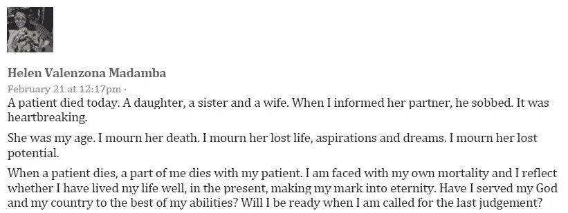

# 家庭中的死亡:结局也对医生造成了沉重打击

> 原文：<https://medium.datadriveninvestor.com/death-in-the-family-endings-also-hit-hard-at-doctors-8137dc245c70?source=collection_archive---------0----------------------->

## 医生在病人手术死亡后寻找应对方法

Photo by Rebecca Peterson-Hall on Unsplash

“今天有个病人去世了。”

死亡是不可避免的，通常在医院，有时在手术中。失去家人对幸存者打击很大。这也给那些努力让病人存活下来的医护人员带来了损失，尽管他们输掉了这场战斗。

医生在职业生涯中，会失去很多病人，但总有第一个。海伦·马丹巴医生在手术室失去了她的第一个病人。伤害和震惊仍然挥之不去。然而，还有更多的病人需要治疗，并且——凭借技巧和毅力——得以存活。

 [## 抑郁症发作时，谁来医治治疗者？

### 医生容易受到压力和心理健康下降的影响

medium.datadriveninvestor.com](/who-heals-the-healer-when-depression-strikes-d72f4c10a4b9) 

Madamba 是菲律宾宿务市 Vicente Sotto 纪念医疗中心的妇产科医生和传染病专家，也是 Share A Child 运动的执行董事。

她与其他医疗保健专业人士谈论死亡、垂死和继续生活，但首先这位“社交媒体爱好者”在脸书上发布了“一名患者今天去世”，后来又在博客上讲述了她的经历，细节令人痛苦地新鲜:

> 前几天经历了第一次还是表死。我还在*震惊中*。
> 
> 一个病人在手术中失血过多而死，当时我们试图移除一个破裂出血的肿瘤。*低血容量性休克*。在心肺复苏术的外部按压过程中，挣扎着缝合以完成手术是一次创伤性的经历。
> 
> 当我参加手术时，估计失血量已经是 2 升——肿瘤破裂导致的腹腔积血。我们平时很冷静的麻醉师至少四次用不同的方式问我:“医生，你控制出血源了吗？”或者“医生，你已经结扎出血点了吗？”或者“医生，你成功夹住出血的肿瘤了吗？”和“医生，有活动性出血吗？”麻醉师小组平静地告诉我，病人出现了心动过缓(心率减慢)……然后病人几乎停止了心跳……最后，有人应该开始实施心肺复苏术，因为她心跳停止了。
> 
> 所有这些事件都像是在我眼前发生的一连串事件。我们努力切除子宫，缝合残端，结扎所有出血点，其他人则做心肺复苏术来使病人苏醒。我们听到有人说，有血从她的鼻子和口腔管中流出。为了加快输血速度，血液通过静脉注射。人们跑到血库去取更多的血。人们在呼救。住院医生和实习生轮流进行体外加压。
> 
> 我们缝合皮肤(妇产科医生几乎从不使用缝合器来缝合皮肤)只是为了尽快完成手术。我们继续进行了一个多小时的心肺复苏，实施了两次电击，并注射了八剂肾上腺素。尽管我们尽了最大努力，但整个团队都面带愁容，无言地接受了病人已经去世的事实。*精神冲击*。
> 
> 我不得不面对病人的生活伴侣展示我们切除的肿瘤，并解释病人的心脏停止跳动是因为她失血过多。我还没说完，丈夫就开始抽泣。这令人心碎，我所能做的就是向他表示哀悼。我无法给予支持，因为我也很震惊。*情感冲击*。当我们给他看心电图显示一条平坦的线时，我回到手术室哭了。感觉我的一部分和病人一起死去了。
> 
> 我的朋友告诉我，悲伤和哀悼病人是正常的，“因为你是人。那是一个死去的女人。某人的妻子和女儿。所以是的，你应该悲伤。”
> 
> 在我们医院，产妇死亡率很高。每个月都有几个母亲死于与怀孕有关的原因。一个健康专家如何在情感上与死亡和濒死保持分离，尤其是当你想知道死亡是否可以避免的时候？作为一名医生，写这篇博客可能对我来说是一种宣泄(治疗)，但我真诚地希望与其他可能经历过这些挑战和困难的人讨论，这样我们就可以互相帮助应对病人的死亡——这样我们就可以为我们的病人服务，但不会以牺牲我们自己的情绪和心理健康为代价。

“这是我妇产科职业生涯中的一个里程碑，”马丹巴说。“一点也不容易，但我们挺过来了，希望这次经历能让我们成为更好的医生。病人死亡是作为医生的一部分，所以我们需要学会应对。对我来说，我们处理孕产妇死亡的次数太多了。”

# **呼救**

在情绪压力下，她说医生不应该试图独自处理他们的情绪:“寻求帮助是一种外科谦逊的特质。”

Jaifred F. "Jim" Lopez 博士研究卫生政策，是菲律宾的一名"社区医生"。那是他遇到病人死亡的地方。

“在我的乡村实践中，我必须处理的死亡是我的临终病人，以及偶尔被带到健康中心的编码病人，”他说。“在一个乡村小镇产生的议论可能会令人不安，但当他们知道你做了力所能及的事情时，他们会感谢你的服务。

洛佩兹说:“用信念来处理它帮助了我，我从我的前辈那里学到了这一点。”“生死攸关的情况确实让许多人产生了信念。在每一个病人的死亡中，我学会了我必须悲伤，同时也要继续为其他人服务。这一点不容忽视；情绪会越积越多。”

 [## 倦怠耗尽了简单的答案

### 人们在付出全部甚至更多后会激情四射

medium.datadriveninvestor.com](/burnout-exhausts-easy-answers-143a0840743b) 

Teddy Herbosa 博士是菲律宾大学的执行副校长。他在创伤外科和急救医学方面有丰富的经验。

“这很难，”他说，指的是病人死亡。“我给癌症患者做手术，照顾他们，多年以后，我已经穷途末路了。你和他们一起旅行…依恋。高级医师应该帮助教授如何处理医生的病人意外和困难的死亡。

赫布萨说:“我们尽了最大努力，不断进步，但我们也学会了‘厌倦’，否则[我们就会耗尽](https://medium.com/@JKatzaman/burnout-places-doctors-in-critical-condition-4da0e15bb9ca)。应对灵性是方法之一。我们都学习使用许多技术。每个人都找到了自己独特的应对方式。"

面对悲伤对洛佩兹来说并不容易。

“我过去常常错过悲伤的机会，”他说。“几年前，我有机会继续静修。我没有意识到我已经花了一整天把积累的情绪哭了出来。教训:发生了就哭也没关系。你可以选择私下做。偶尔有这样的静修真好。”

# **不同的视角**

处理病人死亡要看视角。在病人去世后，一个有望成为负责人的亲属可能会在不可避免的死亡之前、之中和之后，摆出一副好脸色。几天后——独自一人——是时候大哭一场了。另一方面，无论医生的精神状态如何，他们都应该继续工作。

“有几天我完全不能工作*第二天*，悲伤使我变得虚弱，”Madamba 说。“在住院实习期间，我失去了一名重症肺炎患者。婴儿安全出生，但母亲没能活下来。当我面对那个姐姐的时候，我是他们安慰的人。我猜我是个移情者，不懂得隐藏情绪。”

产房死亡对 Madamba 打击尤其大。

“我们正在尽最大努力联系转诊机构，寻找降低孕产妇死亡率的方法，”她说。“我们不希望母亲在孕育新生命时死去。”

 [## 倦怠使医生处于危急状态

### 在太少的时间里完成太多的任务会导致压力和错误

medium.datadriveninvestor.com](/burnout-places-doctors-in-critical-condition-4da0e15bb9ca) 

她也寻求精神上的帮助。

“祈祷是抓住一个更高的存在来提升发生的一切，相信一切发生的原因都超出了我们的眼睛所能看到的或我们的心灵所能理解的，”马丹巴说。“我叔叔 Juju 也建议我放松和清空大脑的方法。体育锻炼也是减压的好方法。”

洛佩兹在任何他能找到的地方寻求帮助。

“我在教堂里至少呆了半个小时，”他说。“我和一个朋友或导师交谈。我回家和家人共度时光。我弹吉他。”

赫布萨发现独自离开是一种解脱。

“冥想。安静的时间。孤独。清空我的大脑。呼吸，”他说。“与病人家属交谈很难。我记得资深外科住院医师让我们第一年和家属谈话。野蛮！我也参与了大规模伤亡事故。我记得回家后，只是拥抱我的女儿。其中一个牺牲品是她的年龄。”

# **练习计数**

经验对洛佩兹帮助很大。

他说:“在需要富有同情心和需要现实对待自己的情感之间很难找到平衡。”“这需要练习。

洛佩兹说:“这就像伊格内修斯受到内部纷争的困扰，或者本尼迪克特经受住了恶魔的冲击。”“就像死亡发生时，外科医生留给他或她自己去反思发生了什么。激烈，但情感斗争是必要的。它能培养技能。”

 [## 当压力增大时，是时候寻求帮助了

### 危机期间，远程工作的正常压力会加剧

medium.datadriveninvestor.com](/when-stress-builds-its-time-to-reach-out-for-help-bca08e70b6d7) 

马丹巴说，医疗服务提供者应该有意识地努力吸气和呼气。

“这很难，但我认为每个人都有独特的方式来应对病人的死亡，”她说。“我试过酒精，但它不能淹没我们的绝望。我尝试更多的工作，直到筋疲力尽，但它妥协的关系。我使用安静的正念、冥想、祈祷和表达。

“这就是为什么当应对机制失效时，医护人员患抑郁症和自杀的风险很高，”马丹巴说。

医护人员或家庭成员，很难处理病人的死亡。你不应该把事情憋在心里——至少不要憋太久。在亲人面前保持一张同情而坚强的脸是可以理解的，但是你需要时间和空间在你爆发之前让一切都爆发出来。

“有时没有时间处理，因为这是下一个病例，”T2 的 Iris Thiele Isip Tan(T3)医生说。她是菲律宾大学医学院的教授，也是菲律宾总医院内分泌、糖尿病和新陈代谢科的顾问。

“我已经执业十多年了，我正在失去一些从我开始执业以来就一直陪伴我的老年患者，”她说。

# **起飞**

洛佩兹建议远离忙乱的节奏。

“休息一下，”他说。“如果不可能，建议一些可以给人一种休息假象的事情:减少任务，祈祷或冥想一会儿，休息一天，也许交换一天工作。”

然而，现实可能不会如此宽容。

“问题是如何做到这一点？”马丹巴说。“就像在一段浪漫的关系中，有没有一种方法可以让你不会因为分手或失去对方而受到伤害？有没有办法在感情上拉开距离？”

 [## 利用恐惧获得力量

### 尊重并理解如何疏导普遍的恐惧

medium.datadriveninvestor.com](/tap-into-fear-for-strength-bbf54673b632) 

洛佩兹同意了。

“这实际上很难，”他说。“这需要自知之明。是什么让我比平时更粘人？是什么让我富有同情心？我如何确保我能从伤害中走出来？但有一点是不变的:伤害永远存在。”

Herbosa 说，管理人员应该尽自己的职责帮助医生处理他们的情绪。

“我们需要制度化，并为医生提供可用的应对方法，”他说。“我们互相照应。团结。我们也识别倦怠。”

马丹巴提醒其他人，每个人都是不同的。

她说:“有时候，互相照顾意味着不需要寻求帮助——足够敏感地知道你的医疗保健提供者同伴需要帮助，并主动提供帮助。”。“当它变得太难或太痛苦而无法克服时，放弃可能是个好主意。悲伤过后，还有很多其他方式可以发挥作用。”

# **社会因素**

在创伤中，社交媒体能帮助医疗服务提供者应对病人死亡吗？

社交媒体有好有坏，取决于你从哪里寻找信息。对于灵感来说，它可能是好的，尤其是有支持团体。避开那些随时准备攻击你和其他供应商应该知道并做错了的事情的人——在他们看来。

洛佩兹说:“在讨论这些问题时，我们需要谨慎使用社交媒体，因为它也隐藏着令人遗憾的元素，这些元素不仅没有让人们放心，反而恐吓他们。”。

赫布萨有一个最后的想法:“死亡和濒死就像心脏跳动和肺呼吸一样是生物性的。我们真的需要更多地谈论这个话题，辅导是一种方式。”

**关于作者**

吉姆·卡扎曼是拉戈金融服务公司的经理，曾在空军和联邦政府的公共事务部门工作。你可以在[推特](https://twitter.com/JKatzaman)、[脸书](https://www.facebook.com/jim.katzaman)和 [LinkedIn](https://www.linkedin.com/in/jim-katzaman-33641b21/) 上和他联系。