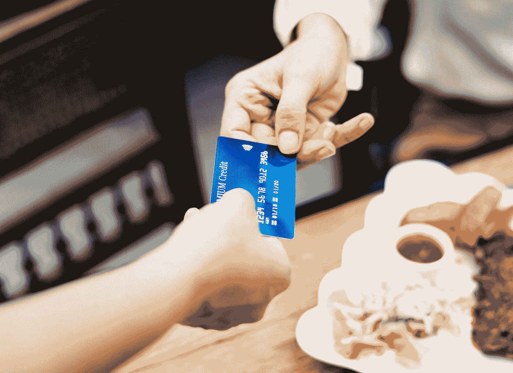

# 借记卡:这就是为什么它们毫无用处

> 原文：<https://medium.datadriveninvestor.com/debit-cards-heres-why-they-are-useless-40b8c62df406?source=collection_archive---------12----------------------->

“person holding a credit card” by [rawpixel](https://unsplash.com/@rawpixel?utm_source=medium&utm_medium=referral) on [Unsplash](https://unsplash.com?utm_source=medium&utm_medium=referral)

在过去的十年里，技术发生了如此大的变化。iPhones 和其他智能手机已经成为我们生活的核心。我们通过这些设备查看新闻、体育、天气，甚至办理银行业务。随着这项新技术的出现，我们已经慢慢改变了付款、支付账单和检查所有财务信息的方式。随着移动支付的出现，我们慢慢看到人们不再使用现金和借记卡。现在，我们正在成为一个基于移动支付的社会，由于许多原因，借记卡的使用基本上已经变得毫无价值。

信用卡提供借记卡没有的奖励。

信用卡是你日常购物获得奖励的一个很好的途径。许多信用卡对你已经购买的许多东西提供高达 2%的返现。举例来说，如果你在某一年花了 2000 美元在食品杂货上，你会在你无论如何都要买的东西上免费赚到 40 美元。关于这一点的另一个好处是，大多数信用卡公司将匹配你在第一年赚取的现金返还！80 美元对你来说可能是免费的食品杂货！

现金返还并不是使用信用卡的唯一好处。如果你像我一样喜欢去新奇刺激的地方，旅行里程信用卡会给你很大的回报。通过使用这些里程，您可以节省大量机票、酒店和租车费用！

**#2:你不再需要带现金了。**

借记卡的主要论点是可以从自动取款机中取出现金。随着 Apple pay、Square 甚至 Venmo 的发明，你购物的大多数地方和你做的事情都不再需要现金了。几乎每个餐馆、酒吧和你喜欢去的地方都会有某种形式的信用卡处理技术。另一件要记住的事情是，如果你丢了钱包，你的现金就没了。有了信用卡，你可以通过在线门户或移动应用程序访问它，并暂停所有支付。随着大多数信用卡成为美国的主要业务，能够快速暂停信用卡应该是一个优先事项。

如果你出于某种原因确实需要现金，你可以从大型连锁店如 CVS、沃尔玛和塔吉特百货取回现金。

**#3:被黑的借记卡比被黑的信用卡更危险。**

我可以证明这一说法。我的信用卡和借记卡以前都被黑过。通过信用卡公司让您注册的附加安全功能和通知，当您收到信用卡时，您将会不断地收到国外对您的帐户收费的通知。随着信用卡公司 24/7 不间断地监控购物，你的信用卡公司通知你欺诈性收费只是时间问题。如果你的卡真的被别人偷了并被他们使用，这些信用卡公司就有防止欺诈的保险。该公司将很快通知您，这些费用将退还到您的帐户。

就借记卡而言，情况就大不相同了。我通过一个小镇银行存款，他们的时间非常有限。你的银行可能要过几天才会通知你，你的借记卡已经被黑了，在许多情况下，你将不得不经历一个漫长的审查费用的过程，希望你能得到退款。当我的借记卡被黑时，我不得不等了将近两周，钱才被放回我的账户。

信用卡是你个人理财计划中的一个主要因素，随着新支付技术的引入，塑料借记卡正慢慢成为过去。

-JP