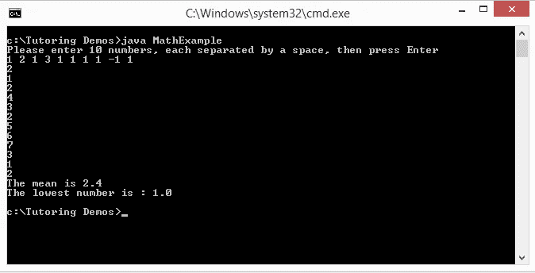
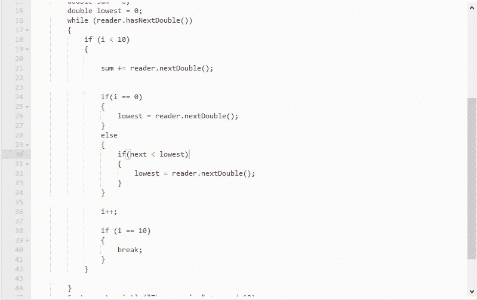
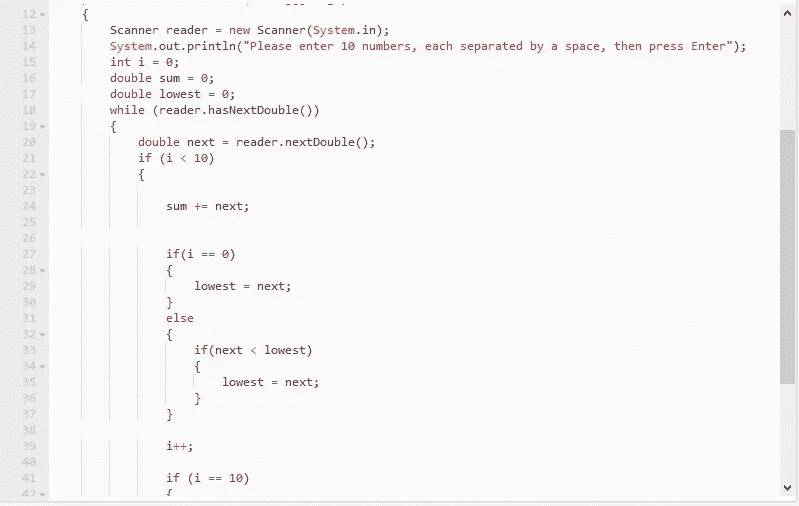
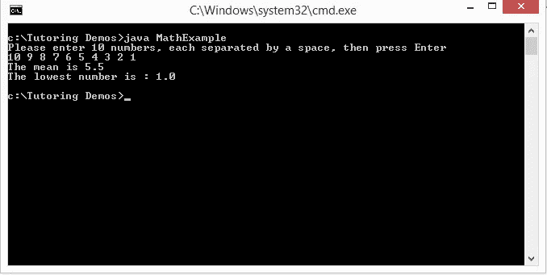

# 调试陷阱:用 Java 获取扫描仪输入

> 原文：<https://medium.datadriveninvestor.com/debugging-pitfall-getting-scanner-input-in-java-41e42874cbe?source=collection_archive---------11----------------------->

We’re going to be working with some numbers today… Photo by [Mika Baumeister](https://unsplash.com/photos/Wpnoqo2plFA?utm_source=unsplash&utm_medium=referral&utm_content=creditCopyText) on [Unsplash](https://unsplash.com/search/photos/numbers?utm_source=unsplash&utm_medium=referral&utm_content=creditCopyText)

作为一名软件开发人员，在某些时候，您可能不得不编写从用户那里获得某种输入的代码。我辅导过的大多数 Java 学生都使用标准键盘来获取用户输入。在 Java 中有几种不同的方法来完成这个任务，但是我的学生在课堂上学习的常见方法是使用 *Scanner* 类。在很多方面，我发现这个类比我第一次学习 Java 时学到的更容易使用(我们使用了 *BufferedReader* 和 *InputStreamReader* 类)。然而，我看到很多新生在*扫描仪*课上犯了一个非常微妙的错误。

让我们举一个非常简单的数学例子。假设您正在编写一个程序，要求用户从键盘输入一个列表，比如说 10 个数字。你的程序应该对列表执行两项任务:计算打印平均值，打印列表中最小的数字。如果你的数学技能生疏了，一列数字的平均值是所有数字的总和，除以列表的长度。让我们试一试这个问题。你可以在[https://codepad.co/snippet/bAGpUdAb](https://codepad.co/snippet/bAGpUdAb)找到完整的代码，所以去吧，复制代码，然后试着运行它。会发生什么？嗯，下面是我在电脑上从命令行运行它时的样子:

Why is our *Scanner not working?*

这是怎么回事，为什么让我输入这么多数字？我应该能够输入 10 个数字，按 enter 键，然后进行计算，但这里显然不是这样。让我们看几行代码。我在下图中显示了第 16–44 行:

Here’s the section of code in question.

在第 16 行，我们有一个 while 循环，它将检查是否有另一个要读取的数字，这很好。你可以看到我们有一个名为 *i* 的计数器，一旦我们读取了 10 个数字(第 38–41 行)，它就会中断循环。所以理论上，我们不应该像我在截图中那样输入所有的数字。我们去别处看看。

第 21、26 和 32 行获取列表中的当前数字，因此我们可以更新我们的 sum 并检查它是否是最小的数字，从而做出相应的更改。

哦，但是等一下…我们真的得到了我们认为得到的数字吗？看一下 *nextDouble()* 方法的文档:[https://docs . Oracle . com/javase/7/docs/API/Java/util/scanner . html # next double](https://docs.oracle.com/javase/7/docs/api/java/util/Scanner.html#nextDouble)。下面是相关的一行:“将输入的下一个标记扫描为 double。如果下一个标记不能被翻译成有效的 double 值，这个方法将抛出`InputMismatchException`。如果翻译成功，扫描仪将跳过匹配的输入。现在请仔细阅读。它说，如果我们成功地找到一个双精度值(意味着有另一个数字要读取)，“扫描仪前进超过匹配的输入。”这一行可能有点复杂，但它的意思是，一旦我们读取了下一个数字，*扫描仪*对象将更新它的位置，并准备读取下一个数字。

关于*扫描仪*物体是这样的。我们在这里假设它会接受一行或一个输入令牌并读取它。但是它能一次读完整行吗？这取决于我们是否使用方法来得到下一行，或者下一个数字，或者下一个字符，不管是什么。正如你从文档中看到的，有很多方法基本上允许我们根据需要获得尽可能少或尽可能多的下一个输入。因此*扫描仪*将读取我们告诉它的任何内容，然后停止并等待进一步的指示。如果我们想一次读一行，我们告诉它获取下一行，对那一行做我们想做的任何事情，然后告诉它继续下一行，等等。

但这意味着*扫描仪*有某种方式“标记”其输入文本的进度。当我们让它获取下一行时，它知道自己在文本中的位置，所以它可以继续下一行。因此，在这种情况下，当文档的那一行说“扫描仪前进”时，这意味着它将前进到下一行或下一个数字。这就是我们的问题所在。这三行 21、26 和 32 不仅仅是得到我们应该相加的当前数字，然后检查它是否是最低的。它实际上将*扫描仪*的“书签”移动到输入列表中的下一个数字！我们应该在每次处理一个新数字时给变量加 1，当我数到 10 时，我们应该停止。但是这些行使*扫描仪*前进了 3 倍，读取了 3 个额外的数字，但没有更新 I。这就是为什么在我发布的截图中，我能够在程序最终输出结果之前输入这么多数字。

这个故事的寓意是，如果你正在使用一个*扫描器*对象，并且你需要对当前行、数字或任何类型的令牌做一些事情，不要一直从*扫描器*调用下一个令牌。读取一次，然后将它存储在一个变量中，这样你就不用再次调用*扫描器*了，直到你准备好进入下一个。下面是我们的代码应该看起来更好的截图:

Here’s what the code should actually look like.

你可以在[https://codepad.co/snippet/Ex7zEYNE.](https://codepad.co/snippet/Ex7zEYNE.)获得代码，下面是我运行它的结果:

Now we’ve got a winning program!

这是一个非常微妙的错误，很多人都忽略了，但在我看来，预防是最好的保护。此外，这也表明学习如何阅读文档是一项非常有价值的技能，即使这可能会令人望而生畏。

# 有关系的

将[永久链接](http://cloudyheavengames.com/debugging-pitfall-getting-scanner-input-java/)加入书签。

*原载于 2018 年 9 月 20 日*[*cloudyheavengames.com*](http://wp.me/p6x8lb-aj)*。*