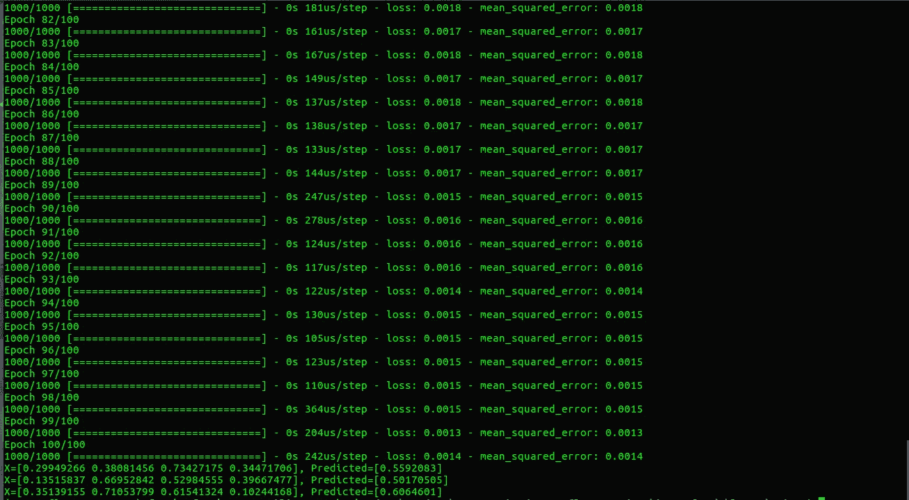
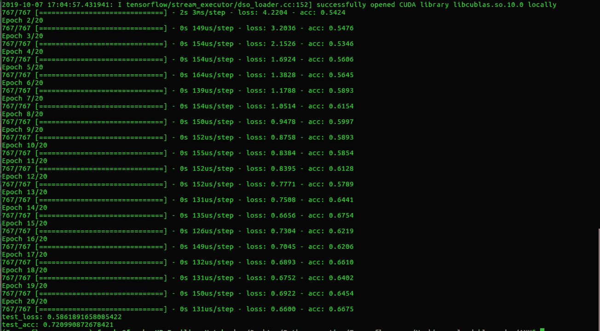
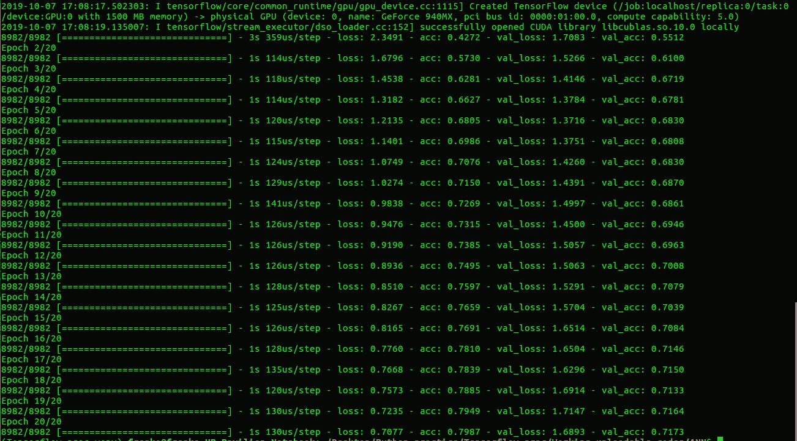

# 用实例揭穿人工神经网络(ANN)

> 原文：<https://medium.datadriveninvestor.com/debunking-artificial-neural-networks-ann-with-practical-examples-8d3265f69a54?source=collection_archive---------2----------------------->


你好，欢迎来到**【揭穿神经网络】**系列的第一篇帖子。在这个系列中，我们将尝试理解深度学习的底层机制和黑盒概念。我们不仅要尝试理解深度学习是如何工作的，还要用我们自己的计算机来实现它！

近来，深度学习风靡全球。从为谷歌的搜索引擎提供动力到估计优步送货的时间，深度学习已经证明了它改变技术工作方式的潜力。

## `What is Deep Learning???`

深度学习是机器学习的一个子领域，它试图在数据的帮助下模仿人类智能。**以身作则。**

# 如果给定大量数据和计算能力，深度学习几乎胜过所有其他传统的机器学习算法。这使得 DL 成为创建尖端解决方案的首选方法。

## 那么是什么驱动了深度学习呢？？？

深度学习的核心是一种被称为**神经网络**的新型数学架构。顾名思义，这些神经网络是受生物神经元的启发。 [***神经元***](https://en.wikipedia.org/wiki/Neuron) 是一种电可兴奋细胞，通过电信号接收、处理和传递信息。 **An** [***人工神经元***](https://en.wikipedia.org/wiki/Artificial_neuron) **是表示生物神经元**模型的数学函数。下面是一个非常简单的人工神经网络。它包含一个由 3 个输入节点组成的输入层、两个各有 4 个节点的隐藏层和一个输出节点。你可以在这里 找到稍微复杂一点的神经网络结构 [***。***](https://cdn-images-1.medium.com/max/1200/1*-abk643OlEr7fEYtCT1M3A.png)


A simple Artificial Neural Network

详述人工神经网络的数学细节超出了本文的范围。这正是为什么我想把你们都引向 [***这篇文章***](https://www.codeproject.com/Articles/1261763/ANNT-Feed-forward-fully-connected-neural-networks) 。它描述了 ANN 的简史，其中涉及的所有必要的数学，重要的术语等。这是每个想要真正了解这一激动人心的技术背后发生了什么的人的必读文章。

介绍、炒作和理论已经够多了。是时候把手弄脏了！我们将首先创建一个虚拟环境，并安装所有必要的模块。

注意:这篇文章假设你熟悉 Python 语言。

要开始使用 DL，我们需要创建一个环境，在这个环境中我们可以安装所有必需的库。使用虚拟环境是确保您的安装不会搞乱整个系统的最佳方式！按照下面的步骤复制我在这些项目中使用的虚拟环境。

*   用这个命令创建一个虚拟环境。您需要安装 venv 才能使用它。

```
python3 -m venv keras_venv
```

*   激活虚拟环境。

```
source /path/to/your/venv/bin/activate
```

*   安装此项目所需的所有库模块，以便在此命令的帮助下工作。

```
pip install numpy scipy scikit-learn pandas matplotlib seaborn pillow keras 
```

我们将使用 Tensorflow 作为 Keras 库的后端。Tensorflow 有两种变体，即仅 CPU 和 CPU+GPU。前一种变体很容易安装，只需在上述 pip install 命令的末尾添加“TensorFlow”。**然而**，后一种变体并不那么容易安装。你需要有支持 CUDA 的 GPU/，它才能工作。你必须安装必要的 CUDA 库，看看 TF 版本是否与这些库兼容。你可以在网上找到一些非常好的关于如何安装 TF GPU 的教程。我会把那部分留给你。

## TensorFlow & Keras 入门:

Tensorflow 是 Google 的开源机器学习框架。它是目前最受初学者和行业老手青睐的 ML/DL 框架。如今，不同行业的许多老牌公司都使用 TF 来满足他们的人工智能需求。Google 自己在它的大部分产品线中都使用了 TF。虽然 TF 是一个很好的工作框架，但是要理解它可能有点困难。这几乎是用 Python 写另一种语言。Keras 是构建在 Tensorflow 之上的高级库。它抽象出了几乎所有伴随 TF 而来的不必要的复杂性。它真的很容易理解和实现，有惊人的文档，并定期更新。由于所有这些属性，Keras 是神经网络项目快速原型化的首选库。

就是这样。你的 DL 环境已经准备好了！

这篇文章分为三个部分，每个部分都有自己的问题陈述。

# 1.回归:

回归是关于预测一个真实的或连续的数量，如“工资”或“价格”或“重量”。基于先前的模式预测给定时间的股票价格、预测未来的房地产价格、基于来自先前公司的数据预测雇员的工资等等都可以归类为回归问题。回归问题属于监督学习范畴。在 ML 中，有解决线性问题的线性模型和解决非线性问题的非线性模型。我强烈建议你浏览这些模型，以便更好地理解它们背后的数学原理。这也有助于建立直觉。这里我们将尝试用 ANN 来**解决一个简单的线性回归问题。**

ANN for a Regression problem

从我的角度来看，代码本身是很好的注释，但我们仍然会通过一部分一部分地分解来简化它

## 分解代码:

第 1–8 行处理导入所有必需的模块和库。Numpy 用于数值计算，Pandas 用于数据操作，Sklearn 用于数据创建和预处理，最后 Keras 用于创建 ANN 模型。

```
import numpy as np
import pandas as pdfrom keras.models import Sequential
from keras.layers import Dense, Dropoutfrom sklearn.preprocessing import MinMaxScaler
from sklearn.datasets import make_regression
```

第 10–21 行处理的是创建一个适合于回归预测的随机数据块，并对其进行缩放。由于输入数据的高度可变性，在某些数据集中缩放输入数据是一个必要的步骤。缩放数据集使模型不容易出现离群值。

```
X, Y = make_regression(n_samples=100, n_features=4, noise=0.1, random_state=1)scaled_X = MinMaxScaler()
scaled_Y = MinMaxScaler()scaled_X.fit(X)
scaled_Y.fit(Y.reshape(100, 1))X = scaled_X.transform(X)
Y = scaled_Y.transform(Y.reshape(100, 1))
```

在第 23–24 行，我们初始化了模型的实例

```
model = Sequential()
```

从第 26–42 行开始，我们实际上创建了具有密集网络的 ANN 模型。请注意，在密集神经网络的每一层之后，我们用 Dropout 方法添加了另一行。Keras 中的 Dropout 方法从层中随机删除节点。这样做是为了避免在我们的模型中过度拟合。**过度拟合意味着模型不从特征输入中学习，而是开始记忆整个数据，破坏了模型的泛化能力。**最后一个密集层将仅包含一个节点，该节点仅对应于回归任务的一个实值输出。

```
model.add(Dense(units = 32, input_dim = 4, activation = 'relu'))
model.add(Dropout(0.10))model.add(Dense(units = 32, activation = 'relu'))
model.add(Dropout(0.20))model.add(Dense(units = 32, activation = 'relu'))
model.add(Dropout(0.20))model.add(Dense(units = 1, activation = 'linear'))
```

在接下来的五行中，我们用一些参数编译创建的模型，比如损耗、优化器等。让我们试着简要理解其中一些术语的含义。

1.  损失-也称为成本函数或误差函数，是评估模型预测能力的一种方法。损失函数越高，模型的性能越低。[喀拉斯可用损失](https://keras.io/losses/)
2.  优化器-训练神经网络是关于最小化成本函数以及最小化实际输出和预期输出之间的差异。优化器通过响应损失函数的输出来更新模型，从而将损失函数和模型参数联系在一起。[Keras 中可用的优化器](https://keras.io/optimizers/)
3.  Epoch-在最终确定输出之前训练神经网络的迭代次数。

```
model.compile(loss='mse', optimizer='adam', metrics = ['mae'])model.fit(X, Y, epochs = 100, verbose = 0)
```

***我仍然会继续阅读*** [***这篇文章***](https://www.codeproject.com/Articles/1261763/ANNT-Feed-forward-fully-connected-neural-networks) ***以便更好地理解所有这些重要的 ML 术语。***

就是这样。我们的模型已经准备好进行预测了。在这段代码的最后一部分，我们创建了另一个随机数据块，一个没有经过模型训练的随机数据块，并在其上测试我们这个小而强大的模型，看看它的表现如何。

```
Xnew, a = make_regression(n_samples=3, n_features=4, noise=0.1, random_state=1)Xnew = scaled_X.transform(Xnew)ynew = model.predict(Xnew)for i in range(len(Xnew)):
    print("X =",Xnew[i], ",", "Predicted =",ynew[i])
```

# 输出:


TRAINING PHASE



PREDICTED VALUES.

# 2.二元分类:

分类问题是关于将观察值分类到离散的类中。与输出为真实值的回归不同，分类输出具有不同的概率分类，如“蓝色/红色”、“是/否”、“男性/女性”等。理解分类的一个很好的例子是将邮件分类为“垃圾邮件/非垃圾邮件”。**二元分类因此将观察值分类为两个离散的类别。**在传统的机器学习中，有很多很好的算法来执行分类任务，如支持向量分类、K 近邻、逻辑回归、决策树、随机森林等。在这里，我们将尝试使用人工神经网络通过基于特征的深度学习来解决它。

## 分解代码:

正如人们已经可以推断的那样，这段程序与回归程序非常相似。我们首先导入所有必要的库。

```
import pandas as pdfrom keras.models import Sequential
from keras.layers  import Dense, Dropoutdf = pd.read_csv('pima-indians-diabetes.csv')X = df.iloc[:,0:8].values
Y = df.iloc[:,8].values
```

接下来，我们启动模型实例，并添加 3 层 32 和 64 个节点以及 Dropout 方法。最后一层将是输出层，其单元数量总计为所需输出的数量。

```
classifier = Sequential()classifier.add(Dense(units = 32, activation = 'relu', input_dim = 8))
classifier.add(Dropout(0.10))classifier.add(Dense(units = 64, activation = 'relu'))
classifier.add(Dropout(0.20))classifier.add(Dense(units = 64, activation = 'relu'))
classifier.add(Dropout(0.10))classifier.add(Dense(units = 1, activation = 'sigmoid'))
```

然后，我们用“二进制相关性”损失和“Adam”优化器来编译该模型。将模型拟合到训练数据集将是下一步。

```
classifier.compile(loss='binary_crossentropy', optimizer='adam', metrics=['accuracy'])classifier.fit(X, Y, batch_size=30, epochs=200, verbose=1)
```

为了评估我们的模型，我们将调用。评估来自 Keras 的方法，并输出我们训练的模型的准确性和损失的结果分数。

```
score = classifier.evaluate(X, Y, verbose=0)
print ('test_loss:', score[0])
print ('test_acc:', score[1])
```

# 输出:



# 3.多类分类:

多类分类问题与二元分类问题完全相同，唯一的区别是观察类的数量。二元分类模型将输出分为两个不同的类别。多类分类模型可以将输出分类到更多的类中。理解这一点的一个很好的例子是将给定的水果分成 5 个不同的类别，即:“苹果”、“橘子”、“香蕉”、“猕猴桃”或“甜瓜”。该算法可以根据水果的特征，如“形状”、“颜色”、“大小”等，决定将水果分为 5 类中的一类。下面是深度学习将如何尝试使用 ANN 解决这种类型的分类问题的示例。

## 分解代码:

任何 Python 程序的首要部分通常是导入所有必要的库。从第 1 行到第 5 行，我们做同样的事情。

```
from keras.models import Sequential
from keras.layers import Dense, Dropout
from keras.preprocessing.text import Tokenizer
from keras.utils.np_utils import to_categorical

from keras.datasets import reuters
```

现在，这个特殊的数据集需要一些文本预处理，然后才能输入到我们的模型中。这里唯一需要的预处理是将输入数据转换成标记化形式，然后转换成分类形式。这样做是因为我们希望我们的输出是多类分类格式。

```
num_features = 5000

(train_x, train_y), (test_x, test_y) = reuters.load_data(num_words = num_features)

tokenizer = Tokenizer(num_words = num_features)train_x = tokenizer.sequences_to_matrix(train_x, mode = 'binary')test_x = tokenizer.sequences_to_matrix(test_x, mode = 'binary')train_y = to_categorical(train_y)test_y = to_categorical(test_y)
```

在第 29 行，我们启动了模型实例。从第 31–54 行，我们创建了我们的模型。我们添加了几层密集连接的网络以及 Keras 的 dropout 方法，以避免过度拟合。在第 57 行，我们添加了最后一层输出。请注意，节点(单元)的数量明显多于前面的问题。这就是“多类”这个名字的由来。我们尝试将输入数据分成以下 46 种概率输出场景之一。

```
model = Sequential()model.add(Dense(units = 32, input_shape = (num_features, ),activation = 'relu'))
model.add(Dropout(0.15))model.add(Dense(units = 32, activation = 'relu'))
model.add(Dropout(0.15))

model.add(Dense(units = 32, activation = 'relu'))
model.add(Dropout(0.15))model.add(Dense(units = 32, activation = 'relu'))
model.add(Dropout(0.15))model.add(Dense(units = 32, activation = 'relu'))
model.add(Dropout(0.15))model.add(Dense(units = 46, activation = 'softmax'))
```

最后。我们用损失作为“分类交叉熵”而不是“二元交叉熵”来编译我们的模型。这样做是因为我们的数据本质上是绝对的。我们的下一步将是在长达 50 次迭代中拟合训练特征和训练标签上的数据。这将输出最终结果。

```
model.compile(loss = 'categorical_crossentropy', optimizer = 'rmsprop', metrics = ['accuracy'])model.fit(train_x, train_y, batch_size = 100, epochs = 50, validation_data = (test_x, test_y), verbose = 1)
```

# 输出:



就这样了，伙计们。拍拍自己的背。你看完了整篇文章。

**我们所做工作的总结:**

1.  深度学习是什么，和机器学习有什么不同。
2.  Keras 和 Tensorflow 是什么？
3.  如何在我们自己的系统中建立一个本地的深度学习环境？
4.  如何使用人工神经网络进行回归、二元分类和多类分类

你可以在[我的 Github](https://github.com/DixitIshan/Deep_Learning_with_Keras) 上找到注释良好且结构化的代码以及参考注释。一定要去看看。

再见！下次见。！！！