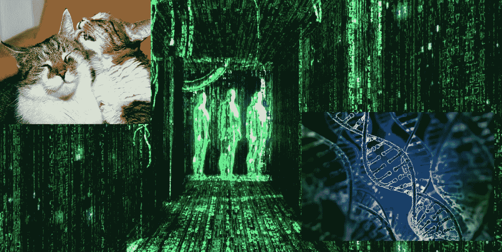

# 揭穿《大西洋月刊》关于猫、人工智能和 DNA 的文章——以及为什么他们报道的结果仍然非常可怕。

> 原文：<https://medium.datadriveninvestor.com/debunking-the-atlantics-article-about-cats-artificial-intelligence-and-dna-and-why-the-result-d8636432a8c8?source=collection_archive---------22----------------------->

## 谷歌的 cat picture 算法学习如何分析 DNA 并不是人工智能变得有知觉或超级智能的一步——但它是走向普遍技术失业的重要一步。

(这篇文章之前发表在我的一个旧博客上，现在已经被淘汰了——这篇文章是为了回应“有点老了”,但是文章的主旨仍然和以前一样相关。

[大西洋](https://www.theatlantic.com/)是我最喜欢的新闻来源之一。在这个政治报道极度两极化的时代，在我看来,《大西洋月刊》是最接近平衡和冷静的出版物。这就是为什么当我看到这篇文章[“谷歌教会了一个人工智能，它可以对猫的照片进行分类以分析 DNA”](https://www.theatlantic.com/science/archive/2017/12/google-deepvariant-dna/547634/?utm_source=atlfb)时，我真的很失望。这篇文章描述了谷歌如何采用一种为图像处理(特别是猫的图像)而设计的神经网络，并将其应用于分析 DNA 数据的生物学中长期存在的问题。这篇文章感觉有点太煽情了，所以我浏览了这篇文章提到的原始研究论文。

**首先**，标题“谷歌教会了一个对猫的照片进行分类以分析 DNA 的人工智能”意味着谷歌采用了一个正在运行的计算机程序的实例，该程序已经开始对猫的照片进行分类，并以某种高级方式与它进行了交流，以便它最终开始分析 DNA，就好像有人在他们的笔记本电脑上安装了愤怒的小鸟并启动了它，然后给愤怒的小鸟的副本输入了一堆文件或命令，以便它最终学会如何执行与 TurboTax 相同的任务。他们根本不是这么做的。他们采用了一种抽象的计算模型，在这种情况下，是一种特定类型的神经网络，通常用于分析猫的图像，并对模型进行了一些调整，以便他们可以将其应用于分析 DNA。

**第二个**，他们在文章*中使用了一个非常误导人的措辞，在短短一年内，* [*人工智能的表现超过了*](https://www.biorxiv.org/content/biorxiv/early/2016/12/21/092890.full.pdf) *一个叫做 GATK 的标准人类编码算法。这意味着人工智能编写了自己的代码，或者有一些其他的自主措施。正在讨论的神经网络不产生代码，它产生数学参数。此外，神经网络本身是由人类编码的，所以在这两种情况下，分析 DNA 的问题都是由人类编写的代码解决的，这只是不同类型的代码。查看实际的论文本身，作者所做的是找到一个更复杂的分析 DNA 的通用模型。作者使用了[卷积神经网络](https://en.wikipedia.org/wiki/Convolutional_neural_network)，与使用逻辑回归、隐马尔可夫模型和贝叶斯分类的 GATK 相比，卷积神经网络具有[能够逼近任何数学模型的特性，所有这些都是较老的数学模型，并且必须针对正在分析的数据的特定实例进行调整。这更像是作者发现了“一个主数学模型来统治他们”，而不是一个超越人类的自主人工智能。
如果人们确实认为神经网络是一种人工智能(](https://en.wikipedia.org/wiki/Universal_approximation_theorem)[这本身就是一场哲学辩论，参见强人工智能与弱人工智能](https://www.cs.utexas.edu/~mooney/cs343/slide-handouts/philosophy.4.pdf))，那么旧程序 GATK 所做的也是人工智能，因为神经网络和上述统计模型都是机器学习的类型(即两者都是弱人工智能的实例)。因此，对报告结果更准确的描述是“谷歌的 DeepVariant 人工智能在 DNA 分析任务中胜过了一个更古老、更初级的人工智能”。*

不管怎样，人工智能胜过人类的说法是错误的。

**第三**，从数学上讲分析 DNA 的问题和分析识别猫图片内容的问题没有那么大区别。两者都是[统计模式识别问题](https://en.wikipedia.org/wiki/Pattern_recognition)的实例。另一个例子是数独和航班时刻表之间潜在的数学相似性，解决数独难题的相同类型的算法可以用来优化航班时刻表。准备好接受那些声称“谷歌使用一个会玩数独的人工智能来解决[美国航空公司假日季节飞行员短缺](https://skift.com/2017/11/29/american-airlines-potential-holiday-pilot-shortage-explained/)”的文章吧。

可以肯定的是，报告的结果令人印象深刻，特别是与旧软件相比，DeepVariant 的健壮性，以及他们设法采用图像处理算法来处理非图像数据的方式。但这不是人工智能实现超人智能的重要一步，也不是谷歌-天网即将接管地球的先兆。

好吧，那么为什么我仍然觉得报道的结果如此可怕呢？

考虑一下原始论文中的这句话:“DeepVariant 代表了从专家驱动的统计建模向更自动化的深度学习方法迈出的重要一步，用于开发软件来解释生物仪器数据”——关键词:“从专家驱动向自动深度学习方法”——deep variant 可能不是人工智能向实现自我意识或超人智能迈出的一步，但它确实代表了用机器自动化取代熟练人类工人的(另一)重要一步。

典型的科幻场景描绘了一个启示录/反乌托邦的未来，人工智能发展到有自我意识的地步，然后转向反对人类(终结者电影，黑客帝国等)。这种场景影响了公共话语，关于人工智能影响的最突出的讨论似乎围绕着如何避免这一结果，或者如何适应这一结果。我们这个时代最伟大的圣贤，[埃隆·马斯克](https://www.vanityfair.com/news/2017/03/elon-musk-billion-dollar-crusade-to-stop-ai-space-x)，[史蒂芬·霍金](http://www.bbc.com/news/technology-30290540)，[比尔·盖茨](https://www.forbes.com/sites/ericmack/2015/01/28/bill-gates-also-worries-artificial-intelligence-is-a-threat/#5a376ee8651f)，都担心“如果人工超级智能的潜力没有得到重视，类似于《终结者》和《黑客帝国》系列科幻小说的事情可能会发生”。

我不同意。我们确实面临着某种形式的“T0”奇点，但它不是超级智能和有自我意识的机器之一。相反，我们正迅速走向一个自动化的临界质量，在此之后，绝大多数熟练的人工劳动，无论是体力劳动还是智力劳动，都将被没有知觉但仍然非常强大的机器学习设备所取代。我之前提到过，从数学的角度来看，分类猫图像和分析 DNA 有很多共同点。股票市场分析师和交易员所做的分析类型也属于同一类数学问题。很有可能，DeepVariant 中使用的卷积神经网络，或其他一些[深度学习架构](https://en.wikipedia.org/wiki/Deep_learning)(最有可能是[递归神经网络](https://en.wikipedia.org/wiki/Recurrent_neural_network)，因为金融主要涉及时间序列数据)也将胜过目前华尔街分析师最常用的统计模型和软件。目前任何人都渴望的最高技能和高收入职业之一将被淘汰。它不止于此。甚至创造性的努力[如音乐](https://www.fastcompany.com/40455600/this-new-ai-composed-pop-song-sounds-like-something-from-a-spotify-playlist)和[写小说](https://www.wired.com/2017/12/when-an-algorithm-helps-write-science-fiction/)可能很快就会被机器学习算法取代。在一个痴迷于降低成本和最大化效率的社会，任何可以自动化的任务都会自动化。最有意义和最受欢迎的就业形式将变得完全多余。

随之而来的社会动荡和破坏将是这样的，人工智能是否会超越这一点进化成完全的感知能力是一个悬而未决的问题。

在我链接的《福布斯》关于盖茨的文章中，引用了他的话:

> *“我在关注超智能的阵营里。首先，机器将为我们做很多工作，但不是超级智能的。如果我们管理得好，这应该是积极的。“几十年后，尽管智能强大到足以令人担忧。在这一点上，我同意埃隆·马斯克和其他一些人的观点，不明白为什么有些人不担心。”*

这里的关键点是“…如果我们管理得好，这应该是积极的*，*”。这是一个非常非常大的“如果”，如果我们按照过去的历史模式(看，更多的模式识别！)，我们管理好的机会不大。到目前为止，我们在管理快节奏技术创新引起的社会和生态破坏方面的失败率是 100%。

让我以一种更具戏剧性的方式重新表述它:人工智能驱动的启示录或反乌托邦很有可能发生——但这不会是因为强人工智能变得有自我意识，然后转向我们，而是因为弱人工智能取代了大多数人类工人，而我们的经济和政治系统不知道如何处理这种情况。

从这个角度来看，最能预言未来的不是《黑客帝国》或《终结者》系列，而是另一部科幻系列片:弗兰克·赫伯特的沙丘。该系列主要事件的背景故事讲述了[【巴特勒圣战】](https://en.wikipedia.org/wiki/Butlerian_Jihad)，一场针对 AI 的未来冲突，最终导致宗教禁止制造任何可以思考的机器:

> *“你不应该按照人脑的样子制造一台机器。”* — [橙色天主教圣经](https://en.wikipedia.org/wiki/Orange_Catholic_Bible)

布特勒圣战的一个关键点是，这不是因为智能机器反叛人类，而是因为智能机器允许一些人压迫另一些人。

在[《沙丘》](https://en.wikipedia.org/wiki/Dune_(novel)) (1965)中，有一个角色说:

> *“曾经人们把他们的思想交给* [*机器*](https://en.wikiquote.org/wiki/Machines) *，希望这样能让他们***。但那只允许其他拥有机器的人去奴役他们。”**

*后来，在[《沙丘之神皇》](https://en.wikipedia.org/wiki/God_Emperor_of_Dune) (1981)中，另一个人物解释道:*

> *勒托说:“圣战的目标是像机器一样的机器态度。“人类设置了这些机器来篡夺我们的美感，我们必要的自我意识，我们从自我意识中做出生活判断。自然，机器被摧毁了。”*

*让我们不要让事情发展到像布特勒式圣战这样的地步。埃隆马斯克(Elon Musks)和比尔盖茨(Bill Gates)可以利用他们丰富的知识和影响力来解决即将到来的技术失业问题，而不是试图避免任何类似终结者/黑客帝国的场景。*