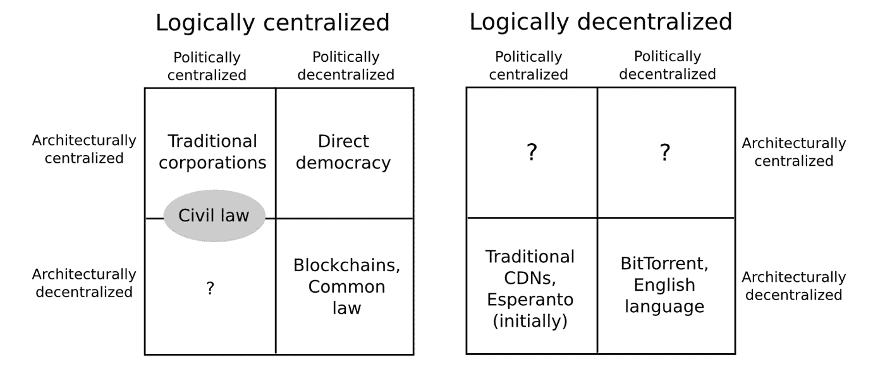

# 分散化、多样化和抗脆弱性

> 原文：<https://medium.datadriveninvestor.com/decentralization-diversification-and-antifragility-f1b7fdb8c915?source=collection_archive---------7----------------------->

1997 年，当被问及现代企业面临的一些最大挑战时，汤姆·彼得斯和罗伯特·沃特曼，这两位《[追求卓越](https://www.amazon.com/Search-Excellence-Americas-Companies-Essentials-ebook/dp/B009YM9VOQ)》的作者，都将“去中心化”列为最严峻的挑战之一。

> 彼得斯[宣称](https://www.forbes.com/asap/1998/0223/128.html)“在经历了 50 年的组织兴衰之后，我们两个坚持了一个……并且只有一个……基本信念，放松缰绳，百花齐放，百家争鸣，这是在这个危机四伏的时代保持活力的最佳方式。这是一个古老的想法，但它仍然是新的，主要是因为我们仍然没有找到如何让它工作的方法。”

随着区块链技术和随之而来的*许多*可能性的出现，也许我们现在终于接近看到我们社会中去中心化过程的潜力了。

更值得注意的是，值得思考的是自然系统是否都有去中心化的倾向。换句话说，去中心化仅仅受到业务流程的青睐，还是也受到我们整个大自然的青睐？

分散化是否发生在自然系统中，并沿着我们进化的道路出现？

这些问题不会让任何批评者闭嘴，也不会帮助我们设计更好的区块链解决方案，但它肯定会帮助我们从更好的角度看待这些问题。

从更好的角度来看，我们倾向于看到事物如何自然发展的过程。

# 分权简史

彼得斯说去中心化是“一个古老的想法”并没有错。

事实上，它已经在许多场合取得了明确的成功。例如，美国化学公司杜邦在 20 世纪 20 年代因分散其在 R&D 的活动而广受赞誉，这是一种将研究人员与各个工厂经理更紧密联系起来的方式。此举使杜邦最终创建了一个新的运营部门，并使其业务多元化。

在银行界，主要的瑞典银行 Handelsbanken 在 20 世纪 70 年代在其时任首席执行官[和著名的分权支持者](https://books.google.co.id/books/about/Decentralisation_why_and_how_to_make_it.html?id=gwu4MAAACAAJ&redir_esc=y) — Jan Wallander 的领导下成功地转向了分权模式。Handelsbanken 此后在权力下放方面形成了几个突破性的概念，例如其“[银行是分行](https://uk.reuters.com/article/uk-handelsbanken-britain/handelsbanken-revives-the-role-of-the-british-bank-manager-idUKKBN0L61NP20150202)”的理念，为各个分行经理做出贷款决策提供了前所未有的自主权；以及[教堂塔尖原则](https://nordicfinancialunions.org/wp-content/uploads/NFU-Conference_MikaelSorensen.pdf)，该原则宣称，一个人“不应该在比从教堂塔尖上所能看到的更大的区域内开展银行业务”。

到了世纪之交，像 BitTorrent 和 Limewire 这样的公司为其用户提供了一种创新的，[去中心化的数据存储和文件共享方法](http://www.datadriveninvestor.com/2018/09/05/blockchain-and-data-storage-a-perfect-match/)。用户不用从中央服务器下载文件，而是可以在他们的网络伙伴之间共享。

虽然上述案例展示了优秀的使用案例，但就扩散和受欢迎程度而言，分散化被集中化结构所掩盖。

从商业模式到政府、货币体系到社会组织——中央集权仍然是事实上的标准。看起来汤姆·彼得斯 20 年前的断言是正确的，那就是**我们仍然没有想出如何让权力下放发挥作用……**

# 何必去放权呢？

随着区块链的出现，我们现在迎来了一种核心利用去中心化的技术。

以比特币为例，只有当分散的节点网络达成共识时，交易才有效。这意味着我们不需要一个中央机构来控制和管理货币体系，不像法定货币和中央银行。

以太坊更进一步，在其区块链上促进了分散式应用程序的构建。利用建立在以太坊基础上的智能契约，去中心化自治组织(DAO)有朝一日可能会严重挑战作为集权结构特征的僵化等级制度的统治地位。

以太坊创始人 Vitalik Buterin 通过强调概念的三个独立支柱反复[定义了去中心化](https://medium.com/@VitalikButerin/the-meaning-of-decentralization-a0c92b76a274):

1.  架构(去)集中化，指的是系统中有多少节点/物理计算机，以及系统是否能够容忍这些节点中的一个或多个出现故障。
2.  政治(去)集中化，解决了多少实体控制系统内的节点。
3.  逻辑(去)集中化——系统是创建一个单一的整体对象还是一个无定形的群体？如果分成两半，系统还能运行吗？

那么，就确定一个系统内权力下放的性质而言，Buterin 认为它将包含上述类型的一些或全部的组合:

[来源](https://medium.com/@VitalikButerin/the-meaning-of-decentralization-a0c92b76a274)

# 看待权力下放的其他方式

从语境的角度来理解分权，布特林的描述发人深省。

然而，为了弄清楚去中心化的*为什么是*，我们可能想要扩展我们对正在讨论的系统的功能方面的探究。

在生物系统的背景下，去中心化是否与有机体的生存机会有关？它与我们的进化足迹相吻合吗？在维持生命的过程中，自然是否喜欢分散的过程？(下面有更多相关信息)

在金融体系的背景下，分散化是否与通过分散化实现最优风险承担有关？权力下放和多样化是同一现象的不同方面吗？这样来思考这个问题:通过分散自己的风险，你是否也实现了分散投资组合的稳定回报(通过一篮子资产)？

从自然系统的角度来看，去中心化是否会导致一个更加抗脆弱的系统——这是纳西姆·塔勒布在他的书中流行的一个概念。一个版本的抗脆弱系统由许多简单的子过程组成，当这些子过程同时运行时，不仅允许整个系统具有更高的弹性，而且在压力和无序状态下也能更好地发展。

# 集权是一种异常现象

就弄清楚*“如何让去中心化运作起来”*而言，正如汤姆·彼得斯所想，探索我们作为人类是否真的在去中心化过程中表现得更好似乎是值得的。

分权与我们的自然倾向和本能一致吗？还是说我们的核心生物冲动终究偏向集权？

当我们考虑我们自己作为一个物种的进化时，我认为分散化，而不是集中化，与生物机体如何发挥最佳功能相一致。

彼得斯将去中心化过程描述为允许“百花齐放”并非偶然。许多人认为分权是比集权更自然、更有机的发展方式。

例如，在人体内，去中心化通常与健康的生物系统相关，而去中心化则导致损伤或累积过量(例如肿瘤)。

以我们的血管和毛细血管网络为例。它们构成了一个高度分散的系统，使血液能够在单个细胞之间和整个内部网络中运输重要的营养物质，支持我们内部器官的健康功能。

但是，一种被称为[动静脉畸形(AVMs)](https://www.mayoclinic.org/diseases-conditions/brain-avm/symptoms-causes/syc-20350260) 的疾病，即通常在大脑中形成的异常血管团块，缺乏重要的营养，例如，代表着向潜在的破坏性中央化状态的转变。

正如尼尔·强森(Neil Johnson)的《简单复杂性:复杂性理论清晰指南 中所描述的那样，动静脉畸形“可能开始像一个新的城市中心一样行动，血液可能更喜欢通过它流动，而不是通过大脑精心收集的非常小的毛细血管走正常的路线。”

一脑 AVM [(来源)](https://www.mayoclinic.org/diseases-conditions/brain-avm/symptoms-causes/syc-20350260)

在我们的身体内，当分散的血流得到维持时，循环系统保持健康，但一旦血管变得集中，就会出现异常。

你喜欢分散血流还是集中血流？虽然看起来是个奇怪的问题，但后者听起来很难想象。

我们复杂的内部工作方式是否会对现实世界中哪些类型的系统起作用，哪些不起作用，产生相关的影响，从而促进一个整体健康的系统？毕竟，我们是一个高度进化的物种，我们可以从我们的生物机制如何以及为什么以它们所拥有的方式进化中学到很多。

但是，在考察我们的自然过程时，这并不一定意味着我们可以忽视中央集权。相反，它已经成为世界运作的组织结构的事实上的模式。

但是为什么会这样呢？

控制？贪婪？还是我们对权力的渴望？

如果你努力工作，你将理所当然地获得更大的回报和在体制内更重要的地位？

或者，在某些情况下，集中式模型更有效。

[来源](http://www.memegen.com/meme/hecnhv)

值得承认的是，自远古以来，我们就一直在彼此交战，总是为了在我们的物种中获得资源所有权的至高无上*。*

毕竟，自然选择就像我们体内血管的运作一样牢牢植根于生物学。

纵观当今世界，某些地方的权力积累强烈表明我们仍然倾向于等级权力结构——这种结构似乎与权力下放相对立*。*

也许理想的范式最终是一个两阶段的过程，随着实体经营范围的扩大而演变。

首先，建立一个中央机构(范围狭窄/重点突出),根据明确的愿景，利用其资源建设和指导其初步发展。

随着时间的推移，随着管理机构范围的扩大，权力下放将取而代之，显然需要通过发展多个权力下放的辅助子流程(即多样化导致权力下放)来最大限度地提高其生存机会。

正如杜邦公司在近 100 年前所意识到的，当业务多样化的需求出现时，子系统的发展和进化将会产生相应的需求。为了增加多元化体系繁荣发展的可能性，答案往往是去中心化。

同样值得记住的是，分权的定义是“将权力从组织中心分散出去的过程”。换句话说，首先要有一个“总部”，然后才能取消它的权力。这也将减轻中央实体的压力，它将不再承担系统单一(和中央)故障点的责任。

另一种解释是，与集权相比，分权似乎是一个更进化的下一步。

# 这一切在哪里结束？

但是权力下放的程度似乎没有限制，权力的再分配也没有限制。这会是个问题吗？正如我们在最近的[文章](http://www.datadriveninvestor.com/2018/06/30/just-how-decentralized-are-cryptocurrencies/)中所讨论的，许多加密货币继续保留某种形式的集中化——通常通过共识流程、决策或令牌分发——这使我们远离了许多人正在寻求的去中心化范式。

那么，‘*完全去中心化*’是什么样子的呢？

完全放弃权力和控制中心，这样那些在系统中拥有经验和知识的人和那些没有的人得到完全一样的对待？这真的可取吗？需要解决这些问题，以确定一个系统内应该出现的权力下放程度，以及可以/应该采用什么样的自动防故障机制(如果有的话)。

即使在人体循环系统的情况下，心脏也是控制中心，执行最重要的功能。对于高度分散的商业组织，如 Handelsbanken，[研究表明](https://www.sciencedirect.com/science/article/abs/pii/S0956522113001164)“技术官僚控制和组织结构的强大作用”的重要性，以及“信任在上级向下级提供基于经验的建议中的作用”

这些都是需要考虑的棘手问题。但是，如果我们能够更多地作为一个集体来审视自己，是什么让我们在分子水平上发挥作用，我们的欲望和不完美，以及我们真正寻求的是什么——无论被认为是客观上的好还是坏——我们很可能会找到更多答案，来回答自然界中集权或分权所发挥的关键作用。

简短的回答是:我们如何看待相对于更大框架的操作范围。更详细的答案是——我们如何评估构成我们存在基础的各种范围和功能的相对重要性。

当然，这将迫使我们思考和重新思考一切事物的目的。我们将更接近于弄清楚“如何让它(去中心化)发挥作用。”

*原载于 2018 年 10 月 12 日*[*【www.datadriveninvestor.com*](http://www.datadriveninvestor.com/2018/10/12/decentralization-diversification-and-antifragility/)*。*