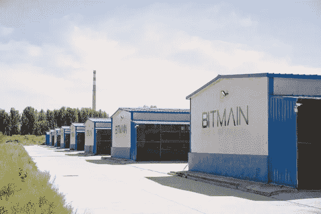
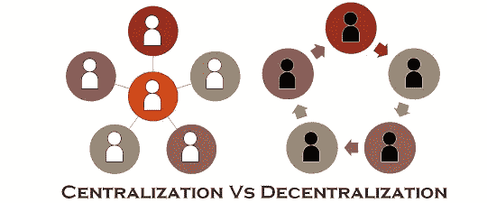
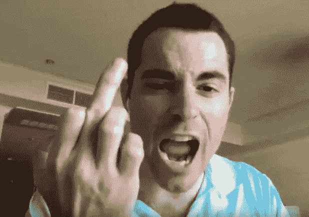
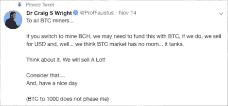

# 去中心化的加密货币？…在你的梦里

> 原文：<https://medium.datadriveninvestor.com/decentralized-cryptocurrency-in-your-dreams-e5682a9d7db?source=collection_archive---------17----------------------->

比特币现金霸权之争。

## 前言:

在我们开始之前。这不是 FUD，它的灵感来自我过去几天、几周和几个月的观察，以及我对参与比特币现金分叉惨败的坏人行为的厌恶。

任何真正相信加密货币，特别是比特币是去中心化和民主的人都需要认真看待最近的市场事件。虽然鲸鱼继续不时操纵市场，FUD(恐惧、不确定、怀疑)和 FOMO(害怕错过)影响向上或向下的趋势，但分散化(或明显缺乏分散化)是令人担忧的原因。

“真正的”中本聪(而不是权力饥渴、自我中心、自大狂、伪君子——克雷格·赖特博士)的分权、民主的愿景，似乎只是现实中的白日梦。

事实是，比特币仍然引领市场，是最受追捧的货币。最近，它的统治地位几乎总是在整个市场的 50%以上，这使得它成为几乎所有秘密市场行动的催化剂。

这一切都很好，老实说，我自己也有点比特币狂热，我的最终目标是长期增加我的 BTC 总持有量，从而增加 BTC 和等价的法定价值。

我敢打赌，对于我们中的绝大多数人来说，这是关于投资和获利，而不是分散货币和取消银行控制权的自由主义观点。当该说的都说了，该做的都做了，我们真的在乎它是否去中心化了吗？说到底，如果你在秘密市场赚钱，这对你有什么影响吗？

加密货币现实主义者坚持认为，去中心化和民主是加密货币用例及采用的核心驱动力。这可能是一个乌托邦式的观点，看起来有一些重大的缺点和缺陷，就像我们在过去几周看到的那样。默认情况下，正如我们现在所知道的，在许多情况下，分散意味着对于谁拥有控制权没有制衡。这是好事吗？

随着时间的推移，比特币、以太坊、比特币现金和莱特币等货币所使用的工作证明(PoW)算法似乎被滥用了，消除了 it 去中心化和民主化的最初愿景。由于比特大陆被认为是世界上最大的矿业公司(总部设在中国)，也有人怀疑中国政府至少以某种方式参与其中。随着数据块大小的增长，需要额外的计算能力，这使得一些人负担不起，并减少了网络上的节点数量。

利害关系证明(PoS)怎么样？…你可能会问 PoS 也有它自己的局限性。虽然 PoS 需要非常有限的计算能力，但是下注者持有的代币数量减少了那些持有量小的人的收益，而那些下注量大的人获得了更多的奖励。同样，在某些情况下，参与的成本可能会让一些人望而却步，从而降低了集中化的程度。

目前，我们正在见证权力竞争的力量，这些人正在展示他们有多大的影响力，他们的行动如何证明权力下放不是一个现实，而是一个尚未实现的愿景。

## 比特币现金哈希大战

BCH 哈希战争的持续传奇证明，就比特币和比特币现金而言，去中心化是不存在的。这一切都始于比特币现金协议的硬分叉。有了罗杰 Ver 撑腰**比特币现金 ABC** 和克雷格·赖特撑腰**比特币现金 Satoshi 的愿景**(或 SV)。

比特币现金 ABC 希望继续使用当前 32Mb 的比特币现金块大小，而比特币 SV 希望将其增加到 128Mb。

提高块的大小可以提高事务的速度，但是这样做的一个缺点是由于几个因素导致区块链变得更加集中。1)增加的块大小需要更大的磁盘空间，这反过来意味着更少的节点将能够存储整个区块链(所需计算能力的高昂成本)。2)较大的数据块会增加延迟(使其变慢)，因此需要较少的节点来确保保持区块链的速度。这些因素的总体影响是，参与区块链的节点将会减少，从而使其更加集中。

双方都调动了资源来挖掘他们喜欢的比特币现金叉，以努力“赢得战争”。最终的影响是，他们都在以每天 25 万到 50 万美元的损失进行开采！

根据比特币白皮书，比特币的任何分叉，只要链长最长，就成为赢家。然而，这是无法执行的，普遍的共识是，双方将继续斗争，而不考虑这一点。

## 战争贩子

*   **罗杰·弗**，比特币的早期采用者和最初比特币现金的倡导者，历史上一直经营着一个比特币矿池。最近，在没有咨询或建议资金池成员的情况下，他决定将所有资源从比特币转向比特币现金 ABC。这对他未来声誉和可信度的损害是可以预见的，但我怀疑未来会有多少人会相信他的任何矿池。

*   **克雷格·赖特**在推特上说，他通过将采矿业务转移到比特币现金服务来弥补损失的策略是出售他储备的大量比特币，丝毫不考虑 BTC 的价格或社区。这将(似乎)严重影响市场，我们已经看到了 BTC 和所有 alt 硬币前所未有的价格下跌。虽然这可能不是根本原因，但这整个惨败造成的恐惧、不确定性和怀疑肯定会导致一些人恐慌性抛售。克雷格·赖特也威胁要发动 51%的攻击。通俗地说，这意味着如果比特币 SV 能够积累比比特币现金 ABC 更高的散列率(51%的计算能力)，他们就可以干扰 ABC，扰乱它，足以摧毁它。这就是那个自称是“真正的”中本聪的家伙。

如果这是真的，你会问为什么一个通过改变生活的发明而拥有公平和民主形象的人，会像学校操场上的暴徒一样，不顾一切地为所欲为，而不考虑他的发明或整个社区。

你们自己决定谁是最大的恶棍。

不幸的是，我在这里没有看到任何赢家。我只看到失败者。老实说，这不可能发生在两个更好的人身上(讽刺！).问题是，其后果似乎正在影响整个加密，并将损害一些无辜的投资者。展望未来，这种情况可能会再次发生，因为随着加密货币的发展，需要增加块大小来满足更广泛的采用。

我们只能希望这些家伙和他们各自的阵营明白事理，解决他们的冲突。然而，在双方都如此自负的情况下，这似乎令人怀疑。记得人们甚至金正日和堂亲吻和好(一段时间)。

***免责声明:*** *本文纯属个人观点。我不认可我所写的任何公司或品牌。我使用它们只是为了演示，说明一个观点或作为一个例子。这不是财务或任何其他形式的建议。永远做你自己的研究。*

*原载于 2018 年 11 月 19 日*[*www.datadriveninvestor.com*](https://www.datadriveninvestor.com/2018/11/19/decentralized-cryptocurrency-in-your-dreams/)*。*