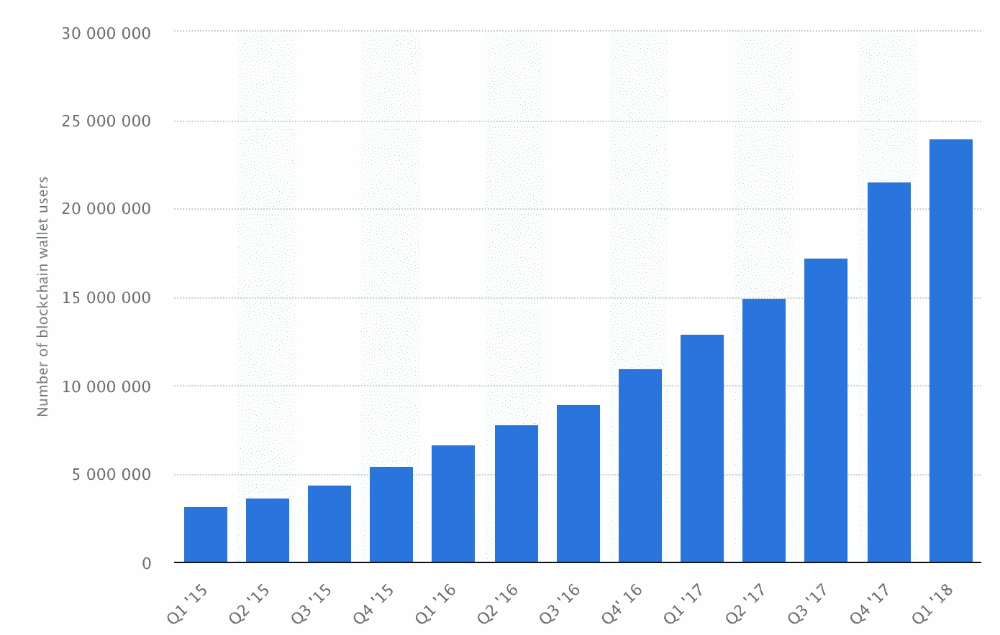
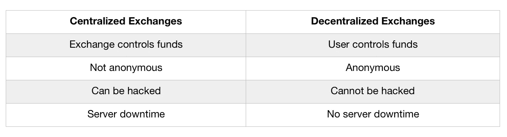
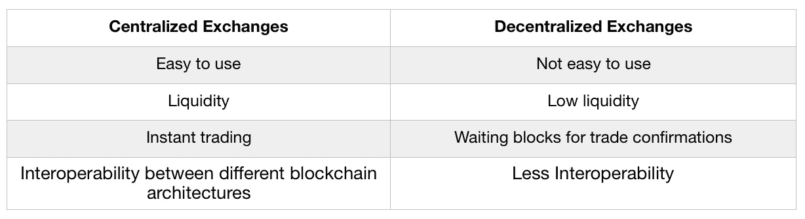

# 分散式交易所是加密货币交易的未来

> 原文：<https://medium.datadriveninvestor.com/decentralized-exchanges-are-the-future-of-cryptocurrency-trading-4455adb90f4c?source=collection_archive---------2----------------------->

截至今天(2018 年 7 月 27 日)，所有加密货币的交易额接近 150 亿美元。让我们客观地看待它。

纳斯达克今天达到了 1610 亿美元的交易量，大约是现在的 10 倍。然而，加密货币市场更接近于外汇市场，其日交易量超过 5 万亿美元。与此相比，加密货币感觉仍然很小，但这是我们可以用来估计加密货币最大潜在容量的数字。相差 300 倍。如果比特币价格上涨同样的因素，每一个比特币的价格将接近 2.4 百万美元。

加密货币市场能抵挡住这种潜力吗？纵观比特币钱包数量的增长，我们可以注意到有一个指数趋势。在我看来，这种趋势持续下去取决于两个因素。

Number of bitcoin wallets.

# 第一采用因素:安全性

今天，大多数金融交易都是集中的。这意味着用户存入的钱通常存放在一个地方。对于黑客来说，这是一个容易攻击的目标。集中式交易所有着安全性差的历史。仅去年一年，代币经济就有超过 10 亿美元的资金被盗。只要这一风险持续存在，加密货币和分散服务的全球采用就会受阻。

## **分散交易所和证券**

从根本上来说，分散式交易所比集中式交易所为所有利益相关者提供了更多的安全性和控制。

Centralized vs Decentralized

我非常惊讶地发现，集中交易所的交易量远远大于分散交易所的交易量。事实上， **99%的加密货币交易仍然通过集中交易所进行。**阻碍的是什么？

# 第二个采用因素:可用性

Usability in centralized and decentralized exchanges

分散交易所相对较差的用户界面和用户体验限制了它们的覆盖范围。就功能而言，分散式交易所仍然远远落后于集中式交易所，包括订单类型方面的缺点。交易员需要等待，并经常为创建新订单或填补现有订单而付费。此外，所有分散式交换机目前仅限于使用一个区块链架构。然而，分散交易所的最新进展表明，这些问题中的一部分可能很快就会成为过去。

# 振作起来。可用性来了。

一个在功能上涵盖可用性挑战的值得注意的项目是 [**Switcheo**](https://switcheo.network/) 。该交易所网络提供的技术提供了即时交易，并允许不同区块链之间的互操作性，如 Neo、Qtum 和 ether eum——事实上，这是第一个世界多链交易所。这些特点很可能使 Switcheo 与币安等交易所展开竞争。

# 分散式交易所是下一件大事…

分散的交易所将大大有助于分散的生态系统的安全。唯一的障碍是可用性。已经有一些项目为这一改善做出了重大贡献。一旦我们到了那里，分散式交易所可能会面临大规模增长。99%的加密货币交易仍然通过集中交易所进行，这一事实在已经不断增长的加密市场中带来了巨大的增长潜力。

# …但是…

在这发生之前，有一个严重的先有鸡还是先有蛋的问题，可能会阻止该模型挑战已建立的加密货币交易所。

简而言之，你需要流动资金来获得采纳，然而为了吸引交易者，流动资金是必须的。如果 [Switcheo](https://switcheo.network/) 和其他分散式交易所找到解决这一挑战的途径，我们可能会看到向分散式交易所过渡的趋势将受到挑战现状的较小项目的推动。

请分享您对 DEX 技术及其未来的想法！