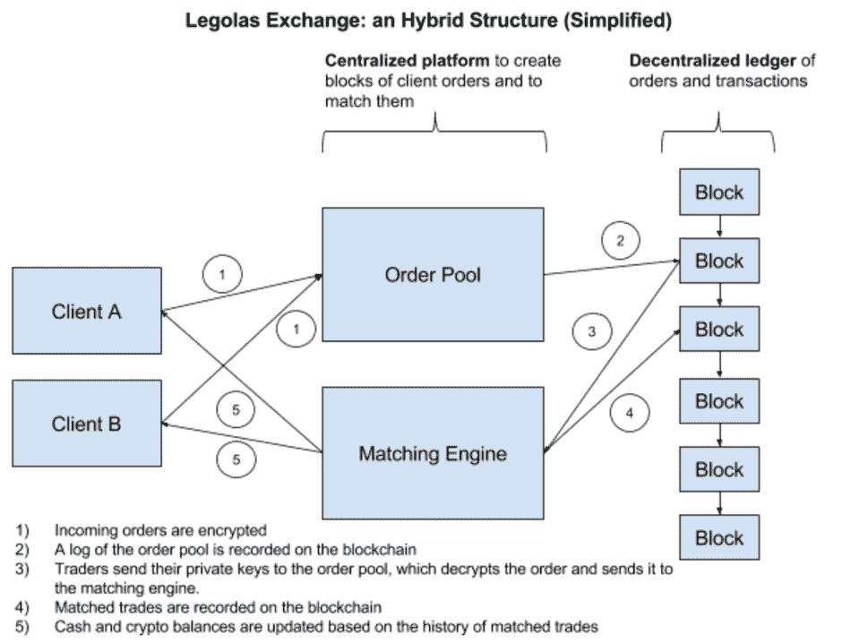

# 分散式交易所是加密货币交易的未来(下)

> 原文：<https://medium.datadriveninvestor.com/decentralized-exchanges-as-the-future-of-cryptocurrency-trading-part-ii-b9aeea4f0a89?source=collection_archive---------5----------------------->

在我的前一篇文章中，我强调了分散交易所(dex)在一系列重要问题上，如安全和隐私，相对于集中交易所是一个显著的进步。

但是，dex 绝不是最终产品。在它们被广泛采用之前，还需要进行大量的开发工作。事实上，过去几年已经出现了数十种 DEX 模型，但许多模型在用户数量和交易量方面都没有取得成功。

在这篇文章中，我们来看看为什么会出现这种情况，以及可能提出的解决方案…

## 分散式交易所目前的局限性

最大的问题仍然是 T2 缺乏流动性。由于易于使用，集中式交易所仍然是加密投资者的首选交易场所——这是*尽管*我们之前概述的那些严重的安全漏洞。事实上，[看一看交易量最高的交易所](https://coinmarketcap.com/exchanges/volume/24-hour/all/)就会发现，目前没有一家分散式交易所排名前 50。IDEX 目前是排名最高的指数，大约在第 60 位，其交易量还不到币安的 1%。

流动性不足使得以公平的市场价格买卖密码比在流动性强的集中交易所更具挑战性，同时订单需要更长时间才能完成。此外，流动性的缺乏使新交易者远离 dex，这反过来会使他们长期处于流动性不足的状态，正如该领域专家所承认的。

迄今为止，大多数 dex 都建立在以太坊区块链平台上，该平台目前每秒只能处理 15 次交易。这是很慢的，也意味着交易者通常要等很长时间才能执行订单。虽然诸如分片等扩展解决方案[正在实施中，可以看到以太坊的处理能力大幅提升，但它是否能够充分支持链上活动的提升仍有待观察，而链上活动的提升是 dex 实现足够的流动性交易量所必需的。](https://twitter.com/VitalikButerin/status/991021062811930624)

以太坊区块链的使用也意味着大部分 dex 只能支持 **ETH 和 ERC20 代币**的交易。虽然这种令牌占了数百个项目，但当然还有数百个非 ERC20 令牌无法列出。因此，大多数 dex 还不能在其建立的区块链之外促进足够快速的交易执行。

**领跑**也继续是 dex 的一个问题。一旦您创建并签署了一个广播到网络的事务，它在被挖掘到一个块中之前会保留在一个挂起的“mempool”中。鉴于区块链的公共性质，因此，另一方可以在[待决状态](https://blockchain.info/unconfirmed-transactions)中看到该交易。因此，为了在队列中跳到该交易之前，新的一方可以简单地广播相同的交易，但是具有更高的天然气价格。这将使新事务首先被挖掘到块中。

虽然 dex 对黑客攻击提供了相当大的改进，但它们并不是完全不可渗透的。例如，去年，Etherdelta 宣布黑客已经成功控制了它的 DNS 服务器。在将用户转移到恶意版本的网站后，攻击者能够从那些将他们的私钥导入假网站的人那里窃取资金。

考虑到缺乏中央权威，dex 上的用户界面往往有很多不足之处。学习如何在集中交易所交易并不需要花太多时间。相比之下，在 Etherdelta 这样的 DEX 上，事情可能会变得相当混乱，尤其是对于新用户来说。

毫无疑问，尽管 dex 在几个指标上代表着相对于集中式交易所的显著进步，但目前大多数交易员仍更喜欢集中式交易所提供的更易于使用的界面和流动性。

## 那么，如何提高 dex 呢？

密码圈内最受期待的技术之一是[闪电网络](http://www.datadriveninvestor.com/2018/04/13/the-lightning-network/)，这是一种比特币的多层扩展解决方案。这种预期的一部分是为了引入原子互换。

原子互换也被称为原子跨链交易，它使双方能够在独立的区块链上以无信任的方式离线直接交换两种不同的加密货币，而无需中央中介的参与。相反，每一方都使用他们各自的私钥签署交易。

在比特币、莱特币和 Zcash 的区块链上已经成功执行了原子互换，而莱特币的创造者查理·李通过将莱特币兑换成比特币、Vertcoin 和 Decred，成功进行了原子互换。事实上，李开复已经称赞了链外原子交换是“即时的、低费用的、保护隐私的”。

因此，由于交换发生在不同的区块链，原子互换可以极大地增强 dex 的能力，允许它们支持更广泛的货币，并实现近乎即时的交换。

科莫多目前似乎处于这项技术的最前沿。虽然大多数原子互换活动需要用户下载交易中涉及的货币的整个区块链，但 Komodo 的 BarterDEX(目前正在建设中)[将采用 Electrum server](https://komodoplatform.com/worlds-first-scalable-atomic-swap-solution/) ，它不需要完整的区块链下载，因此更加轻量级和实用。

Airswap DEX 于 4 月下旬推出，并在第一天成功处理了价值超过 100 万美元的交易。该公司已经[确定了](https://themerkle.com/search-and-trade-directly-with-airswap-a-merkle-exclusive-with-co-founder-don-mosites/)分散订单簿的局限性，例如“一个困难的协调问题……比赛条件、领先的比赛，以及不得不为取消买单”，创始人唐·莫斯特斯称之为“做市商的失败”

相反，Airswap 提供了一个“索引器”系统。这更像是一个搜索引擎或公告板，让交易者可以宣布他们的交易意图以及在哪里可以找到他们。如此，[“任何人都可以进来看一看板，连接到交易对手，进行点对点交易”](https://blog.airswap.io/trade-4-25-d1bcfe26c76c)。

因此，Airswap 认为这种搜索引擎模式将提高做市商提供的流动性，并改善与世界各地其他交易方的连接。

为了结合集中和分散模式的优点，最近出现了许多混合交易所，如 [Legolas](https://lgo.exchange/) 和 [Ethfinex](https://www.ethfinex.com/) 。

例如，Legolas 将集中式平台与分散式分类账相结合，前者支持可扩展的链外订单池和匹配，后者以透明和“可证明公平”的方式记录交易。Legolas 还声称其交易所是“先跑证明”，因为交易在订单簿被锁定之前是隐藏的:

[*来源*](https://medium.com/legolas-exchange/legolas-exchange-benefits-of-an-hybrid-solution-ed6ad5234a0d)

对于新用户来说，dex 可能会让人望而生畏。但是看起来一些 dex 正在这个问题上采取行动。例如，Etherdelta [最近宣布](https://twitter.com/EtherDelta/status/1001086348155994112)将推出界面更新。显然，平台越方便用户，交易所就越有吸引力，尤其是对经验不足的加密投资者而言。

— — — — –

dex 似乎很可能会越来越受欢迎，特别是如果代币持有者继续在交易所寻求更大的安全性和对其资产的控制。事实上，像币安这样的集中交易市场最近宣布将推出单独的 dex，这表明他们看到了分散模式的未来。

显然，在这个阶段有一些问题需要解决，但在一个将去中心化作为其核心创始原则之一的世界里，这一概念延伸到交易和交换领域似乎是不可避免的。

*原载于 2018 年 6 月 21 日*[*www.datadriveninvestor.com*](http://www.datadriveninvestor.com/2018/06/21/decentralized-exchanges-as-the-future-of-cryptocurrency-trading-part-ii/)*。*

