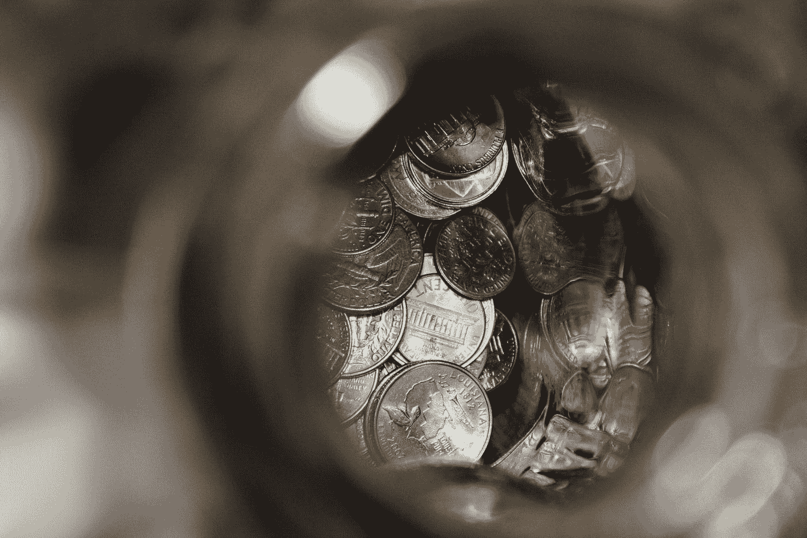
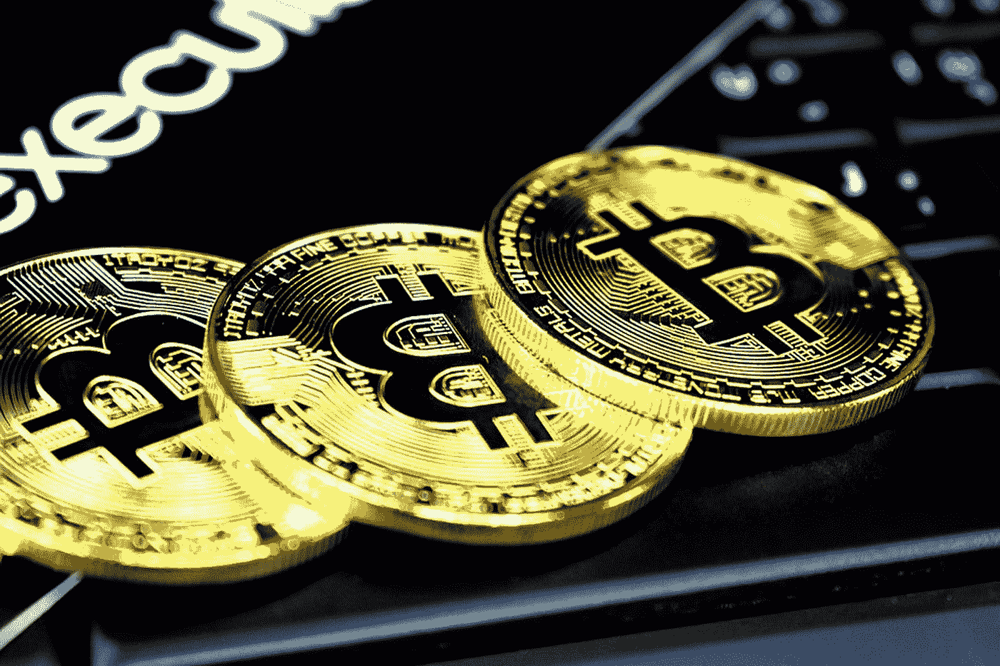

# 分权金融:未来还是闹剧？

> 原文：<https://medium.datadriveninvestor.com/decentralized-finance-future-or-farce-8faa5b087c3b?source=collection_archive---------7----------------------->

Photo by [Eric Muhr](https://unsplash.com/@ericmuhr?utm_source=medium&utm_medium=referral) on [Unsplash](https://unsplash.com?utm_source=medium&utm_medium=referral)

分散金融，如果你真的缺少资金，通常被称为 DeFi，是一种不依赖于银行等中央监管系统的金融形式。它在整个 21 世纪变得越来越有名，但很多人似乎不明白 DeFi 到底是什么。

迄今为止，DeFi 最著名的例子是比特币。一种[加密货币](https://www.datadriveninvestor.com/glossary/cryptocurrency/)于 2009 年问世(0.1 版本)，此后价值暴涨，催生了多名密码百万富翁。但比特币既不是唯一的加密货币，也不是唯一的 DeFi 形式。是时候让我们投入到这场新运动中，看看这是否是我们的未来。

 [## 外汇投资如何帮助偿还债务|数据驱动的投资者

### 外汇是对外汇市场的投资，不同国家的货币在外汇市场上进行兑换

www.datadriveninvestor.com](https://www.datadriveninvestor.com/2019/02/13/how-forex-investment-helps-to-repay-your-debts/) 

# 什么是分权金融？

好了，让我们深入研究一下:什么是 DeFi？DeFi 是一种[点对点](https://www.datadriveninvestor.com/glossary/peer-to-peer/)电子金融工具系统，指的是使用加密令牌和区块链*使任何人都能发行、转让和拥有金融工具的项目。当阅读谈论 DeFi 的文章时，每当提到金融工具、数字资产、资产或金融资产(或这些词的任何其他组合)时，所指的是反映一个值的[令牌](https://www.datadriveninvestor.com/glossary/token/)。用更简单的语言来说:钱。

DeFi 变得更容易理解，因为它本质上只是建立在区块链基础上的传统金融工具。最知名的[公众区块链](https://www.datadriveninvestor.com/glossary/public-blockchain/)是[以太坊](https://www.datadriveninvestor.com/glossary/ethereum/)。但是大多数人又陷入了困境，因为大多数人不知道什么是区块链。

[区块链](https://www.datadriveninvestor.com/glossary/blockchain/)是一个系统，在这个系统中，用[比特币](https://www.datadriveninvestor.com/glossary/bitcoin/)或另一种加密货币进行的交易记录被保存在几台连接在一个点对点网络中的计算机上。在本文中，当我们说“[块](https://www.datadriveninvestor.com/glossary/block/)和“链”时，我们实际上是在谈论存储在公共数据库(“链”)中的数字信息(“块”)。区块链上的区块是由数字信息组成的。具体来说，它们有三个部分:关于交易的信息，如日期、时间、金额和供应商，关于购买者的信息(您的数字签名或用户名)以及该信息的唯一标识符代码，称为“哈希”。

对于随后移动到链的块，事务必须已经发生，并且其信息需要被验证。谁在验证这个？不是一个超负荷工作的人，而是一个计算机网络在做这件事。这些网络通常由遍布全球的数千台(或者就比特币而言，[约 500 万台](https://www.jbs.cam.ac.uk/faculty-research/centres/alternative-finance/publications/global-cryptocurrency/#.W1xv4NgzZ-U))电脑组成。电脑网络会迅速检查你的交易是否如你所说的那样发生了。他们确认购买的细节，包括交易的时间、金额和参与者。从那里，你的信息是好的去，并成为一个更大的块与其他验证交易的一部分。最后，这个更大的块获得了自己的“散列”，并且该信息在链上公开。Tadaa！

因此，实际上，这就像给潘多拉手镯增加了魅力。谢天谢地，你不需要有学位就能理解其中的逻辑。如果你需要更多关于区块链的信息，Investopedia 有一整篇文章专门介绍它，我推荐你在这里阅读。

我们现在已经找到了驱动 DeFi 的技术，但这还不够。接下来，我们将了解 DeFi 的目标以及您如何自己使用它。我们将主要在后一部分深入探讨加密货币。

# 去中心化金融想要什么？

DeFi 创立的初衷是拒绝当前的金融体系。尤其是区块链就是抱着这个想法创立的，早在 1991 年。

当比较区块链(及其加密货币)和标准货币时，差异变得相当明显。像美元这样的货币由中央机构监管和验证，通常是银行或政府。在这种类型的系统下，用户的数据和货币在技术上由他们的银行或政府随意支配。如果一家银行倒闭，或者该国政府不稳定，该国货币的价值可能会受到威胁。这些都是导致比特币产生的担忧。

Photo by [Clifford Photography](https://unsplash.com/@cliffordgatewood?utm_source=medium&utm_medium=referral) on [Unsplash](https://unsplash.com?utm_source=medium&utm_medium=referral)

通过将业务分散到一个计算机网络，区块链允许比特币和其他加密货币在不需要这样的中央机构的情况下运行。这不仅降低了风险，还消除了许多处理和交易费用。这也给那些货币不稳定的国家带来了更稳定的货币，有了更多的应用和更广泛的个人和机构网络，他们可以在国内和国际上做生意。

所有这些听起来都很棒，但迄今为止，这只是一个正在实施的计划。虽然全球可访问性和使用是一个伟大的目标，但这是迄今为止的全部目标。亚马逊、易贝等大型在线零售商以及任何形式的在线杂货零售都还没有接受这种货币。尽管随着脸书天秤座的出现，可能会有相当大的变化。我以前写过一篇关于天秤座的文章，请务必在这里阅读。

# 分散财务能做什么？

现在我们称这个系统为分散的原因似乎很清楚，它不依赖于中央权威。酷，酷。但作为消费者，这对你意味着什么呢？嗯，你接触 DeFi 的主要途径是通过加密货币，最著名的是比特币，但也有很多其他可用的。与“正常”货币相比，使用加密会导致发行、交易和所有权方面的巨大差异:

## 发布

在“正常”的金融体系中，银行或政府发行货币，并可以用它来改变货币的价值。通常，这被用来改变[汇率](https://www.datadriveninvestor.com/glossary/exchange/)，改善出口(产品变得比其他国家更便宜)和促进国内生产(进口产品变得更贵)。分散金融没有单一的货币发行者，所以这个过程有点不同。

加密是公开挖掘的。这意味着任何人都可以创建它。然而，这并不意味着没有特定的标准可以遵循。有几个安全令牌发行平台，著名的例子是 [Polymath](https://blockonomi.com/polymath-guide/) 和 [Harbor](https://harbor.com/) ，它们为发行者在区块链上发行令牌化证券(加密)提供框架、工具和资源。他们为证券准备自己的标准化代币合约，以实现自动化合规和可定制的交易参数，从而满足监管要求。类似地，它们与服务提供商(如经纪自营商、托管人、法律实体等)集成在一起，以在发行方的流程中提供帮助。

现在，如果你在想:“酷，让我们去[挖掘](https://www.datadriveninvestor.com/glossary/mining/)一些密码吧！”我有坏消息要告诉你。它需要相当大的计算能力。描绘一幅画面:你不再需要打开家里的暖气，你的电费会因为开采 0.01%的加密货币而飙升。这就是问题所在。

## 交易和价值

现在，假设你有一些加密货币(开采或购买)，现在怎么办？可以交换(交易)用它买东西。我们开车去吧。

当交易加密，你会遇到一些问题。市场不像道琼斯指数这样的“正常”资产市场那样开放。[在 DeFi 中交换](https://www.datadriveninvestor.com/glossary/exchange/)，或者开放金融，即使你将使用分散交换(DEX)协议和点对点( [P2P](https://www.datadriveninvestor.com/glossary/peer-to-peer/) )市场。DEX 是一种点对点的资产交换，没有第三方中介。但是，这些地方相当模糊，它们的用户界面不是为胆小的人准备的(一点也不友好)，所以交易量到目前为止还不是很大，这在很大程度上仍在开发中。

现在一种最近变得更加流行的东西被称为稳定币。稳定银行正在提出发行代币、审计其储备和管理其价格挂钩的新模式。后者对于价值的确定非常有意义。稳定货币只是区块链发行的代币，旨在与外部资产——主要是美元——保持稳定挂钩，但也可以与黄金或其他资产挂钩。资产与什么挂钩取决于发行(和创建)T2 硬币的协议。现在，如果你想要 DeFi，stablecoins 可能看起来相当违反直觉，因为它们看起来不像最初打算的那样分散。但是，并非所有的 stablecoins 都是相同的，实际上有三种不同的类别:

1.  加密抵押:对于这种类型的稳定证券，根据当前的抵押比率，基础资产的抵押额高于贷款资产的抵押额。因此，如果比率是 150%，那么存入价值 150 美元的基础资产将会得到 100 美元的贷款资产。这就像一个由协议决定的汇率一样有效。这种协议的一个例子是制造商戴。
2.  法定抵押:这些稳定的硬币是最受欢迎的。这些硬币依赖于用户的信任，通过提供透明的审计，他们的美元储备可以支持当前流通的代币供应，以维持价格挂钩。它们消除了基于区块链的公开加密货币的优势，并增加了一层风险，因为这些稳定货币背后的公司从用户存入银行账户的存款(美元)利息中赚取收入。如前所述，它们的价值是固定的，通常与美元的比率为 1:1，它们是最不分散的加密类型。
3.  非抵押贷款:这些稳定的货币依赖于供给的变化，这种变化基于一种算法来维持稳定的钉住汇率。这些是最分散的类型，最接近 DeFi 的最初理想。

Photo by [rupixen.com](https://unsplash.com/@rupixen?utm_source=medium&utm_medium=referral) on [Unsplash](https://unsplash.com?utm_source=medium&utm_medium=referral)

记住这些差异，很难说加密货币的价值是什么，因为它取决于它的抵押品。一些依赖于其他资产(其他密码，或美元，黄金等。)，其他的纯粹是供给型的。当然，这使得交易变得更加困难，我们甚至还没有开始用密码来交换实际的商品或服务。我们将在本文的第二部分做一些事情。

## 所有权和公开贷款

开放贷款协议可能比任何其他类型的 DeFi 更受关注。主要由于 Dai 和其他 P2P 协议(如 [Dharma](https://www.dharma.io/) )以及流动性池设计(如[复合金融](https://compound.finance/))的使用迅速增加，分散式贷款正在产生重大影响。

这种形式的贷款如此受欢迎是有原因的:与传统信贷结构相比，它有许多优势:

1.  与数字资产借出/借入的集成
2.  数字资产抵押
3.  即时交易结算和新的担保贷款方法
4.  没有信用检查，这意味着无法利用传统服务的人可以获得更广泛的服务
5.  标准化和互操作性—还可以通过自动化降低成本

因此，它有效地更快，更便宜，并不排除你访问它取决于你的信用评分。对很多人来说，后者是一种解脱。

开放协议借贷完全局限于区块链，如以太坊，并且对在全球范围内扩大金融包容性有一些有趣的长期影响。MakerDAO 是最著名的分散式贷款协议，变得如此受欢迎，以至于很难维持与 Dai: USD 挂钩的平价。所以，这很有趣…

还有其他利用数字资产的贷款服务，如 BlockFi，其中使用了标准的信用模型，如信用检查和在幕后处理贷款请求的公司。所以，似乎总有一条中间道路，即使是 DeFi。

许多 DeFi 应用程序已经注意到，对于许多人来说，满 100 有点多，并提供混合数字资产/传统金融服务。 [BlockFi](https://blockfi.com/) 就是一个例子。另一个更能涵盖当前对金融产品的关注的术语是开放金融(而非分散金融)，其中集成数字资产、区块链和开放协议的生态系统正在迎合传统的金融结构。这似乎是下一个大动作，因为现在是银行成长并走向未来的时候了，否则未来将会得到它们。

对我来说就是这样。这篇文章，至少是第 1 部分，已经对什么是去中心化金融，它如何工作，它想要什么，以及你如何自己实现它给出了一个更一般的解释。

通常，我对自己撰写和发表的文章和建议很有信心，但在这篇文章中，我要声明:我不是这方面的专家，绝对不是。在进入定义、区块链和加密的世界之前，请确保自己查阅一些资源，我在这里选择了一些，来自我在本文中使用的来源，如 Blockonomi、 [Investopedia](https://www.investopedia.com/terms/b/blockchain.asp) 和 [Outlier Ventures](https://outlierventures.io/research/mapping-decentralised-finance-defi/) 。但也请寻找超越的资源。

在本文的第二部分，我们将探讨 DeFi 对当前金融体系的影响，我们已经看到的 DeFi 到目前为止所取得的成就(并讨论它并不那么好的名声)，当然还会深入研究行为科学对 DeFi 的看法。敬请关注！

*原载于 2019 年 10 月 30 日*[*https://www.datadriveninvestor.com*](https://www.datadriveninvestor.com/2019/10/30/decentralized-finance-future-or-farce/)*。*