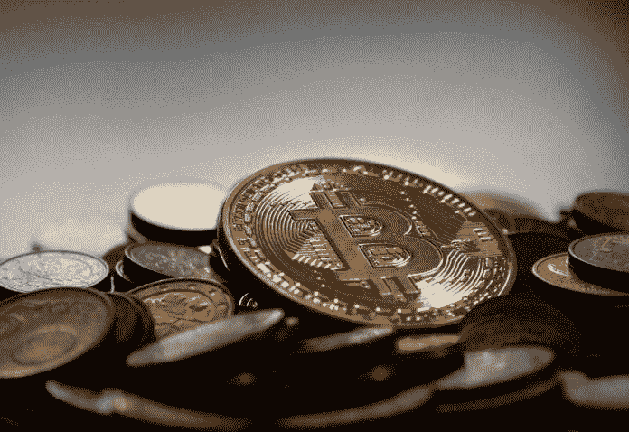

# 分散金融第 2 部分:行为科学视角

> 原文：<https://medium.datadriveninvestor.com/decentralized-finance-part-2-the-behavioral-science-perspective-1156403872b8?source=collection_archive---------11----------------------->

分散金融(DeFi)正在掀起波澜，其几种(加密)货币、平台和协议在新闻和其他形式的主流媒体中越来越突出。我受到了发表在彭博上的一篇关于“加密反叛者”的文章的启发，这篇文章深入探讨了这个话题。在第一篇文章中，就我的理解，我列出了 DeFi 是什么，想要什么，做什么。在这篇文章中，迷你系列的第二部分，我们将看看我们所看到的 DeFi 到目前为止所取得的成就，并讨论它并不那么好的名声，当然，也将探究行为科学对 DeFi 的看法。最终还是要搞清楚未来是不是去中心化！

# 成就很多，问题更多。

到目前为止，我们还不能说[分权](https://www.datadriveninvestor.com/glossary/decentralization/)已经接管。至少不是以加密货币的形式。这不是每个人都喜欢的东西。这主要由 3 个原因驱动:

 [## 外汇投资如何帮助偿还债务|数据驱动的投资者

### 外汇是对外汇市场的投资，不同国家的货币在外汇市场上进行兑换

www.datadriveninvestor.com](https://www.datadriveninvestor.com/2019/02/13/how-forex-investment-helps-to-repay-your-debts/) 

*先动优势*
这个优势的明显含义是:你要么是第一个，要么是最后一个。最先投资 crypto 的人，第一个著名的是[比特币](https://www.datadriveninvestor.com/glossary/bitcoin/)(没有卖掉或失去它们……)现在很富有。最初，这是一个噱头，一点点的乐趣，一个实验，然后它变成了严重的[硬币](https://www.datadriveninvestor.com/glossary/coin/)。我们都看过关于秘密百万富翁的故事。他们在炒作之前搬进来，然后炒作来了，他们兑现。对他们有好处。

但对你来说不太好。因为如果你现在才加入，那就太晚了。也许如果一种新的密码问世，你仍然可以获得一些利润，但是秘密已经泄露了，我的朋友。加密有明显的先发优势。

现在，即使是先行者也会犯错。我们都知道这样一个故事，某人的朋友的叔叔的兄弟两次搬家，他曾经拥有比特币，他们很早就便宜地买了比特币，然后用其中的 20 个买了一个披萨。他们对能够做到这一点感到非常高兴，因为这不是“真正的”钱。他们现在一定觉得自己有多蠢…

对加密一无所知？
另一个与密码有关的问题是，其底层流程如[【区块链】](https://www.datadriveninvestor.com/glossary/blockchain/)，是他们不容易理解的。对于理解金钱的人来说，这仍然很难理解。因为这和我们已经知道的太不一致了。当然，[采矿](https://www.datadriveninvestor.com/glossary/mining/)的钱可以比作中央银行印更多的钱。如果一种加密货币是固定的，我们也可以(在某种程度上)掌握它的价值。但那是大多数人在喝了三杯咖啡、一杯鸡尾酒和一个半小时的讲座后停下来的地方。但是要理解它，你需要深入得多。

在本系列的第一部分中，我谈到了所有权和借出协议。我把它写得很短，但是你可以很容易地写一本关于它的书。你可以写一整本关于密码的书，更不用说区块链了。所以技术很难。但让我们现实一点，我们知道如何操作电脑和智能手机，但我们真的不知道它们是如何工作的，我们似乎对此很满意。所以并不是技术理解阻碍了我们。不，加密可能不是这里的问题。正是权力下放带来的缺乏理解似乎把钉子钉进了棺材。

大多数人希望有一个权威(最好是没有面孔和声音的)来指导过程。说什么能做什么不能做。什么是合适的，什么是不合适的。最纯粹的去中心化金融没有人检查你的信用，也没有人发放贷款，但后者是通过加密完成的。人们秘密地借钱给其他人。最纯粹的密码是建立在信任的基础上的。对一个经历过危机的人来说，对金融体系的信任可能要求过高。跳入深海也有点过了。

我们所看到的结果是开放金融的发展。一种金融形式，其中有信用检查，有协议来保持和满足某些标准。这种形式的金融希望与我们熟知的“正常”金融相结合。我认为它可能真的有机会。但稍后会详细介绍。

你的名声不好！
又一天又一桩丑闻。好吧，也许没有那么激烈，但加密货币被用于购买非法商品和服务的消息肯定对 DeFi 的声誉没有好处。

crypto 之所以叫 crypto 是有原因的，它来源于加密。这就是与您的交易相关的信息。你掌握着这些信息的钥匙，只有你能打开它(除非你被黑客攻击)。这是加密和区块链的最大优势之一，你的信息被加密了。但这正是它被用于非法活动的原因。

现在，如果你不太了解 crypto、区块链或 DeFi，也没有积极地去做相关的研究，这可能就是你所知道的全部。关于大规模非法活动的故事，如所有加密用户，是有新闻价值的。Crypto 有机会在大众媒体上大放异彩，并像弹药一样被用来支付…

这给我们留下了什么？嗯，有点乱。一方面，我们有充满希望的极端主义者(不是那种极端主义者……)，他们希望看到旧的金融世界被烧毁，为他们的错误、明目张胆的勒索付出代价，并创造一个金融自由和平等的新世界。但这是失败的。这是失败的，因为当涉及到金融时，人们想要某种形式的权威，某种形式的保护，尽管如此，旧的系统(银行之类的)仍然代表着这一点。我们需要实物(纸币)。我们理解。我们知道银行应该对它有好处。剩下的就有点过分了。还有密码？嗯，只是有点噱头。支持武器和毒品交易的危险花招。这是给罪犯的硬币！一些大书呆子运气不错。那不是我们。

# 分散金融的行为科学

Crypto 正在尝试。DeFi 正在尝试。我很感激。但是从行为科学的角度来看，基于我之前讨论的三个主题，这里有一些问题。然而，不仅仅是问题，还有乐观，甚至可能是一些有用的提示。让我们深入研究一下。

我应该提到，我以前写过关于加密货币的行为科学:我指的是我关于 [Libra](https://www.moneyonthemind.org/post/behavioural-economics-on-libra) 的文章，我觉得我应该在继续之前讨论一下。我那篇关于天秤座的文章非常愤怒，而且(非常)公开地提出了批评。主要原因是我不是脸书的粉丝，我更相信扎克伯格至少有 16 个备选议程，但没有一个关注我的幸福。对于其他实际的去中心化加密货币(因为 Libra 根本没有去中心化)，我目前还没有做出判断，但我持谨慎乐观的态度。我确实认为金融系统早就应该彻底改革了，因为中央当局(通常是银行)似乎把我们视为产品而不是 T2 的客户，从我们身上赚钱而不是帮助我们管理它。然而，我最大的问题在于:经过几十年的研究和生活，我们并不真正理解我们当前的金融体系到底发生了什么。创建并可能集成一个全新的系统是解决方案吗？或者一个快速的解决方案导致同样的问题，几年后呢？

很难理解区块链和大多数加密货币的事实对此没有帮助。实际上，很难将密码视为真实的货币。现在，这可能会导致天秤座文章中概述的过多问题。这可能意味着，相对于其他支付方式，我们把它当作游戏钱，不要把它当回事，超支了。

我确实认为有一个相当简单的解决办法:让每个供应商都接受它作为一种货币，并在某种程度上将其挂钩，这样它的价值就变得清晰了。因此，我们可以用密码来表达我们重视的产品，这就变成了一种更具体的货币形式。但这种受监管的接受需要中央监管，这不是 DeFi 背后的最初想法。这似乎是当前 DeFi 参与者之间的分歧:是整合还是终止当前的金融体系。这就是去中心化和开放式财务的区别。

另一个问题是目前与区块链和加密相关的炒作。一小群人成功地从中赚钱，有些人甚至因此成为百万富翁。这听起来像生活！但问题是，一旦这些资产的价值下降，你的百万富翁地位也会下降(非常像股票市场)。由于[交易所](https://www.datadriveninvestor.com/glossary/exchange/)的选择有限(出售大量密码会立即导致其价值暴跌，你需要持有相当多的密码才能成为百万富翁)，并且对密码是什么以及如何正确运行的理解有限，这确实会导致一些问题。部分原因是有限的理解导致了炒作。但这并不是一个明智的投资理由……随着长岛冰茶股份有限公司(Long Island Iced Tea Corp .)最近更名为 Long [Blockchain](https://www.datadriveninvestor.com/glossary/blockchain/) Corp .，受新的股票需求推动，其股价上涨了 289%。这应该会告诉你你需要知道的一切。

为了让密码发挥作用，它需要被正确地视为货币。这将是由权威驱动的事情。从行为科学的角度来看，我们需要的不是 DeFi，我们还没有准备好。我们没有那么革命。我们尝试了一下，但是在我们真正游泳之前还需要大量的划水。我认为 DeFi 将很好地将自己转变为开放金融，整合到当前的系统中，并从内部改变它们。

# 未来是去中心化的吗？

我觉得，通过上一段，我已经回答了这个问题。到目前为止，我们面对的是明确的:新的钱，我们不知道如何感知，与一个令人难以置信的坏或噱头的声誉。很酷，但这有可能成为未来吗？

我们目前正处于权力下放的早期阶段。为此，我们要感谢一场危机。人们已经对“正常”系统失去了信心，并开始反对它。很好。动手吧！而有些聪明的人已经走得比踢更远了；他们开始创造、编码和挖掘。他们创造了一些新的东西，在旧机构的废墟上崛起。

当我们审视银行和其他金融机构的职能时，它们最初的作用早已不复存在。他们不再是我们钱的保管人了。通常它们是我们货币问题的根源。Crypto 和 DeFi 作为一个整体正在侵蚀这个系统的基础，对此我只能鼓掌。但是，这是一个我们知道的系统。我们只知道这些。因此，如果未来是开放的，而不是分散的，我不会感到惊讶。

另一件需要记住的事情是，技术正在大步向前发展。我们不仅有越来越强大的计算机(更快的交易和采矿！)但是同样的能力可以用来在解密时变得更快(取消[加密](https://www.datadriveninvestor.com/glossary/encryption/))。这对区块链来说不是好消息，因为它的主要资产是加密技术。

这对 DeFi 的影响仍不明朗。这有可能会赶走玷污 crypto 声誉的非法购买活动。把一切都公开。信息将被公开，但这实际上与我们现在的系统没有什么不同。它可能会把 crypto 放在更亮的地方，使它对其他人显得更友好。

解密也可能破坏整个加密的吸引力，它可能会产生一个更加难以理解的加密版本。谁知道呢？有一件事是肯定的，只要技术会发展，区块链也会发展，加密技术也会发展，因此，DeFi 也会发展。这可能是我们所希望的进化。或者至少是它的第一版。

这种技术发展的另一个方面是它来得相当突然和相当快。人们需要一些时间来适应它。35 岁以下的每一代人都非常精通技术。我们将熟悉更新的技术，并学会理解它们。长期接触会有帮助。教育甚至可能会介入其中。归根结底，这都是为了适应当前的世界。

未来是光明的，我的思想是开放的。我只是不确定金融体系是否也会如此。

*原载于 2019 年 11 月 4 日*[*【https://www.datadriveninvestor.com】*](https://www.datadriveninvestor.com/2019/11/04/decentralized-finance-part-2-the-behavioral-science-perspective/)*。*