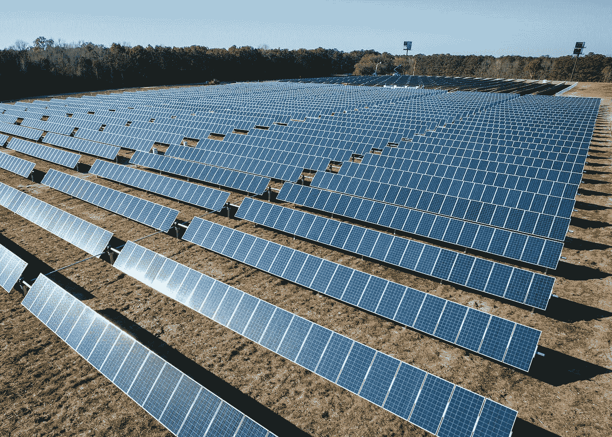

# 使用区块链技术的分散式太阳能

> 原文：<https://medium.datadriveninvestor.com/decentralized-solar-using-blockchain-technology-60629d64f6de?source=collection_archive---------12----------------------->

(第 4 部分，共 4 部分)

# 区块链中的分布式账本

原始纸质总账的数字化形成了一个更好的会计平台。分布式分类账是用先进的加密技术和其他算法创建的。它们代表由网络中的每个参与者独立访问和更新的数据库，而不受中央节点的控制。网络中的每个节点处理每笔交易，做出结论并传递信息，以确保所有其他节点对结论达成共识，之后分类账被更新。

换句话说，分布式分类账可以被描述为以分散的形式保存在不同地点的人之间的所有交易和协议的记录，而不需要中央方来防止对记录的任何操纵。由于分布式分类帐是分散的，它们不会受到网络攻击，因为它们使用加密技术来防止未经授权的访问。

 [## 2019 年十大区块链课程|数据驱动的投资者

### 渴望在区块链发展吗？你想知道区块链是如何工作的，但不知道在哪里？或者就是太多了…

www.datadriveninvestor.com](https://www.datadriveninvestor.com/2019/03/08/top-10-blockchain-courses/) 

# 开发用于货币支付的加密货币

大多数现存的区块链都有自己的代币，这些代币是通过铸造过程获得的。然后它们被引入区块链系统作为交换手段。代币来源于系统效用，即加密货币系统向用户提供有用和独特的特征，吸引投资，从而升值。随着系统用户数量的增加，令牌的效用也增加，因为它现在可以在多方之间进行交易。[需求也增长，代币价值升值](https://papers.ssrn.com/sol3/papers.cfm?abstract_id=3084011)。

铸造加密货币的过程应该控制货币的需求和供应。这一过程应该向公众开放。在区块链技术中，这个过程类似于交易的处理。

开发货币代币的另一种方法是通过侧链。通过这种方式，为基于许可的区块链系统开发了加密货币，该系统支持双向联合钉住，这可以允许以一种以上的加密货币进行交易，因此使得用户能够在任何本地货币代币上进行交易，而不需要铸造过程。

也可以通过使用国家货币购买证券来开发货币代币。这是当今数字支付中最常做的事情。例如，PayPal 向其用户账户存入等量资金，并转移到其内部系统。取款时，用户通过银行等传统支付系统获得支付。这种由中央银行支持的货币的好例子包括英格兰银行支持的 RSCoin 和 WAVES，WAVES 试图为中央银行和机构提供数字货币解决方案。通过中央银行获得的货币代币的优势在于它们能够保值，并降低用户使用其他加密货币的风险。

加密货币也可以通过跨链 DvP 生成，其中交易方在两个分类账中都持有账户。由两个区块链网络上的分布式分类帐提供的托管服务支持[点对点交易](https://papers.ssrn.com/sol3/papers.cfm?abstract_id=3084011)。

# 那么，太阳能+区块链？

太阳能行业存在巨大的机会。区块链技术在支持公共资源池的概念中起着纽带的作用。它模仿了社区太阳能项目的管理平台，使低收入社区能够方便地获得更多的太阳能选择。它实现了对等交互，以共同追求一个共同的目标，确保每一方都获得足够的能量，并且当多余的能量被交易到系统中时，没有未使用的能量。

区块链为能源贸易面临的问题提供了解决方案。它增强了安全性，提高了效率，促进了创新。由于区块链技术的可靠性、有效性和附加值，越来越多的公司倡导采用该技术。区块链技术有潜力塑造能源供应的未来。它在金融部门的应用已经达到成熟阶段，这是其他经济部门可以效仿的条件。区块链采用的资产联合使用促进了共享经济和分权组织的创建。

总的来说，从客户的角度来看，区块链技术显示出很大的潜力，应该通过市场参与来进一步发展。为了实现最佳性能，区块链技术必须改进到这样一个阶段，智能合同可以作为自主实体运行，依靠它们自己的法律来增加去中心化和分布式模型。

第一部分 | [第二部分](https://medium.com/datadriveninvestor/decentralized-solar-using-blockchain-technology-751e424439b4?source=friends_link&sk=2bd24176d130b2821d2376c42cb8063b) | [第三部分](https://medium.com/fullstacked/decentralized-solar-using-blockchain-technology-ee6a120b9da5?source=friends_link&sk=4d2a0fecd846181e7984f18e0f213a63) | **第四部分**