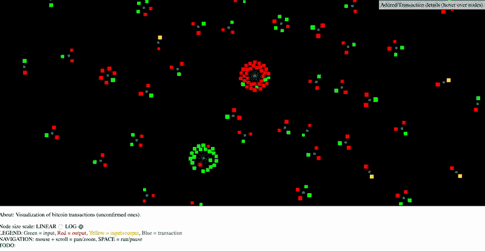

# 使用区块链技术的分散式太阳能

> 原文：<https://medium.datadriveninvestor.com/decentralized-solar-using-blockchain-technology-6ab718ba8925?source=collection_archive---------3----------------------->

*A view of the* [*Gulf of Mexico*](https://images.unsplash.com/photo-1451187580459-43490279c0fa?ixlib=rb-1.2.1&ixid=eyJhcHBfaWQiOjEyMDd9&auto=format&fit=crop&w=1952&q=80)*.*

## (第 1 部分，共 4 部分)

最初，传统的能源交易模式是从垄断的能源生产到被动的能源消费者的非常集中的单向流动。然而，随着太阳能住宅、电池存储、智能电表、电动汽车和物联网设备越来越受欢迎，能源行业正在快速发展。这些来自使能技术的未来趋势正在提供更多的**灵活性、可见性和控制。**因此，随着行业转向能源共享生态系统，人们质疑传统能源模式是否合适。

*Technology trends are reflecting a distributed network.*

这项研究提出了如何通过引入透明且不可变的数据库来鼓励分布式对等交互，从而将区块链技术应用于能源基础设施。通过以太坊智能合约，这个网络可以与计算逻辑相关联，并可以作为自治实体运行，最终塑造能源供应的未来。

> **随着行业向能源共享生态系统发展，传统能源模式是否合适？**

 [## 2019 年成为主流的 7 大区块链挑战及更多...数据驱动的投资者

### 教训是永远不要停止学习和成长。关于技术、金融、工作场所、生产力和…

www.datadriveninvestor.com](https://www.datadriveninvestor.com/2019/03/25/top-7-blockchain-challenges-to-go-mainstream-in-2019-more/) 

阻止小规模消费者进入太阳能行业的一个大问题是最初的前期存款。一些法规甚至要求供应商拥有大于 5000 kW 的发电机，根据位置的不同，这可能至少需要 1000 万美元。因此，大多数社会经济地位低下的人无法从这些太阳能转换系统中受益。这引入了一个社区太阳能项目的临时解决方案，在该方案中，消费者可以作为利益相关者，在他们的同行中分担成本和利益。虽然这确实暂时缓解了社会经济可及性问题，但社区太阳能模仿了一种相当分散的模式。为了让太阳能部门反映出真正的分布式模式，需要一个点对点的互动网络。

# 区块链

区块链本质上是一个透明的分布式和去中心化的账本。这项技术不断发展，如今被越来越多的行业采用，因为它实现了新的商业模式，为通过互联网进行价值交易创造了各种媒介。区块链技术在能源领域的应用是与能源生产、交易和分配相关的交易的数字化。区块链技术通过互联网提供了多种设备的互联，为每个参与的人提供了影响整个系统的平等机会。区块链基础设施内共享的信息不是由单一实体控制的。相反，所有连接的实体都可以访问它，并对其进行加密以防止修改，从而允许透明地记录交易和其他形式的数据。这项技术允许分类帐分布进行非集中管理的数字交易。

Real-time transactions with Bitcoin can be seen through: [http://dailyblockchain.github.io/](http://dailyblockchain.github.io/)

从一开始，区块链就以比特币加密货币背后的技术起家。能源行业的数字化和扩展增加了灵活性，并为智能系统打开了大门。特别是，太阳能部门可以采用点对点的太阳能买卖方式，使用户能够进行太阳能交易，并评估他们的生产和消费决策。因此，区块链技术有潜力创造一个全新的集成网络，从根本上不同于目前的交易模式。

# 区块链上更智能的能源电网

区块链可以更好地解决行业数据管理中遇到的问题。为了跟踪生产的能源数量，政府已经采用了利用贸易证书的系统。最好通过使用区块链系统来管理此类证书。[区块链在太阳能交易的记录证书上保持不变的日志，这使得数据管理不干扰其他商业活动](https://www.semanticscholar.org/paper/A-blockchain-based-smart-grid%3A-towards-sustainable-Mengelkamp-Notheisen/57d6de06108aab568915c1590b2fc114947cd35c)。

这在能源行业至关重要，因为能源生产商和消费者通过电网联网，共享数据。发电厂的仪表生成提交给系统注册提供商的数据日志电子表格，从而创建证书。这些证书的买卖是由中介方进行的。这导致了高昂的交易成本、会计差错的空间，以及偶尔不可信的中介。将电能表和逆变器直接连接到区块链上，通过灌输一个没有中间环节的订单簿，可以消除大多数此类问题。虽然这可以说明一个不可替代商品的市场，但这仍然可以类似地用能源交易来表示。能源生产商将列出所生产的能源的数量和价格，而能源消费者可以选择接受或拒绝投标。当协议被满足时，能量交易将被履行。

由于系统效率低下和持续的集中式发电厂，发电商在获得分布式能源付款时会遇到延迟。区块链支付是即时的，因为能源的生产者和消费者在点对点网络中相连。小区里的邻居之间可以买卖电力，而不需要先把电子卖给电网。在能源领域使用区块链技术还将使政府能够跟踪太阳能等清洁能源产生的能量。这是可悲的跟踪能源证书，这是采用区块链技术的巨大潜力之一。网格上的交易可以通过区块链运行来验证，而不会干扰正常的业务活动。

**第一部** | [第二部](https://medium.com/@simonbalean/decentralized-solar-using-blockchain-technology-751e424439b4?sk=2bd24176d130b2821d2376c42cb8063b) | [第三部](https://medium.com/fullstacked/decentralized-solar-using-blockchain-technology-ee6a120b9da5?source=friends_link&sk=4d2a0fecd846181e7984f18e0f213a63) |第四部