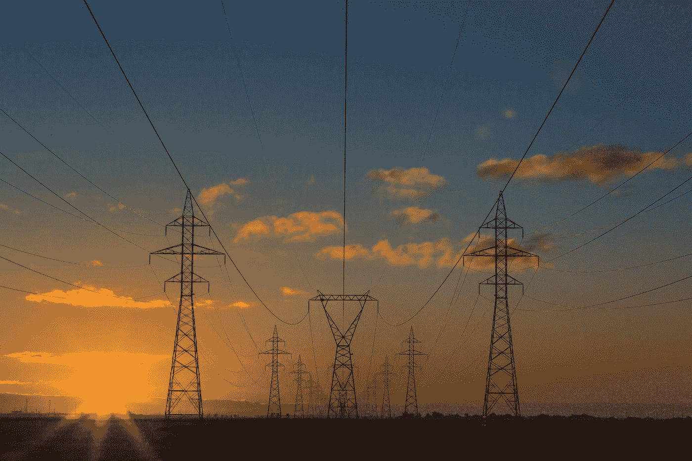
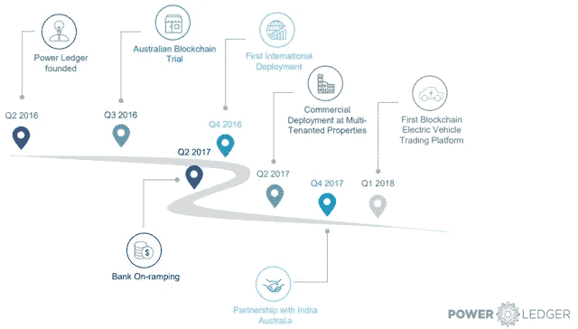

# 使用区块链技术的分散式太阳能

> 原文：<https://medium.datadriveninvestor.com/decentralized-solar-using-blockchain-technology-751e424439b4?source=collection_archive---------2----------------------->

[Transmission towers in the sunset](https://images.unsplash.com/photo-1473341304170-971dccb5ac1e?ixlib=rb-1.2.1&auto=format&fit=crop&w=1950&q=80)

(第二部分，共四部分)

# 点对点能源交易模式

家庭住宅中快速增长的太阳能装置导致了能源“消费者”的增加，即生产和消耗电力的家庭设备。为了利用这一趋势，点对点交易平台已经推出，以实现太阳能装置产生的能量的买卖。

太阳能领域已经提出了许多区块链应用案例。点对点(P2P)电力交易模式被视为最佳选择，因为它有助于小规模发电商将多余的电力出售给其他用户。[该平台基于以太坊区块链技术，方便会员之间的交易](https://www.sciencedirect.com/science/article/pii/S1876610217308007?via%3Dihub)。

 [## 创新提醒:区块链 3.0、Terra 协议、ICO 门户和更多|数据驱动的投资者

### 尽管过去几个月加密货币的价格波动很小，但这项技术并没有停止发展…

www.datadriveninvestor.com](https://www.datadriveninvestor.com/2019/03/16/innovation-alert-blockchain-3-0-terra-protocol-an-ico-portal-more/) 

P2P 区块链模型上的分布式数据库模拟新的电网，以适应新的市场架构。区块链为分布式能源的安装提供了显著的优势。这在使电网提供的实时定价响应服务与实时相位控制系统同步以平衡电网与分配和市场操作系统的操作方面是有用的。它通过整合电力的物理和金融方面，允许透明和负责任的能源系统。

社区太阳能设计呼吁个人走到一起，共同追求使用太阳能作为能源的共同目标。联合意向群体智能体(JIGA)使个体能够集体追求他们的目标。在 unity 中，一个社区能够汇集个人的贡献来产生一个长期的资源。这个想法是社区太阳能系统的基础。[区块链技术对太阳能生产和使用中的公共互联有很大帮助](https://fenix.tecnico.ulisboa.pt/downloadFile/3779572278229/Optimised%20model%20for%20community-based%20hybridsyestem_NLP.pdf)。

最初，这里有一个中央配电站。随着区块链技术的出现，更容易发展成一个分散的电力系统，使能源消费者不仅可以使用电网的电力，还可以为电网的能源量做出贡献。区块链因其各种优势而吸引企业。它使用分布式数据库，这是分散在整个网络，因此没有一个中心点，可以作为黑客等攻击者的目标。

# 区块链能源项目

区块链技术利用了分布式账本技术(DLT)，这是一种将新交易的信息添加到以前记录中的系统，形成了一个连续的信息链。它采用数字货币的概念来渗透到金融领域，并使用加密技术来保护系统中的数据。区块链技术中采用的这些概念可以应用于能源部门以提高效率。该网络是分散的，不需要第三方，并使用加密货币结算支付。区块链项目利用智能合约加快交易处理速度，不需要信用证。

区块链为日益增长的能源需求和经常性的电力短缺和停电提供了解决方案。许多项目已经到位，以探索区块链技术在遏制与[原始集中、依赖和低效电网系统](https://ieeexplore.ieee.org/document/8048842)相关的问题方面的应用。

## 网格加

该项目旨在通过使用“智能能源代理”，由网络的人工智能硬件授权，实现向能源世界的过渡。用户可以在家中使用这种硬件，帮助他们预测能源使用需求。硬件用于在价格最低时自动购买能源。“智能能源代理”进入各种能源市场，使用户能够在 15 分钟内做出购买决定。所有这些都是自动发生的，无需用户参与。

Grid +用户可以出售家中太阳能电池板产生的多余能量。用户还可以安全地储存产生的多余能量，在价格达到峰值时出售，并以最高利率获利。在 Grid+项目中，购买和销售能源的支付通过常用的 BOLT 令牌来实现。

## 电力分类帐

这是世界上第一个在能源贸易中使用区块链技术的平台。它在区块链的分布式点对点网络上运行，允许自动买卖家用太阳能电池板产生的能量。它的工作原理是自动检测太阳能电池板产生的多余能量，储存在电池中，然后将预定部分的能量出售给连接在电力网络中的邻居家。

电力分类帐网络中的交易使用其 POWR 令牌进行结算。更大比例的交易费用于供应房屋，而补救费用由公用事业公司和电力分类帐网络分担。

## 电子

这是英国的一个分散式区块链平台，旨在使用户能够在天然气和电力能源之间高效切换。现有计量系统中的电能表需要在区块链注册。这一升级将提高现有系统的效率。在英国，由于用户需要更多的时间在两种来源之间切换，缺乏天然气和电表的集中注册是一个挑战。

Electron 旨在通过向公用事业公司提供免费电表注册来减少转换所花费的时间，并为网络用户提供一个用于 P2P 能源交易的分散式区块链网络。

## 电子收费

该项目旨在实施区块链网络，连接欧洲和中东地区的电动汽车充电站。使用 eCharge 应用程序，用户将能够识别提供充电设施的酒店，使用最初的 eCharge 支付令牌 ECH 进行预订和支付。

eCharge 旨在增加该地区电动汽车充电站的数量，为其客户提供免费安装，以享受使用特权。这将有助于酒店向客户提供有价值的服务，而不会产生初装费。电动汽车市场有望在不久的将来大幅增长，因此需要充分利用电子充电项目的优势。一般来说，在能源领域采用区块链技术是许多利益相关者都接受的概念，包括大型能源公司，如英国能源公司和奥地利维恩能源公司。

第一部分 | **第二部分** | [第三部分](https://medium.com/fullstacked/decentralized-solar-using-blockchain-technology-ee6a120b9da5?source=friends_link&sk=4d2a0fecd846181e7984f18e0f213a63) | [第四部分](https://medium.com/@simonbalean/decentralized-solar-using-blockchain-technology-60629d64f6de?source=friends_link&sk=5167615c30f11a7593410f2e16545dd2)