# 决策树冒险 2 —决策树分类器参数解释

> 原文：<https://medium.datadriveninvestor.com/decision-tree-adventures-2-explanation-of-decision-tree-classifier-parameters-84776f39a28?source=collection_archive---------3----------------------->

[](http://www.track.datadriveninvestor.com/1B9E)

# **摘要**

决策树分类器模型参数在决策树冒险的第二本笔记中解释。调优不在本笔记本的讨论范围之内。本文中的模型是根据学生的特征(性别、种族/民族、父母的教育水平、午餐、备考课程)来预测学生在数学课堂上的成功。使用来自 kaggle 的学生表现数据集。源代码在:【https://github.com/haydarozler/decision_tree_adventures】

# 研究说明

本研究建立了 8 个决策树模型。

初始模型使用默认参数运行，没有任何调整，精度为 56%。

在从 2 到 7 的其他模型中，我只改变了一个参数，并观察了结果。从 2 到 7 每个模型使用的参数分别是 max_depth，min_samples_split，min_samples_leaf，max_leaf_nodes，Gini+min _ infinity _ decrease，entropy+min _ infinity _ decrease。已经针对每个参数的不同值运行了模型。重点是找到每个参数单独工作时的最佳值。

每个参数的最佳值使模型精度几乎达到同一点，68%。但是这些模型为我们产生了两个主要的树。其中一个大约有 5 个终端节点，另一个大约有 15 个。

模型 2、3、4 和 6(分别使用参数 max_depth、min_samples_split、min_samples_leaf、Gini+min _ infinity _ decrease)产生具有 14-20 个终端节点的较大的树。

模型 7(使用参数熵+最小杂质减少)产生具有 6 个终端节点的更小的树。

模型 5(使用参数 max_leaf_nodes)提出了两个备选方案。如果你看图“模型-5 精度(%) vs max_leaf_nodes 参数”，你会看到有 2 个峰值。在其中一个示例中，终端节点数为 4–5，而在另一个示例中，终端节点数为 14。

模型 8 是本次研究的最终模型，我们必须决定使用哪些参数和值。我更喜欢较小的树，我的投票是使用熵进行杂质计算，模型 7 的最佳值用于最小杂质减少，模型 4 的最佳值用于最小样本叶。以下是我解释原因的几点:

*   很可能较小的树具有较低的方差。请注意，应该计算方差，并且这个决定应该基于这些计算。
*   我支持在决策树模型中使用最小杂质减少，因为你可以确定，只有当有杂质改进的空间时，树才会生长。这是有意义的。
*   我认为使用带有最小杂质减少的最小样本叶是一个很好的支持参数。因为即使有进一步发展的空间，它也会在某个点上停下来，不让你有一个由很少样本组成的终端节点树。

在这项研究中，我只应用了预修剪技术，只检查了准确性。当然，我们可以通过后剪枝和交叉验证技术达到更好的结果。当然，准确性不是我们需要检查的唯一结果。我将在接下来的文章中讨论这些问题。

# 为建模准备数据

```
import pandas as pd
import seaborn as sns
import matplotlib.pyplot as plt
from sklearn import preprocessing
from sklearn.tree import DecisionTreeClassifier
from sklearn.model_selection import train_test_split
from sklearn.metrics import accuracy_score, confusion_matrix, classification_report
from sklearn import tree
import graphviz 
import numpy as np
from sklearn.externals.six import StringIO  
from IPython.display import Image  
from sklearn.tree import export_graphviz
import pydotplusdataset = pd.read_csv("StudentsPerformance.csv")dataset["math grade"] = ""
dataset.loc[(dataset["math score"] >= 60), "math grade"] = "Pass"
dataset.loc[(dataset["math score"] < 60), "math grade"] = "Fail"
dataset.drop(columns=['math score', 'reading score', 'writing score'], inplace=True)one_hot = pd.get_dummies(dataset['gender'], prefix='gender', drop_first=True)
dataset = dataset.join(one_hot)
one_hot = pd.get_dummies(dataset['race/ethnicity'], prefix='race/ethnicity', drop_first=True)
dataset = dataset.join(one_hot)
one_hot = pd.get_dummies(dataset['parental level of education'], prefix='parental level of education', drop_first=True)
dataset = dataset.join(one_hot)
one_hot = pd.get_dummies(dataset['lunch'], prefix='lunch', drop_first=True)
dataset = dataset.join(one_hot)
one_hot = pd.get_dummies(dataset['test preparation course'], prefix='test preparation course', drop_first=True)
dataset = dataset.join(one_hot)data_train, data_test_hold = train_test_split(dataset, test_size=0.30, random_state=21)
data_test, data_hold = train_test_split(data_test_hold, test_size=0.33, random_state=21)columns_move = ["gender", "race/ethnicity", "parental level of education", "lunch", "test preparation course", "gender_male", "race/ethnicity_group B", "race/ethnicity_group C", "race/ethnicity_group D", "race/ethnicity_group E", "parental level of education_bachelor's degree", "parental level of education_high school", "parental level of education_master's degree", "parental level of education_some college", "parental level of education_some high school", "lunch_standard", "test preparation course_none"]y_train = data_train["math grade"].values
X_train = data_train[columns_move].values
y_test = data_test["math grade"].values
X_test = data_test[columns_move].values
```

# 建立初始模型，无需调整

```
model = DecisionTreeClassifier(criterion='gini', splitter='best', 
                 max_depth=None, min_samples_split=2, 
                 min_samples_leaf=1, min_weight_fraction_leaf=0.0, 
                 max_features=None, random_state=None, 
                 max_leaf_nodes=None, min_impurity_decrease=0.0, 
                 min_impurity_split=None, class_weight=None, 
                 presort=False)model.fit(X_train[:,5:], y_train)y_pred = model.predict(X_test[:,5:])
print("Model Accuracy: %.2f" % (accuracy_score(y_test,y_pred)*100), "%")dot_data = StringIO()
export_graphviz(model, out_file=dot_data,  
                filled=True, rounded=True,
                special_characters=True)
graph = pydotplus.graph_from_dot_data(dot_data.getvalue())  
Image(graph.create_png())OUTPUT:
Model Accuracy: 56.22 %
```

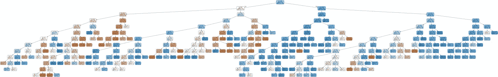

Tree of Model-1

# 关于初始模型的注释

模型是用该方法的默认参数建立的。这就是为什么当你把决策树和其他树比较时，它会很大。

同时又是过度拟合的例子。为了验证这一点，我使用训练数据进行了预测，准确率约为 80%，远远高于 56%。测试集的抛硬币准确率接近 56%，训练集的准确率接近 80%，这意味着过度拟合。

# 解释参数

## random_state : int，RandomState 实例或 None，可选(默认值=None)

我改了顺序，放在开头。如果你不希望在创建模型时有任何随机性，只需写下任何数字并一直使用它。在我们的例子中，我将写 21，并在所有的例子中保持它。

## 标准:字符串，可选(默认值="gini ")

可能的选项有“基尼”和“熵”。“基尼指数”和“交叉熵”都是表示节点纯度的值。当节点较纯时，基尼指数或交叉熵值较小，接近于零。只要该值减少到零或者没有其他参数阻止它，决策树算法就会拆分节点。现在，让我们继续基尼。

## 拆分器:字符串，可选(default="best ")

如果你有这么多的参数，如果你知道所有这些参数都与树相关，那么你可以选择“随机”来节省训练时间，但我相信大多数时候，甚至可能是所有时间，你会使用默认的，最好的。

## max_depth : int 或 None，可选(默认值=None)

树的最大深度。如果没有，则扩展节点，直到所有节点都是纯的，或者直到所有节点包含的样本少于 min_samples_split 样本。

# 建立模型-2

*   以最初的模型为例
*   设置 random_state=21(对所有模型都一样)
*   用 1 到 15 之间的不同数字设置 max _ depth，2，3，4，5，6，7，8，9，10，11，12，13，14，15]。

```
c_parameter_name = 'max_depth'
c_parameter_values = [1,2,3,4,5,6,7,8,9,10,11,12,13,14,15]
c_best_parameter = 0
c_best_accuracy = 0
c_worst_parameter = 0
c_worst_accuracy = 100df = pd.DataFrame(columns=[c_parameter_name, 'accuracy'])for input_parameter in c_parameter_values:
  model = DecisionTreeClassifier(criterion='gini', splitter='best', 
                   max_depth=input_parameter, min_samples_split=2, 
                   min_samples_leaf=1, min_weight_fraction_leaf=0.0, 
                   max_features=None, random_state=21, 
                   max_leaf_nodes=None, min_impurity_decrease=0.0, 
                   min_impurity_split=None, class_weight=None, 
                   presort=False)model.fit(X_train[:,5:], y_train)y_pred = model.predict(X_test[:,5:])

    acc_score = accuracy_score(y_test,y_pred)*100

    df = df.append({c_parameter_name : input_parameter , 'accuracy' : acc_score}, ignore_index=True)

    if acc_score > c_best_accuracy:
        c_best_accuracy = acc_score
        c_best_parameter = input_parameter
        c_best_model = model

    if acc_score < c_worst_accuracy:
        c_worst_accuracy = acc_score
        c_worst_parameter = input_parameter
        c_worst_model = model

print(df)
print("")plt.figure(figsize=(12,6))
sns.pointplot(x=c_parameter_name, y="accuracy", data=df)
title = 'Model-2 Accuracy(%) vs ' + c_parameter_name + ' parameter'
plt.title(title)
plt.xticks(rotation= 90)
plt.grid()OUTPUT:
max_depth   accuracy
0         1.0  64.179104
1         2.0  68.159204
2         3.0  67.164179
3         4.0  68.656716
4         5.0  65.671642
5         6.0  66.169154
6         7.0  63.681592
7         8.0  62.686567
8         9.0  63.681592
9        10.0  58.706468
10       11.0  57.711443
11       12.0  56.716418
12       13.0  56.716418
13       14.0  56.716418
14       15.0  56.716418
```

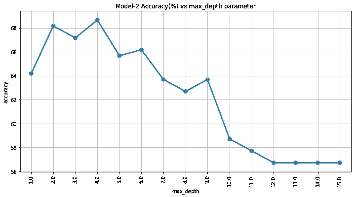

Model-2 Accuracy (y) vs max_depth (x)

```
print("BEST PERFORMANCE TREE,", c_parameter_name, "=", c_best_parameter, ", accuracy = %.2f" % (c_best_accuracy))
dot_data = StringIO()
export_graphviz(c_best_model, out_file=dot_data,  
                filled=True, rounded=True,
                special_characters=True)
graph = pydotplus.graph_from_dot_data(dot_data.getvalue())  
Image(graph.create_png())OUTPUT:
BEST PERFORMANCE TREE, max_depth = 4 , accuracy = 68.66
```

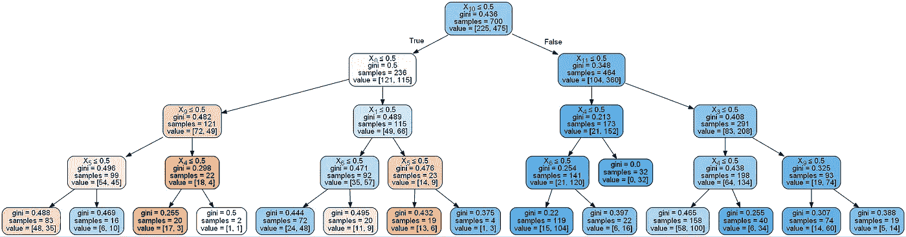

Best Tree of Model-2

```
print("WORST PERFORMANCE TREE,", c_parameter_name, "=", c_worst_parameter, ", accuracy = %.2f" % (c_worst_accuracy))
dot_data = StringIO()
export_graphviz(c_worst_model, out_file=dot_data,  
                filled=True, rounded=True,
                special_characters=True)
graph = pydotplus.graph_from_dot_data(dot_data.getvalue())  
Image(graph.create_png())
```

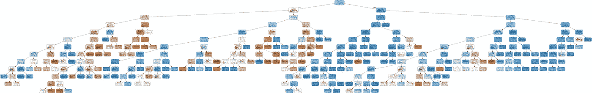

Worst Tree of Model-2

# 关于模型 2 的评论

当 max_depth=4 时，精度最高。此外，max_depth=2 或 max_depth=3 也具有更好的精度。很明显，在我们的例子中，不需要更深的树，深度在 2 到 4 之间的树足以做出更好的预测。

精度与 max_depth 图还告诉我们，预测精度随着深度的增加而降低。深度较低的模型比深度较高的模型具有更好的泛化能力。

我不太喜欢这个参数。它可以在还有很长一段路要走的地方砍树，它仍然是可分裂的。还有我比较喜欢的参数。我们很快就会见到他们。

对于我们的模型 2，我们选择 max_depth = 4，并继续其他参数。

# 解释参数

## min_samples_split : int，float，可选(默认值=2)

分割一个节点所需的最小样本数。如果该参数被设置为 20，并且如果一个节点包括小于 20 的样本，则意味着这是最后一个节点(这意味着终端节点或叶)，并且它不再是可分裂的。

# 建立模型-3

*   以最初的模型为例
*   设置 random_state=21
*   用从 5 到 400 的不同数字设置 min _ samples _ split，10，15，20，25，30，35，40，45，50，55，60，65，70，75，80，85，90，95，100，105，110，115，120，125，130，135，140，200，250，300，350，400

我们使用 min_samples_split 代替 max_depth。假设 min_samples_split=50，那么我们将观察到任何样本少于 50 的节点都不会分裂。因此，所有终端节点的样本数将小于 50，所有内部节点的样本数将大于 50(或等于 50)。

```
c_parameter_name = 'min_samples_split'
c_parameter_values = [5,10,15,20,25,30,35,40,45,50,55,60,65,70,75,80,85,90,95,
                       100,105,110,115,120,125,130,135,140,200,250,300,350,400]
c_best_parameter = 0
c_best_accuracy = 0
c_worst_parameter = 0
c_worst_accuracy = 100df = pd.DataFrame(columns=[c_parameter_name, 'accuracy'])for input_parameter in c_parameter_values:
    model = DecisionTreeClassifier(min_samples_split=input_parameter, random_state=21)model.fit(X_train[:,5:], y_train)y_pred = model.predict(X_test[:,5:])

    acc_score = accuracy_score(y_test,y_pred)*100

    df = df.append({c_parameter_name : input_parameter , 'accuracy' : acc_score}, ignore_index=True)

    if acc_score > c_best_accuracy:
        c_best_accuracy = acc_score
        c_best_parameter = input_parameter
        c_best_model = model

    if acc_score < c_worst_accuracy:
        c_worst_accuracy = acc_score
        c_worst_parameter = input_parameter
        c_worst_model = model

print(df)
print("")plt.figure(figsize=(12,6))
sns.pointplot(x=c_parameter_name, y="accuracy", data=df)
title = 'Model-3 Accuracy(%) vs ' + c_parameter_name + ' parameter'
plt.title(title)
plt.xticks(rotation= 90)
plt.grid()OUTPUT:
    min_samples_split   accuracy
0                 5.0  57.213930
1                10.0  57.711443
2                15.0  57.213930
3                20.0  59.203980
4                25.0  60.696517
5                30.0  61.194030
6                35.0  65.671642
7                40.0  67.164179
8                45.0  67.164179
9                50.0  67.164179
10               55.0  67.164179
11               60.0  67.164179
12               65.0  67.164179
13               70.0  67.164179
14               75.0  68.159204
15               80.0  68.159204
16               85.0  68.656716
17               90.0  68.656716
18               95.0  68.656716
19              100.0  67.164179
20              105.0  67.164179
21              110.0  67.164179
22              115.0  67.164179
23              120.0  68.159204
24              125.0  68.159204
25              130.0  68.159204
26              135.0  68.159204
27              140.0  68.159204
28              200.0  68.159204
29              250.0  64.179104
30              300.0  64.179104
31              350.0  64.179104
32              400.0  64.179104
```

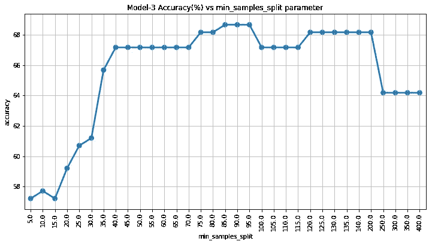

Model-3 Accuracy (y) vs min_samples_split (x)

```
print("BEST PERFORMANCE TREE,", c_parameter_name, "=", c_best_parameter, ", accuracy = %.2f" % (c_best_accuracy))
dot_data = StringIO()
export_graphviz(c_best_model, out_file=dot_data,  
                filled=True, rounded=True,
                special_characters=True)
graph = pydotplus.graph_from_dot_data(dot_data.getvalue())  
Image(graph.create_png())
```

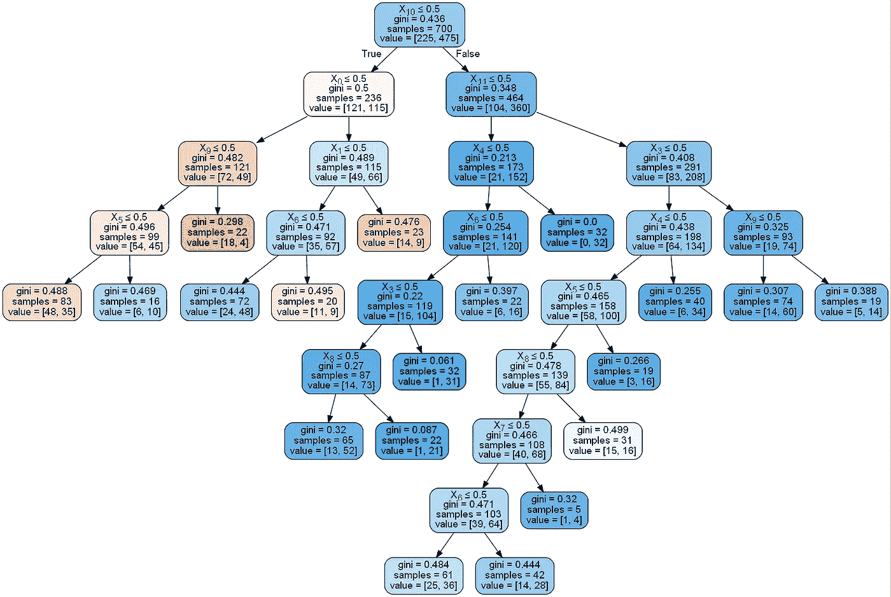

Best Tree of Model-3

```
print("WORST PERFORMANCE TREE,", c_parameter_name, "=", c_worst_parameter, ", accuracy = %.2f" % (c_worst_accuracy))
dot_data = StringIO()
export_graphviz(c_worst_model, out_file=dot_data,  
                filled=True, rounded=True,
                special_characters=True)
graph = pydotplus.graph_from_dot_data(dot_data.getvalue())  
Image(graph.create_png())
```

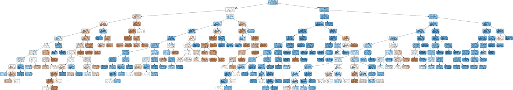

Worst Tree of Model-3

# 关于模型 3 的评论

我们已经用 min_samples_split 代替 max_depth 得到了类似的结果。

min_samples_split 的值介于 40 和 200 之间，看起来适用。值低于 40 时开始过度拟合，节点数增加，每个节点中的样本数减少。另一方面，过泛化在 200 之后开始，节点数量减少，并且每个节点中的样本数量增加。

对于我们的模型-3，我们选择 min_samples_split = 85，并继续其他参数。

# 解释参数

## min_samples_leaf : int，float，可选(默认值=1)

叶节点上所需的最小样本数。想象这样两种情况:在这两种情况下，min_samples_leaf 被设置为 5，我们的节点有 20 个样本。现在，模型将决定进一步拆分它，或者就此打住。在前一个参数 min_samples_split 中，这个决定是根据这两个信息做出的。但在这种情况下，首先我们必须尝试拆分，并查看左分支和右分支中的样本数。在第一种情况下，假设左边有 8 个样本，右边有 12 个样本。它们都大于 5，因此将进行这种分割。但是如果左是 4，右是 16，因为 4 小于 5，所以不会进行这种分裂，并且这种未分裂的节点将是终端节点(叶)。因为它的任何分支的样本数都不应少于该参数。

# 建立模型-4

*   以最初的模型为例。
*   设置 random_state=21
*   用 5 到 200 的不同数字设置 min _ samples _ leaf，10，15，20，25，30，35，40，45，50，55，60，65，70，75，80，85，90，95，100，150，200]。

轮到 min_samples_leaf 了。它应该提供与 min_samples_split 非常相似的结果。

```
c_parameter_name = 'min_samples_leaf'
c_parameter_values = [5,10,15,20,25,30,35,40,45,50,55,60,65,70,75,80,85,90,95,100,150,200]
c_best_parameter = 0
c_best_accuracy = 0
c_worst_parameter = 0
c_worst_accuracy = 100df = pd.DataFrame(columns=[c_parameter_name, 'accuracy'])for input_parameter in c_parameter_values:
    model = DecisionTreeClassifier(min_samples_leaf=input_parameter, random_state=21)model.fit(X_train[:,5:], y_train)y_pred = model.predict(X_test[:,5:])

    acc_score = accuracy_score(y_test,y_pred)*100

    df = df.append({c_parameter_name : input_parameter , 'accuracy' : acc_score}, ignore_index=True)

    if acc_score > c_best_accuracy:
        c_best_accuracy = acc_score
        c_best_parameter = input_parameter
        c_best_model = model

    if acc_score < c_worst_accuracy:
        c_worst_accuracy = acc_score
        c_worst_parameter = input_parameter
        c_worst_model = model

print(df)
print("")plt.figure(figsize=(12,6))
sns.pointplot(x=c_parameter_name, y="accuracy", data=df)
title = 'Model-4 Accuracy(%) vs ' + c_parameter_name + ' parameter'
plt.title(title)
plt.xticks(rotation= 90)
plt.grid()OUTPUT:
    min_samples_leaf   accuracy
0                5.0  57.213930
1               10.0  61.194030
2               15.0  64.676617
3               20.0  66.169154
4               25.0  66.169154
5               30.0  66.169154
6               35.0  68.159204
7               40.0  68.159204
8               45.0  68.159204
9               50.0  68.159204
10              55.0  68.159204
11              60.0  68.159204
12              65.0  68.159204
13              70.0  68.159204
14              75.0  68.159204
15              80.0  68.159204
16              85.0  68.159204
17              90.0  68.159204
18              95.0  68.159204
19             100.0  68.159204
20             150.0  64.179104
21             200.0  64.179104
```

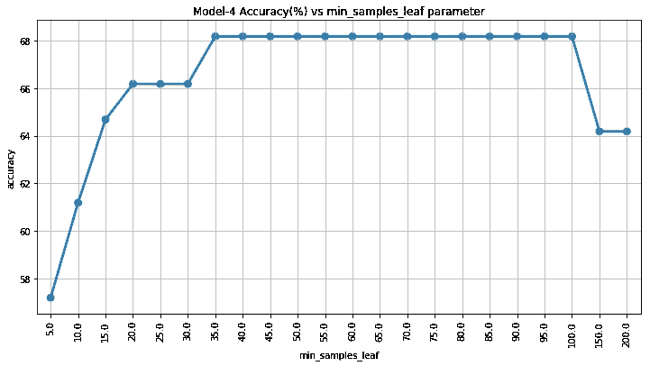

Model-4 Accuracy (y) vs min_samples_leaf (x)

```
print("BEST PERFORMANCE TREE,", c_parameter_name, "=", c_best_parameter, ", accuracy = %.2f" % (c_best_accuracy))
dot_data = StringIO()
export_graphviz(c_best_model, out_file=dot_data,  
                filled=True, rounded=True,
                special_characters=True)
graph = pydotplus.graph_from_dot_data(dot_data.getvalue())  
Image(graph.create_png())
```

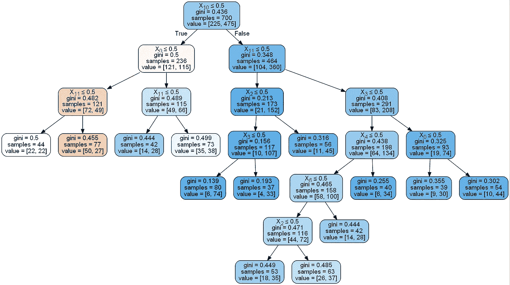

Best Tree of Model-4

```
print("WORST PERFORMANCE TREE,", c_parameter_name, "=", c_worst_parameter, ", accuracy = %.2f" % (c_worst_accuracy))
dot_data = StringIO()
export_graphviz(c_worst_model, out_file=dot_data,  
                filled=True, rounded=True,
                special_characters=True)
graph = pydotplus.graph_from_dot_data(dot_data.getvalue())  
Image(graph.create_png())
```

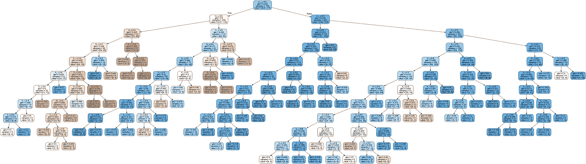

Worst Tree of Model-4

# 关于模型 4 的评论

没有大的区别。min_samples_leaf 的值介于 35 和 100 之间，看起来适用。

请注意，分裂是如何随这些参数变化的。正如您在 Model-3 中看到的，第三层左侧的节点有 121 个样本，使用特性 X9 将其拆分为 99 和 22。另一方面，在模型-4 中，由于 min_samples_leaf=35 > 22，它忽略 X9，并使用特征 X11 分割为 44 和 77。

对于模型 4，我们选择 min_samples_leaf = 35，然后继续其他参数。

# 解释参数

## min_weight_fraction_leaf : float，可选(默认值=0。)

要求位于叶节点的权重总和(所有输入样本)的最小加权分数。当未提供 sample_weight 时，样本具有相等的权重。这是一个有点棘手的参数，老实说，一开始很难理解。

想象一下这样一种情况，你有很多样本，你想使用所有的样本，但其中一些更可信，一些不可信。当然，您可以删除这些样本，但您并不想完全删除它们，您只是想在不太重要的时候使用它们。在这种情况下，在 fit 方法中，您必须给出 sample_weight 参数作为先决条件。否则，min_weight_fraction_leaf 参数将被忽略，没有任何警告。当给定 sample_weight 时，将设置输入样本的权重。然后在模型中，您可以知道不应该创建权重低于 min_weight_fraction_leaf 的叶子。

## max_features : int、float、string 或 None，可选(默认值=None)

Max_feature 是每次做出分割决策时要考虑的要素数量。假设数据的维数是 80，max_feature 是 20，每次你需要寻找分裂时，你随机选择 20 个特征并使用它们来决定 20 个特征中的哪一个是最好使用的。当你到下一个节点时，你将随机选择另外 20 个，以此类推。此外，即使你设置的数量为 20，如果你深入下去，你会结束使用所有的功能，但每次你限制设置为 20。

## max_leaf_nodes : int 或 None，可选(默认值=None)[](http://localhost:8888/notebooks/Documents/DataScience/Kaggle%20Competitions/Students%20Performance%20in%20Exams/Decision%20Tree%20Adventures%202%20-%20Explanation%20of%20Decision%20Tree%20Classifier%20Parameters.ipynb#max_leaf_nodes-:-int-or-None,-optional-(default=None))

树中终端节点(叶子)的总数。

# 建立模型-5

*   以最初的模型为例。
*   设置 random_state=21。
*   设置 2 到 20 个不同数量的 max _ leaf _ nodes，3，4，5，6，7，8，9，10，11，12，13，14，15，16，17，18，19，20]。

我们通过设置 max_leaf_nodes 将终端节点(叶子)的数量限制在一定的数量。在模型-4 中，终端节点的数量是 12。这给了我们一个想法。让我们看看会发生什么。

```
c_parameter_name = 'max_leaf_nodes'
c_parameter_values = [2,3,4,5,6,7,8,9,10,11,12,13,14,15,16,17,18,19,20]
c_best_parameter = 0
c_best_accuracy = 0
c_worst_parameter = 0
c_worst_accuracy = 100df = pd.DataFrame(columns=[c_parameter_name, 'accuracy'])for input_parameter in c_parameter_values:
    model = DecisionTreeClassifier(max_leaf_nodes=input_parameter, random_state=21)model.fit(X_train[:,5:], y_train)y_pred = model.predict(X_test[:,5:])

    acc_score = accuracy_score(y_test,y_pred)*100

    df = df.append({c_parameter_name : input_parameter , 'accuracy' : acc_score}, ignore_index=True)

    if acc_score > c_best_accuracy:
        c_best_accuracy = acc_score
        c_best_parameter = input_parameter
        c_best_model = model

    if acc_score < c_worst_accuracy:
        c_worst_accuracy = acc_score
        c_worst_parameter = input_parameter
        c_worst_model = model

print(df)
print("")plt.figure(figsize=(12,6))
sns.pointplot(x=c_parameter_name, y="accuracy", data=df)
title = 'Model-5 Accuracy(%) vs ' + c_parameter_name + ' parameter'
plt.title(title)
plt.xticks(rotation= 90)
plt.grid()OUTPUT:
    max_leaf_nodes   accuracy
0              2.0  64.179104
1              3.0  64.179104
2              4.0  68.159204
3              5.0  68.159204
4              6.0  67.164179
5              7.0  67.164179
6              8.0  67.164179
7              9.0  67.164179
8             10.0  67.164179
9             11.0  66.666667
10            12.0  66.666667
11            13.0  66.666667
12            14.0  68.159204
13            15.0  67.661692
14            16.0  67.164179
15            17.0  67.164179
16            18.0  67.164179
17            19.0  67.661692
18            20.0  67.661692
```

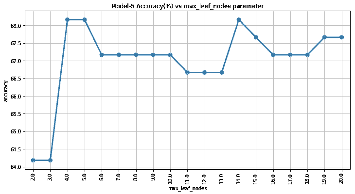

Model-5 Accuracy (y) vs max_leaf_nodes (x)

```
print("BEST PERFORMANCE TREE,", c_parameter_name, "=", c_best_parameter, ", accuracy = %.2f" % (c_best_accuracy))
dot_data = StringIO()
export_graphviz(c_best_model, out_file=dot_data,  
                filled=True, rounded=True,
                special_characters=True)
graph = pydotplus.graph_from_dot_data(dot_data.getvalue())  
Image(graph.create_png())
```

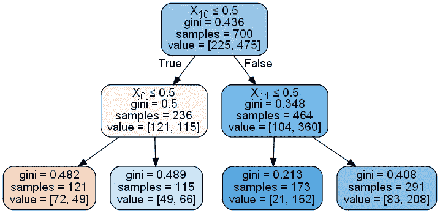

Best Tree of Model-5

# 关于模型 5 的评论

有两座小山。其中一个位于 max_leaf_nodes=4 或 5，另一个位于 max_leaf_nodes=14。

如果让你选一个，你会选哪个？我的选择是 max_leaf_nodes=4，因为它具有更强的泛化能力，并且有可能用新数据给出更好的结果。

这就是为什么我们选择 4 片叶子作为模型 5 的最佳模型。

我没有一次又一次地画最差的模型，因为树很深，所以它们一般都一样。

# 解释参数

## min _ infinity _ decrease:float，可选(默认值=0。)

我最喜欢的参数，最明智的一个。根据标准参数，基尼指数或交叉熵用于计算分裂的纯度。让我们举个例子:

我们正在创建一个模型，根据一个人的一些特征来发现他是否生病。在模型中有 100 个样本，在我们将决定是否分割的当前节点中，有 20 个样本，其中 12 个是，8 个不是

步骤 1:模型在任何分裂之前计算当前节点的纯度:

P(是)= 12 / 20 = 0.6 P(否)= 8 / 20 = 0.4 基尼系数= 0.6 x 0.4 + 0.4 x 0.6 = 0.48

步骤 2:通过使用可能的特征来分割该节点，并计算每个节点的基尼系数，并将其与先前的基尼系数进行比较。现在我们只做一个特色。假设如果我们通过使用其中一个特征来分割这个节点，在左分支中有 13 个样本(11 个是和 2 个否)，在右分支中有 7 个样本(1 个是和 6 个否)。

首先分别计算两个分支:

左支；P(是)= 11 / 13 = 0.85 P(否)= 2 / 13 = 0.15 基尼-指数-左= 0.85 x 0.15 + 0.15 x 0.85 = 0.255

右支；P(是)= 6 / 7 = 0.86 P(否)= 1 / 7 = 0.14 基尼系数-右= 0.86 x 0.14 + 0.14 x 0.86 = 0.241

基尼指数越接近零意味着节点越纯。在我们的例子中，新的分支节点比具有 20 个样本的原始节点更纯。

第三步:计算加权杂质减少量，以了解如果你成功完成分裂，你会得到多少更纯的节点。

N_t / N x(杂质— N_t_R / N_t x 右杂质— N_t_L / N_t x 左杂质)

其中 N 是样本总数，N_t 是当前节点的样本数，N_t_L 是左子节点的样本数，N_t_R 是右子节点的样本数。

20/100 x(0.48–7/20 x 0.241–13/20 x 0.255)= 0.046

步骤 4:在对所有特征进行计算并找到所有替代物的杂质减少量后，选择最大的一个并与最小杂质减少量进行比较。如果它大于 min _ infinity _ decrease，那么将进行这种拆分。

用这种计算方法评估每个分离方案，并选择最大的杂质减少量。如果设置了最小杂质减少，如果任何分割不能减少杂质超过最小杂质减少，树停止生长。这意味着没有必要分裂更多，因为你的节点不会更纯粹。那分裂的意义是什么？

这是我最喜欢的预修剪。它说只要有继续拆分的价值就继续拆分。我喜欢将它与 min_samples_leaf 一起使用，这样我可以告诉模型在有值时继续分裂，但不要在终端节点中减少到某个数字，因为否则我无法信任结果。

这个主题将在关于决策树机制的文章中详细解释。

# 建立模型-6

*   以最初的模型为例
*   设置 random_state=21
*   Set min _ 杂质 _ 减少=[0.00005，0.0001，0.0002，0.0005，0.001，0.0015，0.002，0.005，0.01]

现在我们将看到最小杂质减少的影响。

```
c_parameter_name = 'min_impurity_decrease'
c_parameter_values = [0.00005,0.0001,0.0002,0.0005,0.001,0.0015,0.002,0.005,0.01]
c_best_parameter = 0
c_best_accuracy = 0
c_worst_parameter = 0
c_worst_accuracy = 100df = pd.DataFrame(columns=[c_parameter_name, 'accuracy'])for input_parameter in c_parameter_values:
    model = DecisionTreeClassifier(min_impurity_decrease=input_parameter, random_state=21)model.fit(X_train[:,5:], y_train)y_pred = model.predict(X_test[:,5:])

    acc_score = accuracy_score(y_test,y_pred)*100

    df = df.append({c_parameter_name : input_parameter , 'accuracy' : acc_score}, ignore_index=True)

    if acc_score > c_best_accuracy:
        c_best_accuracy = acc_score
        c_best_parameter = input_parameter
        c_best_model = model

    if acc_score < c_worst_accuracy:
        c_worst_accuracy = acc_score
        c_worst_parameter = input_parameter
        c_worst_model = model

print(df)
print("")plt.figure(figsize=(12,6))
sns.pointplot(x=c_parameter_name, y="accuracy", data=df)
title = 'Model-6 Accuracy(%) vs ' + c_parameter_name + ' parameter'
plt.title(title)
plt.xticks(rotation= 90)
plt.grid()OUTPUT:
   min_impurity_decrease   accuracy
0                0.00005  55.721393
1                0.00010  56.218905
2                0.00020  60.696517
3                0.00050  65.671642
4                0.00100  67.164179
5                0.00150  67.661692
6                0.00200  66.666667
7                0.00500  64.179104
8                0.01000  64.179104
```

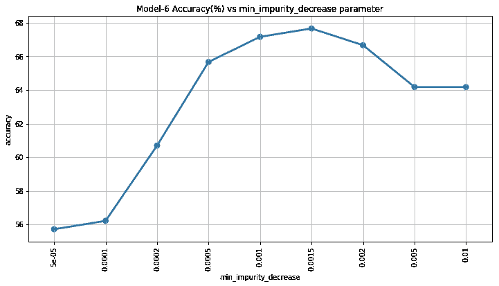

Model-6 Accuracy (y) vs min_impurity_decrease (x)

```
print("BEST PERFORMANCE TREE,", c_parameter_name, "=", c_best_parameter, ", accuracy = %.2f" % (c_best_accuracy))
dot_data = StringIO()
export_graphviz(c_best_model, out_file=dot_data,  
                filled=True, rounded=True,
                special_characters=True)
graph = pydotplus.graph_from_dot_data(dot_data.getvalue())  
Image(graph.create_png())
```

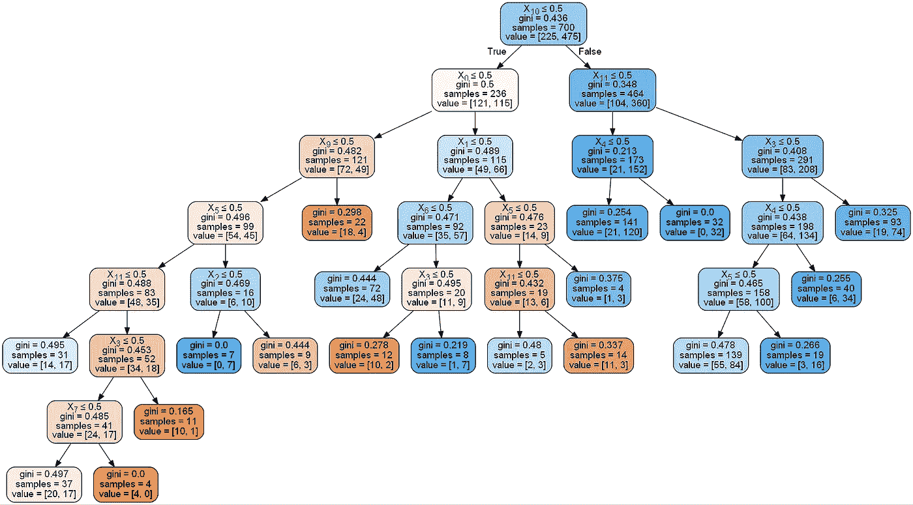

Best Tree of Model-6

# 关于模型 6 的评论

没有任何改善。另一方面，这比其他参数更可信，因为它仅在分割中有值时才分割。

对于我们的模型-6，我们选择最小杂质减少= 0.0015。我们还能做些什么？我们可以尝试用熵作为标准。

# 建立模型-7

*   以最初的模型为例
*   设置 random_state=21
*   集合标准= '熵'
*   Set min _ 杂质 _ 减少=[0.0005，0.001，0.002，0.005，0.01，0.02，0.05，0.1，0.15，0.2，0.4]

```
c_parameter_name = 'min_impurity_decrease'
c_parameter_values = [0.0005,0.001,0.002,0.005,0.01,0.02,0.05,0.1,0.15,0.2,0.4]
c_best_parameter = 0
c_best_accuracy = 0
c_worst_parameter = 0
c_worst_accuracy = 100df = pd.DataFrame(columns=[c_parameter_name, 'accuracy'])for input_parameter in c_parameter_values:
    model = DecisionTreeClassifier(criterion='entropy', min_impurity_decrease=input_parameter, random_state=21)model.fit(X_train[:,5:], y_train)y_pred = model.predict(X_test[:,5:])

    acc_score = accuracy_score(y_test,y_pred)*100

    df = df.append({c_parameter_name : input_parameter , 'accuracy' : acc_score}, ignore_index=True)

    if acc_score > c_best_accuracy:
        c_best_accuracy = acc_score
        c_best_parameter = input_parameter
        c_best_model = model

    if acc_score < c_worst_accuracy:
        c_worst_accuracy = acc_score
        c_worst_parameter = input_parameter
        c_worst_model = model

print(df)
print("")plt.figure(figsize=(12,6))
sns.pointplot(x=c_parameter_name, y="accuracy", data=df)
title = 'Model-7 Accuracy(%) vs ' + c_parameter_name + ' parameter'
plt.title(title)
plt.xticks(rotation= 90)
plt.grid()OUTPUT:
    min_impurity_decrease   accuracy
0                  0.0005  60.199005
1                  0.0010  65.174129
2                  0.0020  67.661692
3                  0.0050  68.159204
4                  0.0100  64.179104
5                  0.0200  64.179104
6                  0.0500  64.179104
7                  0.1000  66.169154
8                  0.1500  66.169154
9                  0.2000  66.169154
10                 0.4000  66.169154
```

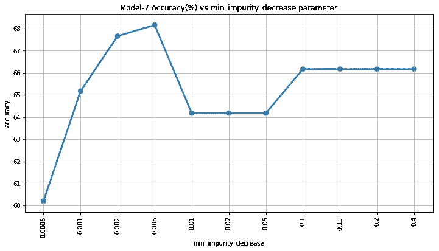

Model-7 Accuracy (y) vs min_impurity_decrease (x)

```
print("BEST PERFORMANCE TREE,", c_parameter_name, "=", c_best_parameter, ", accuracy = %.2f" % (c_best_accuracy))
dot_data = StringIO()
export_graphviz(c_best_model, out_file=dot_data,  
                filled=True, rounded=True,
                special_characters=True)
graph = pydotplus.graph_from_dot_data(dot_data.getvalue())  
Image(graph.create_png())
```

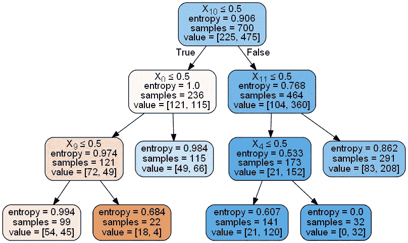

Best Tree of Model-7

# 关于模型 7 的评论

它给出了几乎相似的结果。

对于我们的模型-7，我们选择最小杂质减少= 0.005。

我们可以尝试最后一个模型，它可以结合我们在以前的模型中使用的一些参数。

# 解释参数

## min _ infinity _ split:float，(默认值=1e-7)

算了吧，已经弃用了。

## class_weight : dict，字典列表，“平衡”或无，缺省值=无

它用于给每个类赋予权重，并告诉哪个类值得更多的权重。class_weight='balanced '也可以工作，它只是根据每个类频率的比例自动调整权重。

此外，它可以在您试用您的模型时使用。不是添加或删除列，而是给类的权重赋予 0，您可以告诉模型忽略这个特性。

当我尝试“平衡”选项时，精确度下降。这意味着我们的类中的频率是不平衡的，通过设置为“平衡”来降低不太频繁的类的权重会破坏模型，这意味着不太频繁不会降低一个类在我们的数据和模型中的重要性。

## 预排序:bool，可选(默认值=False)

是否对数据进行预排序，以加快拟合中最佳分割的查找速度。对于大型数据集上决策树的默认设置，将此设置为 true 可能会减慢训练过程。当使用较小的数据集或受限的深度时，这可以加速训练。

# 建立模型-8

*   以最初的模型为例
*   设置 random_state=21
*   集合标准= '熵'
*   设置 min_samples_leaf=35
*   设置最小杂质减少=0.005

这是我们最后的型号。我在其他模型中只改变了一个参数，只是为了展示这个参数的效果。在最后一个例子中，让我们试着结合一些参数。由于熵比基尼系数给出更好的结果，我们可以选择熵来计算杂质。另外两个是我最喜欢的参数，最小样本叶和最小杂质减少。只有当有一个值增长更多(min _ infinity _ decrease)时，模型才会增长，并且它会在某个点停止，在该点，在一个终端节点(min_samples_leaf)中会有某个最小数量的样本。我从以前的模型中选择最佳参数值。

```
model = DecisionTreeClassifier(criterion='entropy', splitter='best', 
            max_depth=None, min_samples_split=2, 
            min_samples_leaf=35, min_weight_fraction_leaf=0.0, 
            max_features=None, random_state=21, 
            max_leaf_nodes=None, min_impurity_decrease=0.005, 
            min_impurity_split=None, class_weight=None, 
            presort=False)model.fit(X_train[:,5:], y_train)y_pred = model.predict(X_test[:,5:])
print("Model Accuracy: %.2f" % (accuracy_score(y_test,y_pred)*100), "%")dot_data = StringIO()
export_graphviz(model, out_file=dot_data,  
                filled=True, rounded=True,
                special_characters=True)
graph = pydotplus.graph_from_dot_data(dot_data.getvalue())  
Image(graph.create_png())OUTPUT:
Model Accuracy: 68.16 %
```


Tree of Model-8

# 关于模型 8 的评论

准确度没有提高。另一方面，我认为这个模型是一个稳定的通用模型(低方差)。