# 决策树算法及动手实例

> 原文：<https://medium.datadriveninvestor.com/decision-tree-algorithm-with-hands-on-example-e6c2afb40d38?source=collection_archive---------0----------------------->

决策树是最重要的机器学习算法之一。它用于分类和回归问题。在本文中，我们将讨论分类部分。

**什么是决策树？**

决策树是一种具有树状结构的分类和预测工具，其中每个内部节点表示对属性的测试，每个分支表示测试的结果，每个叶节点(终端节点)持有一个类别标签。

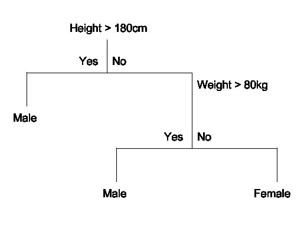

上面我们有一个小决策树。决策树的一个重要优势是它具有高度的可解释性。这里如果身高> 180cm 或者身高< 180cm and weight > 80kg 的人是男性。否则就是女性。你想过我们是如何想出这个决策树的吗？我将尝试用气象数据集来解释它。

在进一步讨论之前，我将解释一些与决策树相关的重要术语。

**熵**

在机器学习中，熵是对正在处理的信息的随机性的一种度量。熵越高，就越难从这些信息中得出任何结论。

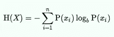

**信息增益**

信息增益可以定义为通过观察另一个随机变量获得的关于一个随机变量或信号的信息量。它可以被认为是父节点的熵和子节点的加权平均熵之差。

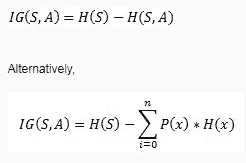

**基尼杂质**

Gini 杂质是一种度量，用于衡量从集合中随机选择的元素被错误标记的频率，前提是该元素是根据子集中的标签分布随机标记的。

基尼系数下限为 0 ，如果数据集只包含一个类别，则为 0。

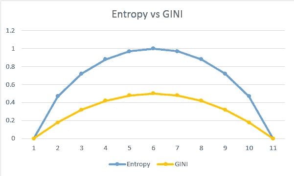

有很多算法可以建立决策树。他们是

1.  **CART** (分类和回归树)——这使用基尼系数作为衡量标准。
2.  **ID3** (迭代二分法 3)——这使用熵和信息增益作为度量。

在本文中，我将介绍 ID3。一旦你得到了它，就很容易使用 CART 实现同样的功能。

# **使用 ID3 算法分类**

考虑一个数据集，我们将根据它来决定是否踢足球。

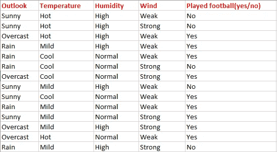

这里有因变量决定因变量。独立变量是天气、温度、湿度和风。因变量是是否踢足球。

作为第一步，我们必须找到决策树的父节点。对于以下步骤:

***求类变量的熵。***

e(S)=-[(9/14)log(9/14)+(5/14)log(5/14)]= 0.94

注意:在这里，我们通常将对数以 2 为底。总共有 14 个是/否，其中 9 个是，5 个否。在此基础上，我们计算了上面的概率。

从上述 outlook 数据中，我们可以很容易地得出下表

***现在我们要计算平均加权熵*** 。也就是说，我们已经找到了每个特征的总权重乘以概率。

E(S，outlook) = (5/14)*E(3，2) + (4/14)*E(4，0) + (5/14)*E(2，3)=(5/14)(-(3/5)log(3/5)-(2/5)log(2/5))+(4/14)(0)+(5/14)((2/5)log(2/5)-(3/5)log(3/5))= 0.693

***下一步是寻找信息增益*** 。就是我们上面找到的母熵和平均加权熵之差。

IG(S，展望)= 0.94 - 0.693 = 0.247

类似地，找到温度、湿度和风力的信息增益。

IG(S，温度)= 0.940 - 0.911 = 0.029

IG(S，湿度)= 0.940 - 0.788 = 0.152

IG(S，Windy) = 0.940 - 0.8932 = 0.048

***现在选择具有最大熵增益*** 的特征。这是展望。所以它形成了我们决策树的第一个节点(根节点)。

现在我们的数据如下

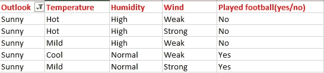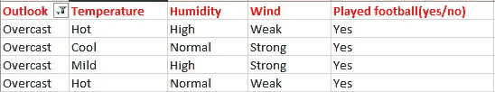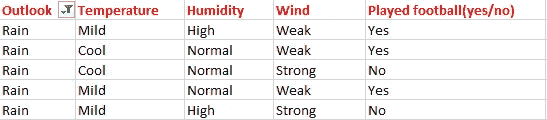

由于阴天只包含类“yes”的例子，我们可以将其设置为 Yes。这意味着如果天气不好，足球将会进行。现在我们的决策树看起来如下。

下一步是在我们的决策树中找到下一个节点。现在我们会在阳光底下找到一个。我们必须确定以下哪个温度、湿度或风具有更高的信息增益。

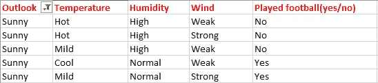

计算父熵 E(晴天)

e(晴天)=(-(3/5)log(3/5)-(2/5)log(2/5))= 0.971。

现在计算温度的信息增益。IG(晴天，温度)

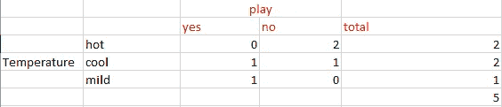

E(晴天，温度)= (2/5)*E(0，2) + (2/5)*E(1，1) + (1/5)*E(1，0)=2/5=0.4

现在计算信息增益。

IG(晴天，温度)= 0.971–0.4 = 0.571

类似地，我们得到

IG(晴天，湿度)= 0.971

IG(晴天，有风)= 0.020

这里 IG(晴天，湿度)是最大值。所以湿度是阳光下的节点。

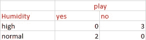

对于上表中的湿度，我们可以说，湿度正常时会发生游戏，湿度高时不会发生游戏。同理，求雨天下的节点。

***注意:熵大于 0 的分支需要进一步分裂。***

最后，我们的决策树将如下所示:

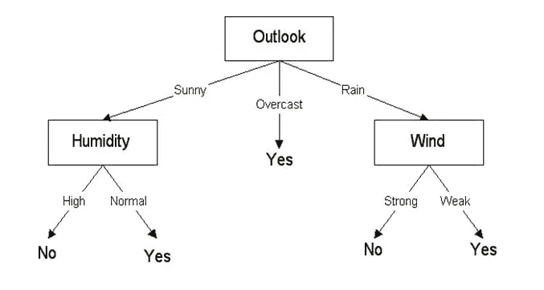

# 使用 CART 算法的分类

使用 CART 分类与之类似。但是我们用基尼系数来代替熵。

因此，作为第一步，我们将找到决策树的根节点。为了计算阶层变量的基尼系数

基尼系数(S) = 1 - [(9/14) + (5/14) ] = 0.4591

**下一步，我们将计算基尼系数。首先，我们将找到前景、温度、湿度和风平均加权基尼系数。**

首先，考虑前景的情况

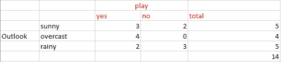

基尼(S，展望)= (5/14)基尼(3，2)+(4/14)*基尼(4，0)+(5/14)*基尼(2，3)=(5/14)(1-(3/5)-(2/5))+(4/14)* 0+(5/14)(1-(2/5)-(3/5))= 0.171+0+0.171 = 0.342

基尼系数(S，前景)= 0.459 - 0.342 = 0.117

基尼系数(S，温度)= 0.459 - 0.4405 = 0.0185

基尼系数(S，湿度)= 0.459 - 0.3674 = 0.0916

基尼系数(S，windy) = 0.459 - 0.4286 = 0.0304

选择一个基尼系数更高的。前景基尼系数上升。所以我们可以选择它作为我们的根节点。

现在你已经知道如何进一步发展了。重复我们在 ID3 算法中使用的相同步骤。

**决策树的优缺点**

优势:

1.  决策树非常容易理解
2.  几乎不需要数据预处理
3.  适合低延迟应用

缺点:

1.  更有可能过度拟合噪声数据。随着树变得更深，过度拟合噪声的概率增加。一个解决办法是**修剪**。你可以从我的 [***Kaggle 笔记本***](https://www.kaggle.com/arunmohan003/pruning-decision-trees) ***中了解更多关于修剪的内容。*** 另一种避免过度拟合的方法是使用类似随机森林的套袋技术。你可以从[***Neptune . ai***](https://neptune.ai/blog/random-forest-regression-when-does-it-fail-and-why)的一篇文章中阅读更多关于随机森林的内容。

**参考文献:**

*   [https://www.saedsayad.com/decision_tree.htm](https://www.saedsayad.com/decision_tree.htm)
*   应用人工智能课程