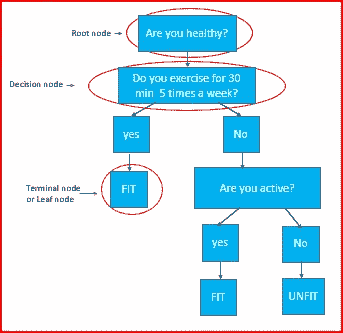
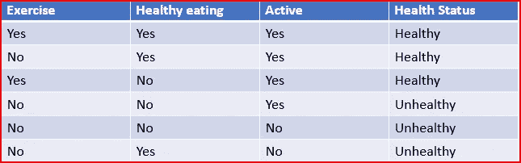
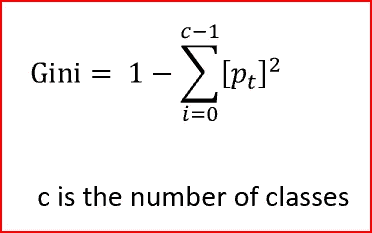
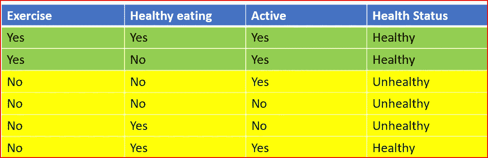
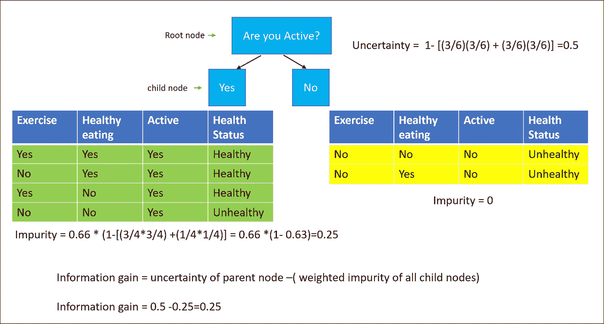
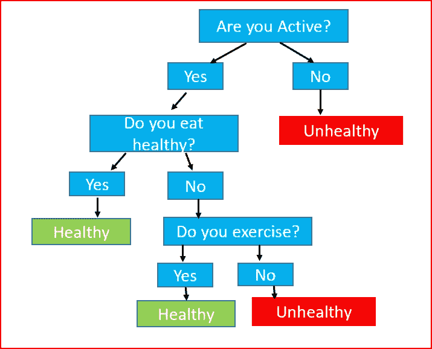

# 决策树和随机森林

> 原文：<https://medium.datadriveninvestor.com/decision-tree-and-random-forest-e174686dd9eb?source=collection_archive---------3----------------------->

在本文中，我们将了解什么是决策树，决策树是如何构建的，以及决策树的优点和缺点。什么是随机森林，它们如何提高决策树的预测能力。

先决条件:[机器学习](https://medium.com/datadriveninvestor/machine-learning-demystified-4b41c3a55c99)

Decision Tree and Random Forest

**T5 什么是决策树？**

决策树是一种受监督的非参数机器学习算法。用于分类和回归问题。

它是树状结构的图形表示，包含所有可能的解决方案。它有助于在特定条件下做出决定。

sample decision tree

***决策树是如何构建的？***

如何拆分的决策严重影响决策树的准确性。它根据可用的输入变量分割节点。选择产生最佳同质数据集的输入变量。

让我们以 12 个人为样本，根据输入特征将他们分为健康或不健康。

*   每周至少锻炼 5 次，每次 30 分钟
*   健康饮食
*   活跃的

Data for building decision tree

对于这个例子，我们将使用 CART 分类和回归树，它使用基尼指数(杂质测量)和信息增益指数来构建树。

***什么是基尼指数？***

基尼指数是节点纯度或杂质的量度。这是衡量随机选择的变量被错误分类的频率。

构建决策树时，我们想知道从什么问题开始比较合适。我们将数据集分为每周锻炼 5 次，每次 30 分钟以上的人群。接下来，我们随机选择一个实例，并想知道我们经常会误分类的概率。**这是基尼指数。**

Gini Index

让我们通过划分数据集来理解，人们每周至少锻炼 5 次，每次锻炼 30 分钟或以上。

我们对数据进行了重新排序，使得所有绿色行都是“练习”列为“是”的实例。黄色行是练习列为 no 的实例

当我们从绿色行中随机抽取一个实例时，我们永远不会分类错误，因为我们总是会得到正确的答案，即这个人是健康的。

计算绿色行的基尼系数

基尼= 1-[(2/2)*(2/2)]= 1–1 = 0

基尼值为 0 表示绿色数据集中的所有案例都属于同一类别。我们看到所有绿色行都在降级。据说数据是纯的，所以杂质为 0。

计算所有行的基尼系数，我们有一半数据集是健康的，另一半是不健康的

基尼= 1-[(3/6)*(3/6)+(3/6)*(3/6)]= 1-[0.25+0.25]= 1-. 5 = 0.5

***什么是信息增益？***

信息增益是起始节点的不确定性和两个子节点的加权杂质之间的差异。信息增益决定了应该使用哪个特征来分割数据。

为了构建决策树，我们用最纯粹的子节点分割特征。信息增益帮助我们找到减少不确定性的问题。

我们将首先分割具有最高信息增益的特征。这是一个递归过程，直到所有子节点都是纯的，或者直到信息增益为零。

在我们的例子中，基于最高的信息增益，最好的问题是“你是活跃的吗？”。这将是决策树的根。

information gain calculation

我们递归地不断寻找最佳问题，划分数据，寻找子节点的杂质，直到所有子节点都是纯的或者信息增益为零。

这是我们根据数据构建的最终决策树。

Final Decision Tree

## 决策树的优势

*   容易解读。直截了当的图形可视化是直观的，使任何人都容易理解
*   有助于识别最有助于预测的变量。它根据属性重要性进行拆分。
*   处理连续和分类目标属性。
*   在大型数据集上表现出色
*   一定程度上不受离群值和缺失值的影响。
*   非参数方法——对映射函数的形式做出假设。由于他们不做任何关于映射函数的假设，他们可以自由地学习数据中存在的任何函数形式
*   树可以处理定性输入变量，而不需要创建虚拟变量

## 决策树的缺点

*   决策树容易过度拟合
*   给出最优解，但不是全局最优解
*   与其他回归和分类模型相比，决策树不具有相同的预测准确性

我们使用另一种叫做随机森林的算法来克服决策树的缺点。

***什么是随机森林？***

假设你被要求估计罐子里有多少糖果。你需要在不打开罐子的情况下做这件事。

你可以让不同的人来帮你估计，然后如果你取所有不同估计的平均值，你将会非常接近实际的数字。

这正是随机森林的工作方式。随机森林提高了算法的预测能力，也有助于防止过度拟合。

随机森林是最简单也是应用最广泛的算法。用于分类和回归。它是随机决策树的集合。每个决策树为目标变量的预测投一票。随机森林选择得到最多投票的预测。

集成学习模型聚集了多个机器学习模型，以提供更好的性能。在随机森林中，我们使用多个随机决策树以获得更好的准确性。

随机森林是一种集成 bagging 算法，以实现低预测误差。它通过随机选择树来减少单个决策树的差异，然后对它们进行平均或者挑选得到最多投票的类。

*Bagging 是一种生成多个版本预测值的方法，以获得一个聚合预测值*

## 随机森林的优势

*   预测准确率高。
*   高效处理大型数据集
*   无需删除要素即可处理多个输入要素的能力
*   预测基于被认为对分类很重要的输入特征。
*   在缺少数据的情况下工作良好，仍能提供更好的预测准确性

## 随机森林的缺点

*   不容易解释
*   带有噪声分类或回归的随机森林过度拟合

## 参考资料:

[https://www . stat . Berkeley . edu/~ brei man/random forests/cc _ home . htm #概述](https://www.stat.berkeley.edu/~breiman/RandomForests/cc_home.htm#overview)

