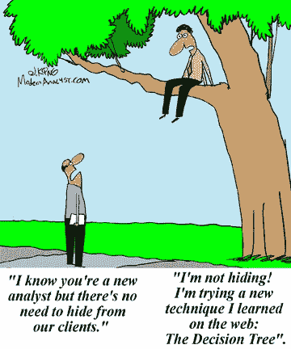
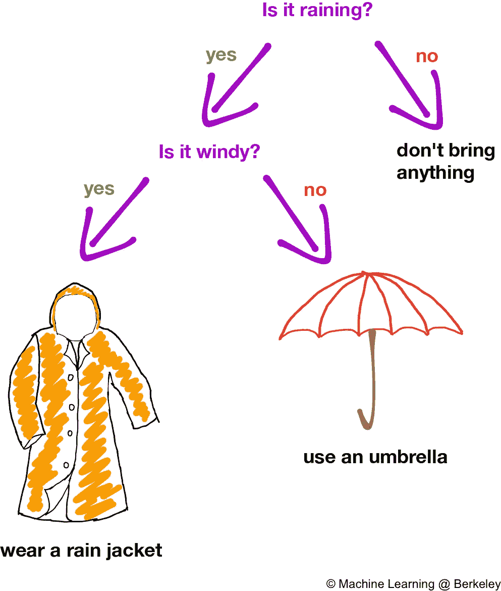
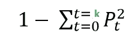
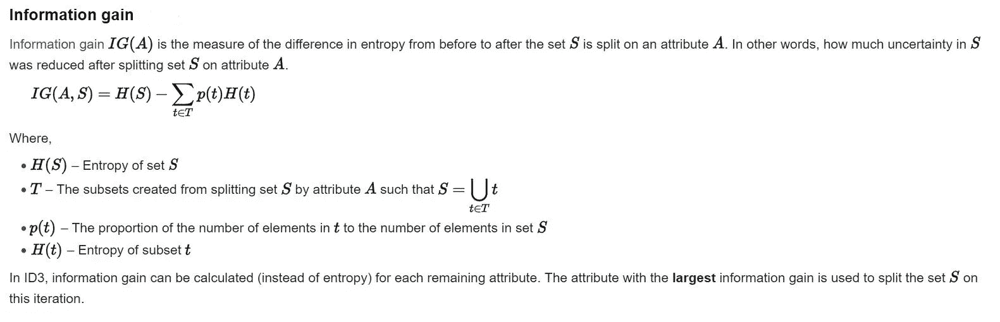
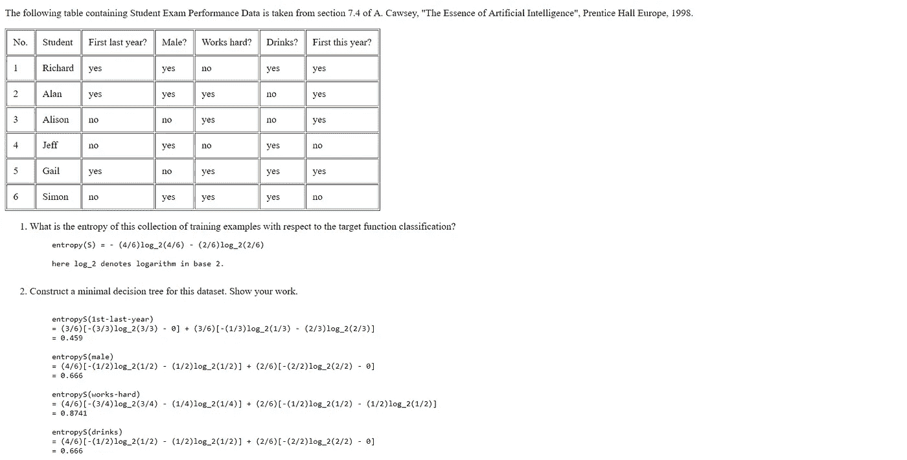
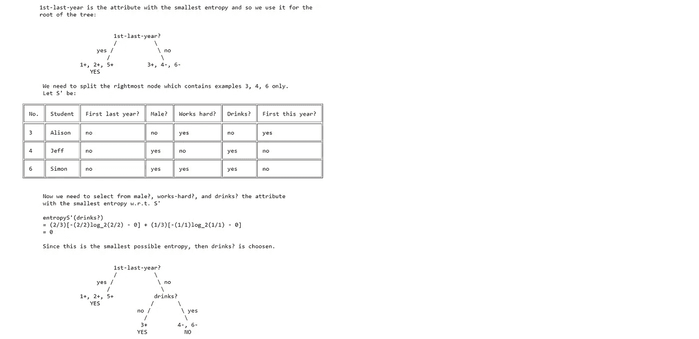

# 决策树

> 原文：<https://medium.datadriveninvestor.com/decision-trees-70ebfdce08e2?source=collection_archive---------3----------------------->

[https://www.quotemaster.org/images/s_92/92558cf82706fcb46a06dded0c687a7b.jpg](https://www.quotemaster.org/images/s_92/92558cf82706fcb46a06dded0c687a7b.jpg)

人们常说，许多创新都是受大自然的启发，事实证明，这种机器学习算法实际上是受树木的启发。这是一个很好的算法，可用于分类和回归监督学习问题。决策树是最直观的机器学习算法，并在各种问题中得到应用。

在生活中，我们经常会做出导致不同结果的决定，这里不同的决定由通向不同状态的树枝来表示。

Figure 1: [https://ml.berkeley.edu/blog/assets/tutorials/5/intro-DT-1.png](https://ml.berkeley.edu/blog/assets/tutorials/5/intro-DT-1.png)

当我们说“如果下雨，我会带把伞”时，我们就形成了一个决策树，如图 1 中的“关于”所示。

## 构建决策树

有两种流行的算法用于构建决策树:

1.  CART(分类和回归树)使用基尼指数作为衡量标准。
2.  ID3(迭代二分法),使用熵和基尼指数以及信息增益作为度量。

所有这些对你来说可能看起来很棘手，但是相信我，在这篇博客结束的时候你会明白的。

构建决策树时的杂质(或纯度)度量被称为基尼指数。所谓杂质，我们指的是数据的熵或随机性。如果在特定状态下预测一个类是不可行的，这是树中内部节点的情况，则杂质是高的。然而，叶节点的熵为零，因为我们不需要任何进一步的分裂，并且知道相关联的标签。

## 购物车算法

像所有其他机器学习算法一样，该算法试图最小化成本函数，在这种情况下，成本函数是基尼指数度量。基尼指数越低，分割越好。具有“k”类的数据集的基尼指数由下式给出:

Gini Index

其中 Pt 是目标值为‘t’的变量的比例。

## ID3 算法

这里我们选择具有最大信息增益的分割。信息增益是对属性拆分前后熵差的度量。

wikipedia

为了更加清楚，考虑下面使用 ID3 算法的例子:

## 摘要

决策树虽然非常准确，但经常导致过拟合。为了避免过度拟合，我们使用修剪和设置最大深度等技术。

这么迷茫什么时候用哪个机器学习模型？不要担心这是一个常见的问题，参考下面的备忘单，如果你不明白任何其他算法，检查我的其他博客，你也可以通过 *ratikpuri1998* @gmail.com 联系我，获得评论或建议。

[https://blogs.sas.com/content/subconsciousmusings/files/2017/04/machine-learning-cheet-sheet.png](https://blogs.sas.com/content/subconsciousmusings/files/2017/04/machine-learning-cheet-sheet.png)

#机器学习#互联网