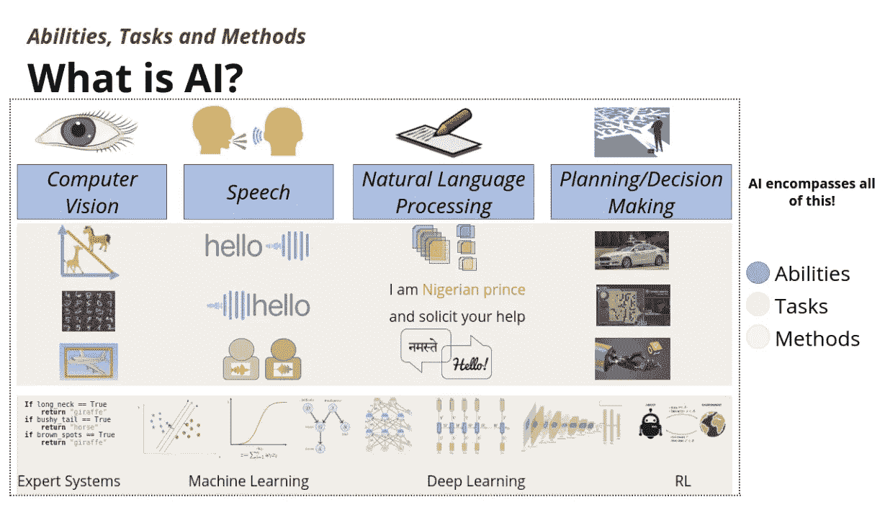

# 解码人工智能术语

> 原文：<https://medium.datadriveninvestor.com/decoding-ai-jargon-af15e7539148?source=collection_archive---------24----------------------->

Photo by [Owen Beard](https://unsplash.com/@owenbeard?utm_source=medium&utm_medium=referral) on [Unsplash](https://unsplash.com?utm_source=medium&utm_medium=referral)

**AI、ML、深度学习、计算机视觉、模式识别**是当今的流行语。这些下一代技术将在未来几十年统治科技行业。所有这些都很好，但是当我们谈论这些技术时，很少有人真正理解它们之间的关系或者它们之间的区别。

我们来试着解码一下这个 AI 行话。我们都知道人类是聪明的生物，有 T2 的能力去完成显示智慧的任务。这些**能力**是什么

看到和感知的能力:人类能够看到和感知他们的环境。他们知道识别物体，区分或分类动物等。

**说和听的能力**:人类能够通过言语来传达自己的想法，能够倾听他人以理解内容和语境。

**读写(和翻译)的能力**:人类能够阅读给定的文本并理解其内容，还能书写他人能够理解的文本。在某些情况下，我们还可以在文本之间进行翻译。

**计划和决策的能力**:这是人类最重要的能力。从早上到睡觉，我们都要参与无数的决策过程，比如走哪条路可以更快地到达学校，或者投资哪只股票等等。

> 所以人工智能可以定义为相对于人类表现出来的自然智能，机器表现出来的智能。当我们将这些人类能力映射到 AI 时，它们可以分别归类为**计算机视觉**、**语音**、**自然语言处理**和**决策制定。**

让我们看看人工智能的能力和一些我们能够通过它们完成的任务

1.  **计算机视觉:**一旦机器具备视觉能力，它就能**识别手写数字**，**对不同的动物进行分类**，或者**探测环境中的物体**等等。
2.  **语音:**具有语音功能的机器可以**从提供的内容中生成语音信号**或者可以**识别语音信号**。同样，不同语音信号的**分类**也可以实现。
3.  **自然语言处理**:NLP 实现的一些任务是- **将文档分类**成不同的类别，如体育、政治或科学等。、**将电子邮件文档分类为垃圾邮件或非垃圾邮件**、**摘要**、**问答**、**文本翻译**。
4.  **规划/决策:**这里最突出的例子是**自动驾驶汽车**，它涉及许多决策，更有趣的是它需要其他能力的输入，比如机器必须配备计算机视觉能力，以便决定加速、减速、制动等..类似于**玩游戏**和**机器人手臂**的事情也属于计划和决策的范围。

> 一旦我们获得了的**能力，并且我们能够通过它们完成一些**任务**，现在问题来了，我们将如何执行这些任务，也就是说，有什么**方法**来完成这些任务。**

AI Map by OneFourthLabs

现在让我们看看实现上述一些任务的方法。在人工智能时代的早期,**专家系统**非常流行。*一个* ***专家系统*** *是一个模拟人类专家决策能力的计算机系统，主要表现为 if-then 规则。但人们最终意识到，很难明确地将所有规则编码下来，有时甚至不可能提出一套清晰明确的规则。这就是**机器学习**发挥作用的地方，在这里，机器被给予带标签的数据以及一些关于存在的关系的提示，ML 算法本身在没有显式编程的情况下计算出底层模式。*

> **机器学习**是让计算机在没有明确编程的情况下行动的科学。

人们已经开发了许多机器学习算法，如**线性回归**、**逻辑回归**、**支持向量机**、**图形模型**和**神经网络**，用于实现许多展示智能的任务。近年来，一个名为**深度学习**的机器学习算法家族，包括**神经网络、递归神经网络和卷积神经网络**，已经变得非常突出，因为这些算法能够比已经存在的早期算法执行得更好。**深度学习**本身是机器学习的一个子集，它提供了用一套工具解决跨越不同人工智能领域的大量问题的机会，如**计算机视觉、语音、NLP** 。最后，**强化学习**相对来说是**机器学习**的一个新领域，它处理**规划**和**决策**，其中也有**深度学习的一些组件。**