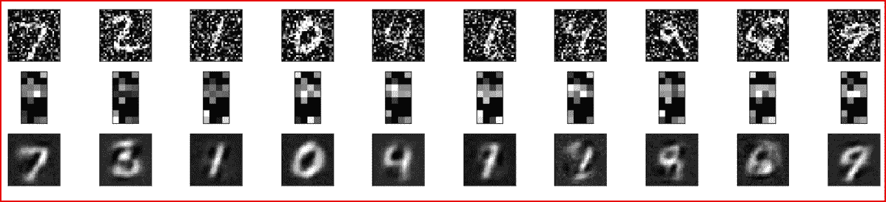
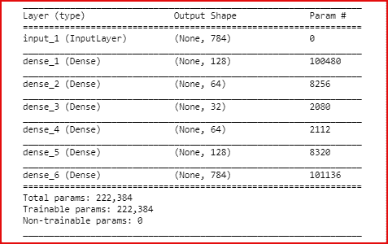
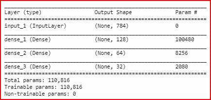
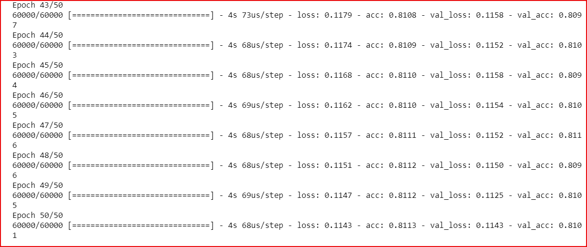
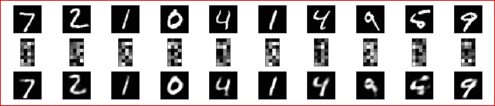
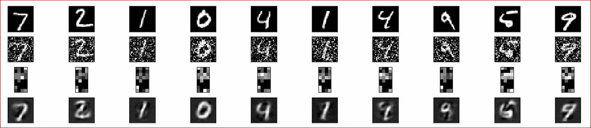

# 使用 Keras 的深度自动编码器

> 原文：<https://medium.datadriveninvestor.com/deep-autoencoder-using-keras-b77cd3e8be95?source=collection_archive---------0----------------------->

[](http://www.track.datadriveninvestor.com/1B9E)

在这篇文章中，我们将使用 MNIST 数据集逐步构建一个深度自动编码器，然后还将构建一个去噪自动编码器。



First row is the noise added to MNIST dataset. Second row is encoded images and third row is the decode images of MNIST dataset using autoencoders

## 先决条件:

[B **自动编码器专用集成电路**](https://medium.com/datadriveninvestor/deep-learning-autoencoders-db265359943e)

[**自动编码器的类型**](https://medium.com/datadriveninvestor/deep-learning-different-types-of-autoencoders-41d4fa5f7570)

[使用 keras 的简单自动编码器](https://medium.com/@arshren/simple-autoencoders-using-keras-6e67677f5679)

## 逐步创建深度自动编码器

我们将创建一个深度自动编码器，其中输入图像的尺寸为 784。然后我们将它编码成 128 维，然后编码成 64 维，然后编码成 32 维。我们将开始将 32 维图像解码为 64，然后解码为 128，最后重建回 784 的原始尺寸。

让我们开始构建深度自动编码器

导入所需的库

```
from keras.datasets import mnist
from keras.layers import Input, Dense
from keras.models import Modelimport numpy as np
import pandas as pd
import matplotlib.pyplot as plt%matplotlib inline
```

加载 MNIST 数据集影像。我们不加载标签。我们希望重建图像作为自动编码器的输出。

创建训练集和测试集，并规范化数据以更好地训练模型。

```
(X_train, _), (X_test, _) = mnist.load_data()X_train = X_train.astype('float32')/255
X_test = X_test.astype('float32')/255X_train = X_train.reshape(len(X_train), np.prod(X_train.shape[1:]))
X_test = X_test.reshape(len(X_test), np.prod(X_test.shape[1:]))print(X_train.shape)
print(X_test.shape)
```


Shape of X_train and X_test

我们需要把 784 维的输入图像转换成 keras 张量。

```
input_img= Input(shape=(784,))
```

为了构建自动编码器，我们必须首先对输入图像进行编码，并添加不同的编码和解码层来构建深度自动编码器，如下所示。


Deep Autoencoder

```
encoded = Dense(units=128, activation='**relu**')(**input_img**)
encoded = Dense(units=64, activation='**relu**')(**encoded**)
encoded = Dense(units=32, activation='**relu**')(**encoded**)
decoded = Dense(units=64, activation='**relu**')(**encoded**)
decoded = Dense(units=128, activation='**relu**')(**decoded**)
decoded = Dense(units=784, activation='**sigmoid**')(**decoded**)
```

在重建输入图像的最后一层，我们使用 sigmoid 激活函数。输出层需要预测需要 0 或 1 的输出的概率，因此我们使用 sigmoid 激活函数。

对于编码器和解码器的所有隐藏层，我们对非线性使用 relu 激活函数。

我们用输入图像作为输入来创建自动编码器。输出将是最终的解码器层

```
autoencoder=Model(input_img, decoded) 
```

我们可以提取以输入图像作为输入的编码器，编码器的输出是 32 维的编码图像

```
encoder = Model(input_img, encoded)
```

让我们来看看深度自动编码器模型的结构

```
autoencoder.summary()
```



让我们看看编码器的结构

```
encoder.summary()
```



我们用 adam optimizer 编译自动编码器模型。

由于像素值为 001，我们使用二进制交叉熵作为损失函数

我们使用准确性作为衡量模型性能的标准。

```
autoencoder.compile(optimizer='adam', loss='binary_crossentropy', metrics=['accuracy'])
```

我们最终使用具有 50 个时期和 256 个批量的训练数据来训练自动编码器。

```
autoencoder.fit(X_train, X_train,
                epochs=50,
                batch_size=256,
                shuffle=True,
                validation_data=(X_test, X_test))
```



使用自动编码器预测测试集以获得重建图像。我们还预测了使用编码器查看编码图像的测试。

```
encoded_imgs = encoder.predict(X_test)
predicted = autoencoder.predict(X_test)
```

为了查看原始输入、编码图像和重建图像，我们使用 matplotlib 绘制图像。

```
plt.figure(figsize=(40, 4))
for i in range(10):
    **# display original images**
    ax = plt.subplot(3, 20, i + 1)
    plt.imshow(X_test[i].reshape(28, 28))
    plt.gray()
    ax.get_xaxis().set_visible(False)
    ax.get_yaxis().set_visible(False)

   ** # display encoded images**
    ax = plt.subplot(3, 20, i + 1 + 20)
    plt.imshow(encoded_imgs[i].reshape(8,4))
    plt.gray()
    ax.get_xaxis().set_visible(False)
    ax.get_yaxis().set_visible(False)**# display reconstructed images**
    ax = plt.subplot(3, 20, 2*20 +i+ 1)
    plt.imshow(predicted[i].reshape(28, 28))
    plt.gray()
    ax.get_xaxis().set_visible(False)
    ax.get_yaxis().set_visible(False)

plt.show()
```



## 降噪自动编码器

让我们现在添加一些噪声到输入图像，我们将剪辑 0 和 1 之间的值

```
#loading only images and not their labels
(X_train, _), (X_test, _) = mnist.load_data()

X_train = X_train.astype('float32')/255
X_test = X_test.astype('float32')/255

X_train = X_train.reshape(len(X_train), np.prod(X_train.shape[1:]))
X_test = X_test.reshape(len(X_test), np.prod(X_test.shape[1:])) X_train_noisy = X_train + np.random.normal(loc=0.0, scale=0.5, size=X_train.shape)
X_train_noisy = np.clip(X_train_noisy, 0., 1.)X_test_noisy = X_test + np.random.normal(loc=0.0, scale=0.5, size=X_test.shape)
X_test_noisy = np.clip(X_test_noisy, 0., 1.)print(X_train_noisy.shape)
print(X_test_noisy.shape)
```


Shape of X_train_noisy and X_test_noisy

我们对有噪声的图像使用相同的深度自动编码器

```
**#Input image**
input_img= Input(shape=(784,))**# encoded and decoded layer for the autoencoder**
encoded = Dense(units=128, activation='relu')(input_img)
encoded = Dense(units=64, activation='relu')(encoded)
encoded = Dense(units=32, activation='relu')(encoded)
decoded = Dense(units=64, activation='relu')(encoded)
decoded = Dense(units=128, activation='relu')(decoded)
decoded = Dense(units=784, activation='sigmoid')(decoded)**# Building autoencode**r
autoencoder=Model(input_img, decoded)**#extracting encoder**
encoder = Model(input_img, encoded)**# compiling the autoencod**er
autoencoder.compile(optimizer='adadelta', loss='binary_crossentropy', metrics=['accuracy'])**# Fitting the noise trained data to the autoencoder** autoencoder.fit(X_train_noisy, X_train_noisy,
                epochs=100,
                batch_size=256,
                shuffle=True,
                validation_data=(X_test_noisy, X_test_noisy))**# reconstructing the image from autoencoder and encoder**
encoded_imgs = encoder.predict(X_test_noisy)
predicted = autoencoder.predict(X_test_noisy)**# plotting the noised image, encoded image and the reconstructed image**
plt.figure(figsize=(40, 4))
for i in range(10):
**# display original images**

    ax = plt.subplot(4, 20, i + 1)
    plt.imshow(X_test[i].reshape(28, 28))
    plt.gray()
    ax.get_xaxis().set_visible(False)
    ax.get_yaxis().set_visible(False)

**# display noised images**
    ax = plt.subplot(4, 20, i + 1+20)
    plt.imshow(X_test_noisy[i].reshape(28, 28))
    plt.gray()
    ax.get_xaxis().set_visible(False)
    ax.get_yaxis().set_visible(False)**# display encoded images**    
    ax = plt.subplot(4, 20, 2*20+i + 1 )
    plt.imshow(encoded_imgs[i].reshape(8,4))
    plt.gray()
    ax.get_xaxis().set_visible(False)
    ax.get_yaxis().set_visible(False)**# display reconstruction images**
    ax = plt.subplot(4, 20, 3*20 +i+ 1)
    plt.imshow(predicted[i].reshape(28, 28))
    plt.gray()
    ax.get_xaxis().set_visible(False)
    ax.get_yaxis().set_visible(False)

plt.show()
```

我们看到重建的图像接近原始图像



First row is the original image , second row is the noise added to MNIST dataset. Third row is encoded images and fourth row is the decode images of MNIST dataset using autoencoders

我希望这能帮助你理解深度自动编码器和去噪自动编码器如何使用 keras 工作

# 如果你喜欢这个帖子，请鼓掌！

参考资料:

[https://blog.keras.io/building-autoencoders-in-keras.html](https://blog.keras.io/building-autoencoders-in-keras.html)

## 来自 DDI 的相关故事:

[](https://medium.com/datadriveninvestor/which-is-more-promising-data-science-or-software-engineering-7e425e9ec4f4) [## 数据科学和软件工程哪个更有前途？

### 大约一个月前，当我坐在咖啡馆里为一个客户开发网站时，我发现了这个女人…

medium.com](https://medium.com/datadriveninvestor/which-is-more-promising-data-science-or-software-engineering-7e425e9ec4f4) [](https://medium.com/datadriveninvestor/deep-learning-explained-in-7-steps-9ae09471721a) [## 用 7 个步骤解释深度学习

### 和猫一起

medium.com](https://medium.com/datadriveninvestor/deep-learning-explained-in-7-steps-9ae09471721a)