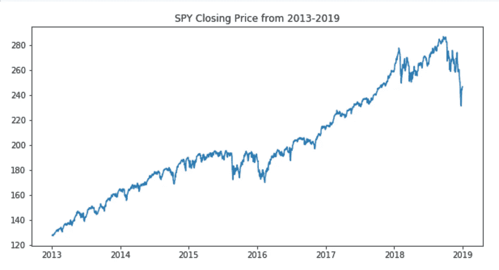
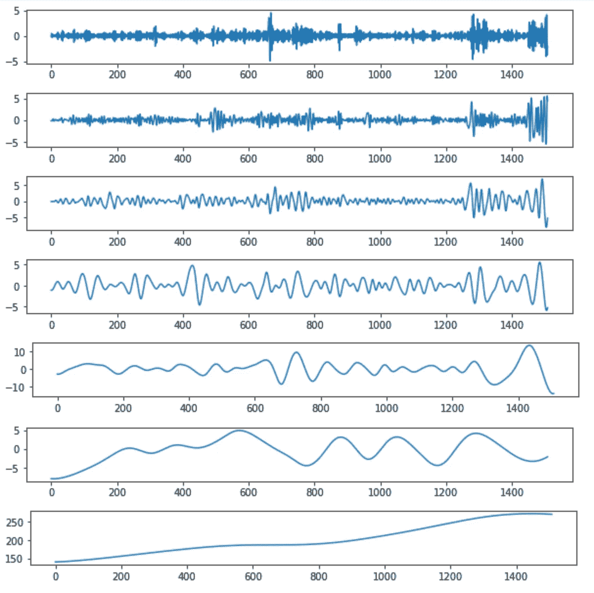
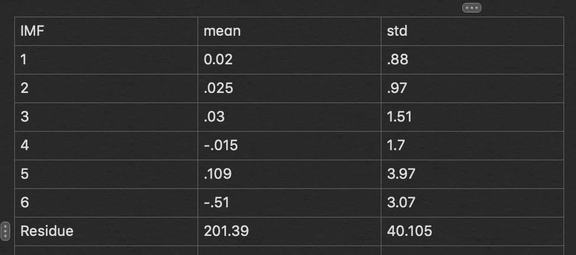
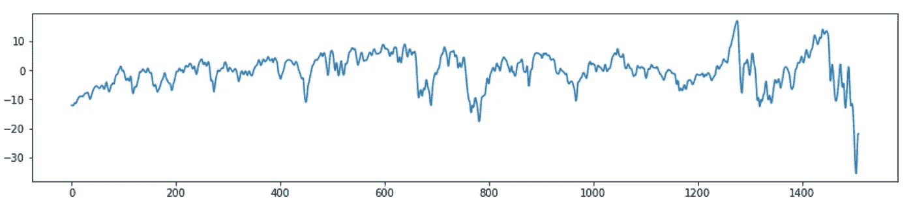
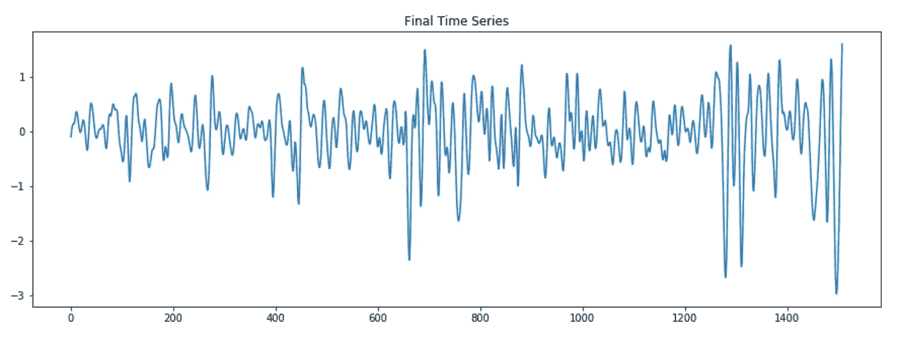
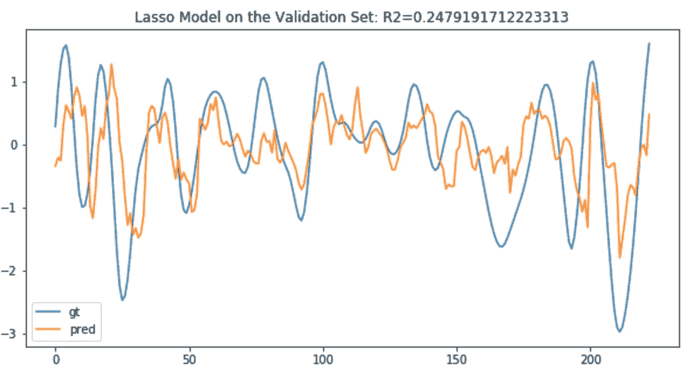
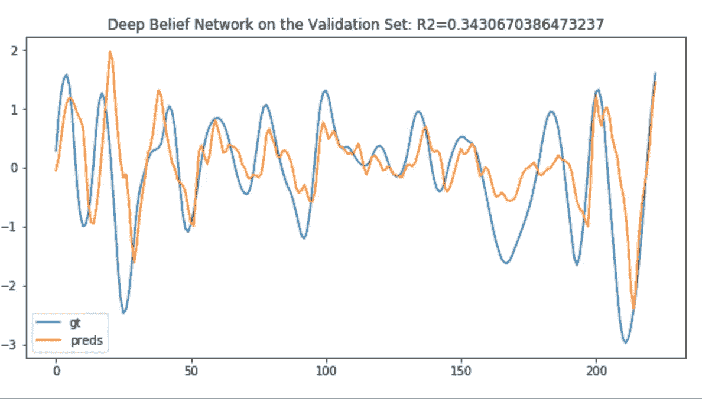
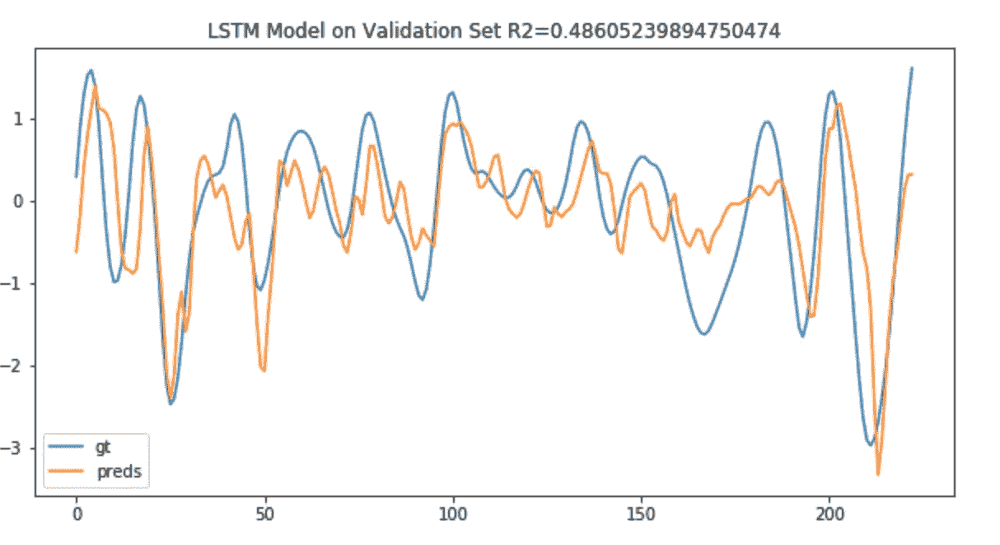

# 深度信念网络回归(金融时间序列)

> 原文：<https://medium.datadriveninvestor.com/deep-belief-network-regression-on-financial-time-series-b0115bad7c7d?source=collection_archive---------3----------------------->

我想用[深度信念网络](https://en.wikipedia.org/wiki/Deep_belief_network)进行单变量时间序列回归的实验，并找到了一个运行在 numpy 和 tensorflow 上的 [Python 库](https://github.com/albertbup/deep-belief-network)，其中包括用于监督回归和分类的模块。我使用的时间序列是 SPY 交易所交易基金(ETF)——它跟踪标准普尔& P500 指数。目标是使用连续 20 天的收盘价创建一个自回归模型，该模型可以预测未来 5 天的收盘价。我将该模型和 DBN 的 R2 评分与拉索和 LSTM 模型的结果进行了比较。首先，这是时间序列。

我使用经验模式分解对这个序列进行了分解，这种分解将非线性、非平稳的时间序列分解为在几个“物理上有意义的”频率上运行的窄带振荡分量，以及代表数据长期趋势的单调增加的残差。这是 IMF 的样子，你可以看到它们就像一个二进滤波器组，意味着(平均)频率相差 2 倍。下面是它们的样子:

IMFs and the Residue of the SPY time series.

以下是每个 IMF 和残差的均值和标准差:

你可以看到大多数的平均值接近 0。IMF 和残差之和等于原始序列。我通过去除 IMF1 和 IMF2(高频成分)以及残差(单调趋势)创建了一个新的系列。如果你把剩下的相加，你会得到一个在 0 附近振荡的更平滑的序列。

 [## 金融中的机器学习|数据驱动的投资者

### 在我们讲述一些机器学习金融应用之前，我们先来了解一下什么是机器学习。机器…

www.datadriveninvestor.com](https://www.datadriveninvestor.com/2019/02/08/machine-learning-in-finance/) 

Sums of IMFs 2–6

然后对该系列求一次差(用 ARIMA 的说法是 I(1)系列),得到这个:

Differenced Time Series

我把它分成一个训练集和一个验证集，没有洗牌，所以验证代表样本外的未来。首先，我训练了一个套索模型，这是它在验证集上的表现:

然后是深度信念网络模型，下面是它在验证集上的表现:

最后，这是 LSTM + FCN 模型在验证集上的工作方式:

就 R2 得分而言，LSTM 做得最好。我将在其他一些时间序列数据集上测试这一点，以更好地了解什么在什么情况下效果最好，以及在其他一些 RNN 变体中的效果。