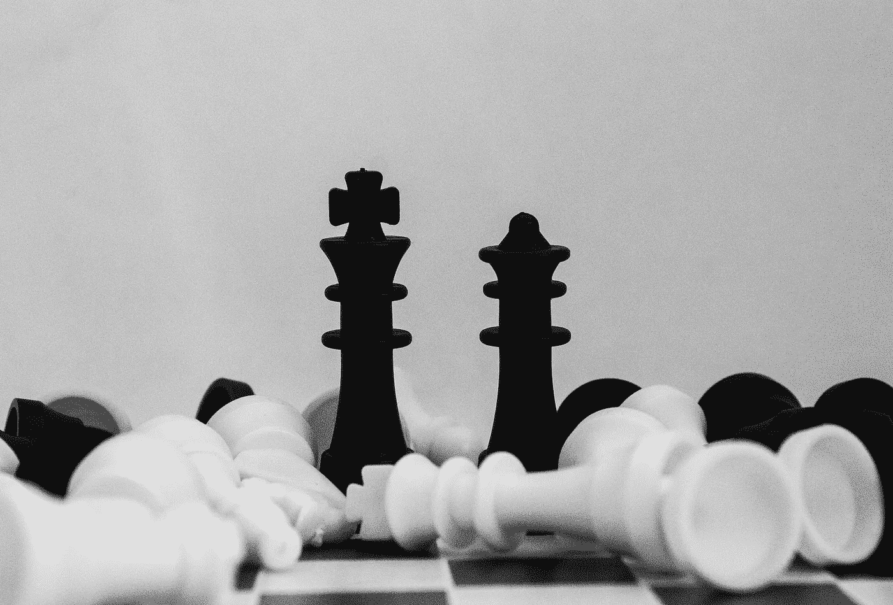

# 深蓝和 AlphaZero:比较人工智能巨头

> 原文：<https://medium.datadriveninvestor.com/deep-blue-and-alphazero-comparing-giants-of-artificial-intelligence-2c57081dd762?source=collection_archive---------0----------------------->

Photo by [Piotr Makowski](https://unsplash.com/@maqov?utm_source=unsplash&utm_medium=referral&utm_content=creditCopyText) on [Unsplash](https://unsplash.com/search/photos/chess?utm_source=unsplash&utm_medium=referral&utm_content=creditCopyText)

1997 年，IBM 开发的国际象棋计算机“深蓝”以 3.5-2.5 的比分击败了当时的世界象棋冠军加里·卡斯帕罗夫。凭借这一壮举，深蓝成为有史以来第一台在标准时间控制下击败世界象棋冠军的计算机。

人工智能公司 DeepMind 的 AlphaZero 是 AlphaGo Zero 的继任者，AlphaGo Zero 本身又继承了 alpha go 的继任者 AlphaGo Master。2016 年 3 月，AlphaGo 在棋盘游戏 Go 的五局比赛中击败了 Lee Sedol，成为第一个毫无障碍地击败人类 9-dan 职业选手的围棋计算机程序。

 [## 人工智能与创造力:作为创意引擎的比根——数据驱动的投资者

### 的确，2018 年可以被视为人工智能创造的创造力全盛时期的开始。当然可以…

www.datadriveninvestor.com](https://www.datadriveninvestor.com/2019/02/13/ai-creativity-biggan-as-a-creative-engine/) 

一年后，2017 年 5 月，AlphaGo Master 击败了当时世界排名第一的选手柯洁。目前，AlphaZero 被认为是现有(人类或人工)最强的围棋选手，击败了 AlphaGo Zero，后者以 100 比 0 的比分击败了 Lee Sedol，以 60 比 40 的比分击败了 AlphaGo。

# 比较巨人

比较深蓝和 AlphaZero 似乎不太公平，因为它们发明的时间段不同。然而，我将在这篇文章中做的比较不是基于性能，而是更多地基于用来实现性能的技术及其优缺点。就性能而言，AlphaZero 完胜，因为它比深蓝更擅长下棋和下围棋(是的，深蓝甚至根本不会下围棋)。事实上，这并不令人惊讶，因为 AlphaZero 的开发比深蓝晚了 25 年以上。

在深入了解深蓝和 AlphaZero 的不同智能之后，我将从透明度和适用性两个方面对这两个系统进行比较。

# 深蓝的智慧

## 搜索程序

深蓝的国际象棋智能是 GOFAI(优秀的老式人工智能)的一个伟大例子。它使用人类设计的搜索程序来寻找优秀的国际象棋步骤，它所做的一切都是显式编程的。深蓝搜索的走法是一种*极小最大*的走法，这意味着它将走法的有效性建立在对手能做出的最佳反走法的基础上。这个“最佳”反棋也是以同样的方式发现的:通过考虑对手的对手(即深蓝)可以做什么反棋，这又取决于对手可以做什么反棋，等等。该搜索过程必须在某个点停止:当到达终点位置(赢/输/平)时，或者当到达某个搜索深度(例如，向前移动 10 步)时停止。在终端位置的情况下，位置的值很容易确定:赢了 1 分，输了 1 分，平局 0 分(例如)。当达到最大搜索深度并且位置不是终点时，必须根据每个玩家仍然可用的棋子和它们的(相对)位置来计算启发值。

除了最小最大搜索程序，深蓝还使用了已知国际象棋游戏的数据库。

## 深蓝真的聪明吗？

尽管我毫不怀疑“深蓝”展现了真正的智慧，但其他人(包括“深蓝”的一名开发者)并不同意。人们经常听到的抱怨之一是深蓝使用蛮力:它“只是”搜索许多位置，这(据说)不像人类的国际象棋智能。决定“深蓝”是否真的聪明的重要因素是对聪明有一个清晰的定义。我喜欢[莱格和赫特](https://arxiv.org/pdf/0712.3329.pdf)的非正式定义:

> 智能衡量代理在各种环境中实现目标的能力。

虽然这个定义适用于普遍智能(在不止一个环境中)，但它也适用于一个环境(在这个例子中是国际象棋)。如果目标是在国际象棋上赢下一个世界冠军(这当然是)，深蓝无疑是聪明的:它有很大的能力来实现它的目标。

# AlphaZero 的智能

虽然 AlphaZero 的围棋智能水平确实令人惊叹，但更有趣的是它能做的不仅仅是围棋。你看，与深蓝不同，AlphaZero 是一个学习程序，它的设计允许它学习棋盘游戏国际象棋和 Shogi。你可能已经猜到了，这两款游戏都是目前最高水平的。

AlphaZero 是如何完成其惊人壮举的？它使用了一种叫做强化学习的学习技术。基本上，就围棋而言，它一开始是一个非常糟糕的围棋选手。它开始和自己玩游戏。在每一步，它根据每个可用的下一个游戏位置的*值*选择下一步棋。这个值是由深度神经网络(*深度学习*)赋予它的。就本文的目的而言，神经网络的重要之处在于它们是可以训练的:它们可以根据反馈改变自己赋予某个职位的任何值。所以，在开始时，这个神经网络是随机初始化的，在给 Go 位置赋值时可能很糟糕。结果，AlphaZero 玩了一场可怕的与自己作对的游戏。然而，它确实能看出哪一步棋会导致游戏结束时的输赢！基于该信息，神经网络获得反馈:获胜位置是好的，并且获胜位置之前的位置(可能)也是好的(因为它导致了获胜位置)，尽管当然没有获胜位置那么好。*之前那个*位置可能也挺好的等等。同样的情况也会发生在亏损的头寸上，这当然是不好的。通过玩大量的游戏，AlphaZero 训练自己变得越来越好，最终达到外星人的围棋智能水平。

# 透明度

在我看来，深蓝的智能最大的优点就是透明度高。深蓝决定其下一步行动的方式是完全可以理解的，因为这是明确编入程序的。你可能已经猜到了，AlphaZero 有一种比深蓝更低的透明度:它自学了围棋，它的直觉(是的，我称之为直觉)并没有被完全理解。在深蓝的例子中，对于它走的每一步棋，都可以精确地计算出*它为什么走那一步棋；对于 AlphaZero 来说，这即使不是不可能，也是极其困难的。这有点像人类很难准确解释他们为什么玩某个动作:这是基于一种感觉，一种直觉。这种直觉有数学基础(在人类和 AlphaZero 中都有)，但非常复杂。作为一名初级人工智能程序员，我可以想象出一种方法来修改深蓝，以便能够回答关于它为什么做某一步的问题，方法是打印类似“避免将死”或“保证以后 win 2 移动”的内容。我甚至无法想象如何开始为 AlphaZero 做这些。*

现在，有人可能会说这只是游戏，情报的透明度并不重要。我强烈反对。AlphaZero 的技术不仅仅是为棋盘游戏开发的，而且(几乎)具有普遍的应用性。由于它不是特定领域的，并且可以自学，它可以用于执行现实世界的任务，如在医学图像中检测癌症或在真实交通中驾驶汽车。在这些可能危及人类生命的领域，情报的透明度至关重要。如果出了问题，重要的是要知道这是否是人工智能的错，如果是，如何在未来避免同样的错误。

# 适应性

深蓝输给加里·卡斯帕罗夫主要是因为这个，而 AlphaZero 不仅仅是因为它惊人的围棋、国际象棋和日本兵棋的表现。如前所述，AlphaZero 可用于执行现实世界的任务，而深蓝是专门为国际象棋和国际象棋设计的。诚然，深蓝*激发了计算机科学家让计算机处理复杂计算的灵感，但是系统本身除了下棋什么也不会做。*

# 结论

与 GOFAI(例如深蓝)相比，深度学习(例如 AlphaZero)产生如此极其好的结果，这似乎是人工智能的一个不幸事实，这要容易理解得多。

不要误会我的意思:我对 AlphaZero 和深度学习非常兴奋！然而，我和更多的人一样，也有点担心这些技术有一天会导致不可预见的事故。