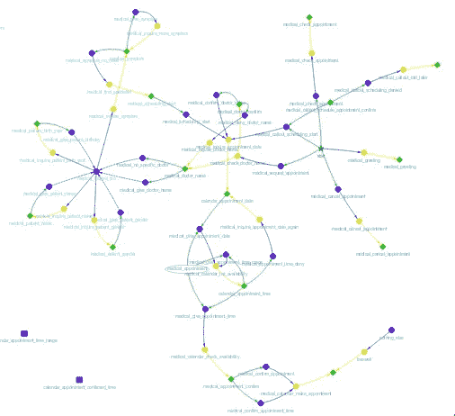

# 面向所有企业的深度对话式人工智能

> 原文：<https://medium.datadriveninvestor.com/deep-conversational-ai-for-every-business-f3e1ee8e609c?source=collection_archive---------11----------------------->

10 个月前，我从三星人工智能研究总监的职位上离职，只有一个梦想——创造一个语言界面，不仅仅是播放音乐、开灯/关灯、设置提醒，而是通过最方便、直观和无处不在的方式帮助人们完成复杂的任务。10 个月后，我非常自豪地向您展示一个正在开发中的深度对话引擎。

*(免责声明:我们用的是 Google ASR 和 Google TTS，其余全部是我们的专有技术)。您会注意到大约 1 秒钟的延迟，这主要是因为我们使用了在线 TTS，而不是预先录制的音频。*

你可能见过 Google demoed Duplex，它通过语音代理帮助用户预约餐厅和沙龙。我们希望更多的企业掌握这种技术。我们希望它尽可能简单，这样每个企业都可以轻松拥有它。为了演示该功能，我们为来自医院、药店和保险公司的潜在客户创建了 5 个对话代理。使用我们的发动机，从设计、训练、集成到测试发射，每台发动机都用了不到一周的时间。如果存在对话数据、语音或文本，交付时间可以进一步缩短。

# 为什么是现在？

半个多世纪以来，对话机器一直是一个长期的梦想，许多先驱都为此付出了巨大的努力，那么为什么是现在呢？

随着近年来技术的突破，每一个部件最终都将在不久的将来实现这一梦想。

首先，ASR 正在进入人类的层面。即使通用引擎仍然遭受诸如上下文歧义、重音、混响和噪声的挑战，其中一些具有补救措施，并且总体性能是令人满意的。

其次，在过去的 2 年里，TTS 在 Wavenet 和 Tacotron 的带领下取得了惊人的进展，这要感谢 Google 的研究团队。现在的合成语音如此人性化，几乎无法与真人区分开来。尽管在线模型仍有一些延迟挑战(在演示中，我们使用了在线模型)，离线模型或混合模型在某些情况下可能会有所帮助。这样人性化的声音，给我们提供了未来很大的想象空间。

最重要的突破还是在 NLP。Mikolov 和 Quoc Le 关于 word2vec 的论文给我们带来了一种用语义的方式来表示语言的强大方法。分布式表示为机器学习驱动的自然语言处理奠定了新的基础。它不仅是一个如此强大的机制，可以携带语义和语法信息，而且我们最终看到了一个通用架构师将对话式人工智能管道的所有部分整体连接在一起的可能性。而且是语言不可知的，多奇妙啊？如果你正在进行自然语言处理，第一步是对你的文本进行矢量化。

# 还有呢？

所有这些技术突破都提供了组件级的基础，但对话式人工智能作为一个系统，还有更多挑战要克服。对话式人工智能如此困难的原因在于三个挑战:上下文绑定、随机和部分可观察。

## 语境理解

人类理解语境中的语言，机器也不例外。在对话中，同一个句子在不同的语境中有不同的意思。理解单个话语是基础，但不足以引导进行功能性对话。举个简单的例子:

> 系统:你喜欢多大的？
> 
> 用户:**你有什么？** = >(暗示“你有什么尺寸的？”)
> 
> …
> 
> 系统:你喜欢加什么浇头？
> 
> 用户:**你有什么**？= >(暗示“你有什么浇头？”)

不仅仅是意图，上下文也可以将实体带入更具体的意义。例如，如果你在谈论安排一个活动，“旧金山”不仅仅是一个地点，而是“活动地点”。如果你说的是送货，那么“旧金山”可能真的意味着“送货 _ 命运”。有了这种精细的理解，实体可以很容易地与您拥有的知识库相关联，并为推理提供基础。

语境是对话的绝对关键。从去年开始，一些系统开始引入基于规则的上下文听写。它解决了一些问题，但依赖于上下文结构的精心设计。我们不认为基于规则的上下文是一个好的解决方案，已经用机器学习的方式解决了上下文理解。

除了语言理解，语境信息还有其他重要的用途。比如“mail”vs .“male”，两者发音完全一样，从 ASR 角度很难区分。为了解决这种歧义，语境可以来拯救。如果对话是在医学语境下，尤其是一方要求性别时，“男性”应该比“邮件”的可能性更大。如果对话语境目前在联系方式中，“邮件”比“男性”有意义得多。根据我们的经验，这种 ASR-NLU 联合优化可以立即将性能提高 30%以上。

## 会话的有向图模型

“解决方案受到问题框架的限制”

今天，大多数系统使用槽填充、树或流结构来对对话建模(槽填充本质上是一种广度优先树)。尽管这种模型很简单，但它们也是当今对话代理脆弱的根本原因。

我们希望创建一个更强大的模型，能够用基本元素来表示对话。因此，我们发明了以下对话的有向图模型。

Directed Graph Model of Conversation

这个强大的结构可以模拟任何对话。的确，对于人类来说，有向图比树、流或槽填充更复杂、更难理解。但是这种技术的好的一面是，除了它的表现力，如果给它适当的数据，它是可以学习的。我们称之为当今系统的“自下而上”方法与“自上而下”方法。

## 多条路径

今天，太多的系统以一种确定性的方式对待对话，“非此即彼”，这是脆性和不灵活性的来源。我们的大脑不会那样处理对话。相反，我们的大脑运行不同可能性的平行假设，然后用先验知识、推理和上下文信息评分。

谈话是高度概率性的。我们将真正的对话定义如下:

> “给定一组已知的服务 **(V)** 或知识 **(K)** ，以及一段可以生成一组状态 **(S = (s1，s2，S3…)**的话语 **(U)** ，生成适当的动作 **(A)** ，目标是完成任务**【T】**，该过程可以通过经验**【E】**逐步改进。”

为了捕捉所有的概率，理想的解决方案是端到端的训练，从演讲到行动。但是它需要大量的数据来训练一个收敛的模型，因此对于大众来说是不实际的。

作为有效性和效率的平衡，我们发明了多假设技术，该技术保持了整个管道的概率性，同时显著减少了训练和推理所需的资源。

# 最后声明

如果你有兴趣了解更多，请在 LinkedIn[https://www.linkedin.com/in/an-michael-wei-a4a02214/](https://www.linkedin.com/in/an-michael-wei-a4a02214/)上找到我。我很乐意联系。