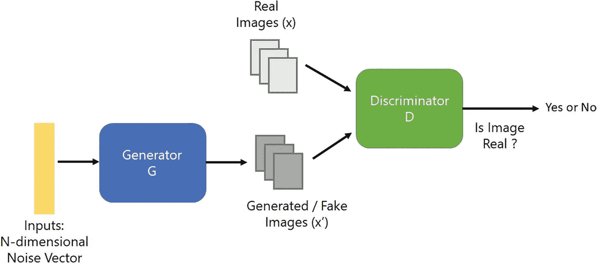
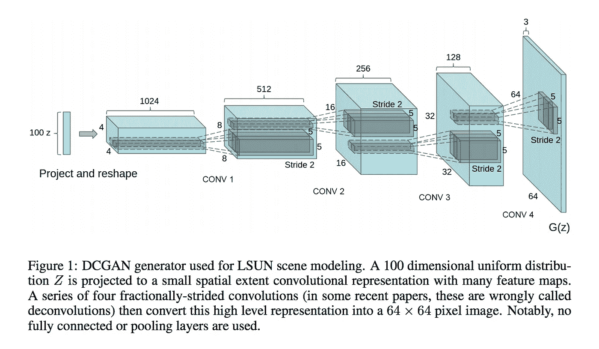
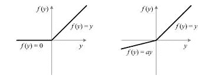
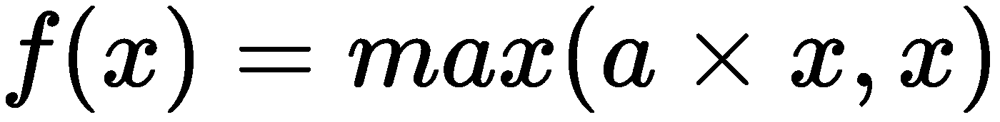

# 深度卷积生成对抗网络

> 原文：<https://medium.datadriveninvestor.com/deep-convolutional-generative-adversarial-networks-dcgans-3176238b5a3d?source=collection_archive---------3----------------------->

由 [Ian Goodfellow](https://arxiv.org/pdf/1406.2661.pdf) 于 2014 年引入的生成性对抗网络(GANs)。GANs 是一种全新的方式，通过一个生成过程来教计算机如何完成复杂的任务。Yann LeCun，深度学习领域最杰出的人之一，在他的演讲中提到“[对抗训练真的是一个很酷的想法，它就像过去 20 年里机器学习中最酷的想法](https://www.youtube.com/watch?v=IbjF5VjniVE&t=2530s)

**甘斯有两个成分**。

*   一个**生成器(**一个 **)** 神经网络。
*   一个**鉴别器(**一个艺术评论家 **)** 神经网络。

**生成器(** An artist **)** 生成 An 图像。**发生器**对真实图像一无所知，通过与**鉴别器**交互来学习。**鉴别器(**艺术评论家 **)** 确定一个物体是否为*【真】**【假】*(通常用接近 1 或 0 的值表示)

总而言之:

*   **鉴别器**是判断给定图像是“真”还是“假”的分类器。
*   **发生器**将随机产生的噪声向量作为输入数据，并从**鉴别器**反馈，产生尽可能接近真实图像的新图像。
*   **鉴别器**使用**发生器**的输出作为训练数据。
*   **发生器**从**鉴别器**获得反馈。
*   这两种模式相互“较量”。每个模型都在这个过程中变得更加强大。
*   **生成器**不断创建新的图像并改进其过程，直到**鉴别器**不再能够辨别生成的图像和真实训练图像之间的差异。

# 高级 DCGAN 架构图

原始 DCGAN 架构( [*深度卷积生成对抗网络的无监督表示学习*](https://arxiv.org/abs/1511.06434) *)* 有*四个*卷积层用于**鉴别器**和*四个*四个分数步长卷积层用于**生成器。**

[https://arxiv.org/pdf/1511.06434.pdf](https://arxiv.org/pdf/1511.06434.pdf)

# 鉴别器网络

**鉴别者**就是试图区分*【真实】**【假】*图像的*【艺术评论家】*。这是一个用于图像分类的卷积神经网络。

**鉴别器**是一个 4 层步进卷积，具有批量标准化(除了其输入层)和泄漏 ReLU 激活。 **Leaky ReLU** 帮助梯度更容易地流过架构。

**ReLU v/s 泄漏 ReLU**

*   **ReLU** 激活功能将取输入值和零之间的最大值。如果我们使用 ReLU 激活功能，有时网络会陷入一种常见的状态，称为**垂死状态**，这是因为网络对所有输出只产生零。
*   **泄漏 ReLU** 通过允许一些负值通过来防止这种**死亡状态**。使**发生器**工作的整个想法是从**鉴别器**接收梯度值，如果网络陷入**垂死状态**的情况，学习过程就不会发生。
*   如果输入为正，则**泄漏 ReLU** 激活功能的输出为正，如果输入为负，则输出为受控的负值。负值由名为 **alpha** 的参数控制，该参数将通过允许一些负值通过来引入网络容差。

(left) ReLU, (right) Leaky ReLU activation functions

**Leaky ReLU Function(here a is alpha)**

**鉴别器**需要输出概率。为此，我们在最终逻辑上使用*逻辑 Sigmoid* 激活函数。

# 发电机网络

**发生器**就是**一个试图创造出看起来尽可能像*真实*的图像的艺术家，来愚弄**鉴别者**。**

****生成器**是一个 4 层分数步长卷积，具有批量归一化(除了其输入层)，并在最终输出层使用**双曲正切( *tanh* )** 激活，在其余层使用**泄漏 ReLU** 。**

# **损失函数**

**这里我们需要定义三个函数，而不是只有一个损失函数。**

****鉴别器有两个任务****

*   ****鉴别器**必须正确地将来自训练数据集的真实图像标记为“*真实*”。**
*   ****鉴别器**必须将来自**发生器**的生成图像正确标记为“*假”*。**

**我们需要计算**鉴频器的两个损耗。“*假“*图像”和“*真”*图像损失之和就是总的鉴别器损失*。*****

****发电机网络有一个任务****

*   **创建一个看起来尽可能像*真实的*的图像来欺骗**鉴别器**。**

# **最佳化**

*   **我们使用 Adam 优化器来最小化损失。**

# **自适应矩估计(Adam) **优化器****

*   **Adam 不同于经典的随机梯度下降。**
*   **随机梯度下降为所有权重更新保持恒定的学习速率(称为 alpha ),并且学习速率在训练期间不变。**
*   **Adam 优化器代表了经典梯度下降法或随机梯度下降法的替代方法。**
*   **Adam 通过应用每个参数的学习权重，将**均方根偏差** ( **RMSprop** )添加到过程中。它分析权重的均值变化有多快，并调整学习权重。**

****dcgan 的培训****

****训练中重复以下步骤****

*   **首先**生成器**创建了一些新的例子。**
*   **使用真实数据和生成数据训练**鉴别器**。**
*   **在**鉴别器**被训练后，两个模型一起被训练。**
*   ****鉴别器**的权重被冻结，但其梯度被用于**生成器**模型，以便**生成器**可以更新其权重。**

**陪着 jupyter 笔记本的一双手可以在[这里](https://github.com/nitwmanish/DCGANs)找到**

# **结论**

*****DCGANs*** 近年来显示出巨大的潜力，已经应用于各种场景，从图像合成到提高图像质量(超分辨率)、图像到图像的翻译、文本到图像的生成等等。此外，gan 是在将 AI 用于艺术、音乐和创意(例如，音乐生成、音乐伴奏、诗歌生成等)方面取得进步的基础。).**

*****我希望这篇文章能帮助你开始构建自己的 DCGANs。我认为它至少提供了一个很好的解释和对 DCGANs 的高层次理解。*****