# 深入了解 AWS 上的活动目录

> 原文：<https://medium.datadriveninvestor.com/deep-dive-on-active-directory-on-aws-3a74e199ffea?source=collection_archive---------0----------------------->

在本帖中，我们将深入探讨 AWS 上的 Active Directory。如果你想知道 Azure AD 与 Active Directory (AD)和 AWS 目录服务的区别，你可以先看看我的博客。

我们将讨论部署模式以及在 AWS 上部署、操作和保护 Active Directory。Active Directory (AD)是一种目录服务，适用于各种基于目录的身份相关服务。域控制器负责集中的域管理。它存储有关域成员的信息，包括设备和用户，验证他们的凭据并定义他们的访问权限。它对域中的所有用户和设备进行身份验证和授权。为域中的所有设备和用户分配和实施安全和组策略，并建立一个框架来部署其他相关服务:证书服务、活动目录联合服务、轻量级目录服务和权限管理服务。

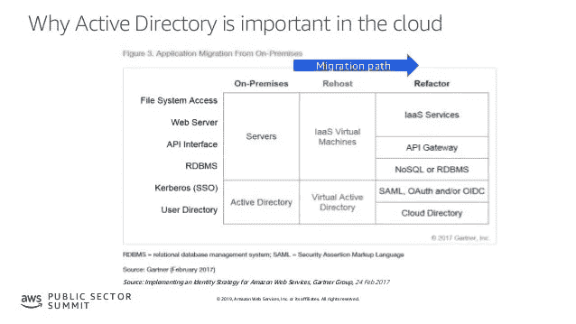

Microsoft AD Deep Dive On AWS

让我们看看*客户为什么部署活动目录*:

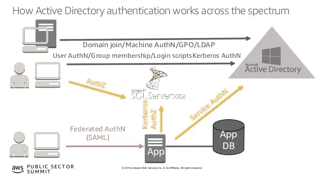

Microsoft AD

无论是内部还是云中的 Windows 工作负载通常都需要活动目录。

无论是在云上还是在内部，延迟都很重要，大多数应用程序都要求 Active Directory 靠近应用程序所在的位置。Active Directory 是一项关键服务，其弹性在 Active Directory 架构中非常重要，因此，您不希望一直依赖网络。

您可能需要管理大量 AWS 资源和服务，并且希望利用现有的 Active Directory 组和用户来控制对 AWS 资源和服务的访问。

有许多应用程序不能通过活动目录进行联合和利用 Kerberos 约束委托。其中一些应用程序可以由 SAML 或 claims 作为前端，但是针对 active directory(如 SharePoint)进行 Kerberos 约束委托。如果你想了解更多关于*[***Kerberos 约束委托与协议转换请看看我在此链接的帖子***](https://www.linkedin.com/pulse/kerberos-constrained-delegation-protocol-transition-claims-altili/) ***。****

*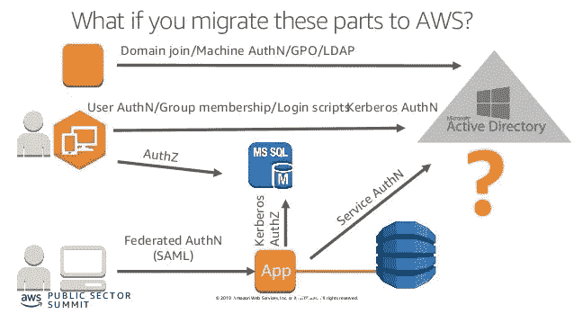*

*Microsoft AD on AWS*

*我们来看一下*在 AWS 上运行 Active Directory 有哪些选择*:*

*1.**自我管理的 AD** ，在 Amazon EC2 实例上部署活动目录。在这种情况下，客户在 active directory 中部署和管理 active directory 基础架构和数据。*

*2. **AWS 托管 AD** ，这是 AWS 服务产品，其中 AWS 管理基础架构，客户负责管理 active directory 中的数据。*

*在这篇文章中，我们将看看使用这两种方法的多种架构模式。让我们讨论一下*为什么我们应该选择一个而不是另一个，以及如何在这两个选项中做出选择:**

*让我们来看第一个自我管理的 AD:那么**为什么要在 ec2 上部署 Active Directory 并管理它**:*

*想要将现有林/域扩展到 AWS *:* AWS 托管 AD 不支持扩展您的现有域。AWS Manage AD 是一个独立于现有域的域。*

*需要域/企业管理权限:AWS 托管 AD 不会授予您域/企业管理权限。相反，您将拥有 ou 的委托权限，这一点我们将在本文后面讨论。*

*扩展现有用户、组、ou 和 GPO:*如果您想在 AWS 和现有域中使用它们。这仅适用于 ec2 上的 Active Directory。**

**内部和 AWS 云之间的单一统一环境:如果您不想拥有两个独立的环境，您需要在 ec2 上部署 Active Directory。这是扩展现有域并使您的现有域对应用程序可用的唯一方法，无论它们位于何处。**

**让我们将第二个 AWS 托管广告作为一个资源域来看:那么**为什么选择 AWS 托管广告选项，推动该选项的一些要求是什么:****

**希望最大限度地减少云中的 ad 基础架构运营管理:如果您不想管理 AD 基础架构，不想管理域，不想每月修补它们，不想备份它们并管理域控制器的可用性。AWS 管理整个基础设施，您只需负责活动目录数据。**

**允许将云广告管理委派给单独的团队，同时保持对用户身份的控制:如果您希望将云 Active Directory 委派给不同于维护基本用户身份的中央 Active Directory 的团队。您可以建立信任来使用这两个目录。**

**需要区分内部环境和 AWS 环境:如果您想要明确区分内部环境和 AWS 云中的内容。您可以通过使用 AWS 托管 ad 来实现这一点，因为它会自动成为一个单独的域。然后，您可以选择是需要单向或双向信任，还是根本不需要信任。让它们完全分开。**

**需要与 AWS 企业应用程序和服务(例如 Amazon RDS、Amazon FSx、AWS 单点登录、AWS 工作文档、AWS 工作邮件、AWS 工作区等)进行本机集成。):如果您需要与 AWS 企业应用程序和服务进行本机集成，那么您可以选择 AWS 托管 AD。**

**让我们看看 AWS 管理的广告的主要功能:**

**Windows Server 2012 R2 域控制器在 2012 R2 功能级别运行。**

**不同可用性区域(AZ)中至少各有 2 个 DC:根据需要添加更多 DC**

**独立或通过信任连接到您的活动目录**

**AWS 企业应用和服务原生集成:EC2 无缝域加入、RDS for SQL Server 认证、授权 Amazon WorkSpaces、Amazon QuickSight 企业版、Amazon Chime Plus/Pro 供应和认证、AWS 单点登录等。**

**组策略，Active Directory 信任支持**

**高可用性和每日快照**

**AWS 是域管理员，您可以获得一个 ou 和该 OU 的委派管理员。对您的 OU 管理帐户的保守授权:应用程序启用限制了一些应用程序，一些管理功能不可用**

**Amazon 职责—操作、多 AZ 部署、补丁程序监控、域控制器恢复、快照和恢复**

**您的职责—管理，通过 AD 控制台和其他 AD 工具进行管理，管理用户、组、GPO 和其他 Active Directory 内容**

**AWS 管理的 Microsoft AD 有两个版本:标准版和企业版。
Standard Edition: AWS 管理的 Microsoft AD (Standard Edition)经过优化，是员工人数不超过 5，000 人的中小型企业的主目录。它提供 1GB 的存储容量，支持多达 30，000*个目录对象，如用户、组和计算机。企业版:AWS 托管 Microsoft AD(企业版)旨在支持拥有多达 500，000*个目录对象和 17 GB 存储空间的企业组织。**

**让我们深入了解典型的部署模式:**

****1。** **将内部广告领域扩展到亚马逊 EC2 上的 AWS****

**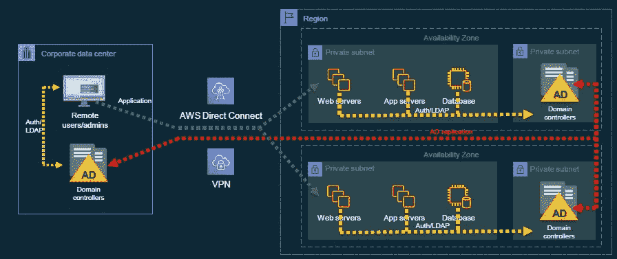**

**Extend AD to ec2**

**在上面的架构中，左边是一个公司数据中心，右边是我们自己运行的域控制器。您可以看到一个 AWS 区域，其中有 web、应用程序、数据库服务器和域控制器。在这种架构中，我们在 ec2 实例上安装 Active Directory，并使它们成为运行在企业数据中心上的同一个域的域控制器。初始 ad 复制和持续复制需要网络连接。我们可以选择 AWS 直连或者 VPN 网络来连接两个网络。在这种架构中，事情是如何运作的？我们在单个区域、单个 VPC 和多个可用性区域运行 web、应用程序和数据库服务器。因此，这与公司数据中心是同一个域；我们在 active directory 中定义站点和服务，以便成员服务器基于这些站点和服务检测域控制器。AWS 区域中的 VPC 被定义为具有适当可用性区域子网的站点，如下例所示。**

**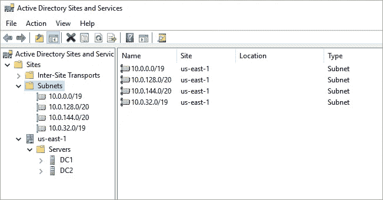**

**AD Sites and Services**

**因此，此 AWS 区域和 AWS 区域 VPC 中的域控制器作为您的站点，具有适当的子网，web、应用程序和数据库服务器将使用本地 Active Directory 控制器进行所有身份验证、组策略和所有 Active Directory 流量。红色虚线是 Active Directory 环境中所有域控制器之间发生的 ad 复制。无论您的域控制器在哪里，无论是在企业数据中心还是在 AWS 上，AD 复制都会继续进行。当远程管理员想要登录到这些 web 服务器之一时。远程管理员将对首次登录工作站进行身份验证，身份验证将在公司 ad 中的本地域控制器上进行。因为它们属于同一个站点，但是当远程管理用户 RDP 进入 web 服务器时，由于站点和服务原因，AWS 中的域控制器会进行身份验证。这种设计统一了环境，使其具有相同的 ou、组策略、用户和计算机对象，并在 AWS 上运行您的工作负载，就像另一个数据中心或另一个站点一样。**

****2。** **使用 AWS 托管 AD 作为资源域****

****

**Extend AD to AWS Managed AD**

**在上面的第二个架构中，我们使用 AWS 管理的 AD 作为资源域。资源域是您将资源对象保存在不同于用户/身份对象所在的域中的地方。因此，在左侧企业数据中心的第二个体系结构中，用户/身份域及其域控制器在此运行。这就是身份的所在。因此，远程管理员用户帐户位于此处。在右边的 web、应用程序和数据库服务器上，但是这些计算机对象作为资源域位于 AWS 管理的 AD 中。该域与公司域中的 active directory 不同。因此，如果您有这些应用程序所需的服务帐户，它们将作为资源位于 AWS 管理的 AD 中。红线代表单向信任，而不是复制。因为信任模型中没有复制。在此架构中，我们展示了一种单向信任，其中 AWS 托管 ad 作为一种资源信任内部企业用户/身份 Active Directory，但反之亦然。此架构允许使用公司内部 Active Directory 的用户身份，登录到 AWS 托管 AD 上运行的任何服务器/资源，而无需复制数据。在这种体系结构中，如果作为远程管理员的用户想要 rdp 到服务器，他将首先登录到 workstation，并且在本地 ad 上进行身份验证，这是本地的。但是，当他 RDP 到 web 服务器时，身份验证仍然会返回到内部 ad，因为用户/身份对象不存在于 AWS 管理的 ad 中。由于这种工作方式，需要在内部和 AWS 区域之间建立强大的网络连接。这需要实时发生，因此强烈建议和需要使用双隧道和冗余方式运行 AWS direct connect 和 VPN。如果没有冗余，并且单个直接连接或单个 VPN 隧道出现故障转移或问题，应用程序将在没有网络连接的情况下继续运行。因为计算机对象和服务帐户位于 AWS 管理的 ad 中。但是，如果没有网络连接，本地 ad 的远程管理员或用户/身份将无法登录 web、应用程序和数据库服务器。**

****3。****ec2 自管理 AD 上的多区域 Active Directory 部署****

**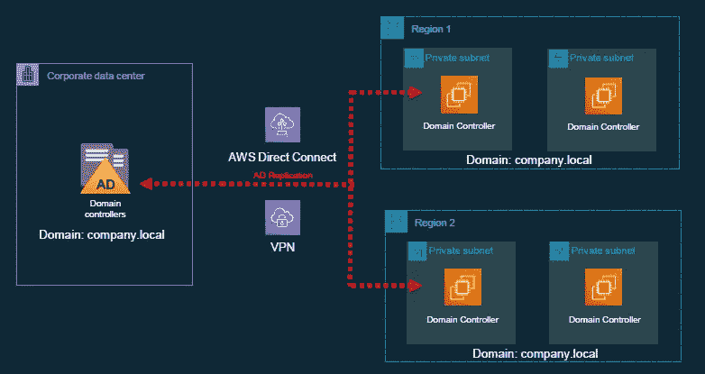**

**Multi Region AD on ec2**

**让我们把这个概念扩展到不止一个地区。许多客户不仅仅在一个地区经营。他们在多个地区运营，因为他们需要靠近用户，或者他们需要灾难恢复等。这种扩张将如何影响建筑？在上述扩展 Active Directory 的体系结构中，您可以将每个区域视为一个 Active Directory 站点，并在每个区域的多个子网和多个 AZ 中放置域控制器。两个 aws 区域上的端域都是 company.local 域。因为我们将同一个域扩展到多个 aws 区域，AWS 上和内部的所有域控制器都包含单个域的所有复制数据。复制流量需要网络连接。**

****4。****AWS 托管 AD 上的多区域 Active Directory 部署****

**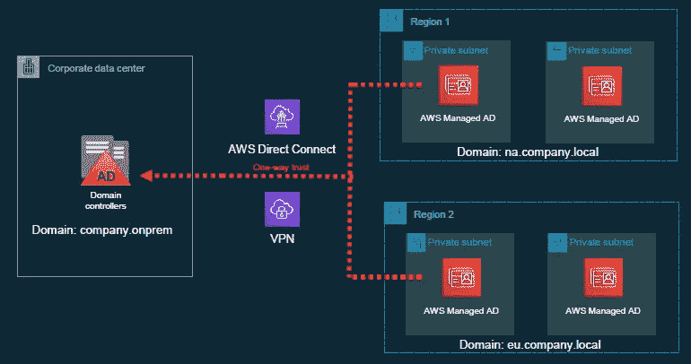**

**Multi Regional AD with AWS Managed AD**

**让我们来看看 aws 管理的 ad 架构。在这个架构中，每个区域有两个不同的域。因为，aws 托管 ad 是区域性服务。这意味着今天你不能跨越区域边界扩展 aws 管理的 ad 域。因此，在多个地区使用 aws 托管 ad 作为资源域需要在每个地区部署一个域。**

**在上述体系结构中，区域 1 中的域是 na.company.local，区域 2 中的域是 eu.company.local。这是两个独立的 aws 管理的 ad 资源域。他们拥有返回到 company.onprem 用户/身份域的单向信任。由于这种架构，您可以在区域性的对象之间进行划分。区域 1 中的成员服务器将是 na.company.local 的成员，区域 2 中的成员服务器将是 eu.company.local 的成员。**

**当管理员登录到工作站时，身份验证在本地的本地域中进行，当管理员 rdp 进入区域 1 或区域 2 服务器时，身份验证需要在本地域中进行。所有服务帐户和计算机对象需要驻留在各自的区域 1 和区域 2 资源域中。因为需要进行身份验证，所以实时网络连接非常重要。网络连接需要具有高度可用的直连和 VPN 架构。**

****5。** **来自 DCs 的互联网名称解析****

**让我们看看互联网域名解析。许多客户将他们的域控制器也用作 DNS 服务器。然而，也有一些客户在不同的设备或路由 53 DNS 中使用。让我们深入探讨互联网域名解析如何适用于这些架构。**

**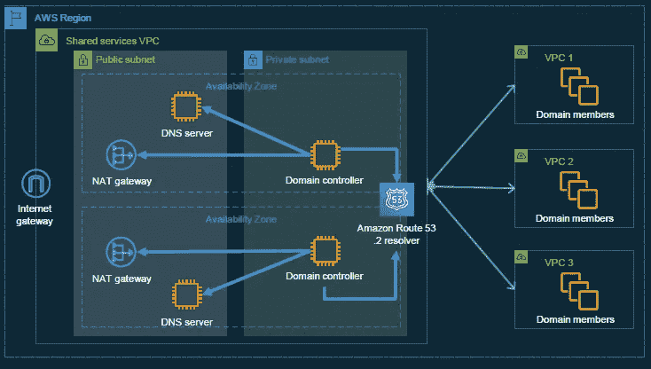**

**Internet Name Resolution**

****互联网名称解析，如果您使用 DNS 的域控制器****

**在这个架构中，右边是多个 VPC，左边是一个共享服务 VPC。AWS 对运行 Active Directory 的建议是将 Active Directory 集中在单个 VPC 的一个区域内。AWS 从安全角度推荐这种方式，我们将在本文后面讨论。但是，您可能有多个 VPC 用于业务部门或应用程序，然后您可以在一个集中的 VPC 中拥有域控制器。不必是两个域控制器，您可以部署任意数量的域控制器。不管是 AWS 管理的 ad 还是 ec2 上的自我管理的 ad。您可以确定需要多少个域控制器来支持您的工作负载。在上面的例子中，它们都指向 DNS 的域控制器。但是，域控制器需要访问 internet 来解析 Internet 名称。**

**第一种方法是*将域控制器指向* [*路由 53 .2 解析器*](https://aws.amazon.com/blogs/aws/new-amazon-route-53-resolver-for-hybrid-clouds/) 。每个 VPC 都有 Route 53 .2 旋变器。您可以将域控制器指向路由 53 .2 解析器，它将为您解析 internet 查询。**这是首选方法。**在链接中你可以找到 AWS 关于 Route 53 .2 resolvers 的博客。**

**第二种方法是在公共子网中运行您自己的 DNS 服务器或设备，这样无需域控制器连接到互联网即可解决重复查询。这是第二种优选的方法。**

**第三种方法是在 DCs 前使用 *nat 网关。因为域控制器不在公共子网中，也不应该在公共子网中。域控制器可以通过将域名放在位于公共子网中的 nat 网关后面来访问互联网以解析域名。***

**在这三种方法中，最优选的方法是使用 Route 53 .2 解析器。第二种首选方式是在公共子网中部署您自己的 DNS 服务器或设备。但是不要忘记照顾这些 DNS 服务器或设备的可用性、可伸缩性和安全性。例如，考虑如何减轻 DNS DDOS 攻击。对于域控制器来说，最好避免 nat 网关方法，因为它们仍然直接连接到互联网上的端点。因为可能存在 DNS 漏洞，并且域控制器有可能暴露于这些漏洞。然而，在 Route53 .2 解析器或公共子网中的 DNS 服务器的情况下，您将 DNS 服务器或 Route53 暴露给互联网，但是域控制器从不直接连接到互联网上的任何名称服务器。**

****6。** **AWS 账户结构****

**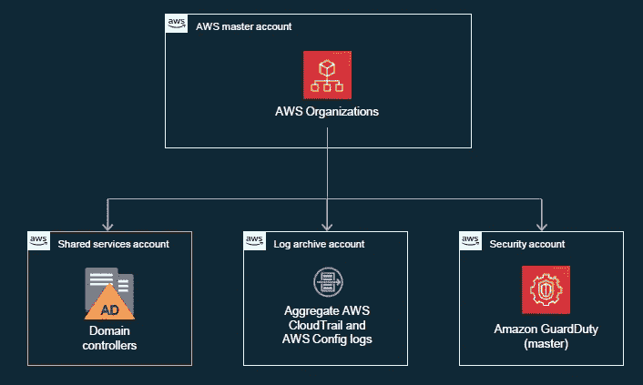**

**AWS Account Structure**

**让我们深入了解 AWS 客户结构。如何处理部署 Active Directory 以支持多个业务部门和应用程序？在上一节中，我们提到 AWS 建议将 Active Directory 集中到每个地区的单个 VPC。那么 VPC 应该在哪个帐户结构中？AWS 拥有[登陆区](https://aws.amazon.com/solutions/aws-landing-zone/)解决方案和 [AWS 控制塔](https://aws.amazon.com/controltower/)，可在 AWS 环境中管理和部署多账户策略。这些 AWS 服务帮助管理多个帐户，并在所有 AWS 帐户之间划分角色。因此，我们可以扩展 AWS 资源，而不用担心帐户和职责分离。**

**AWS 为 Active Directory 建立了帐户结构。在上图中，有一个 AWS 主帐户，它是组织的主帐户。有一个安全帐户，共享服务帐户和登录帐户。像警卫职责或安全工具位于安全帐户，我们所有帐户的日志都在日志存档帐户。因此，Active Directory 帐户可以是共享服务帐户，也可以是 Active Directory 的专用帐户。我们应该将活动目录与其他所有内容分开，尤其是业务部门。因为这样可以集中管理它们，并轻松控制对它们的访问。我们将在本帖的后续部分深入探讨安全性。**

****7。****AWS 上的 Active Directory 安全最佳实践****

**让我们看看 AWS 上的 Active Directory 安全最佳实践。**

**将广告集中在一个 AWS 帐户中。在一个单独的帐户中控制访问比试图在您的业务部门运营的多个帐户中控制许多人对 AD 的访问更容易。**

**限制对 EC2/EBS/目录服务的访问。只有有限数量的授权人员有权管理对 active directory 和快照 ebs 卷的控制访问或对 Active Directory 的 ebs 卷的访问。只有有限数量的授权人员有权启动、停止或终止域控制器。**

**限制安全组仅允许来自所需网络的 AD 端口。安全组帮助过滤流量，只允许 AD 端口(身份验证、复制、信任等。)是所需网络所需的。**

**加密 EBS 卷以进行数据加密，加密 LDAPS 以进行传输。使用 AWS KMS 和 HSM(如有必要)加密 EBS 卷，并打开 LDAPs，以便您的身份验证流量即使在 VPC 也能加密。如果您使用 kms 来加密 EBS 卷，请考虑为 Active Directory 使用单独的主密钥。因为这样您就可以轻松控制谁需要访问该主密钥，并控制谁可以解密使用该客户主密钥加密的 EBS 卷和快照。**

**安全日志是您的身份存储上发生的活动的最佳信息来源。监控安全日志中的异常情况，并为关键安全事件设置警报。可以将安全日志推送到 Cloudwatch，设置警报。**

**从管理服务器执行 AD 管理任务。这增加了谁执行什么任务的安全性和可审计性。**

****8。** **AWS 托管微软广告安全****

**让我们看看 AWS 管理的微软广告安全:**

**AWS 托管 AD 是单租户。您的 DCs 仅包含您的数据。**

**大多数管理任务由 AWS 自动完成。当需要人工干预时，AWS 有支持工程师流程。他们将具有有限的即时访问权限和最低特权访问权限。他们没有管理员权限。**

**域控制器，安全日志传送到亚马逊云观察日志。**

**使用预定义的用户、组和 ou 授予委托管理访问权限。**

**将管理服务器用于管理任务；无法 RDP 到域控制器**

**AWS 托管 AD 将使用路由 53 (.2 解析器)进行互联网绑定查询**

**默认情况下，EBS 卷使用 AWS KMS 加密。所有快照都经过加密并安全存储**

**AWS 托管广告支持 LDAPS。**

**在下表中，您可以找到 AWS 托管活动目录的 AWS 共享责任模型。**

**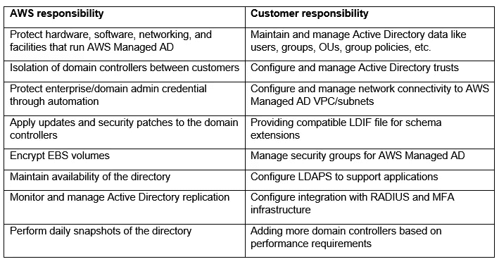**

**AWS Shared Responsibility AWS Managed AD**

****9。** **共享活动目录****

**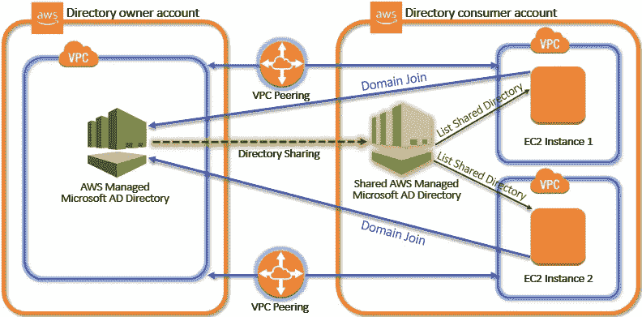**

**Sharing AWS Managed AD**

**AWS 管理的 Microsoft AD 与 AWS 组织紧密集成，允许在多个 AWS 帐户之间无缝共享目录。您可以与同一组织内的其他受信任的 AWS 帐户共享一个目录，也可以与组织外的其他 AWS 帐户共享该目录。当您的 AWS 帐户当前不是组织成员时，您也可以共享您的目录。借助 AWS 管理的 Microsoft AD，您可以为多个用例共享一个目录。例如，您可以共享一个目录来鉴定和授权访问。NET 应用程序、支持 Windows 身份验证的 Amazon RDS for SQL Server 以及用于消息传递和视频会议的 Amazon Chime。下图显示了 AWS 管理的 Microsoft AD 目录的一些用例。这些功能包括授予您的用户访问外部云应用程序的权限，以及允许您的内部 AD 用户管理和访问 AWS 云中的资源。**

**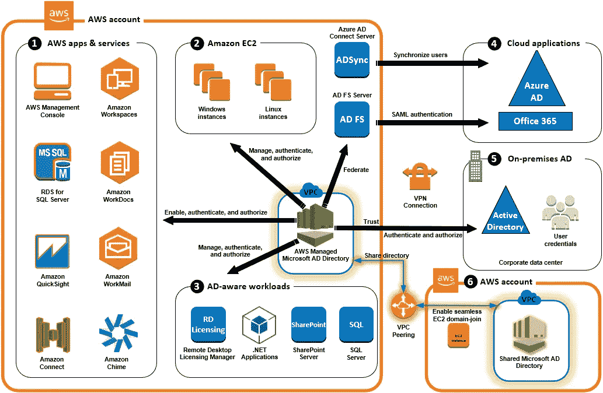**

**AWS Managed AD Use Cases**

**您可以将 AWS 管理的 Microsoft AD 用于以下任何一种业务用例:**

****1。**使用 AD 凭据登录 AWS 应用程序和服务**

****2。**管理亚马逊 EC2 实例**

****3。**为 AD 感知工作负载提供目录服务**

****4。**登录 Office 365 和其他云应用**

****5。**通过内部 AD 建立对 AWS 云的信任**

****6。**共享您的目录，将 Amazon EC2 实例无缝加入 AWS 帐户的域**