# 深入探讨 AWS 应用程序负载平衡器和网络负载平衡器的高级功能

> 原文：<https://medium.datadriveninvestor.com/deep-dive-on-advanced-features-on-aws-application-load-balancer-and-network-load-balancer-49b05662e06?source=collection_archive---------1----------------------->

我将尝试分享关于最新的 AWS 应用程序负载平衡器(ALB)和网络负载平衡器特性的提示和技巧。我将尝试解释部署、配置和利用这些特性的最佳方式。

如何使用 Lambda 函数作为应用程序负载平衡器的目标来服务 HTTP(S)请求。

U 在应用程序负载平衡器中使用内置认证，在用户访问应用程序时安全地认证用户。

E 解释了基于内容的路由规则中的扩展路由标准，以建立复杂的规则，通过高级请求路由、固定响应、重定向、服务器名称指示符将客户端请求路由到应用程序。

让我们来看看弹性负载均衡系列目前有三种类型的负载均衡器。

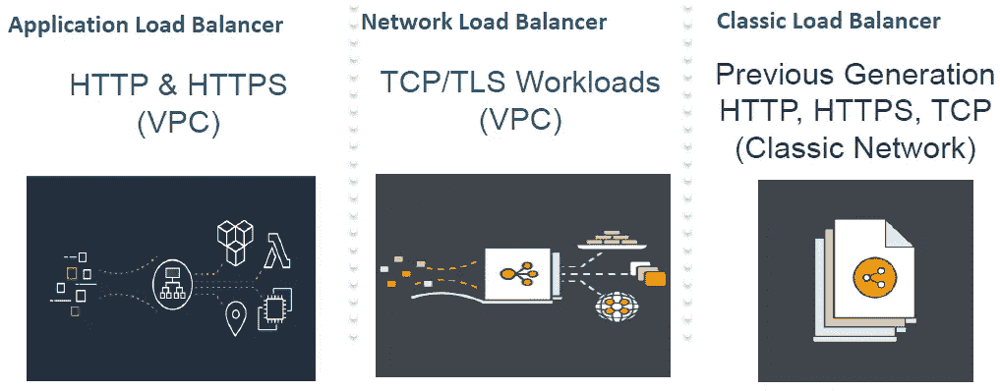

AWS ELB Family

**应用负载平衡器(ALB)** 最适合 HTTP 和 HTTPS 流量的负载平衡。应用负载平衡器(ALB)在 OSI 第 7 层的请求级别运行，并提供高级请求路由功能，如基于路径和主机的路由 web 套接字 HTTP 2 和其他目标可见性功能，以及包括微服务在内的应用架构。

**网络负载均衡器(NLB)** 在 OSI 第 4 层运行，最适合 TCP 流量(传输控制协议)和 TLS(传输层安全协议)流量的负载均衡，这些流量需要极高的性能。NLB 在连接级别运行，每秒能够处理数百万个请求，同时保持超低延迟。网络负载平衡器还支持静态 IP 功能，即每个可用性区域获得一个 IP。

**经典负载均衡器**提供跨多个 ec2 实例的负载均衡，并在第 7 层请求级别和第 4 层连接级别运行。然而，传统负载平衡器没有投资，最终将被淘汰。因此，如果您不使用 VPC，请仅对使用较旧的 ec2 经典网络构建的应用程序使用经典负载平衡器。

让我们来看看弹性负载平衡系列的一些优势:

**高度可用**

弹性负载平衡在多个可用性区域中的多个目标(Amazon EC2 实例、容器、IP 地址和 Lambda 函数)之间自动分配传入流量，并确保只有健康的目标才能接收流量。弹性负载平衡还可以跨区域进行负载平衡，将流量路由到不同可用性区域中的健康目标。亚马逊弹性负载平衡服务级别协议承诺负载平衡器的可用性为 99.99%。

**安全**

弹性负载平衡与亚马逊虚拟专用云(VPC)协同工作，提供强大的安全功能，包括集成的证书管理、用户认证和 SSL/TLS 解密。它们共同为您提供了集中管理 TLS 设置和从您的应用中卸载 CPU 密集型工作负载的灵活性。ELB 可以通过创建接口 VPC 端点，在虚拟私有云(VPC)和弹性负载平衡 API 之间建立私有连接。您可以使用此连接从您的 VPC 调用弹性负载平衡 API，而无需通过互联网发送流量。接口 VPC 端点由 [AWS PrivateLink](https://aws.amazon.com/privatelink/) 提供支持，该功能支持使用私有 IP 地址的 AWS 服务之间的私有通信。

**弹性**

弹性负载平衡能够处理网络流量模式的快速变化。此外，与自动扩展的深度集成确保有足够的应用程序容量来满足不同级别的应用程序负载，而无需手动干预。

**灵活**

弹性负载平衡还允许您使用 IP 地址将请求路由到应用程序目标。这为您提供了虚拟化应用程序目标的灵活性，允许您在同一实例上托管更多应用程序。这也使这些应用能够拥有单独的安全组，并使用相同的网络端口来进一步简化基于微服务的架构中的应用间通信。

**稳健监控&审计**

弹性负载平衡允许您通过 Amazon CloudWatch 指标、日志记录和请求跟踪来实时监控您的应用程序及其性能。这提高了对应用程序行为的可见性，在单个请求的粒度上发现问题并识别应用程序堆栈中的性能瓶颈。

**混合负载均衡**

弹性负载平衡提供了使用同一负载平衡器跨 AWS 和内部资源进行负载平衡的能力。这使得您可以轻松地将本地应用程序迁移、突发或故障转移到云。

弹性负载平衡器系列与 14 种以上的其他 AWS 服务集成，包括自动扩展以满足后端目标的扩展需求。DNS 的 53 号路由。衡量标准的亚马逊云观察。集装箱的 ECS 和 EKS。为部署而部署代码。AWS config 也是 ACM，它是证书管理器等等。

# **ALB 和 NLB 上最近推出的功能概述**

在我们深入探讨具体领域之前。我想回顾一下最近在应用程序和网络负载平衡器上推出的一些功能。ELB **的*控制台支持通过标签*、*资源和标签为基础的权限*、对 ALB 和 NLB 进行过滤，这使得能够使用 IAM 策略在负载平衡器上实施细粒度的访问控制。 ***慢启动*** *为 ALB* 。默认情况下，一旦目标向目标组注册并通过初始运行状况检查，它就开始接收其全部请求份额。在负载平衡器向目标发送全部请求之前，使用慢启动模式可以让目标有时间预热。为目标组启用慢速启动后，目标在注册到目标组时会进入慢速启动模式，并在配置的慢速启动持续时间过后退出慢速启动模式。在慢启动模式下，负载平衡器线性增加它可以发送到目标的请求数量。在目标退出慢启动模式后，负载均衡器可以向它发送完全共享的请求。***ALB 上的用户认证支持****允许您配置应用程序负载平衡器，以便在用户访问应用程序时对其进行安全认证。这使您能够将认证用户的工作转移到负载平衡器，以便应用程序可以专注于其业务逻辑。 *AWS* ***Lambda 作为目标*** *上 ALB。*除了 ec2 实例和基于 IP 的目标之外，负载平衡器还支持 Lambda 函数。 ***高级请求路由*** 超出已经支持的路径和基于主机的路由。我将深入这三个领域中的每一个:用户身份验证、作为目标的 AWS lambda 和高级请求路由。在应用负载平衡器和网络负载平衡器**上推出的一些其他最新功能是*更多 TLS 策略*** *到负载平衡器*。(ELB 安全策略 FS 2018 06 和 ELB 安全策略 TLS 1 2 Ext 2018 06)这些最新策略实施了密码，可确保应用负载平衡器上的前向保密性。从负载均衡器本地重定向*** **的能力**做*可以从 80 重定向到 443 或 HTTP 重定向到 HTTPS 或从一个 URL 重定向到另一个。 ***修复响应*** 是添加到 ALBS 的另一个有趣的特性，它允许您基于某些条件从负载平衡器本身发送一个固定的响应。网络负载平衡器增加了对 ***跨区域负载平衡* NLB 的支持，对 NLB 的*区域间和区域内对等和 VPN* 支持，对 NLB 上 TLS 终止***** 的*支持，允许您在终止 TLS 的同时仍然保留客户端的来源。 ***网络负载平衡器支持 UDP*** 。我们现在可以使用 NLB 为在线游戏、物联网、流媒体、媒体传输和本地 UDP 应用部署无连接服务。如果您在自己的数据中心托管 [DNS](https://en.wikipedia.org/wiki/Domain_Name_System) 、 [SIP](https://en.wikipedia.org/wiki/Session_Initiation_Protocol) 、 [SNMP](https://en.wikipedia.org/wiki/Simple_Network_Management_Protocol) 、 [Syslog](https://en.wikipedia.org/wiki/Syslog) 、 [RADIUS](https://en.wikipedia.org/wiki/RADIUS) 和其他 UDP 服务，您现在可以将这些服务转移到 AWS。您还可以部署服务来处理认证、授权和记账，通常称为 [AAA](https://en.wikipedia.org/wiki/AAA_(computer_security)) 。***

您不再需要维护一组代理服务器来接收 UDP 流量，现在您可以对 TCP 和 UDP 流量使用同一个负载平衡器。您可以简化您的体系结构，降低成本，并提高可扩展性。

# 议程

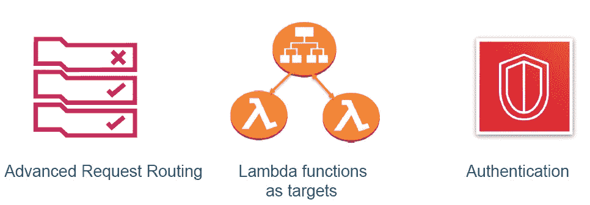

ALB Features

我将深入这三个领域中的每一个:用户身份验证、作为目标的 AWS lambda 和高级请求路由。首先是高级请求路由、重定向、固定响应，然后是 lambda 函数目标，最后是身份验证。

# 高级请求路由

新的请求路由标准到 alb 的基于内容的路由中。这些新标准是:

标准/自定义 HTTP 头
标准/自定义 HTTP 方法
查询参数和查询字符串
源 IP 地址

在此之前，ALB 支持基于主机头和路径的路由。ALB 能够基于 HTTP 请求中除正文之外的几乎任何字段进行路由。让我们看一个典型的请求。

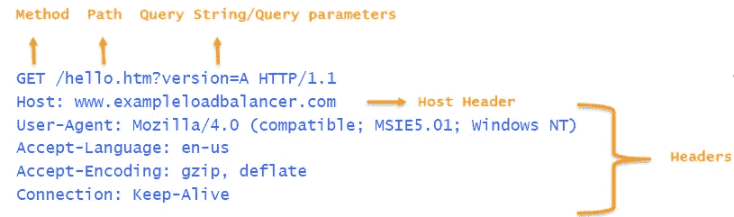

Typical Request

您在上面看到的是一个 get 请求。以 GET 开始，这是一个方法，因此您可以基于方法进行路由。然后你有 path /hello.htm，你可以基于这个路由。然后，您有查询参数的查询字符串，您可以基于它们进行路由。接下来是一个主机头和基于主机头的路由，它从发布时就存在了。现在增加了基于任何定制或标准报头的路由能力。所以 HTTP 请求中几乎涵盖了所有内容。

让我们看一下可以从这一新的路由标准中获益的用例。通过基于*用户代理的路由*，我们可以将机器人流量从人类用户中分离出来，并为每一类用户提供不同的体验。类似地，我们可以使用用户代理头根据设备类别或使用*源 IP 地址*根据用户的地理位置提供各种用户体验。另一个用例是基于*查询字符串的路由*是 a/b 测试。同样，在部署方面，我们可以*使用基于报头的路由*进行蓝绿色部署或金丝雀部署。在微服务上，当您希望拥有基于方法的微服务处理程序时，基于*方法的路由*非常方便。例如，您可以将 get 和 head 方法路由到 read 服务，而将 post 和 put 方法路由到 write 服务。最后，您还可以使用基于 IP 地址的额外限制，或者使用基于 IP 地址的*源路由*的 CDN 网络。

现在让我们看看并理解 AWS ALB 规则中的操作和条件是如何工作的。一个规则可以有一个或多个条件。和一个或多个动作。基本上，我们有路由标准，即条件、条件类型和操作。

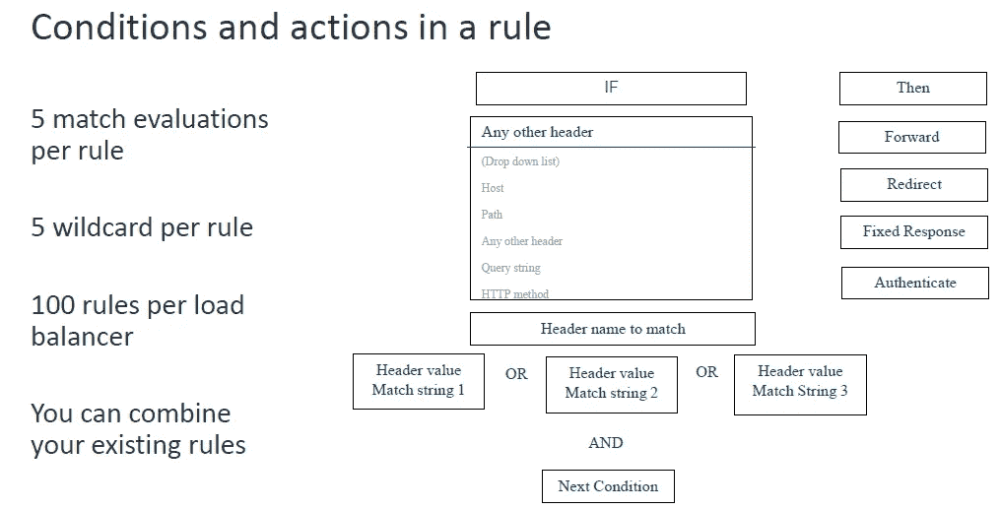

Conditions and Actions

说到行动:

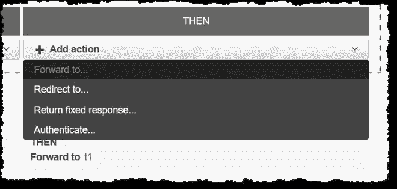

ALB Actions

Forward to 将请求路由到目标组(一组 EC2 实例、一个 Lambda 函数或一组 IP 地址)。重定向至“生成 301(永久)或 302(找到)响应”诊断树，也可用于在 HTTP 和 HTTPS 之间切换。Return fixed response 生成带有任何所需响应代码的静态响应。Authenticate 使用 [Amazon Cognito](https://aws.amazon.com/cognito/) 或 OIDC 提供商来验证请求(仅适用于 HTTPS 听众)。

只需编辑现有的规则，您就可以将此功能用于现有的应用程序负载平衡器。关于这个又酷又强大的新功能，你还应该知道其他一些事情:

指标—您可以查看规则评估和 HTTP 固定响应计数云观察指标，以了解与您的规则相关的活动的更多信息([了解更多信息](https://docs.aws.amazon.com/elasticloadbalancing/latest/application/load-balancer-cloudwatch-metrics.html)):

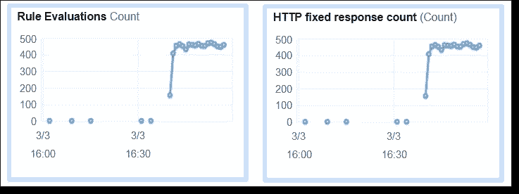

CloudWatch Metrics

程序化访问——您还可以使用 [ALB API](https://docs.aws.amazon.com/elasticloadbalancing/latest/APIReference/Welcome.html) 和 [CLI](https://docs.aws.amazon.com/cli/latest/reference/elbv2/index.html) 创建、修改、检查和删除规则(CloudFormation 支持就绪)。

规则匹配—规则由字符串匹配提供支持，所以要好好测试并仔细检查您的规则是否按预期运行。ALB 访问日志中的 matched_rule_priority 和 actions_executed 字段在调试和测试时会很有帮助([了解更多](https://docs.aws.amazon.com/elasticloadbalancing/latest/application/load-balancer-access-logs.html#access-log-entry-format))。

限制—每个 ALB 最多可以有 100 条规则，不包括默认值。每个规则最多可以引用 5 个值，最多可以使用 5 个通配符。条件的数量仅受引用的唯一值的数量限制。

ALB 现在允许您对每个规则进行最多五次匹配评估。您可以在一个条件中使用这些评估，也可以交叉使用最多五个条件。限制适用于规则级别无关紧要。同样，您也可以使用，每个规则最多五个通配符。每个负载平衡器 100 条规则的总体限制。一个规则中五个值的灵活性使您可以将多个单独的规则组合成更少的规则。让我们以/login 和/signin 指向同一个目标组的路径规则为例。现在你可以用一条规则而不是两条来完成它们。

现在演示基于请求的高级路由。你可以在[https://example load balancer . com/advanced _ request _ routing _ demo . html](https://exampleloadbalancer.com/advanced_request_routing_demo.html)找到所有的演示和解释。

# 基于查询参数的路由

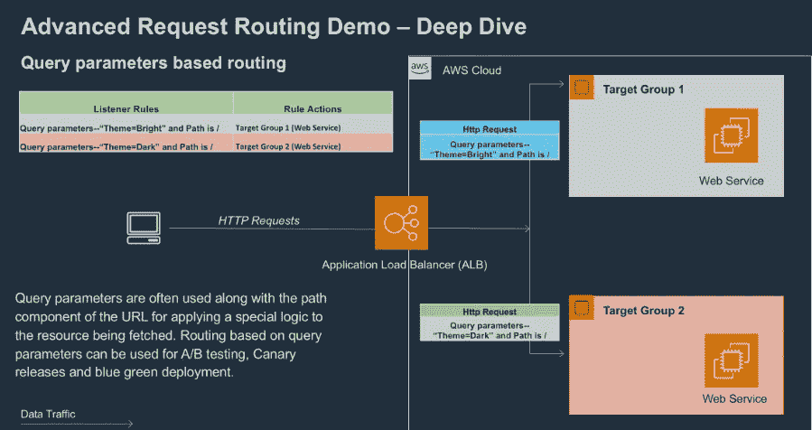

Query Parameters

在上述示例中，基于查询参数主题 bright 和/ path 请求路由目标组 1。(【https://exampleloadbalancer.com/arr_parameter?theme=bright】T2

同样基于查询参数主题黑暗和/路径请求路由目标组 2。(【https://exampleloadbalancer.com/arr_parameter?theme=dark】T4)

1.当您单击该按钮时，一个 HTTP 请求被发送到“exampleloadbalancer”演示应用程序负载平衡器，并带有 URI
2 中的一个查询参数。在应用负载平衡器上配置了两个路由规则，它们根据请求
3 中的查询参数将请求路由到不同的目标组。当您使用查询参数“theme=bright”时，应用程序负载平衡器会返回 bright theme 的页面。同样，当您在请求查询参数中使用“theme=dark”时，您将看到相同的暗主题网页。
4。查询字符串的模式匹配不区分大小写

对于条件中的每个评估，如果查询字符串中的查询参数与作为输入提供的键-值对(包括任何通配符)匹配，则匹配成功。通配符“*”(匹配 0 个或更多字符)和通配符“？”(仅匹配一个字符)可以使用，但建议您避免使用“*”和“？”在查询字符串中。如果存在，“*”和“？”从字面上解释为一个字符，为了与匹配字符串中的通配符区分开来，您需要在这些字符前面加上一个转义字符。

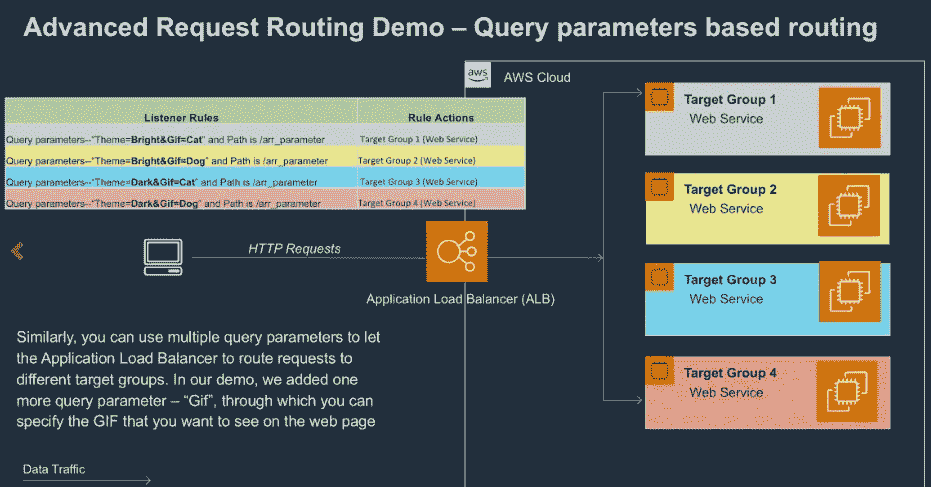

Query parameters based routing

您可以使用多个查询参数让应用程序负载平衡器将请求路由到不同的目标组。在 demo 中，增加了一个查询参数—“gif ”,通过它，您可以指定希望在网页上看到的 GIF。请检查并尝试[https://example load balancer . com/advanced _ request _ routing _ query param _ overview . html](https://exampleloadbalancer.com/advanced_request_routing_queryparam_overview.html)

# 基于 HTTP 方法的路由

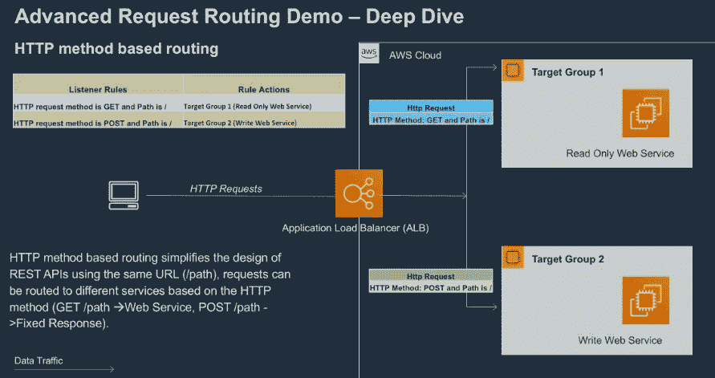

HTTP Method


HTTP Routing

1.  当您单击“GET”按钮时，一个 HTTP GET 请求被发送到“exampleloadbalancer”演示应用程序负载平衡器。

2.在应用程序负载平衡器上配置了两个路由规则。

规则 1:应用程序负载平衡器为 path /arr_method 的任何 GET 请求返回固定的响应静态页面。

规则 2:应用程序负载平衡器将 path /arr_method 的任何 POST 请求路由到 Lambda 目标组，该目标组解析 POST 请求中的城市数据，并返回给定城市的天气信息

3.您配置的 HTTP 方法名必须与请求中的 HTTP 方法完全匹配。

4.匹配字符串中不支持通配符，方法名区分大小写。

5.支持自定义方法。例如，您可以使用 RENEW、ALLOC、FIND 等方法。方法名中只允许使用大写字母(A-Z)、连字符(-)和下划线(_)。示例版本控制、CUSTOM_METHOD、ALLOW 等。方法名中的最大字符数限制为 40，并且方法名区分大小写。

6.配置了两个路由规则来演示自定义 HTTP 方法的工作原理。

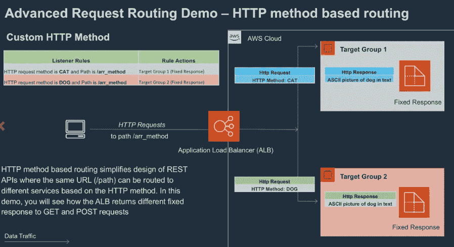

HTTP Method


HTTP Routing

规则 1:自定义 HTTP 方法是 CAT。应用程序负载平衡器为 path /arr_method 的任何 CAT 请求返回固定的响应静态页面。

规则 2:自定义 HTTP 方法是 DOG。应用程序负载平衡器为 path /arr_method 的任何 CDOG 请求返回固定响应静态页面。

[https://example load balancer . com/advanced _ request _ routing _ http method _ overview . html](https://exampleloadbalancer.com/advanced_request_routing_httpmethod_overview.html)

# 基于源 IP CIDR 的路由

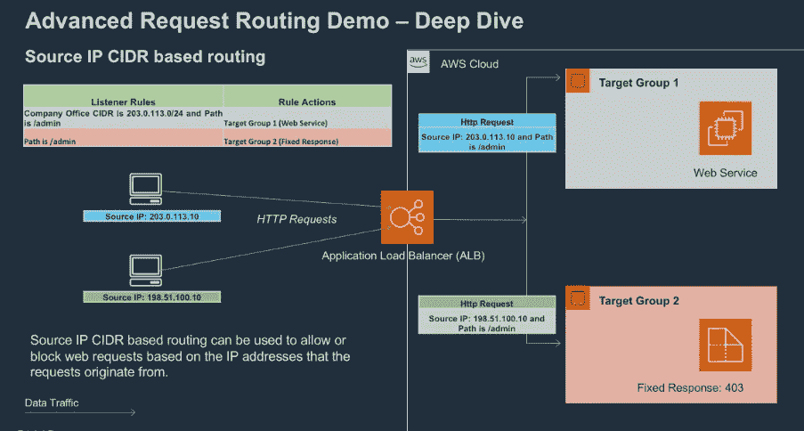

Source IP CIDR

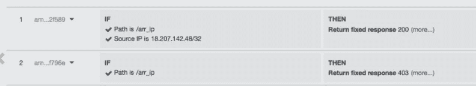

SOURCE IP Routing

1.  假设有一个页面只能从您的管理网络访问，其 IP CIDR 是 203.0.113.0/24。

2.当您从管理网络访问管理页面时，您将看到一个“欢迎页面”。但是，当您从任何其他 IP CIDR 访问该页面时，您将得到一个错误页面。

# 基于 HTTP 头的路由(用户代理头)

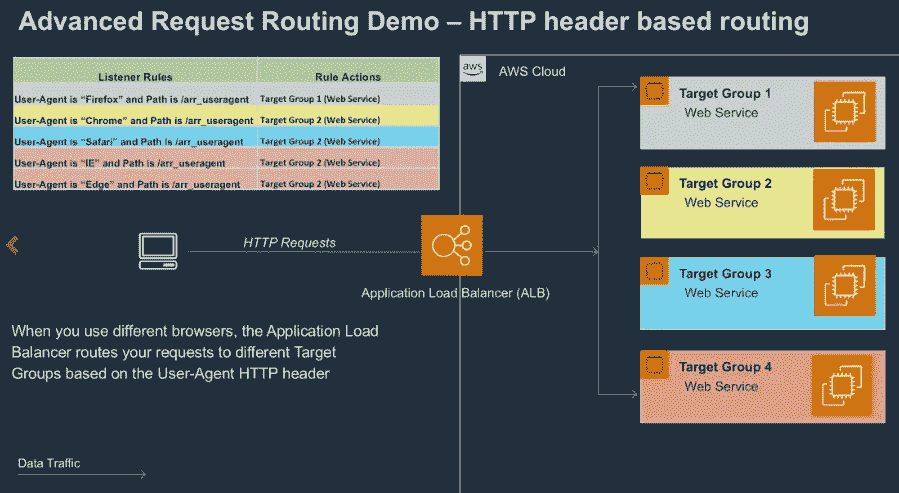

HTTP Header

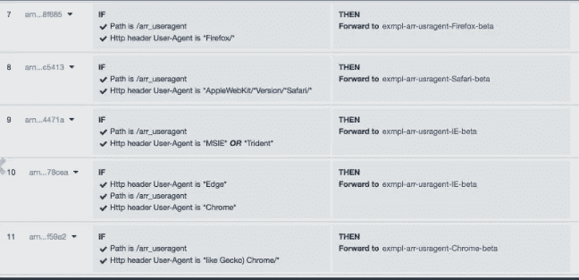

HTTP Header routing

1.当您单击该按钮时，一个 HTTP 请求会发送到“exampleloadbalancer”应用程序负载平衡器，其中包含您的浏览器的用户代理信息。
2。应用负载均衡器上配置了四个路由规则，根据用户代理头(Chrome、Firefox、Safari、IE 和 Edge)将请求路由到不同的目标组。
3。当您从上面列出的浏览器访问页面时，您将看到应用程序负载平衡器提供的不同页面。
4。对于条件中的每个评估，如果头值与作为输入提供的匹配字符串相匹配，并且匹配字符串中包含任何通配符，则匹配成功。
5。正如您在规则配置中看到的，通配符“*”(匹配 0 个或更多字符)或通配符“？”支持(仅匹配一个字符)
[尝试在不同的浏览器中点击此按钮](https://exampleloadbalancer.com/arr_useragent)

另外，你可以在[https://Aws . Amazon . com/blogs/Aws/new-advanced-request-routing-for-Aws-application-load-balancers/](https://aws.amazon.com/blogs/aws/new-advanced-request-routing-for-aws-application-load-balancers/)阅读 Aws 关于高级请求路由的博客。

# ALB 重定向功能

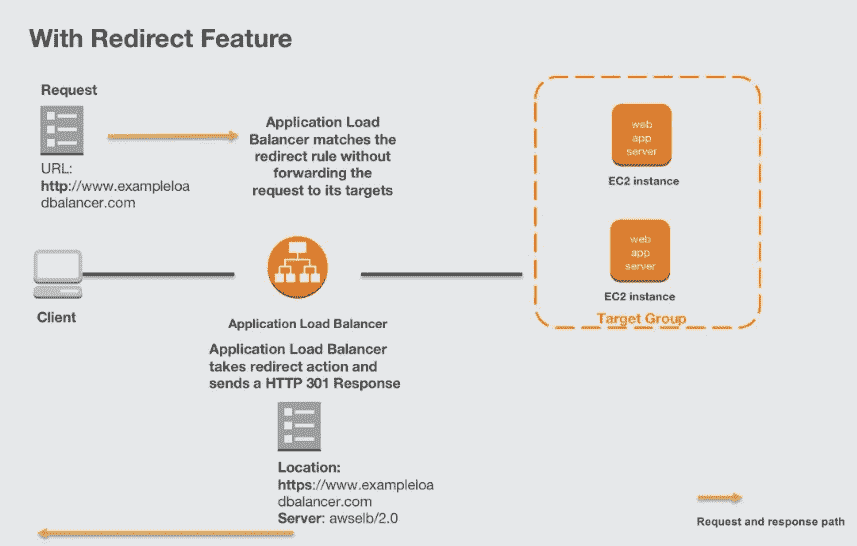

Redirect Feature

ALB 可以将 HTTP 请求重定向到 HTTPS。应用程序负载平衡器支持将 HTTP 重定向作为一项操作发送到您的客户端。这允许您轻松地将 HTTP 流量重定向到您的 HTTPS，使您不必仅仅为了执行重定向而运行 web 服务器。您可以基于任何路由规则重定向请求。如果您有一个旧的 URI，您不希望在您的应用程序中维护重定向，请将它卸载到应用程序负载平衡器！

当一个请求通过带有 cURL 的 HTTP 发送到 exampleloadbalancer 演示站点时， *ALB(服务器:awselb/2.0)* 通过发送一个*“HTTP 301 永久移动”*响应来重定向请求，该响应将“位置”头设置为使用 HTTPS 的重定向 URL。

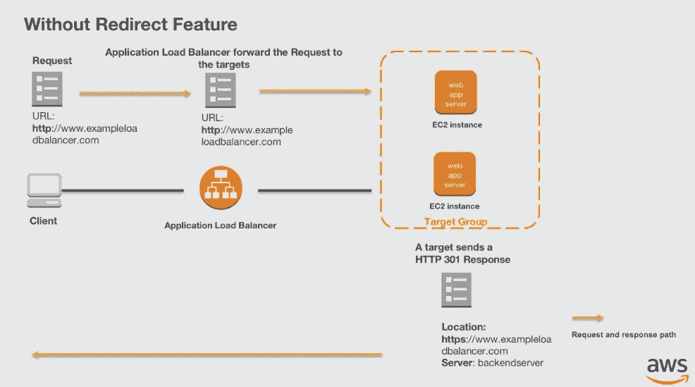

Without Redirect

**可以试试**[**http://exampleloadbalancer.com/**](http://exampleloadbalancer.com/)

# 固定响应

您可以使用固定响应操作来丢弃客户端请求并返回自定义 HTTP 响应。您可以使用此操作返回 2XX、4XX 或 5XX 响应代码和可选消息。对 URI 的请求被发送到应用程序负载平衡器，它通常会将其路由到您的一个目标，但是，当您配置路由规则以提供固定响应时，负载平衡器会生成响应并将其直接发送到客户端。您的后端不会接收请求，从而让您专注于提供应用程序。

```
[
  {
      "Type": "fixed-response",
      "FixedResponseConfig": {
          "StatusCode": "200",
          "ContentType": "text/plain",
          "MessageBody": "Hello world"
      }
  }
]
```

https://exampleloadbalancer.com/fixed_200

https://exampleloadbalancer.com/fixed_404

https://exampleloadbalancer.com/fixed_599

应用程序负载平衡器通过使用 SNI 的智能选择支持多个 TLS 证书。

创建 HTTPS 侦听器时，必须指定一个证书。该证书被称为*默认证书*。

如果您在[证书列表](https://docs.aws.amazon.com/elasticloadbalancing/latest/application/create-https-listener.html#sni-certificate-list)中指定附加证书，则仅当客户端连接时不使用服务器名称指示(SNI)协议来指定主机名，或者证书列表中没有匹配的证书时，才会使用默认证书。

如果您没有指定额外的证书，但需要通过单个负载平衡器托管多个安全应用程序，则可以使用通配符证书，或者为证书中的每个额外域添加一个主题备用名称(SAN)。创建 HTTPS 侦听器后，它有一个默认证书和一个空证书列表。您可以选择将证书添加到侦听器的证书列表中。使用证书列表使负载平衡器能够在同一端口上支持多个域，并为每个域提供不同的证书。

负载平衡器使用支持 SNI 的智能证书选择算法。如果客户端提供的主机名与证书列表中的单个证书匹配，负载平衡器将选择该证书。如果客户端提供的主机名与证书列表中的多个证书匹配，负载平衡器会选择客户端可以支持的最佳证书。证书选择基于以下标准，顺序如下:

公钥算法(首选 ECDSA 而非 RSA)
；哈希算法(首选 SHA 而非 MD5)
；密钥长度(首选最大值)
；有效期

负载平衡器访问日志条目指示客户端指定的主机名和提供给客户端的证书。

AWS 关于 SNI 的博客在[https://AWS . Amazon . com/blogs/AWS/new-application-load-balancer-sni/](https://aws.amazon.com/blogs/aws/new-application-load-balancer-sni/)

演示在[https://exampleloadbalancer.info/sni_demo.html](https://exampleloadbalancer.info/sni_demo.html)

# 如何使用应用负载平衡器和 AWS PrivateLink 安全地大规模发布互联网应用

继博文[https://AWS . Amazon . com/blogs/networking-and-content-delivery/how-to-securely-publish-internet-applications-at-scale-using-application-load-balancer-and-AWS-private link/？nc1=b_rp](https://aws.amazon.com/blogs/networking-and-content-delivery/how-to-securely-publish-internet-applications-at-scale-using-application-load-balancer-and-aws-privatelink/?nc1=b_rp)

解释如何将 PrivateLink 与应用程序负载平衡器结合起来，将 web 应用程序发布到 Internet，而不需要 EC2 或 VPC 对等上托管的代理。

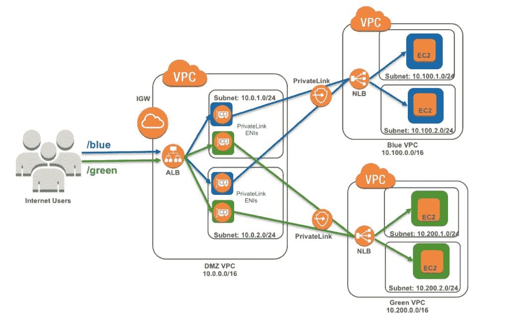

AWS Private Link and ELB

# **如何使用 AWS PrivateLink 通过显式代理来保护和扩展网页过滤**

以下博文[https://AWS . Amazon . com/blogs/networking-and-content-delivery/how-to-use-AWS-private link-to-secure-and-scale-web-filtering-using-explicit-proxy/](https://aws.amazon.com/blogs/networking-and-content-delivery/how-to-use-aws-privatelink-to-secure-and-scale-web-filtering-using-explicit-proxy/)解释了如何使用 AWS PrivateLink 来集中您的网页过滤解决方案，而无需使用 VPC 对等、VPN 或 EIP

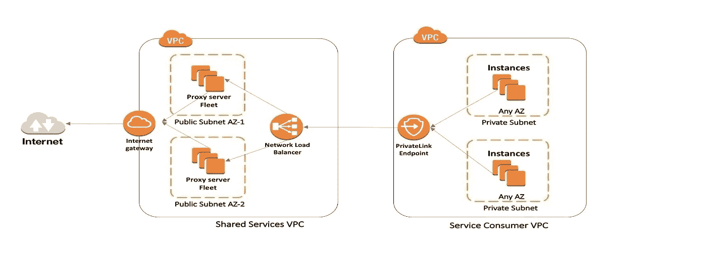

Proxy with ELB and Privatelink

# λ的功能是作为目标

现在让我们深入研究 lambda 函数作为目标。ALB 为所有这些不同计算工作负载(如 Ec2、容器、Ip 地址和现在的 lambda)提供了一个 HTTP 端点。Lambda 作为一个目标，在 alb 后面启用事件驱动的无服务器计算。ALB 和 Lambda 函数应该属于同一个帐户。

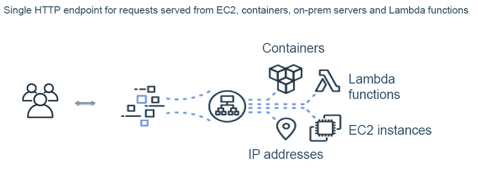

Taregets as Lambda, Ec2, Onprem

lambda 函数作为目标的好处:

将网站构建为无服务器代码
Lambda 来管理和运行您的功能
ALB 作为简单的 HTTP 前端
HTTP 和 HTTPS 协议
使用任何 Lambda 支持的编程语言
ALB 基于内容的路由规则
混合计算的混合应用
使用无服务器为 ALB 创建自定义目标，例如 S3

现在让我们看看如何在 alb 中将 lambda 函数设置为目标。

1.作者 a Lambda 函数
2。创建目标类型为 lambda
3 的目标组。向 ELB 提供粒度权限，以调用您的目标 lambda 函数
4。将 Lambda 函数 ARN 注册到目标组
5。将目标组与监听程序规则相关联

您也可以在控制台中创建 ALB 作为触发器。下面是截图。

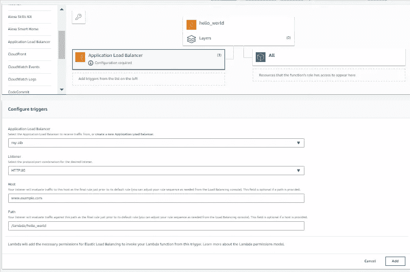

ALB as Trigger

lambda 与 alb 的集成有一个很酷的地方。这是中对 lambda 函数的健康检查支持。

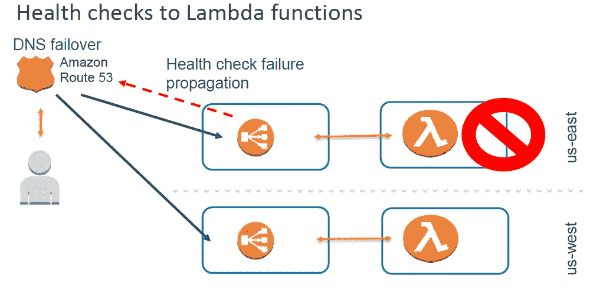

Health Checks

这是一个可选的功能，因为 lambda 调用的健康检查是有代价的。如果您不能容忍应用程序的任何停机时间。万一你的 lambda 函数有问题或者 lambda 函数获取信息的下游依赖不起作用。其工作方式是，您将在美国西部和美国东部创建两个应用程序。两个区域中的等效堆栈。然后，您将使用 DNS 故障转移策略为您的应用程序配置域名。因此，本质上，您将在 route 53 中创建一个别名记录集，并为其设置 DNS 故障转移。主 fqdn 是主负载平衡器。在这种情况下，让我们说是美国东部。这将是您的 fqdn，它将被设置为主服务器。那么美国西部的负载平衡器的 fqdn 将是次要的。现在，当一个区域发生故障时，DNS 故障转移路由 53 将能够切换到另一个区域中的负载平衡器。当 lambda 函数级或下游依赖级出现故障时，它就是这样工作的。该健康检查失败将传播到整个路线 53。通过该通知，路由 53 将开始引导用户到不同区域中的 alb。这将为您提供跨两个不同区域的高可用性应用程序。现在有两件重要事情你也应该知道。

alb 调用的事件的结构是什么？当 alb 调用 lambda 函数时，你得到的内容是什么？

**调用事件**

```
{ 
 **“requestContext”**:{ 
 **“elb”**:{ 
 **“targetGroupArn”**:”arn:aws:elasticloadbalancing:region:123456789012:targetgroup/my-target-group/6d0ecf831eec9f09"
 }
 },
 **“httpMethod”**:”GET”,
 **“path”**:”/”,
 **“queryStringParameters”**:{ parameters },
 **“headers”**:{ 
 **“accept”**:”text/html,application/xhtml+xml”,
 **“accept-language”**:”en-US,en;q=0.8",
 **“content-type”**:”text/plain”,
 **“cookie”**:”cookies”,
 **“host”**:”lambda-846800462-us-east-2.elb.amazonaws.com”,
 **“user-agent”**:”Mozilla/5.0 (Macintosh; Intel Mac OS X 10_11_6)”,
 **“x-amzn-trace-id”**:”Root=1–5bdb40ca-556d8b0c50dc66f0511bf520",
 **“x-forwarded-for”**:”72.21.198.66",
 **“x-forwarded-port”**:”443",
 **“x-forwarded-proto”**:”https”
 },
 **“isBase64Encoded”**:false,
 **“body”**:”request_body”
 }
```

这是一个调用事件的 JSON 结构。你得到一个目标群体 ARN，你可以使用的背景。然后，您将从客户端获得原始请求的所有信息。像 HTTP 方法，路径，查询字符串参数，所有的头和体。有一个名为 isBase64Encoded 的标志，其值可以是 false 或 true。此标志指示 alb 是否在将从客户端接收的二进制正文发送到 lambda 函数之前将其转换为 base64 编码。有一些典型的内容类型可以原样发送正文。但是对于其他内容类型，它是作为 base64 编码发送的，因此标志被设置为 304。

**λ函数的预期响应**

```
{
  "isBase64Encoded": false,
  "statusCode": 200,
  "statusDescription": "OK",
  "headers": {
    "Set-cookie": "cookies",
    "Content-Type": "text/html; charset=utf-8"
  },
  "body": "Hello from Lambda (optional)"
}
```

这是 JSON 中预期 lambda 函数响应的结构。唯一的必填字段是状态代码。然而，你可以按照自己的意愿形成完整的回应。对于这种信息，您希望将其放入需要发送回客户端的响应标头中。如果需要发送二进制体到 ALB，甚至 base64 编码，然后 JSON 序列化，然后发送，并相应标记标志。ALB 知道它是什么类型的内容。

让我们看看极限。限制是 1 兆字节，这个限制只针对身体。

请求体 ALB ==>Lambda 函数<=1 MB
响应 Lambda 函数== > ALB < =1 MB

头的大小限制为 64 千字节，这通常适用于任何目标类型。1 MB 的限制适用于您形成的整个 JSON 响应。ALB 的小时价格没有变化。ALB 的负载平衡器容量单元(lcu)现在包括 0.4 GB 小时的 Lambda 函数处理字节数作为目标。通常 AWS Lambda 收费适用。

# ALB 上的身份验证

它是一种为您的应用程序验证用户身份的工具，因此您不需要在您的应用程序中处理这个问题。应用程序可以专注于业务逻辑，身份验证部分可以卸载到 alb。有两种方法:

与任何符合 OpenID Connect 标准(OIDC)的身份提供商(Idp)进行本机集成
自带 IdP
与 Amazon Cognito 无缝集成
使用 LDAP 或 OIDC 进行企业身份认证
与社交身份提供商(脸书、谷歌、亚马逊)进行身份认证

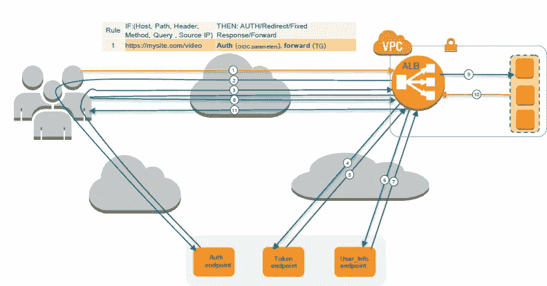

Authentication on ALB

1.用户发送 HTTP 请求到一个托管在授权启用 ALB
2 后面的网站。ALB 检查会话 cookie，如果会话 cookie 丢失，则将用户重定向到 IdP
3。通过 IdP 认证后，用户被重定向到 ALB，授权码为
4。ALB 验证代码并将其发送到令牌端点
5。ALB 接收 JWT 令牌(ID 令牌，访问令牌)
6。ALB 向 User_Info 端点
7 发送访问令牌。ALB 收到用户索赔
8。ALB 使用会话 cookie 将用户重定向到原始的 URI AWSELBAuthSessionCookie。用户使用 AWSELBAuthSessionCookie 向 URI 发出请求。
9。ALB 验证 cookie 并将用户信息转发到后端“X-AMZN-OIDC-*”HTTP 头集
10。后端将响应发送回 ALB
11。ALB 向客户端发送最终响应

让我们看看 alb 与符合 OIDc 的 IDP 握手的认证流程。在本例中，Mysite.com 运行一个视频应用程序，您希望通过身份验证来访问它。现在让我们一步一步来看看会发生什么。

1.用户发送 HTTP 请求观看视频
2。这是第一个请求，用户没有 alb 寻找的会话 cookie，因此 alb 会将用户的这个请求重定向到 IDP
3。用户在 IDP 门户网站输入用户名和密码。在这一点上，一个授权码发出，所以用户重定向回 alb。
4。ALB 认证代码并将其发送到令牌端点
5。ALB 从令牌端点
6 接收 JWT 令牌作为交换。Alb 向 user_info 端点发送作为 JWT 令牌一部分的访问令牌，以获得用户声明
7。ALB 收到用户索赔
8。ALB 使用会话 cookie 将用户重定向到用户想要访问的原始 URL。用户这次带着饼干回到了 URI。
9。Alb 将验证该 cookie，然后将请求转发给目标或应用，其中包括以 HTTP 报头形式从 IDP 接收的与用户相关的信息
10。应用程序(目标)将把响应发送回 alb
11。ALB 将响应转发给客户端

解释如何配置这些集成是很重要的，所以让我们看一下本机 OIDC 配置。

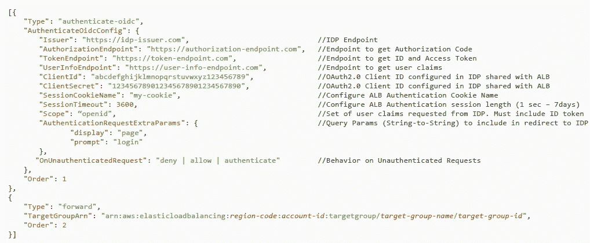

OIDC Configuration

在这里，您配置 IDP 端点，它本身就是一个 URL。然后是我们在令牌端点、授权端点和用户信息端点讨论的所有端点。接下来的两个参数是客户端 ID 和客户端机密。这些参数帮助 IDP 对 alb 进行身份验证。与 IDP 进行握手的可信实体。那么您就有了会话 cookie 名称。有一个默认的 cookie 名称可以工作，但如果您使用多个 IDP，那么您需要为每个配置一个。默认的会话超时 cookie 为七天。范围是一秒到七天。范围基本上是一个参数，它告诉 IDP 在握手过程中 IDP 需要提供的详细程度。那么除了身份验证或未经身份验证的请求之外，您还有不同的选择。在这种情况下该怎么做，以便您可以选择拒绝或允许支持。通常是 JavaScript 的用例或使用 JavaScript 的单页应用程序。

这是演示

[https://example load balancer . auth . us-east-1 . Amazon cognito . com/log in？client _ id = 6 chta 8 di 2d 737 altiugnidsoq 9&redirect _ uri = https % 3A % 2F % 2 fexampleloadbalancer . com % 2 fo auth 2% 2 FID presponse&response _ type = code&scope = OpenID&state = m 49 cv 47 xfwy 0 mklrfiw % 2 birgan 08 gfci ol % 2 ba 3 h3t % 2 fi 8 k2x % 2 fcrkktcoqgfnd 8 qi % 2 ff 4n 0j 0 p 2。](https://exampleloadbalancer.auth.us-east-1.amazoncognito.com/login?client_id=6chta8di2d737altiugnidsoq9&redirect_uri=https%3A%2F%2Fexampleloadbalancer.com%2Foauth2%2Fidpresponse&response_type=code&scope=openid&state=m49cV47xfFwY0tmKlrFiw%2BiRGAn08GficOL%2BA3H3t%2FI8k2X%2FcRkktCoQGFnD8qi%2FF4N0j0P2N%2FMtSyVtPdGJOBmgl2rIDzTCyLkfBGdLSObWbMx27G8GJFosr0fy9aIEfQDfmtydOAoYCbyxo8ZbOjaION2c4WLlUV8AtnBD3TB%2FeGzV5CNgl4tnerF1D5Ss2GPbJ5gUlHec0FX0bA%3D%3D)

现在让我们看看基于 Amazon cognito 的集成。大多数参数是相同的。唯一不同的是，现在您将基本上配置用户池，而不是 IDP 端点。这基本上是您在 Cognito 配置中拥有的用户池 ID。cognito 用户池和用户池域的客户端 ID 以及其余参数都是相同的。

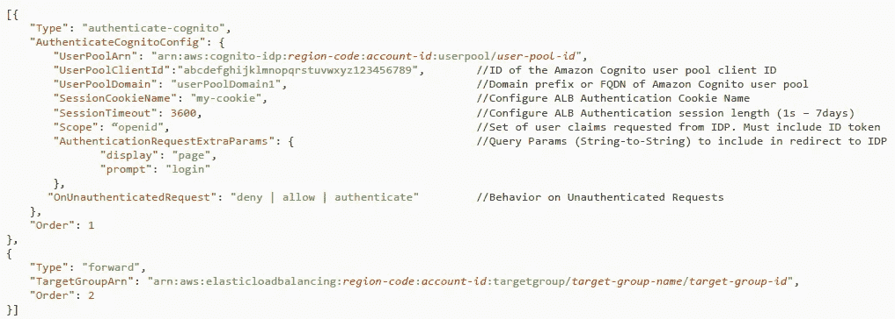

Cognito Configuration

下面是您的应用程序目标收到的信息。

x-amzn-oidc-accesstoken:来自令牌端点的访问令牌(纯文本)
x-amzn-oidc-identity:来自用户信息端点的主题字段(纯文本)
x-amzn-oidc-data:JWT 格式的用户声明(base64 URL 编码并包含签名)

**标题**

```
{ 
"alg": "algorithm", 
"kid": "12345678-1234-1234-1234-123456789012", 
"signer": "arn:aws:elasticloadbalancing:region-code:account-id:loadbalancer/app/load-balancer-name/load-balancer-id", 
"iss": "url", 
"client": "client-id",
"exp": "expiration“
}
```

**有效载荷**

```
{ 
"sub": "1234567890", 
"name": "name", 
"email": "[alias@example.com](mailto:alias@example.com)", 
... 
}
```

你可以在 https://exampleloadbalancer.com/auth_demo.html[试玩](https://exampleloadbalancer.com/auth_demo.html)