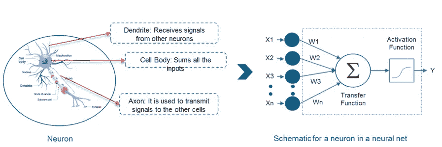
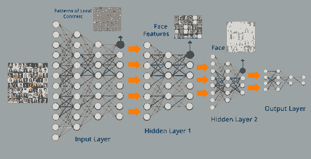
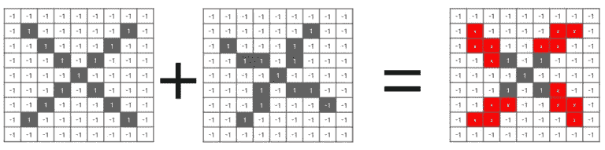
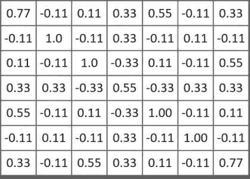
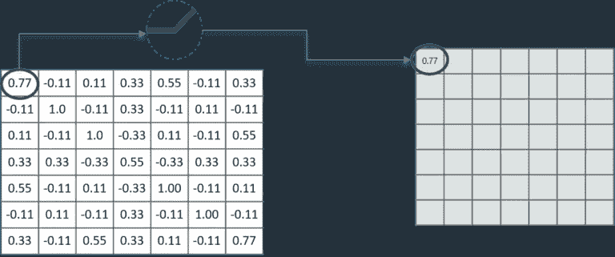
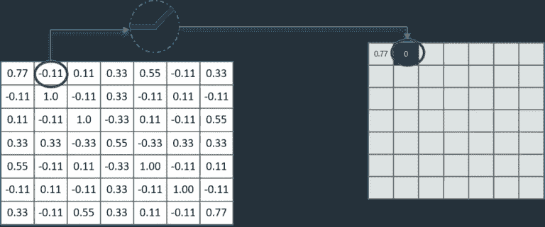
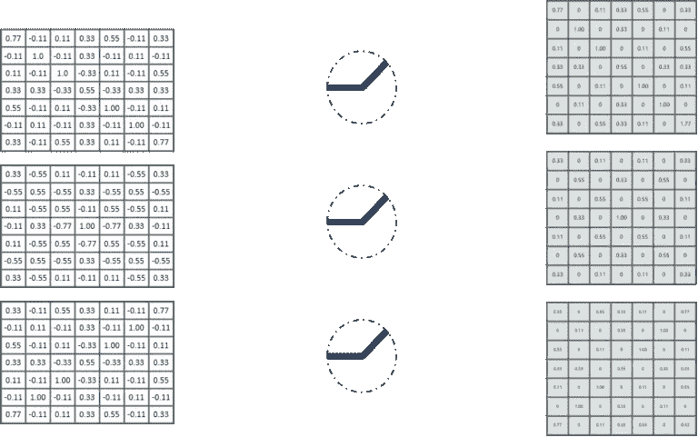
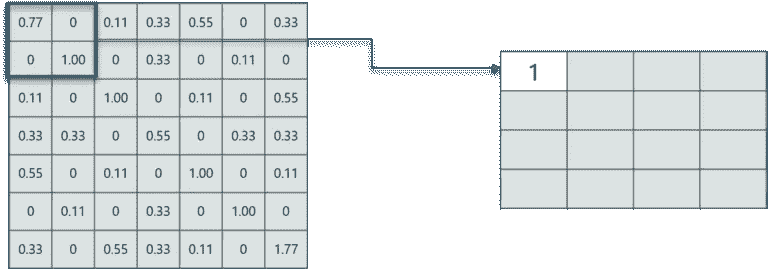
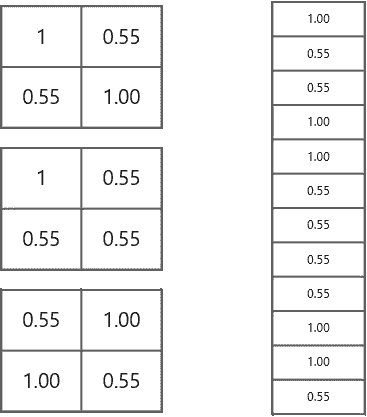
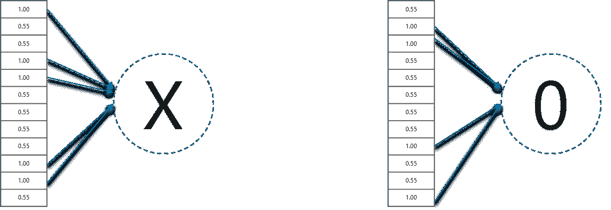

# 初学者的深度学习—简介(第 1 天)

> 原文：<https://medium.datadriveninvestor.com/deep-learning-an-introduction-day1-4bbc3a37de59?source=collection_archive---------6----------------------->

[](http://www.track.datadriveninvestor.com/1B9E)

你好，程序员们！我希望你和我一样兴奋地投入到深度学习中。听起来很酷吧！我假设你已经学习了机器学习，并期待开始深度学习。让我们一起学习吧…



## 什么是深度学习？

深度学习是机器学习的一个子集，它使用一套强大的技术在神经网络中进行学习。DL 算法大致受到人脑中发现的信息处理模式的启发。

[](https://www.datadriveninvestor.com/2019/01/23/deep-learning-explained-in-7-steps/) [## 深度学习用 7 个步骤解释-更新|数据驱动的投资者

### 在深度学习的帮助下，自动驾驶汽车、Alexa、医学成像-小工具正在我们周围变得超级智能…

www.datadriveninvestor.com](https://www.datadriveninvestor.com/2019/01/23/deep-learning-explained-in-7-steps/) 

神经网络是一种模仿大脑结构的机器学习技术。它由称为神经元的学习单元网络组成。每个神经元接收几个输入，对它们进行加权求和，通过一个激活函数，并以一个输出做出响应。

在常规神经网络中，有三种类型的层:



image recognition

1.  **输入层:**我们给模型输入的层。这一层中神经元的数量等于我们数据中特征的总数。
2.  **隐藏层:**来自输入层的输入被送入隐藏层。根据我们的模型和数据大小，可能有许多隐藏层(内部有神经元)。每一层的输出通过前一层的输出与该层的可学习的权重的矩阵乘法来计算，然后通过加上可学习的偏差，随后是使网络非线性的激活函数来计算。
3.  **输出层:**隐藏层的输出被输入到一个逻辑函数中，如 sigmoid 或 softmax，它将每个类的输出转换成每个类的概率分数。

激活函数:激活函数对于人工神经网络学习和理解输入和响应变量之间非常复杂的非线性复杂函数映射非常重要。它们将非线性特性引入我们的网络，并将人工神经网络中节点的输入信号转换为输出信号。该输出信号现在被用作堆栈中下一层的输入。一个*线性函数*就是一个一次多项式。因此，线性方程很容易解决，但它们的复杂性有限，从数据中学习复杂函数映射的能力较弱。因此，我们希望我们的神经网络不仅能够学习和计算线性函数，还能够处理复杂的非线性函数，以便能够学习和模拟其他复杂类型的数据，如图像、视频、音频、语音等。如果您想了解更多关于激活功能的信息，请查看:

[https://towards data science . com/activation-functions-and-its-types-哪个更好-a9a5310cc8f](https://towardsdatascience.com/activation-functions-and-its-types-which-is-better-a9a5310cc8f)

# 卷积神经网络(ConvNet)及其工作原理？

CNN 是一种前馈人工神经网络，其中一层中的神经元将仅连接到它之前的层的小区域。CNN 基本上用于非结构化数据，不像神经网络，神经网络的输入是向量，这里的输入是多通道图像。

计算机读取这样的图像，一个 32×32×3 的图像意味着我们有一个 32 行、32 列和 3 个通道的图像。


This is how a computer reads an image

## 问题:

假设我们有两个可能的图像，如下图所示，在右边我们有 X 和 0 的不同表示，现在计算机将如何分类什么是什么？


Different formations of X and 0

计算机将图像视为像素，如果我们将任意两种形式的像素相加，我们将得到如下结果。



Adding the pixels of two images

计算机将逐个像素地进行比较，正如我们所看到的，仍然有一些像素发生了位移，计算机将很难对结果图像进行分类。


## 那我们该怎么办？

我们取称为过滤器的小块像素，并尝试在相应的附近位置匹配它们，看看我们是否能得到匹配。通过这样做，CNN 在看到相似性方面比直接尝试匹配整个图像要好得多。

*在 CNN 中我们需要理解四个分层的概念:*

1.  *卷积:每个卷积滤波器代表一个感兴趣的特征和 CNN 算法，该算法学习哪些特征构成结果参考。它包括以下几个步骤:*

*   ***对齐*** *特征和图像*
*   ***将*** *每个图像像素乘以对应的特征像素*
*   ***将*** *的数值相加，求总和*
*   ***将*** *的总和除以特征中的像素总数*


In left we have our filter and in the right we have our resulting pixels, we then take the mean and replace the pixels with the mean value , in our case it is 0.55

同样，我们将对所有其他滤波器执行相同的卷积。输出信号强度不取决于特征的位置，而仅仅取决于特征是否存在。最后我们会得到这样的结果，



2.ReLU( **整流线性单元):**

它是一个激活函数或分段线性函数，如果为正，它将直接输出输入，否则，它将输出零。用编码术语来说，我们可以这样解释，

```
if input > 0: 
    return input
else:
    return 0
```

为什么留在这里？

在上面的例子中，我们得到了一些负像素值，所以我们需要删除它们。



No problem with positive pixel values



ReLU will replace negative values with 0, that exactly what we want

我们需要将此应用于每一个功能。



3.共享:

我们在上面研究了激活函数，它的一个功能是汇集。在卷积和应用 ReLU 之后，我们需要缩小我们的像素，这是通过取一个窗口大小(通常是 2 或 3)然后选择最大值作为那个窗口的最终值来完成的。



taking max value from the selected 2x2 window

类似地，我们将在整个图像上移动窗口。

4.在完全连接的层上叠加:


Stacking up all the layers

然后将上述三个阶段叠加起来，最后，我们将过滤后的缩小图像放入一个列表中，如下所示:



Converting into a list in the fully connected layer

这是最后一步，我们有了最终的分类



CNN classified X and 0 based on the final list we got from above

这就是我对 CNN 的看法，这实际上是所有人都需要知道的基础知识，我们不需要做上述计算，这就是为什么我们有数据科学家创建的模型。我们只需要挑选一个适合我们数据的模型，然后简单地训练它，得出结果。

CNN 是我在深度学习中最喜欢的话题之一，所以我想先报道它，有很多东西要学。我将很快上传更多 CNN 和其他深度学习算法的实际实现的博客，到那时请保持关注，祝编码愉快！