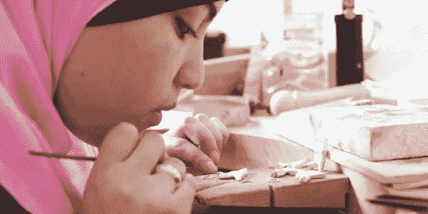
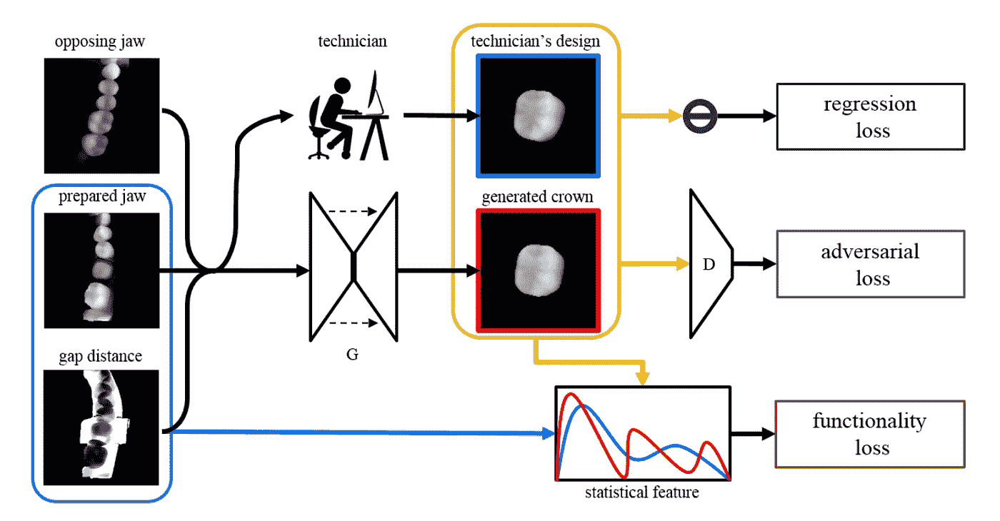

# 深度学习，还有……牙医？

> 原文：<https://medium.datadriveninvestor.com/deep-learning-and-dentists-56f15ba89d76?source=collection_archive---------2----------------------->

有没有磕过牙？或者，更糟的是，击倒一个？假设你有，不可避免的结果是过早去看牙医，然后是非常有趣的牙齿修复过程。

对于那些没有经历过这些的人来说，你的牙医基本上清理了这个区域，取了一个印模(如果涉及高科技魔法，这里可能会涉及到 3d 扫描，但也可能只是一个树脂铸件)，制作并安装了一个“牙冠”，然后煞费苦心地将其塑造到位，一直在调整。

最后一点可能非常艰苦——这里涉及到许多定制手工。这很像皮塔饼，因为它不仅要符合——看起来很合理！—用你的牙齿，但它也必须映射到你的咬、嚼、抓等等。如果做错了，除了看起来怪怪的，还会导致咀嚼困难，导致 TMJ 紊乱，甚至更糟。

你可能会认为 [CAD/3D 打印可以用来避免这种皮塔](https://dl.acm.org/citation.cfm?id=1945160)的大部分，你错了——问题是，获得皇冠 JustRight 涉及的许多工作都是*技能。在代码中指定所有这些是不可行的，因为有太多的规则——以及这些规则的例外！—指定。*

当你仔细想想，这正是深度学习大放异彩的领域，不是吗？我们有大量的功能(*规则！*)，还有很多展示前后条件的例子(*印象！成品皇冠！*)。你会认为我们应该能够在这个问题上抛出一个神经网络，并得到一个模型，可以用来预测新案件的冠，对不对？

好吧，你可能是对的——这正是黄等人在他们最近的论文 [*中所做的“用牙齿修复的生成模型学习超越人类专业知识*](https://arxiv.org/pdf/1804.00064.pdf) ”。他们使用现有的印象和冠作为一种叫做*生成对抗网络* (GAN)的神经网络的输入和输出的“基础事实”，正如你所料，它工作得非常好。

/via [https://arxiv.org/pdf/1804.00064.pdf](https://arxiv.org/pdf/1804.00064.pdf)

这里特别吸引人的是，当考虑牙冠进入相对颌部的允许程度以及接触点分布(这些因素对咬合和咀嚼功能有重要影响)时，该模型实际上最终胜过了技术人员。引用—“*生成的牙冠不仅达到了与人类专家设计相似的形态质量，还支持通过统计特征学习实现的更好的功能*”。

期待在不久的将来，这将成为你牙医工具箱的一部分！

*(* [*)这篇文章也出现在我的博客上*](http://dieswaytoofast.blogspot.com/2018/05/deep-learning-and-dentists.html) *)*