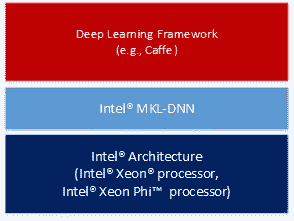

# 深度学习，以及英特尔的 MKL-DNN 法案

> 原文：<https://medium.datadriveninvestor.com/deep-learning-and-intels-mkl-dnn-88fe6de9c7ef?source=collection_archive---------5----------------------->

/via [https://software.intel.com/en-us/articles/intel-mkl-dnn-part-1-library-overview-and-installation](https://software.intel.com/en-us/articles/intel-mkl-dnn-part-1-library-overview-and-installation)

[英特尔的 MKL](https://software.intel.com/en-us/mkl?cid=sem43700010399172316&intel_term=intel%20mkl&gclid=CjwKCAjwr-PYBRB8EiwALtjbz7Dugig7PYIUA419HcIteUyzlhF3EX96nT0uruwoVS09LZTljVk51RoCbAsQAvD_BwE&gclsrc=aw.ds) ，对于那些从来没有真正担心过数学性能的人来说，基本上是一个手工优化的代码库，用于**严肃的**数学，包括线性代数 [(BLAS](https://en.wikipedia.org/wiki/BLAS) ， [LAPACK](https://en.wikipedia.org/wiki/LAPACK) 等。)、[FFT](https://en.wikipedia.org/wiki/Fast_Fourier_transform)、向量数学等等。是的，它特定于英特尔的处理器(因此“英特尔的 MKL*”*和[有效的免费许可](https://software.intel.com/en-us/mkl/license-faq))。如果你在科学/数学/金融科技等领域做任何繁重的工作，你可能已经在你的某个地方使用它了！

[MKL-DNN](https://github.com/intel/mkl-dnn) 是一个建立在 MKL 基础上的库，它增加了针对*深度神经网络*的优化(因此有了“DNN”部分😁).它自 2016 年末以来就已经推出[，但随着新模型和技术的流行，它的更新相当频繁(你好，这个领域的变化速度很快吧！).
尽管在本质上，它需要一大块像样的神经网络原语——比如*卷积*、*归一化*、*张量处理*等等。—并将它们映射到英特尔处理器上可用的](https://software.intel.com/en-us/articles/introducing-dnn-primitives-in-intelr-mkl) [SIMD 指令](https://en.wikipedia.org/wiki/Streaming_SIMD_Extensions)()。这种映射非常关键，因为它允许一次对 16 个数字进行操作(技术上是 16 个单精度数字，即 512 位)

这是个好东西，已经在 [Tensorflow](https://www.tensorflow.org/) 、 [Microsoft CNTK](https://www.microsoft.com/en-us/cognitive-toolkit/) 和 [Caffe](https://github.com/intel/caffe) 上可用了一段时间，最近的[甚至可以在](https://medium.com/apache-mxnet/announcing-apache-mxnet-1-2-0-d94f56da154b) [Apache MXNet](https://mxnet.apache.org/) 上使用。如果你在本地开发 sans-GPU(当然也在 Intel 上)，你真的应该使用它。

也就是说，请注意*您需要使用专门为 MKL* 编译的工具版本。出于各种原因(历史、性能预期、兼容性等。)，它们“默认”的数据格式在 MKL-DNN 和 [TensorFlow](https://www.tensorflow.org/performance/performance_guide) 、 [MXNet](https://medium.com/apache-mxnet/accelerating-deep-learning-on-cpu-with-intel-mkl-dnn-a9b294fb0b9) 等不同。几乎所有的软件都在致力于在本地和 MKL 之间自动切换格式，但是在此之前，你应该确保使用 MKL 的特定版本！(是的，别问我是怎么发现的😡)

() [SIMD](https://en.wikipedia.org/wiki/SIMD) ( *单指令多数据*)是当前英特尔 CPU 支持的一组大约 [70 条指令](https://en.wikipedia.org/wiki/Streaming_SIMD_Extensions)，允许它们一次对多个数据元素进行操作。基本上类似于“*加* ***这些*** *16 个数字到* ***那些*** *16 个数字*”除了“加”发生在一个指令中而不是 16 个。(是的，这有点复杂，但是……无论如何)。

*(* [*这篇文章也出现在我的博客上*](http://dieswaytoofast.blogspot.com/2018/06/deep-learning-and-intels-mkl-dnn.html) *)*

