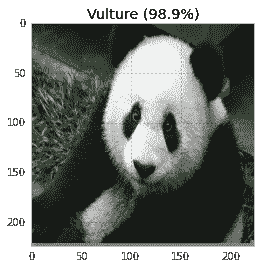
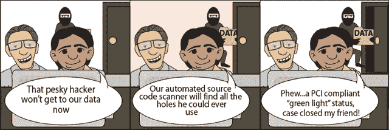

# 深度学习和安全性

> 原文：<https://medium.datadriveninvestor.com/deep-learning-and-security-b670b0d0af07?source=collection_archive---------4----------------------->

攻击深度学习系统的安全性是目前非常流行的事情。毕竟，头条是如此吸引人，你知道吗？
“[*黑掉停车标志会导致 Cause 启示录！*](http://dieswaytoofast.blogspot.com/2018/05/carcrashapocalypsenot-quite-yet.html) ，
[*这一张贴纸就能把香蕉变成烤面包机！*](http://dieswaytoofast.blogspot.com/2018/03/banana-or-toasterdeep-learning-edition.html) 、
、[这么多更](http://dieswaytoofast.blogspot.com/2018/01/image-mis-classification-deep-learning.html)(没错，[我也有罪](http://dieswaytoofast.blogspot.com/2018/03/hacking-your-vision-with-deep-learning.html))。

大多数人(几乎所有人)都有这种症状！)这些论文和文章的一个特点是，它们专注于难以区分的变化— [*翻转这些微小的像素会导致熊猫变成秃鹫*！](https://codewords.recurse.com/issues/five/why-do-neural-networks-think-a-panda-is-a-vulture)——诸如此类。深度学习的诡异之处在于， [***之外的***](https://www.schneier.com/blog/archives/2005/09/movie-plot_thre.html)*****，实际上有*** [***没有真实世界的安全威胁的例子，仅仅是基于不可区分性***](https://arxiv.org/pdf/1807.06732.pdf) ***！*****

**不过，在你对此过于激动之前，让我们更深入地了解一下基于深度学习的安全威胁。当我们谈论基于内容的攻击时，我们实际上是在谈论 ***内容保存*** 和 ***可区分性*** 之间的一个连续体。**

****

**根据定义，无法区分的攻击*(*我们只翻转一个像素，人眼是看不见的！*)***都完全保留了*** 的内容。
你看，攻击背后的要点是让*分类器*出错，让系统认为熊猫是秃鹫。就我们人类而言，还是熊猫。**这就是为什么这是一次攻击** —人类不知道任何事情发生了变化，但深度学习系统认为它是一只秃鹫，而不是一只 pand(然后…什么？但保持这种想法，我们会得到它)。***

***好吧，那么，重述上面的图像，频谱的一端由看起来不会改变任何事情的攻击组成，另一端是可以做任何他们想做的事情的攻击。吉尔默等人的一篇新论文。()将这一点非常清晰地分为以下五类。***

1.  ******内容保留攻击*** :你希望内容能够被理解，即使内容的具体格式发生了变化。想想最近世界杯的所有盗版流媒体——内容要么是信箱式的，要么是电视屏幕被重新拍摄——它们避开了世界上大多数互联网服务提供商的内容过滤机制。***
2.  ******非可疑攻击*** :这里，*你*不知道发生了什么不好的事情，但是幕后发生了攻击，哦的确是的。想象一下，例如，你让你的手机用超声波告诉别人的 Alexa 购买 1337 本艾芬豪(无疑是有史以来最无聊的书*)。它是超声波的，所以爱丽丝的第一个暗示就是货物何时开始出现。****

4.  *******:在这里，你可以做任何你想做的事情。是的，这有点包罗万象，但关键是你对你的攻击有最小的限制。例如，你有某人的 iPhone，你想解锁它，你拥有世界上所有的时间…*******
5.  **********不可区分攻击*** :这里，不可区分是*所要求的*(强调必要)。而且，如前所述，除了[电影情节](https://www.schneier.com/blog/archives/2005/09/movie-plot_thre.html)，这个类别几乎是一个空集。*******

******所以，我们在讨论*不可区分的*攻击——即上面的***-5-***——这时你需要问问自己"*攻击者更喜欢使用不可区分的攻击的可能性有多大，而不是* ***-1-*** *到****-4-****。或者，见鬼，* ***那种毫无机器学习成分的攻击到底有多大可能*** *？*”******

************

******/via [https://mcurphey.files.wordpress.com/2010/04/securitybullshitcartoon023.png](https://mcurphey.files.wordpress.com/2010/04/securitybullshitcartoon023.png)******

******毕竟，攻击者有自己的约束和能力。如果他们能在前门跳华尔兹，他们可能不会像汤姆·克鲁斯那样使用安全带，你知道吗？******

******这里的要点是，如果你的系统容易受到真正愚蠢的攻击(“前门”)，那么在你需要开始担心无法区分的攻击之前，你还有一段路要走！******

************

******这里的证据 A 是[停车标志攻击](http://dieswaytoofast.blogspot.com/2018/05/carcrashapocalypsenot-quite-yet.html)，一个坏人攻击标志导致车祸。每个人都在谈论在停车标志上制造微小的划痕来欺骗探测器，但事实是，更容易的攻击是撞倒停车标志，然后就完事了。******

******当然，这里的要点是，你要设计系统，在你达到对微小划痕的鲁棒性之前很好地校正丢失的信号。见鬼，这几乎就是人类的工作方式——我们的视觉很容易出错，但我们会将许多其他信息联系起来，以确保我们不会搞砸！******

******更重要的是，我们应该记住，在循环中也有防御者！所以，例如，为了防止突然收到 1337 份艾芬豪的邮件，Alexa 在下单前会得到你的允许。或者扩展到每次接收到语音命令时让设备记录和/或通知*。在上面的停车标志示例中，这转化为设备跟踪它们的输入，并报告意想不到的事情("*嗯，每个人都报告说在 E. 76th 街有一个烤面包机，而那里应该有一个停车标志*")。*******

*****或者，换一种说法，不是用“ *OMG STOP-SIGN FIAL 现代启示录我们完蛋了！*、**把“不可区分的扰动问题”看成机器学习相关，而*不是*安全相关**可能更好。正如 [Gilmer 等人所说的](https://arxiv.org/pdf/1807.06732.pdf)，“最终，对手在解决优化问题时发现的错误仍然只是错误，如果可能的话，是值得消除的”。将这些作为安全问题来关注对安全和机器学习都是有害的。毕竟，如果它们是与安全相关的，那么至少与现实世界的场景有一些关联是值得的(而不仅仅是电影情节)。毕竟，安全并不存在于真空中，它必须在攻击者的约束和能力范围内！*****

*****()“激发对抗范例研究的游戏规则[”Gilmer 等人。](https://arxiv.org/pdf/1807.06732.pdf)*****

******(* [*这篇文章也出现在我的博客上*](http://dieswaytoofast.blogspot.com/2018/08/deep-learning-and-security.html) *)******