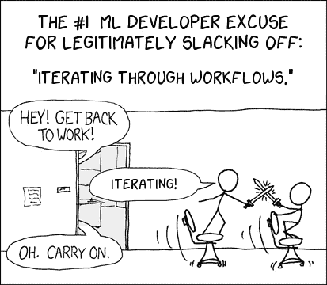

# 深度学习和工作流—它*可以*变得更简单！

> 原文：<https://medium.datadriveninvestor.com/deep-learning-and-workflows-it-can-get-easier-504b5c71c4e3?source=collection_archive---------9----------------------->

/via [https://xkcd-excuse.com/](https://xkcd-excuse.com/)

如果你已经用深度学习建立了任何东西，你很清楚该如何正确地进行训练？你们

1.  从一个基本的工作流程开始。或者，从你以前做过的事情中复制一个工作流程，在你意识到它与你正在做的事情不太匹配之前，把它弄乱一段时间，扔掉，然后，嗯，*从一个基本的工作流程开始*😝。
2.  *开始调整工作流程*。这里的*有一个步骤*耗时太长，需要优化；那里的*有一个步骤*，需要更改参数，等等。
3.  *等待一个* ***批次*** 。说真的，这差不多是你正在做的事情的 99%。等待中。

- **3-** 真的是相当的杀手。每次你调整工作流程，*每次*，你都要重新运行整个该死的东西。这真的很荒谬，因为，真的，整个管道可能需要相当长的时间来运行。

这实际上更糟糕，因为在现实中，你不会一直坐在那里等待*。特别是如果你在玩别人的钱，在这种情况下，你开始工作 1，主动调整东西，开始工作 2，等等。这意味着你有一个工作流程调整的管道，除非你真的*真的*很好，你忘记了版本控制所有的变化，现在[你不太确定你的结果映射到哪个代码/数据/模型的组合，你在再现性地狱](http://dieswaytoofast.blogspot.com/2018/03/reproducibility-and-machine-learning.html)。*

*是的，有很多方法可以解决这个问题。你可以沿着 [***深入***](https://cs.stanford.edu/people/czhang/zhang.thesis.pdf) ()的路线，物化*所有的*中间结果(这么多存储！还有这么多时间来读/写这些结果！)，或者缓存一次性工作流执行 a-la[***keystone ml***](https://arxiv.org/pdf/1808.01095.pdf)()，和/或优化每次迭代中的特征/选择 a-la[***Columbus***](http://hazy.cs.wisc.edu/hazy/papers/TechReportColumbus.pdf)()，但问题是，*它们都集中在工作流*的各个部分。开发工作流的*工作流(元工作流？)还是一个完整的皮塔饼。**

*或者说，*曾经是*一个完整的皮塔饼。进入 [HELIX](https://arxiv.org/pdf/1610.09451.pdf) ，一个端到端的机器学习语言/系统/环境，它做了一些非常酷的事情*

1.  *这是一个基于 Scala 的 DSL，这意味着你可以直接接入所有的 JVM/Spark 库。假设那是你的事。如果不是，很好，很好。*
2.  *它将您的所有工作流程版本化(这本身就非常值得！🤯).跟踪超参数、特征选择等等的变化，这是默认发生的。是的，你*可以*使用`git`来完成这一切，但是记住，这并不像听起来那么简单，尤其是当[你正在并行流水线化任意数量的工作流](http://dieswaytoofast.blogspot.com/2018/03/reproducibility-and-machine-learning.html)😞。最棒的是，您可以直接比较特性、模型和性能指标，从而很好地了解这个领域中[可再现性的核心！](http://dieswaytoofast.blogspot.com/2018/03/reproducibility-and-machine-learning.html)*
3.  *当您使用它时，您还可以可视化与工作流相关联的 Dag，并使用它来进行“探索”😝)的执行计划，如果运气好的话，优化掉*那个*！*
4.  *最后，也是最有趣的是，它会计算出有多少中间输出需要单独实现*，并跨迭代进行优化，这样您就可以在存储/计算预算范围内生活了！**

*好了，最后一点真的很特别。也就是说，你可能会问自己，“*它是如何做到这一点的？*”。请注意，如果你不是，你应该是，因为以最佳方式做这件事有一些严重的问题。*

*你看，如果你有一个∞存储和计算预算，你就可以物化每一个中间结果(a-la[*deep dive*](https://cs.stanford.edu/people/czhang/zhang.thesis.pdf))，对于后续迭代，如果什么都没有改变，你就可以从存储中读出结果。*

*假设您*没有*的能力，您可以具体化一些中间结果，并重新计算您没有的结果(在 HELIX DAG 中，这基本上是计算节点及其每个祖先)。*

*好吧，计算出最佳的重新计算量——到达那个节点需要做的工作量——实际上并不那么复杂(它基本上是 [*项目选择/最大流量*](http://www.cs.princeton.edu/~wayne/cs423/lectures/max-flow-applications) 的变体)。好吧，这不是很基本，但事实就是如此😆).*

*OTOH，弄清楚是否物化一个特定的中间结果是相当困难的(严格地说，物化哪一个中间结果，以及物化多少个中间结果)。*

*   *你真的不知道用户经历了多少次迭代(举一个简单而愚蠢的例子，想象你经历了具体化一个结果的整个过程，然后最终决定你已经*完成*，这意味着你浪费了所有的努力)。*
*   *更糟糕的是，你真的不知道将来工作流会发生什么——你是要使用这些结果，还是扔掉它们，等等。你可以证明，即使在最简单的情况下，*假设用户只会再进行一次迭代，当前迭代的所有结果在下一次*都是可重用的，你可以证明优化问题仍然是 ***NP-Hard*** 。*

*所以，是的，这不仅仅是“很难”，这是 NP 难😡*

*基于所有这些，HELIX 实际上*会*优化是否物化一个给定的节点，或者通过计算重新计算成本，并猜测物化成本来动态地重新计算它。事实证明，这并不是一个糟糕的猜测，因为它导致的累计运行时间比当前的技术水平好 60%到 10 倍( [*DeepDive*](https://cs.stanford.edu/people/czhang/zhang.thesis.pdf) 和 [*KeystoneML*](https://arxiv.org/pdf/1610.09451.pdf) )。*

*这是非常酷的东西，而且我可以想象，这只是深度学习一直渴望的新一代元建模/可视化工具的第一个。*

*()“ [DeepDive:一个用于自动知识库构建的数据管理系统](https://cs.stanford.edu/people/czhang/zhang.thesis.pdf)”作者:【】()“ [KeystoneML:优化大规模高级分析的流水线](https://arxiv.org/pdf/1610.09451.pdf)”—作者:Sparks 等人
()“[*针对特征选择工作负载的物化优化*](http://hazy.cs.wisc.edu/hazy/papers/TechReportColumbus.pdf)—作者:张等人
()“[HELIX:加速人在回路中的机器学习](https://arxiv.org/pdf/1808.01095.pdf)—*

**(* [*这篇文章也出现在我的博客上*](https://dieswaytoofast.blogspot.com/2018/08/deep-learning-and-workflowsit-can-get.html) *)**